# Gradle组成部分

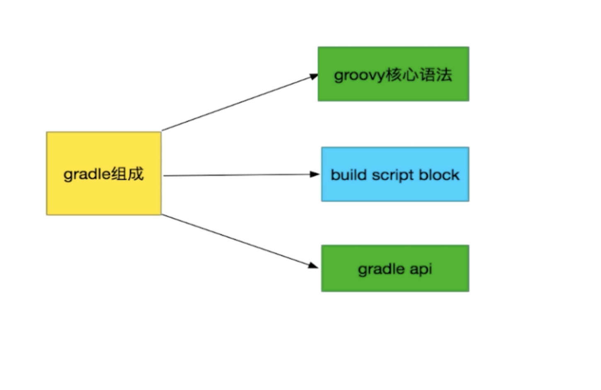

# 生命周期

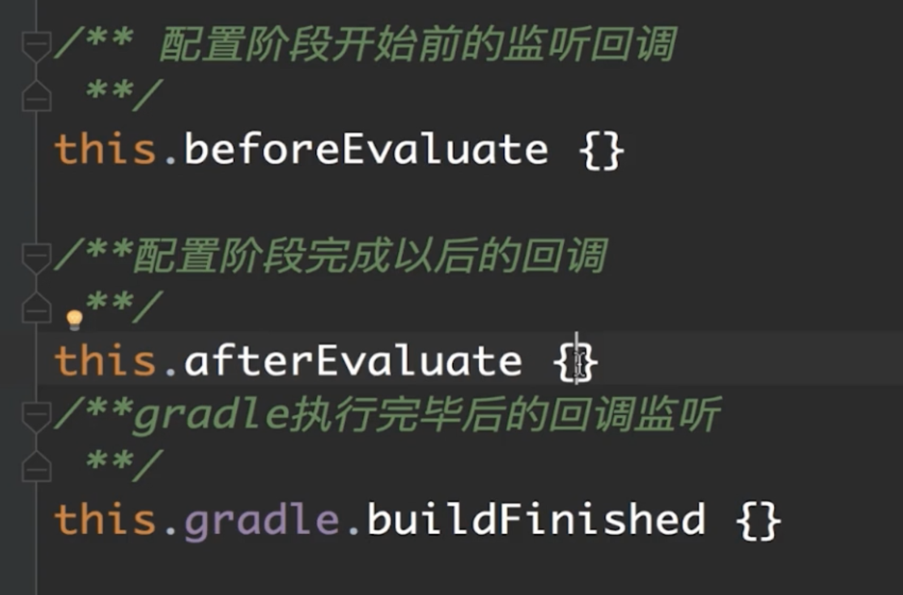

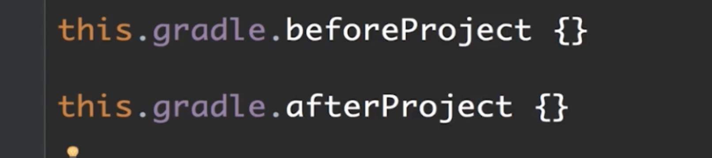

# 任务关系

# Gradle Project讲解

每个 Project 都要有自己的 build.gradle

根 Project 的作用就是管理子 Project，使用对应的 API 来进行管理

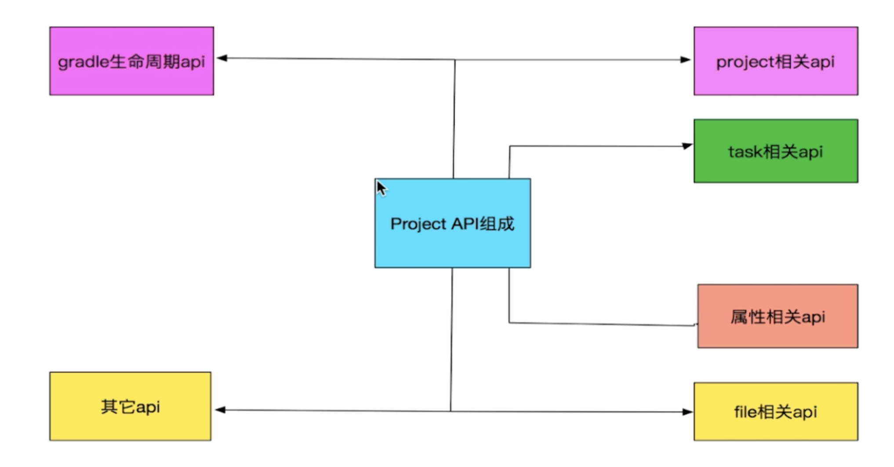

- Project 相关 API 就是管理父和子 Project
- task 相关 AP I就是为我们当前的 Project 定义 task 和使用 task
- 属性相关 API 为 Project 添加额外属性的能力
- file相关 API  为 Project 提供文件处理功能
- 生命周期 API ，在对应的时间触发对应的函数
- 其他 APi 添加依赖，引入外部 project

## 相关API讲解

只要是执行 Gradle 中的任何命令，都会执行Project的配置代码

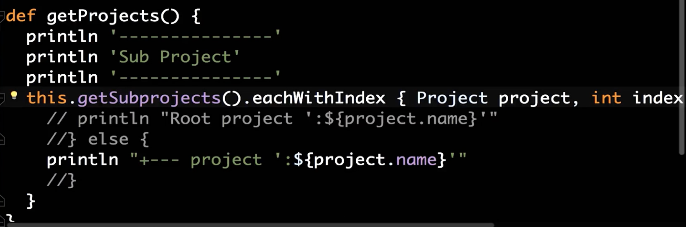

## 管理相应的 Project

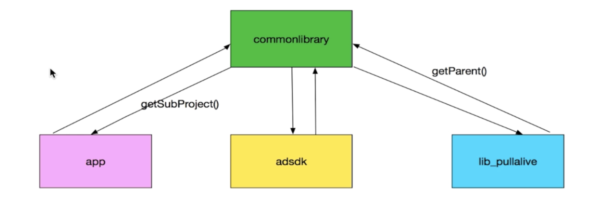

### Project API

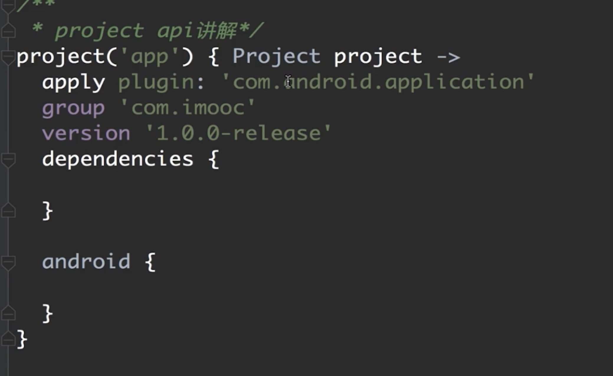

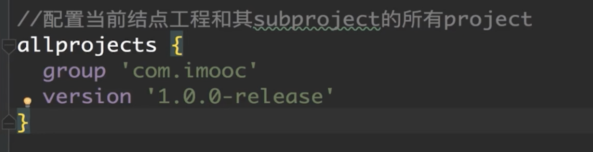

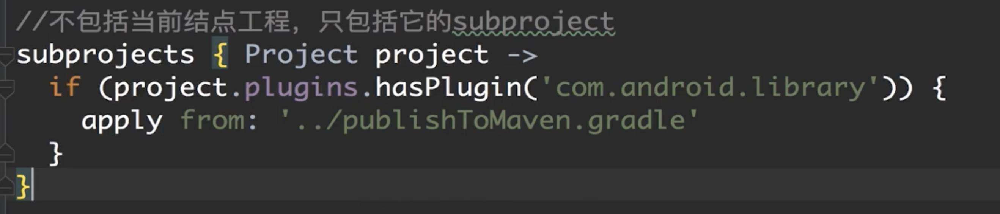

### 属性 API

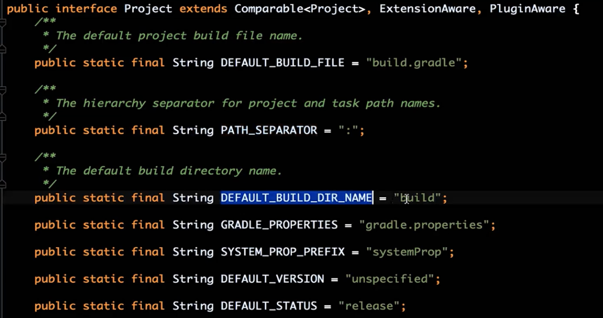

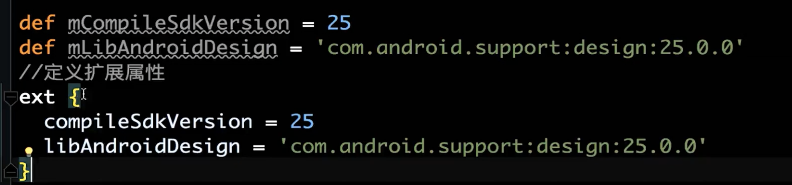

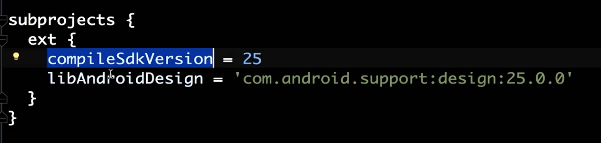

### 可以分出一个新文件来扩展属性

### 通过这句话引入对应的文件

### 通过gradle.properties来添加 

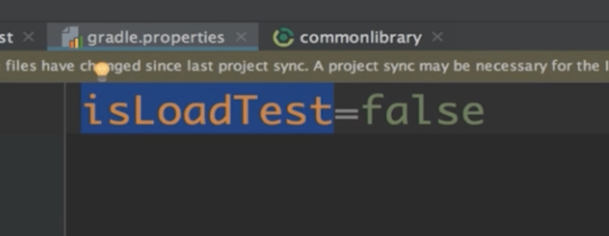

### 这样就能手动控制 Project 导入

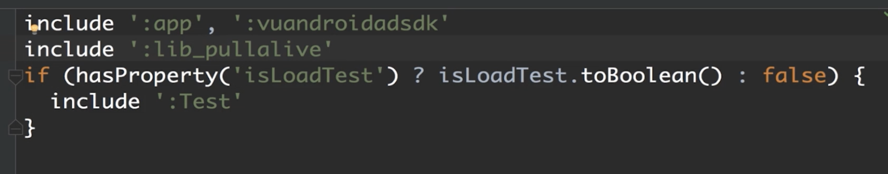

## 文件 API

### Gradle 简化了文件操作，都是基于当前 Project 的根目录开始，无法与系统的文件系统进行交互

### 拿到 Project 路径

### 得到文件内容

### 拷贝文件

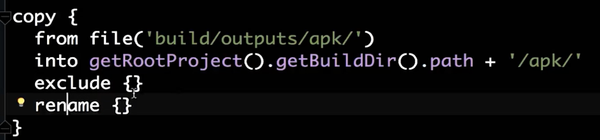

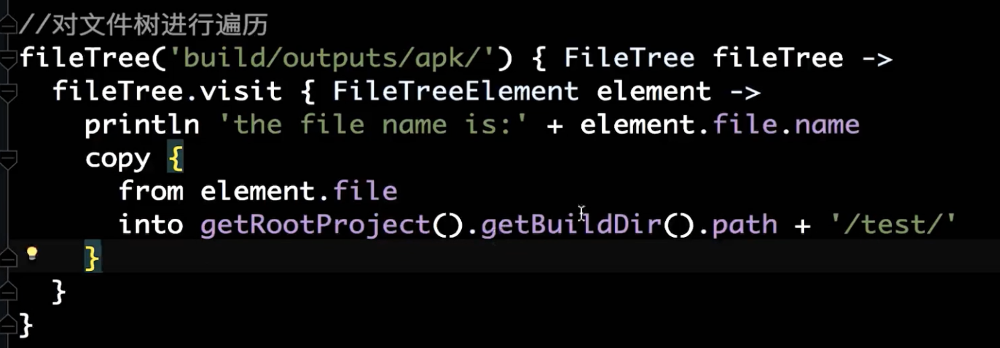

## 依赖相关

### compile 打包还在

### provided 打包不会引入

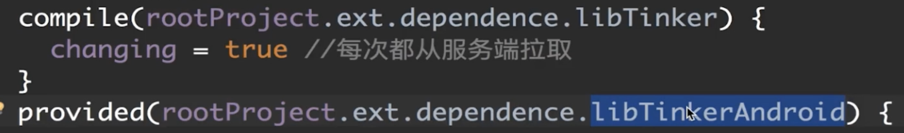

## 其他 API

## 执行外部命令

### 我们写脚本会不可避免的遇到使用系统命令，所以需要执行外部命令

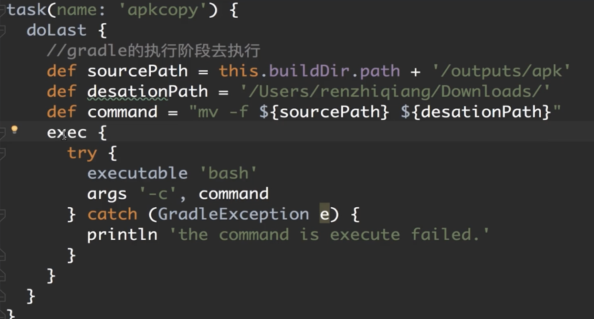