# Task定义和配置

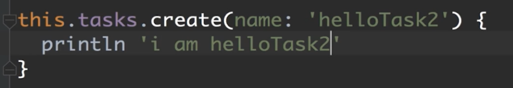

## 配置组名和描述信息

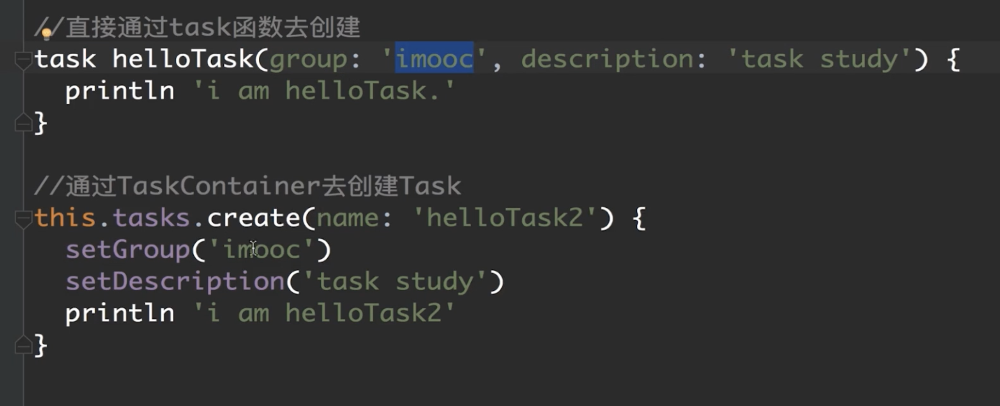

# Task的执行讲解

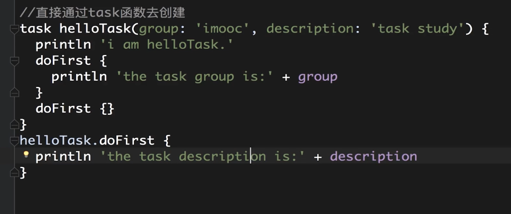

先执行外部的 doFrist 再来执行内部的 doFirst 

只有在 task 中的 doFirst 和 doLast 中的代码会执行在 Gradle 中的执行周期

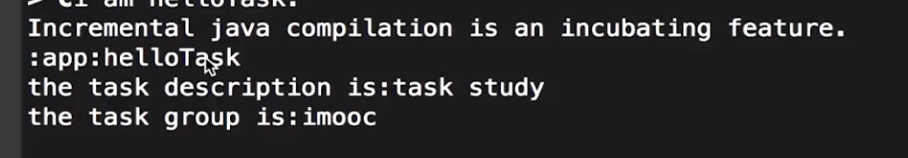

通过 doFirst 可以在执行 task 之前执行一些逻辑

doLast 同理

可以通过task管理来关闭一些测试task来加快编译速度

我是如何知道有哪些task，可以查看控制台打印的task执行名称

# Task的依赖和执行顺序

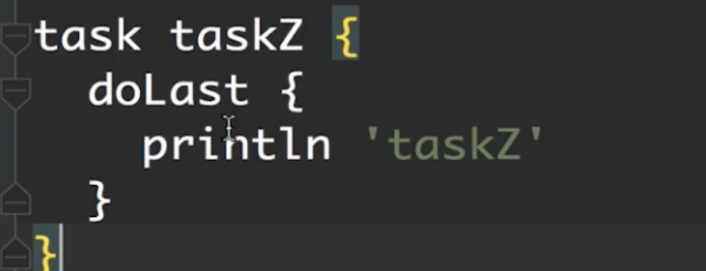

配置相关依赖

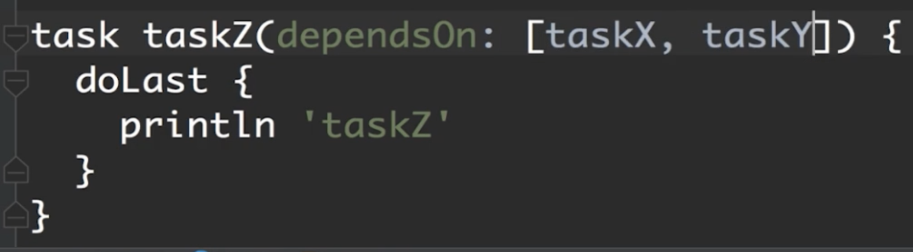

相应的依赖关系

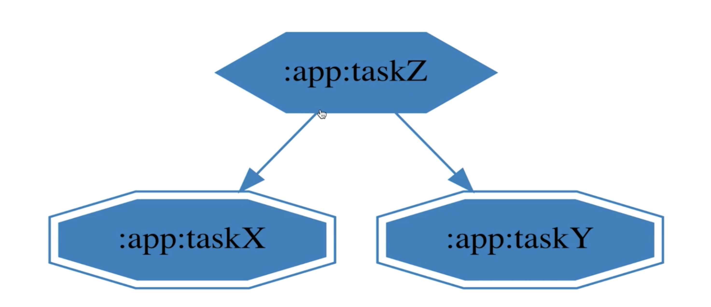

动态的指定相关依赖

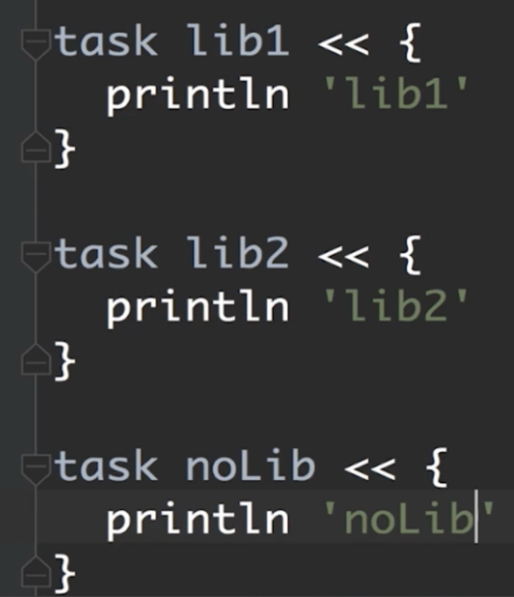

看到 << 等同于 doLast

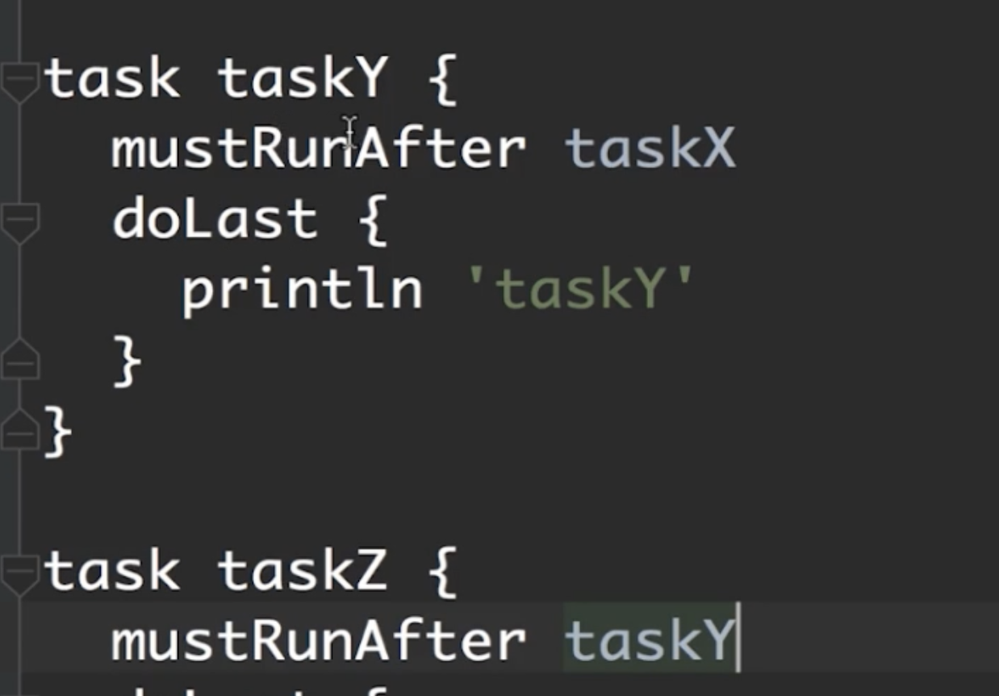

## Task输入输出

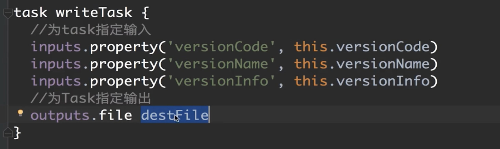

# Task类型

https://docs.gradle.org/current/dsl/org.gradle.api.plugins.antlr.AntlrTask.html

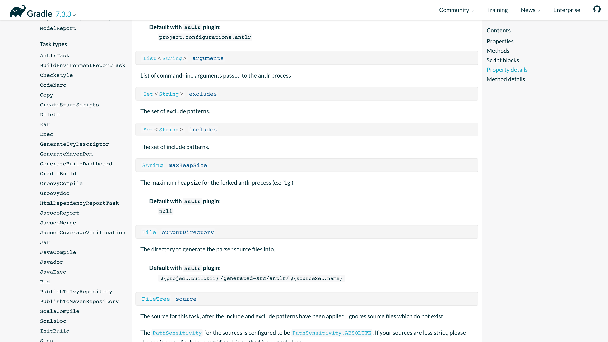

# 挂接到生命周期

记得分文件写完Task后记得引入文件要不然不会解析

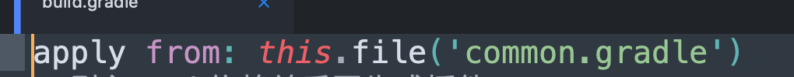

挂接到生命周期

# Task实战

 