## 线程池的自我介绍


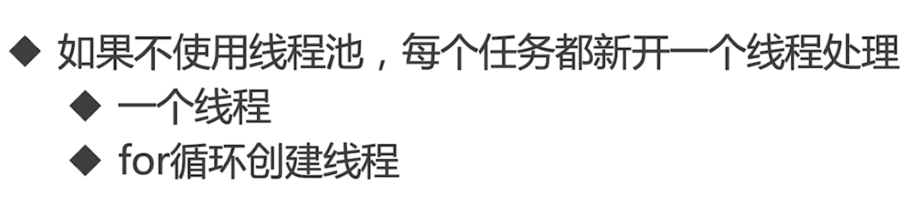

- 创建了一个线程

```java
package threadpool;

/**
 * 描述：     TODO
 */
public class EveryTaskOneThread {

    public static void main(String[] args) {
        Thread thread = new Thread(new Task());
        thread.start();
    }

    static class Task implements Runnable {

        @Override
        public void run() {
            System.out.println("执行了任务");
        }
    }

}
```

- 创建多个线程

```java
package threadpool;

import java.util.concurrent.Executors;

/**
 * 描述：     TODO
 */
public class ForLoop {

    public static void main(String[] args) {
        for (int i = 0; i < 1000; i++) {
            Thread thread = new Thread(new Task());
            thread.start();
        }
    }

    static class Task implements Runnable {

        @Override
        public void run() {
            System.out.println("执行了任务");
        }
    }

}
```

但是我们线程创建了许多线程，会给系统很大的压力


## 为什么要使用线程池

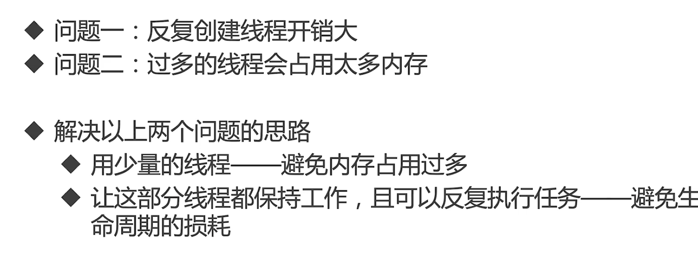

## 使用线程池的好处

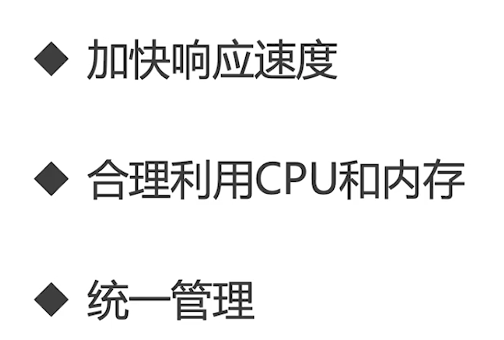

## 线程池适合应用的场景

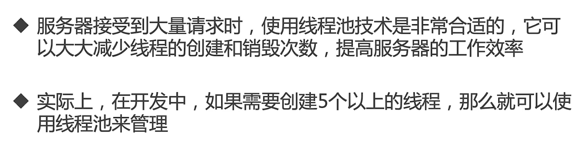

# 创建和停止线程池


## 线程池构造函数的参数


## 参数中的corePoolSize和maxpoolSize


## corePoolSize和maxpoolSize


## 添加线程规则


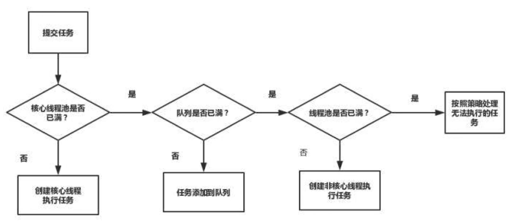


## 举个例子


## 增减线程的特点


## keepAliveTime


## ThreadFactory 用来创建线程


## 工作队列


## 线程池应该手动创建还是自动创建


```java
package threadpool;

import java.util.concurrent.ExecutorService;
import java.util.concurrent.Executors;

/**
 * 描述：     演示newFixedThreadPool
 */
public class FixedThreadPoolTest {

    public static void main(String[] args) {
        ExecutorService executorService = Executors.newFixedThreadPool(4);
        for (int i = 0; i < 1000; i++) {
            executorService.execute(new Task());
        }
    }
}

class Task implements Runnable {


    @Override
    public void run() {
        try {
            Thread.sleep(500);
        } catch (InterruptedException e) {
            e.printStackTrace();
        }
        System.out.println(Thread.currentThread().getName());
    }
}
```

我们可以看到线程的名字始终都是那几个，所以这个也是线程池，我们看到源码


```java
package threadpool;

import java.util.concurrent.ExecutorService;
import java.util.concurrent.Executors;

/**
 * 描述：     演示newFixedThreadPool出错的情况
 */
public class FixedThreadPoolOOM {

    private static ExecutorService executorService = Executors.newFixedThreadPool(1);
    public static void main(String[] args) {
        for (int i = 0; i < Integer.MAX_VALUE; i++) {
            executorService.execute(new SubThread());
        }
    }

}

class SubThread implements Runnable {


    @Override
    public void run() {
        try {
            Thread.sleep(1000000000);
        } catch (InterruptedException e) {
            e.printStackTrace();
        }
    }
}

```


```java
package threadpool;

import java.util.concurrent.ExecutorService;
import java.util.concurrent.Executors;

/**
 * 描述：     TODO
 */
public class SingleThreadExecutor {
    public static void main(String[] args) {
        ExecutorService executorService = Executors.newSingleThreadExecutor();
        for (int i = 0; i < 1000; i++) {
            executorService.execute(new Task());
        }
    }
}

```

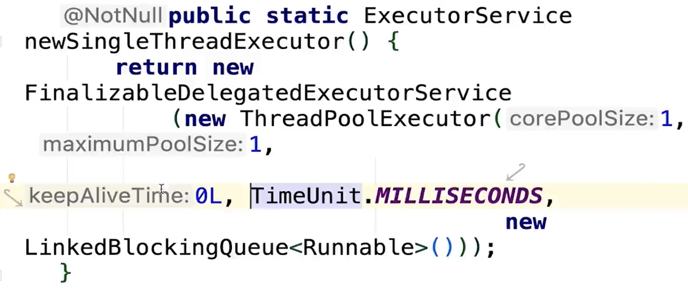


## CacheThreadPool

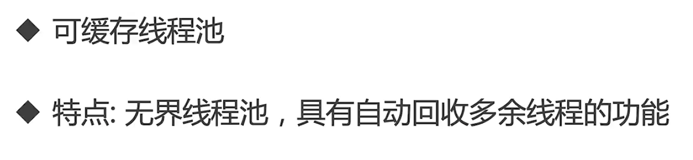

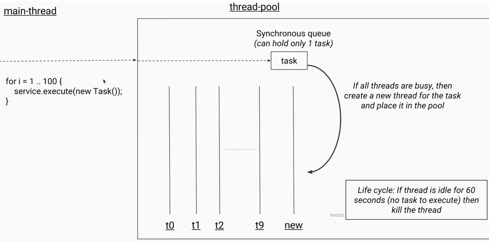

```java
package threadpool;

import java.util.concurrent.ExecutorService;
import java.util.concurrent.Executors;

/**
 * 描述：     TODO
 */
public class CachedThreadPool {

    public static void main(String[] args) {
        ExecutorService executorService = Executors.newCachedThreadPool();
        for (int i = 0; i < 1000; i++) {
            executorService.execute(new Task());
        }
    }
}

```


## ScheduledThreadPool


```java
package threadpool;

import java.util.concurrent.Executors;
import java.util.concurrent.ScheduledExecutorService;
import java.util.concurrent.TimeUnit;

/**
 * 描述：     TODO
 */
public class ScheduledThreadPoolTest {

    public static void main(String[] args) {
        ScheduledExecutorService threadPool = Executors.newScheduledThreadPool(10);
//        threadPool.schedule(new Task(), 5, TimeUnit.SECONDS);
        threadPool.scheduleAtFixedRate(new Task(), 1, 3, TimeUnit.SECONDS);
    }
}

```


## 线程池里的线程数量设定为多少合适

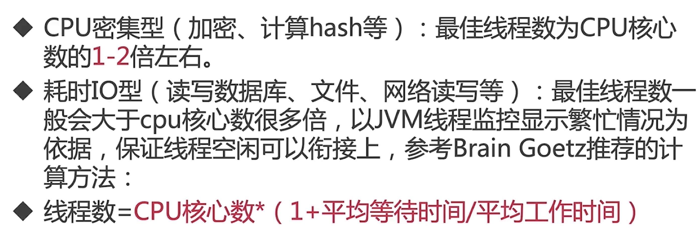

## 停止线程池的正确方法


```java
package threadpool;

import java.util.List;
import java.util.concurrent.ExecutorService;
import java.util.concurrent.Executors;
import java.util.concurrent.TimeUnit;

/**
 * 描述：     演示关闭线程池
 */
public class ShutDown {

    public static void main(String[] args) throws InterruptedException {
        ExecutorService executorService = Executors.newFixedThreadPool(10);
        for (int i = 0; i < 100; i++) {
            executorService.execute(new ShutDownTask());
        }
        Thread.sleep(1500);
//        List<Runnable> runnableList = executorService.shutdownNow();

        executorService.shutdown();
        executorService.execute(new ShutDownTask());
//        boolean b = executorService.awaitTermination(7L, TimeUnit.SECONDS);
//        System.out.println(b);
//        System.out.println(executorService.isShutdown());
//        executorService.shutdown();
//        System.out.println(executorService.isShutdown());
//        System.out.println(executorService.isTerminated());
//        Thread.sleep(10000);
//        System.out.println(executorService.isTerminated());

//        executorService.execute(new ShutDownTask());
    }
}

class ShutDownTask implements Runnable {


    @Override
    public void run() {
        try {
            Thread.sleep(500);
            System.out.println(Thread.currentThread().getName());
        } catch (InterruptedException e) {
            System.out.println(Thread.currentThread().getName() + "被中断了");
        }
    }
}
```


# 常见线程池的特点和用法


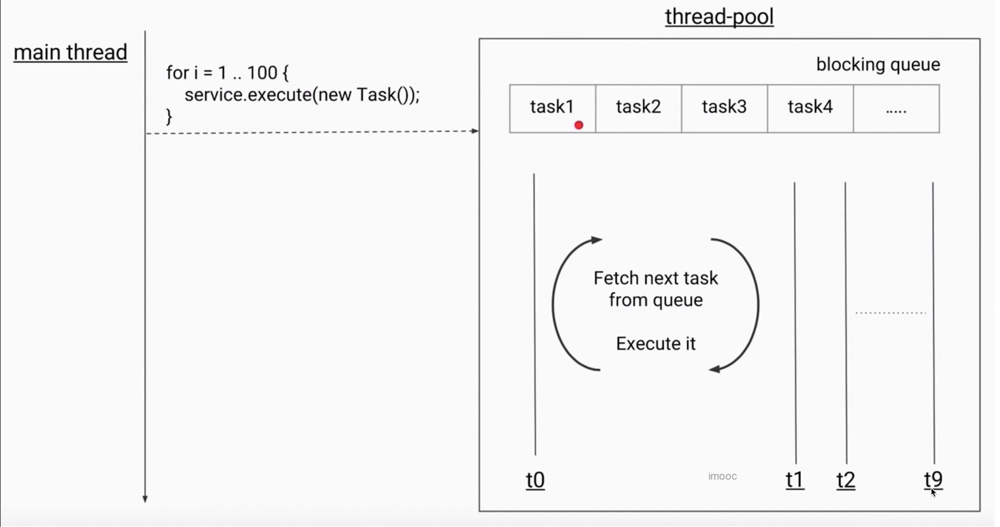


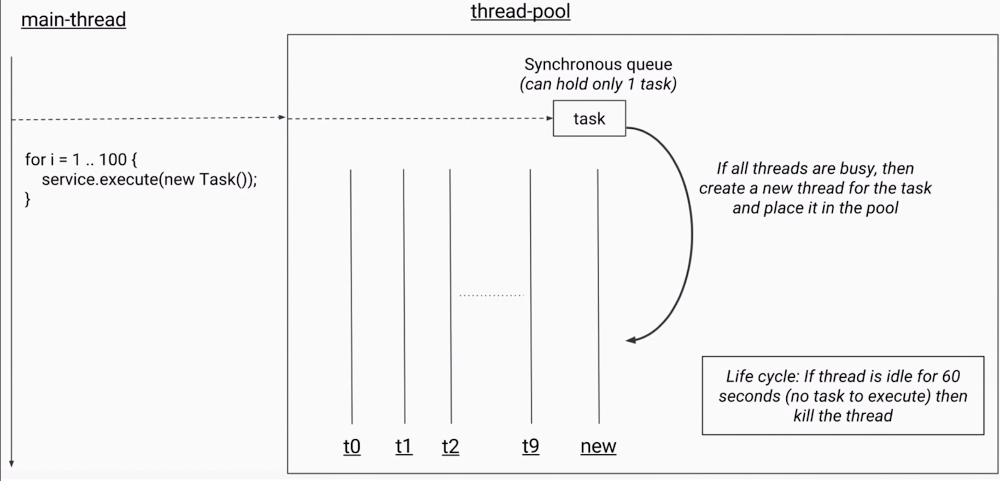


## 以上四种线程池的构造函数的参数

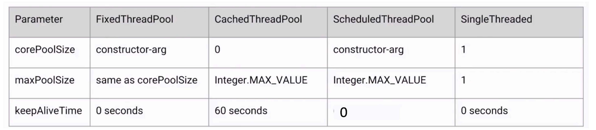

## 阻塞队列分析


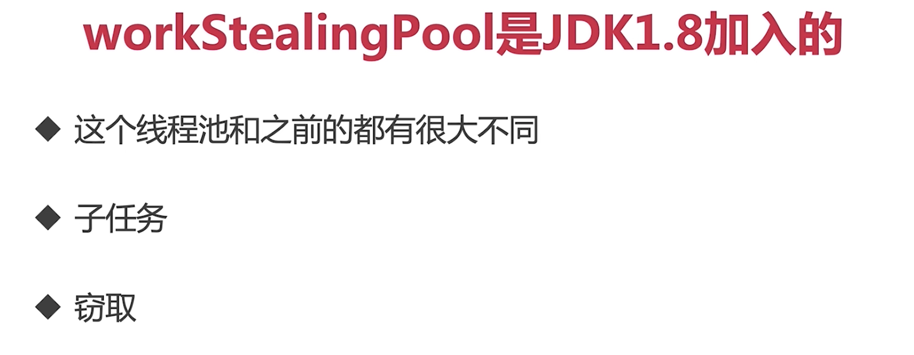

# 任务太多，怎么拒绝？

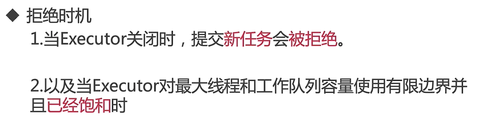


## 四种拒绝策略

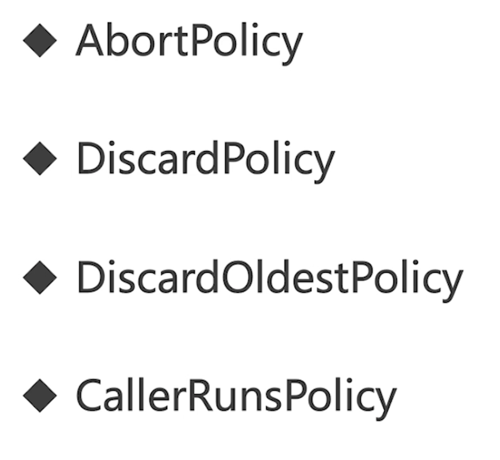


# 钩子方法，给线程池加点料


```java
package threadpool;

import java.util.concurrent.BlockingQueue;
import java.util.concurrent.LinkedBlockingQueue;
import java.util.concurrent.RejectedExecutionHandler;
import java.util.concurrent.ThreadFactory;
import java.util.concurrent.ThreadPoolExecutor;
import java.util.concurrent.TimeUnit;
import java.util.concurrent.locks.Condition;
import java.util.concurrent.locks.ReentrantLock;

/**
 * 描述：     演示每个任务执行前后放钩子函数
 */
public class PauseableThreadPool extends ThreadPoolExecutor {

    private final ReentrantLock lock = new ReentrantLock();
    private Condition unpaused = lock.newCondition();
    private boolean isPaused;


    public PauseableThreadPool(int corePoolSize, int maximumPoolSize, long keepAliveTime,
            TimeUnit unit,
            BlockingQueue<Runnable> workQueue) {
        super(corePoolSize, maximumPoolSize, keepAliveTime, unit, workQueue);
    }

    public PauseableThreadPool(int corePoolSize, int maximumPoolSize, long keepAliveTime,
            TimeUnit unit, BlockingQueue<Runnable> workQueue,
            ThreadFactory threadFactory) {
        super(corePoolSize, maximumPoolSize, keepAliveTime, unit, workQueue, threadFactory);
    }

    public PauseableThreadPool(int corePoolSize, int maximumPoolSize, long keepAliveTime,
            TimeUnit unit, BlockingQueue<Runnable> workQueue,
            RejectedExecutionHandler handler) {
        super(corePoolSize, maximumPoolSize, keepAliveTime, unit, workQueue, handler);
    }

    public PauseableThreadPool(int corePoolSize, int maximumPoolSize, long keepAliveTime,
            TimeUnit unit, BlockingQueue<Runnable> workQueue,
            ThreadFactory threadFactory, RejectedExecutionHandler handler) {
        super(corePoolSize, maximumPoolSize, keepAliveTime, unit, workQueue, threadFactory,
                handler);
    }

    @Override
    protected void beforeExecute(Thread t, Runnable r) {
        super.beforeExecute(t, r);
        lock.lock();
        try {
            while (isPaused) {
                unpaused.await();
            }
        } catch (InterruptedException e) {
            e.printStackTrace();
        } finally {
            lock.unlock();
        }
    }

    private void pause() {
        lock.lock();
        try {
            isPaused = true;
        } finally {
            lock.unlock();
        }
    }

    public void resume() {
        lock.lock();
        try {
            isPaused = false;
            unpaused.signalAll();
        } finally {
            lock.unlock();
        }
    }

    public static void main(String[] args) throws InterruptedException {
        PauseableThreadPool pauseableThreadPool = new PauseableThreadPool(10, 20, 10l,
                TimeUnit.SECONDS, new LinkedBlockingQueue<>());
        Runnable runnable = new Runnable() {
            @Override
            public void run() {
                System.out.println("我被执行");
                try {
                    Thread.sleep(10);
                } catch (InterruptedException e) {
                    e.printStackTrace();
                }
            }
        };
        for (int i = 0; i < 10000; i++) {
            pauseableThreadPool.execute(runnable);
        }
        Thread.sleep(1500);
        pauseableThreadPool.pause();
        System.out.println("线程池被暂停了");
        Thread.sleep(1500);
        pauseableThreadPool.resume();
        System.out.println("线程池被恢复了");

    }
}

```

# 实现原理、源码分析


## Executor家族


## 哪个是线程池

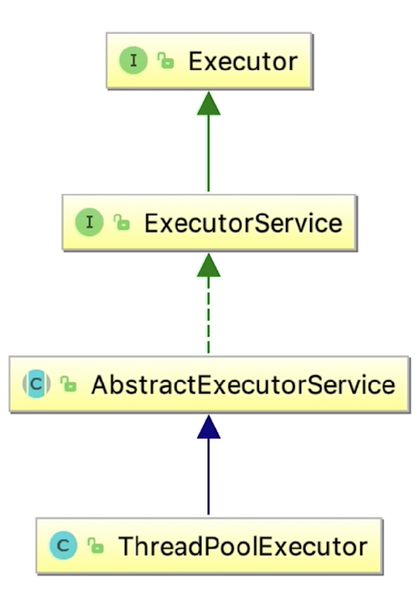

## 线程池实现任务复用的原理


## 线程池状态

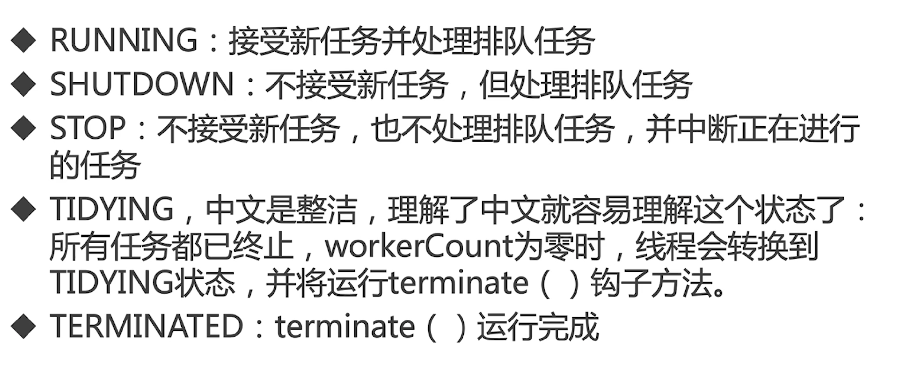

# 使用线程池的注意点

