# 两大使用场景-ThreadLocal的用途


## 典型场景1:每个线程都需要一个独享的对象


### 两个线程分别用自己的SimpleDateFormat

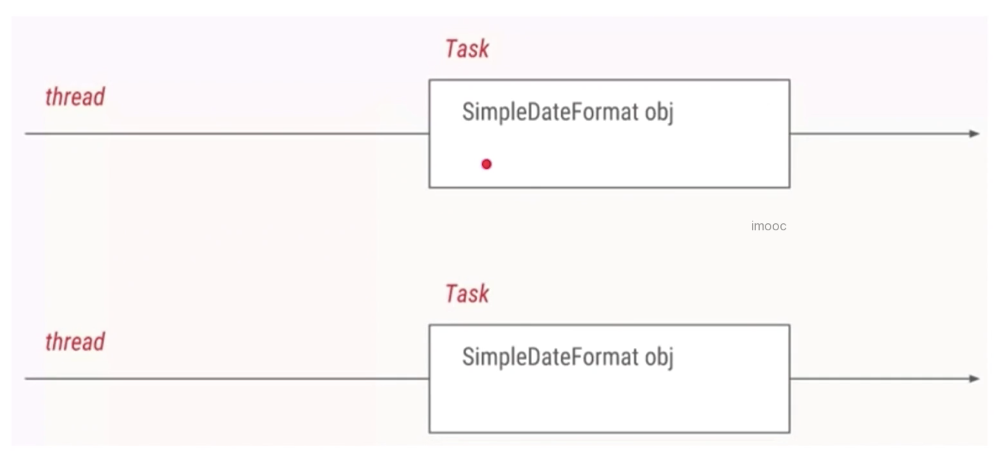

```java
package threadlocal;

import java.text.SimpleDateFormat;
import java.util.Date;

/**
 * 描述：     两个线程打印日期
 */
public class ThreadLocalNormalUsage00 {

    public static void main(String[] args) {
        new Thread(new Runnable() {
            @Override
            public void run() {
                String date = new ThreadLocalNormalUsage00().date(10);
                System.out.println(date);
            }
        }).start();
        new Thread(new Runnable() {
            @Override
            public void run() {
                String date = new ThreadLocalNormalUsage00().date(104707);
                System.out.println(date);
            }
        }).start();
    }

    public String date(int seconds) {
        //参数的单位是毫秒，从1970.1.1 00:00:00 GMT计时
        Date date = new Date(1000 * seconds);
        SimpleDateFormat dateFormat = new SimpleDateFormat("yyyy-MM-dd HH:mm:ss");
        return dateFormat.format(date);
    }
}
```

### 但是有很多线程都需要使用SimpleDateFormat，那就有 10 个 SimpleDateFormat 和 10 个线程，写法不优雅


```java
package threadlocal;

import java.text.SimpleDateFormat;
import java.util.Date;

/**
 * 描述：     10个线程打印日期
 */
public class ThreadLocalNormalUsage01 {

    public static void main(String[] args) throws InterruptedException {
        for (int i = 0; i < 30; i++) {
            int finalI = i;
            new Thread(new Runnable() {
                @Override
                public void run() {
                    String date = new ThreadLocalNormalUsage01().date(finalI);
                    System.out.println(date);
                }
            }).start();
            Thread.sleep(100);
        }

    }

    public String date(int seconds) {
        //参数的单位是毫秒，从1970.1.1 00:00:00 GMT计时
        Date date = new Date(1000 * seconds);
        SimpleDateFormat dateFormat = new SimpleDateFormat("yyyy-MM-dd HH:mm:ss");
        return dateFormat.format(date);
    }
}
```

### 当线程变成 1000 个，我们就得用线程池来改写（要不然性能太差）

```java
package threadlocal;

import java.text.SimpleDateFormat;
import java.util.Date;
import java.util.concurrent.Executor;
import java.util.concurrent.ExecutorService;
import java.util.concurrent.Executors;

/**
 * 描述：     1000个打印日期的任务，用线程池来执行
 */
public class ThreadLocalNormalUsage02 {

    public static ExecutorService threadPool = Executors.newFixedThreadPool(10);

    public static void main(String[] args) throws InterruptedException {
        for (int i = 0; i < 1000; i++) {
            int finalI = i;
            threadPool.submit(new Runnable() {
                @Override
                public void run() {
                    String date = new ThreadLocalNormalUsage02().date(finalI);
                    System.out.println(date);
                }
            });
        }
        threadPool.shutdown();
    }

    public String date(int seconds) {
        //参数的单位是毫秒，从1970.1.1 00:00:00 GMT计时
        Date date = new Date(1000 * seconds);
        SimpleDateFormat dateFormat = new SimpleDateFormat("yyyy-MM-dd HH:mm:ss");
        return dateFormat.format(date);
    }
}
```

### 但是这个还是有重复创建对象SimpleDateFormat造成了性能浪费

改进后创建成全局变量

```java
package threadlocal;

import java.text.SimpleDateFormat;
import java.util.Date;
import java.util.concurrent.ExecutorService;
import java.util.concurrent.Executors;

/**
 * 描述：     1000个打印日期的任务，用线程池来执行
 */
public class ThreadLocalNormalUsage03 {

    public static ExecutorService threadPool = Executors.newFixedThreadPool(10);
    static SimpleDateFormat dateFormat = new SimpleDateFormat("yyyy-MM-dd HH:mm:ss");

    public static void main(String[] args) throws InterruptedException {
        for (int i = 0; i < 1000; i++) {
            int finalI = i;
            threadPool.submit(new Runnable() {
                @Override
                public void run() {
                    String date = new ThreadLocalNormalUsage03().date(finalI);
                    System.out.println(date);
                }
            });
        }
        threadPool.shutdown();
    }

    public String date(int seconds) {
        //参数的单位是毫秒，从1970.1.1 00:00:00 GMT计时
        Date date = new Date(1000 * seconds);
        return dateFormat.format(date);
    }
}
```

### 但是我们发现打印的结果不是我们想要的

## 原因就是所有的线程都共用同一个SimpleDateFormat（线程不安全）对象

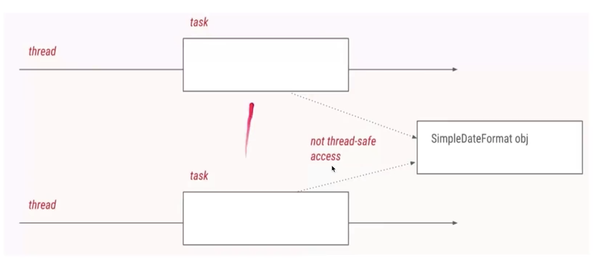

### 遇到线程不安全问题我们首先想到的都是加锁，但是这样会导致效率比较低

```java
package threadlocal;

import java.text.SimpleDateFormat;
import java.util.Date;
import java.util.concurrent.ExecutorService;
import java.util.concurrent.Executors;

/**
 * 描述：     加锁来解决线程安全问题
 */
public class ThreadLocalNormalUsage04 {

    public static ExecutorService threadPool = Executors.newFixedThreadPool(10);
    static SimpleDateFormat dateFormat = new SimpleDateFormat("yyyy-MM-dd HH:mm:ss");

    public static void main(String[] args) throws InterruptedException {
        for (int i = 0; i < 1000; i++) {
            int finalI = i;
            threadPool.submit(new Runnable() {
                @Override
                public void run() {
                    String date = new ThreadLocalNormalUsage04().date(finalI);
                    System.out.println(date);
                }
            });
        }
        threadPool.shutdown();
    }

    public String date(int seconds) {
        //参数的单位是毫秒，从1970.1.1 00:00:00 GMT计时
        Date date = new Date(1000 * seconds);
        String s = null;
        synchronized (ThreadLocalNormalUsage04.class) {
            s = dateFormat.format(date);
        }
        return s;
    }
}
```

### 更好的解决方法就是ThreadLocal


```java
package threadlocal;

import java.text.SimpleDateFormat;
import java.util.Date;
import java.util.concurrent.ExecutorService;
import java.util.concurrent.Executors;

/**
 * 描述：     利用ThreadLocal，给每个线程分配自己的dateFormat对象，保证了线程安全，高效利用内存
 */
public class ThreadLocalNormalUsage05 {

    public static ExecutorService threadPool = Executors.newFixedThreadPool(10);

    public static void main(String[] args) throws InterruptedException {
        for (int i = 0; i < 1000; i++) {
            int finalI = i;
            threadPool.submit(new Runnable() {
                @Override
                public void run() {
                    String date = new ThreadLocalNormalUsage05().date(finalI);
                    System.out.println(date);
                }
            });
        }
        threadPool.shutdown();
    }

    public String date(int seconds) {
        //参数的单位是毫秒，从1970.1.1 00:00:00 GMT计时
        Date date = new Date(1000 * seconds);
//        SimpleDateFormat dateFormat = new SimpleDateFormat("yyyy-MM-dd HH:mm:ss");
        SimpleDateFormat dateFormat = ThreadSafeFormatter.dateFormatThreadLocal2.get();
        return dateFormat.format(date);
    }
}

class ThreadSafeFormatter {

    public static ThreadLocal<SimpleDateFormat> dateFormatThreadLocal = new ThreadLocal<SimpleDateFormat>() {
        @Override
        protected SimpleDateFormat initialValue() {
            return new SimpleDateFormat("yyyy-MM-dd HH:mm:ss");
        }
    };

    public static ThreadLocal<SimpleDateFormat> dateFormatThreadLocal2 = ThreadLocal
            .withInitial(() -> new SimpleDateFormat("yyyy-MM-dd HH:mm:ss"));
}
```

## 典型场景2:每个线程内需要保存全局变量

### 当前用户信息需要被线程内所有方法共享

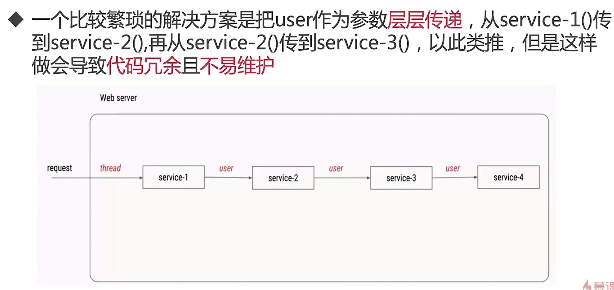

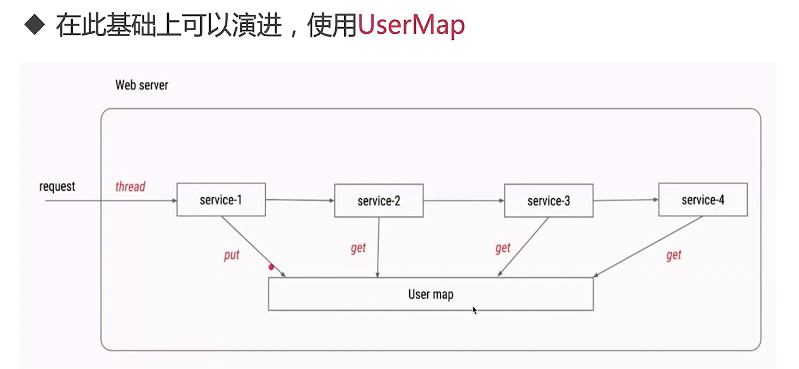


### 每个线程内需要保存全局变量，可以让不同方法直接使用，避免参数传递的麻烦

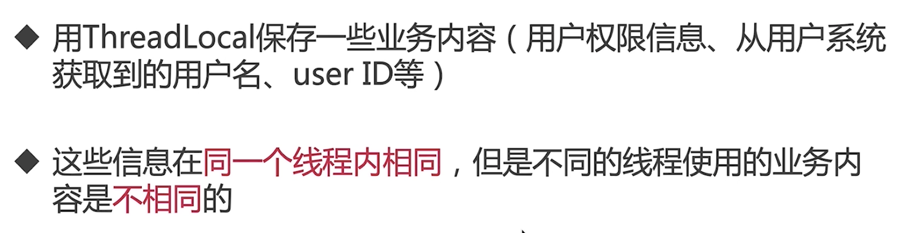

### 使用方法


```java
package threadlocal;

/**
 * 描述：     演示ThreadLocal用法2：避免传递参数的麻烦
 */
public class ThreadLocalNormalUsage06 {

    public static void main(String[] args) {
        new Service1().process("");

    }
}

class Service1 {

    public void process(String name) {
        User user = new User("超哥");
        UserContextHolder.holder.set(user);
        new Service2().process();
    }
}

class Service2 {

    public void process() {
        User user = UserContextHolder.holder.get();
        ThreadSafeFormatter.dateFormatThreadLocal.get();
        System.out.println("Service2拿到用户名：" + user.name);
        new Service3().process();
    }
}

class Service3 {

    public void process() {
        User user = UserContextHolder.holder.get();
        System.out.println("Service3拿到用户名：" + user.name);
        UserContextHolder.holder.remove();
    }
}

class UserContextHolder {

    public static ThreadLocal<User> holder = new ThreadLocal<>();


}

class User {

    String name;

    public User(String name) {
        this.name = name;
    }
}
```

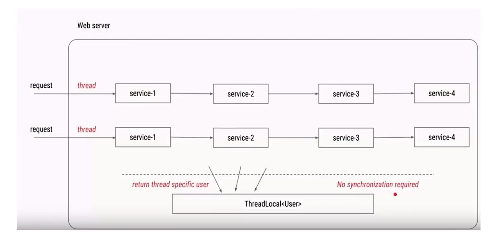

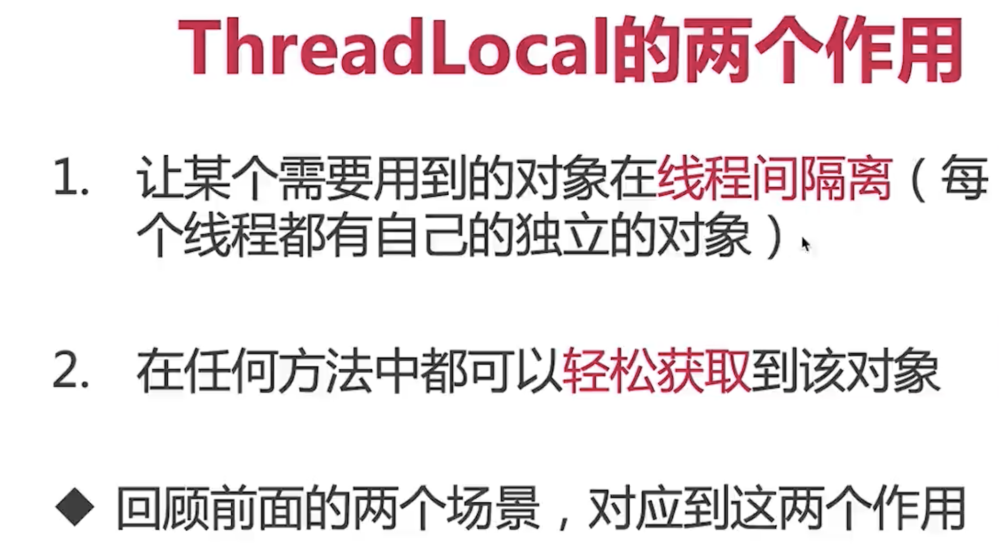

## 根据共享对象的生成时机不同，选择initialValue或set来保存对象

### initialValue


### set


# 使用ThreadLocal带来的好处


# 原理、源码分析

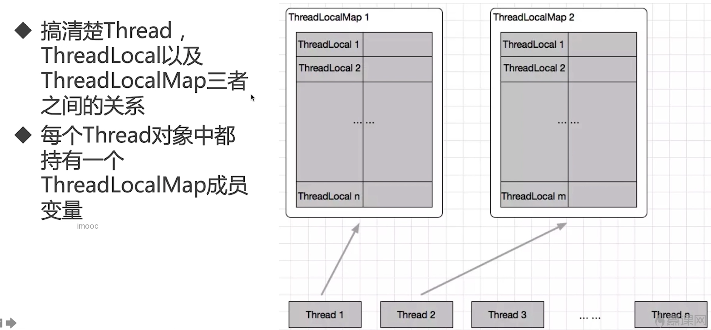

# 主要方法介绍

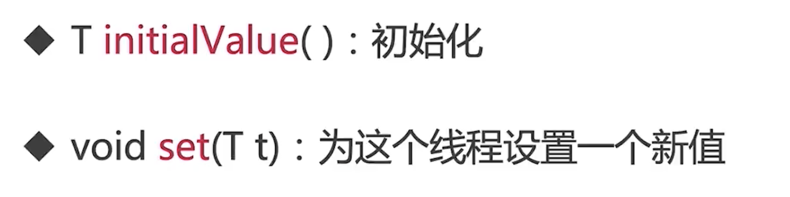


## T initialValue()

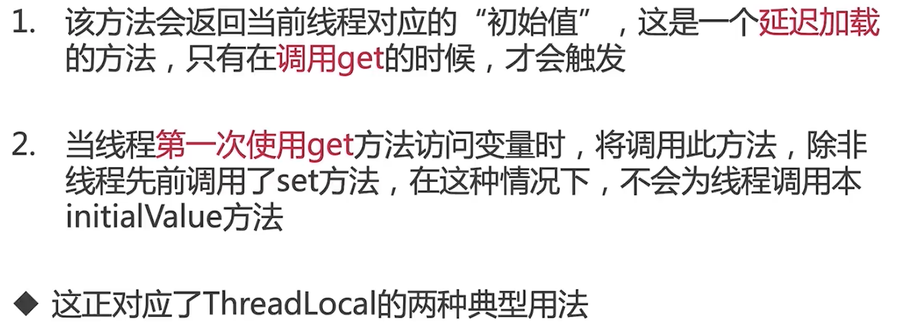

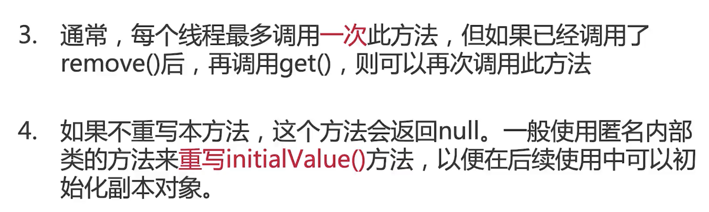


## get 方法


## ThreadLocalMap类


## 两种使用场景殊途同归

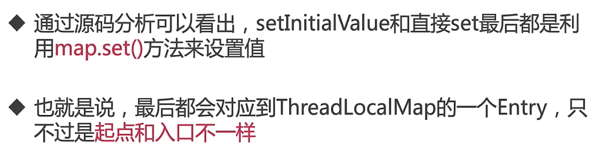

# 注意点


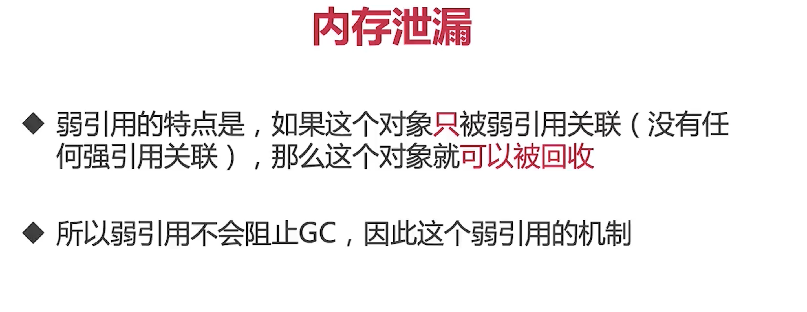 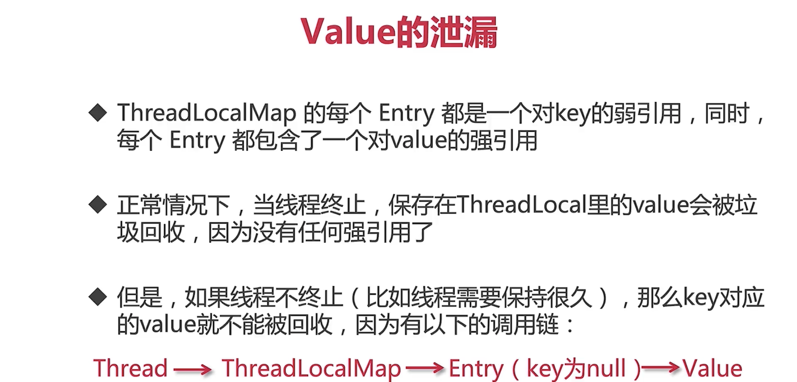


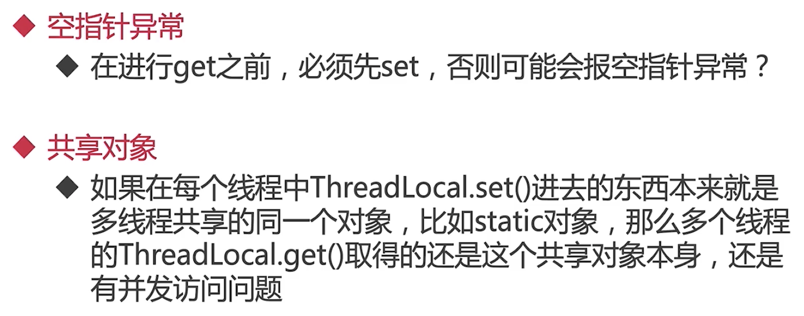

```java
package threadlocal;

/**
 * 描述：     TODO
 */
public class ThreadLocalNPE {

    ThreadLocal<Long> longThreadLocal = new ThreadLocal<Long>();

    public void set() {
        longThreadLocal.set(Thread.currentThread().getId());
    }

    public long get() {
        return longThreadLocal.get();
    }

    public static void main(String[] args) {
        ThreadLocalNPE threadLocalNPE = new ThreadLocalNPE();
        System.out.println(threadLocalNPE.get());
        Thread thread1 = new Thread(new Runnable() {
            @Override
            public void run() {
                threadLocalNPE.set();
                System.out.println(threadLocalNPE.get());
            }
        });
        thread1.start();
    }
}
```


# 实际应用场景-在Spring中的实例分析

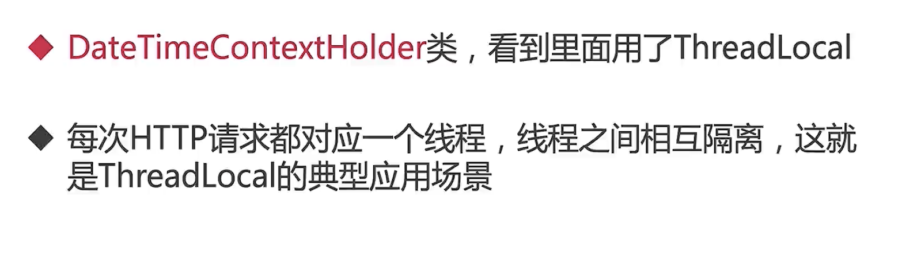
