# 千变万化的锁

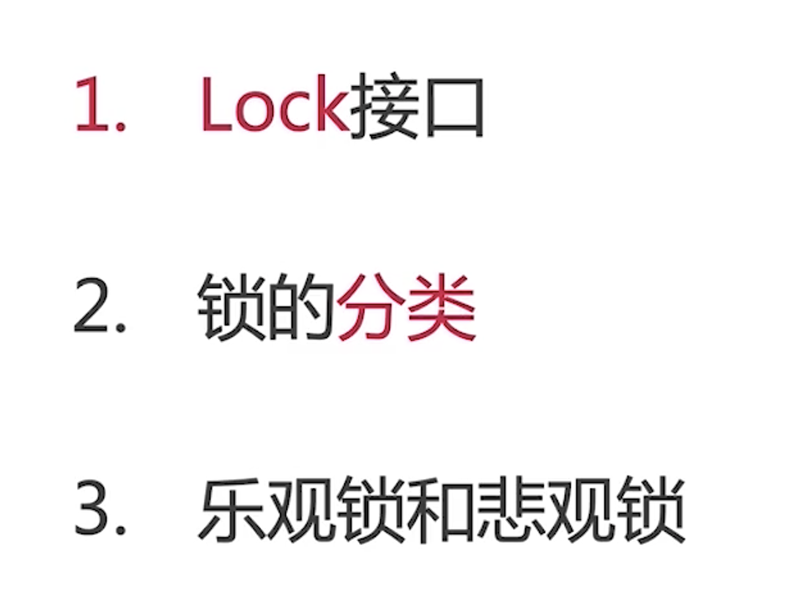

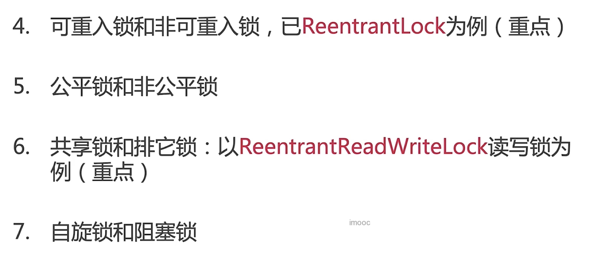


# LOCK接口

## 简介、地位、作用


## 为什么synchronized不够用？为什么需要Lock？


## Lock主要方法介绍

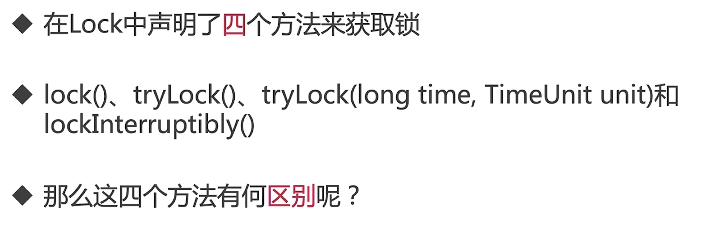

### Lock()

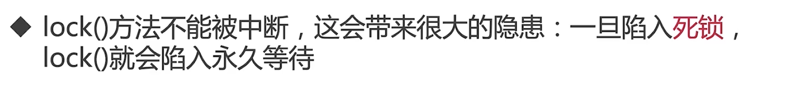

```java
package lock.lock;

import java.util.concurrent.locks.Lock;
import java.util.concurrent.locks.ReentrantLock;

/**
 * 描述：     Lock不会像synchronized一样，异常的时候自动释放锁，所以最佳实践是，finally中释放锁，以便保证发生异常的时候锁一定被释放
 */
public class MustUnlock {

    private static Lock lock = new ReentrantLock();

    public static void main(String[] args) {
        lock.lock();
        try{
            //获取本锁保护的资源
            System.out.println(Thread.currentThread().getName()+"开始执行任务");
        }finally {
            lock.unlock();
        }
    }
}
```

### tryLock()


```java
package lock.lock;

import java.util.Random;
import java.util.concurrent.ThreadPoolExecutor;
import java.util.concurrent.TimeUnit;
import java.util.concurrent.locks.Lock;
import java.util.concurrent.locks.ReentrantLock;

/**
 * 描述：     用tryLock来避免死锁
 */
public class TryLockDeadlock implements Runnable {


    int flag = 1;
    static Lock lock1 = new ReentrantLock();
    static Lock lock2 = new ReentrantLock();

    public static void main(String[] args) {
        TryLockDeadlock r1 = new TryLockDeadlock();
        TryLockDeadlock r2 = new TryLockDeadlock();
        r1.flag = 1;
        r1.flag = 0;
        new Thread(r1).start();
        new Thread(r2).start();

    }

    @Override
    public void run() {
        for (int i = 0; i < 100; i++) {
            if (flag == 1) {
                try {
                    if (lock1.tryLock(800, TimeUnit.MILLISECONDS)) {
                        try {
                            System.out.println("线程1获取到了锁1");
                            Thread.sleep(new Random().nextInt(1000));
                            if (lock2.tryLock(800, TimeUnit.MILLISECONDS)) {
                                try {
                                    System.out.println("线程1获取到了锁2");
                                    System.out.println("线程1成功获取到了两把锁");
                                    break;
                                } finally {
                                    lock2.unlock();
                                }
                            } else {
                                System.out.println("线程1获取锁2失败，已重试");
                            }
                        } finally {
                            lock1.unlock();
                            Thread.sleep(new Random().nextInt(1000));
                        }
                    } else {
                        System.out.println("线程1获取锁1失败，已重试");
                    }
                } catch (InterruptedException e) {
                    e.printStackTrace();
                }
            }

            if (flag == 0) {
                try {
                    if (lock2.tryLock(3000, TimeUnit.MILLISECONDS)) {
                        try {
                            System.out.println("线程2获取到了锁2");
                            Thread.sleep(new Random().nextInt(1000));
                            if (lock1.tryLock(800, TimeUnit.MILLISECONDS)) {
                                try {
                                    System.out.println("线程2获取到了锁1");
                                    System.out.println("线程2成功获取到了两把锁");
                                    break;
                                } finally {
                                    lock1.unlock();
                                }
                            } else {
                                System.out.println("线程2获取锁1失败，已重试");
                            }
                        } finally {
                            lock2.unlock();
                            Thread.sleep(new Random().nextInt(1000));
                        }
                    } else {
                        System.out.println("线程2获取锁2失败，已重试");
                    }
                } catch (InterruptedException e) {
                    e.printStackTrace();
                }
            }
        }
    }
}
```


```java
package lock.lock;

import java.util.concurrent.ThreadPoolExecutor;
import java.util.concurrent.locks.Lock;
import java.util.concurrent.locks.ReentrantLock;

/**
 * 描述：     TODO
 */
public class LockInterruptibly implements Runnable {

    private Lock lock = new ReentrantLock();
public static void main(String[] args) {
    LockInterruptibly lockInterruptibly = new LockInterruptibly();
    Thread thread0 = new Thread(lockInterruptibly);
    Thread thread1 = new Thread(lockInterruptibly);
    thread0.start();
    thread1.start();

    try {
        Thread.sleep(2000);
    } catch (InterruptedException e) {
        e.printStackTrace();
    }
    thread1.interrupt();
}
    @Override
    public void run() {
        System.out.println(Thread.currentThread().getName() + "尝试获取锁");
        try {
            lock.lockInterruptibly();
            try {
                System.out.println(Thread.currentThread().getName() + "获取到了锁");
                Thread.sleep(5000);
            } catch (InterruptedException e) {
                System.out.println(Thread.currentThread().getName() + "睡眠期间被中断了");
            } finally {
                lock.unlock();
                System.out.println(Thread.currentThread().getName() + "释放了锁");
            }
        } catch (InterruptedException e) {
            System.out.println(Thread.currentThread().getName() + "获得锁期间被中断了");
        }
    }
}
```


## 可见行保证


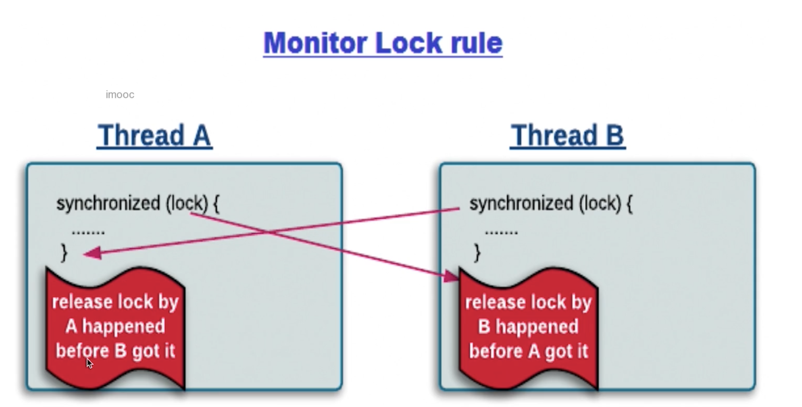    

# 锁的分类


# 乐观锁（非互斥同步锁）和悲观锁（互斥同步锁）

## 为什么会诞生非互斥同步锁-互斥同步锁的劣势


## 什么是乐观锁和悲观锁


### 悲观锁


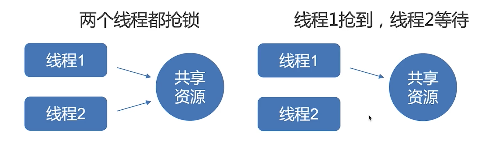


### 乐观锁


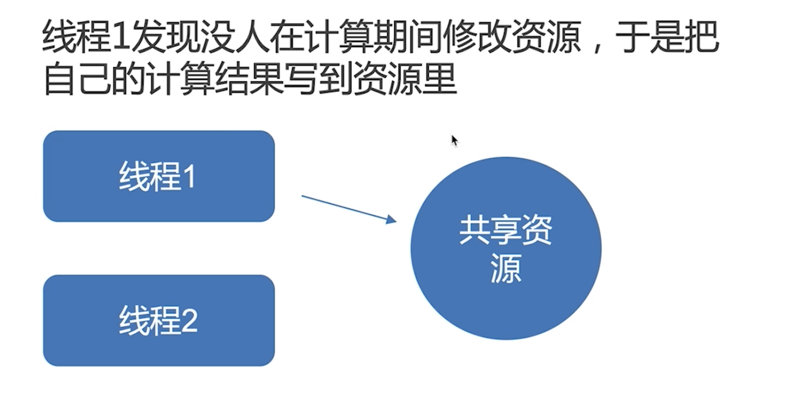


### 典型例子


```java
package lock.lock;

import java.util.concurrent.atomic.AtomicInteger;

/**
 * 描述：     TODO
 */
public class PessimismOptimismLock {

    int a;

    public static void main(String[] args) {
        AtomicInteger atomicInteger = new AtomicInteger();
        atomicInteger.incrementAndGet();
    }

    public synchronized void testMethod() {
        a++;
    }


}
```

### 开销对比


### 两种锁各自的使用场景


## 典型例子

### 乐观锁


# 可重入锁和非可重入锁，已ReentrantLock为例（重点）

## 使用案例


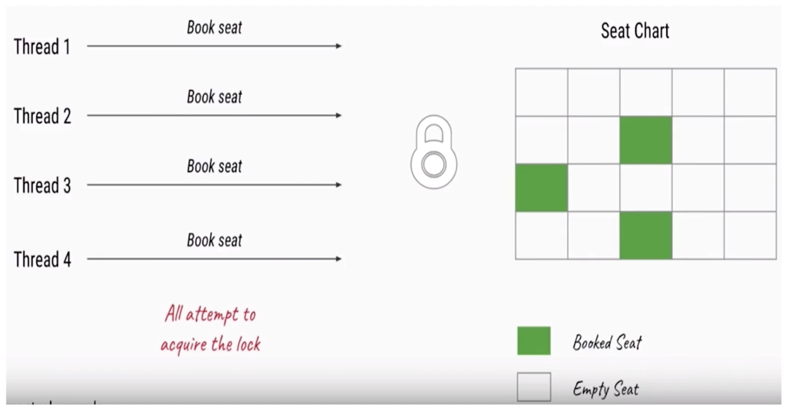

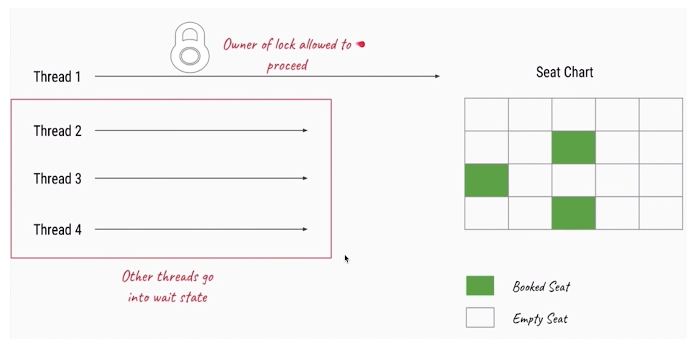

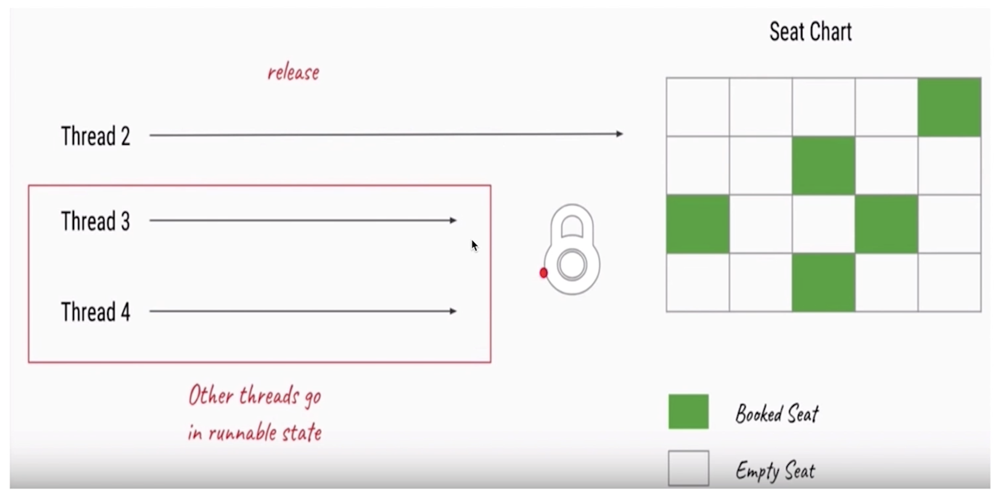

```java
package lock.reentrantlock;

import java.util.concurrent.locks.ReentrantLock;

/**
 * 描述：     演示多线程预定电影院座位
 */
public class CinemaBookSeat {

    private static ReentrantLock lock = new ReentrantLock();

    private static void bookSeat() {
        lock.lock();
        try {
            System.out.println(Thread.currentThread().getName() + "开始预定座位");
            Thread.sleep(1000);
            System.out.println(Thread.currentThread().getName() + "完成预定座位");
        } catch (InterruptedException e) {
            e.printStackTrace();
        } finally {
            lock.unlock();
        }
    }

    public static void main(String[] args) {
        new Thread(() -> bookSeat()).start();
        new Thread(() -> bookSeat()).start();
        new Thread(() -> bookSeat()).start();
        new Thread(() -> bookSeat()).start();
    }
}
```


```java
package lock.reentrantlock;

import java.util.concurrent.locks.Lock;
import java.util.concurrent.locks.ReentrantLock;

/**
 * 描述：     演示ReentrantLock的基本用法，演示被打断
 */
public class LockDemo {

    public static void main(String[] args) {
        new LockDemo().init();
    }

    private void init() {
        final Outputer outputer = new Outputer();
        new Thread(new Runnable() {
            @Override
            public void run() {
                while (true) {
                    try {
                        Thread.sleep(5);
                    } catch (InterruptedException e) {
                        e.printStackTrace();
                    }
                    outputer.output("悟空");
                }

            }
        }).start();

        new Thread(new Runnable() {
            @Override
            public void run() {
                while (true) {
                    try {
                        Thread.sleep(5);
                    } catch (InterruptedException e) {
                        e.printStackTrace();
                    }
                    outputer.output("大师兄");
                }

            }
        }).start();
    }

    static class Outputer {

        Lock lock = new ReentrantLock();

        //字符串打印方法，一个个字符的打印
        public void output(String name) {

            int len = name.length();
            lock.lock();
            try {
                for (int i = 0; i < len; i++) {
                    System.out.print(name.charAt(i));
                }
                System.out.println("");
            } finally {
                lock.unlock();
            }
        }
    }
}
```

## 可重入性质


```java
package lock.reentrantlock;

import java.util.concurrent.locks.ReentrantLock;

/**
 * 描述：     TODO
 */
public class GetHoldCount {
    private  static ReentrantLock lock =  new ReentrantLock();

    public static void main(String[] args) {
        System.out.println(lock.getHoldCount());
        lock.lock();
        System.out.println(lock.getHoldCount());
        lock.lock();
        System.out.println(lock.getHoldCount());
        lock.lock();
        System.out.println(lock.getHoldCount());
        lock.unlock();
        System.out.println(lock.getHoldCount());
        lock.unlock();
        System.out.println(lock.getHoldCount());
        lock.unlock();
        System.out.println(lock.getHoldCount());
    }
}
```

```java
package lock.reentrantlock;

import java.util.concurrent.locks.ReentrantLock;

/**
 * 描述：     TODO
 */
public class RecursionDemo {

    private static ReentrantLock lock = new ReentrantLock();

    private static void accessResource() {
        lock.lock();
        try {
            System.out.println("已经对资源进行了处理");
            if (lock.getHoldCount()<5) {
                System.out.println(lock.getHoldCount());
                accessResource();
                System.out.println(lock.getHoldCount());
            }
        } finally {
            lock.unlock();
        }
    }
    public static void main(String[] args) {
        accessResource();
    }
}
```


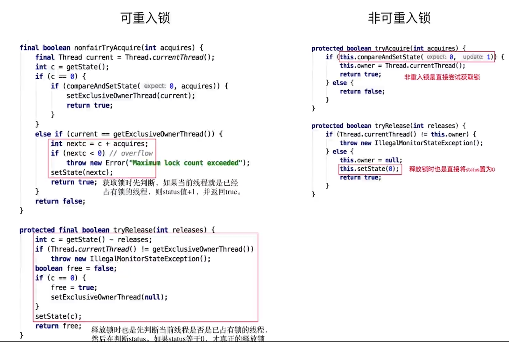

## 其他方法介绍


# 公平锁和非公平锁

## 什么是公平和非公平


## 为什么要有非公平锁


## 公平的情况


## 不公平的情况


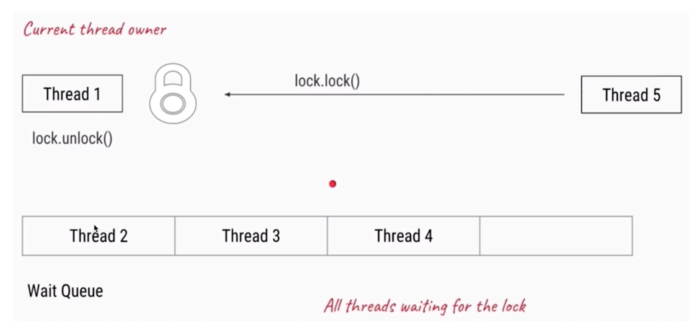

## 代码演示：公平和非公平

```java
package lock.reentrantlock;

import java.util.Random;
import java.util.concurrent.locks.Lock;
import java.util.concurrent.locks.ReentrantLock;

/**
 * 描述：     演示公平和不公平两种情况
 */
public class FairLock {

    public static void main(String[] args) {
        PrintQueue printQueue = new PrintQueue();
        Thread thread[] = new Thread[10];
        for (int i = 0; i < 10; i++) {
            thread[i] = new Thread(new Job(printQueue));
        }
        for (int i = 0; i < 10; i++) {
            thread[i].start();
            try {
                Thread.sleep(100);
            } catch (InterruptedException e) {
                e.printStackTrace();
            }
        }
    }
}

class Job implements Runnable {

    PrintQueue printQueue;

    public Job(PrintQueue printQueue) {
        this.printQueue = printQueue;
    }

    @Override
    public void run() {
        System.out.println(Thread.currentThread().getName() + "开始打印");
        printQueue.printJob(new Object());
        System.out.println(Thread.currentThread().getName() + "打印完毕");
    }
}

class PrintQueue {

    private Lock queueLock = new ReentrantLock(true);

    public void printJob(Object document) {
        queueLock.lock();
        try {
            int duration = new Random().nextInt(10) + 1;
            System.out.println(Thread.currentThread().getName() + "正在打印，需要" + duration);
            Thread.sleep(duration * 1000);
        } catch (InterruptedException e) {
            e.printStackTrace();
        } finally {
            queueLock.unlock();
        }

        queueLock.lock();
        try {
            int duration = new Random().nextInt(10) + 1;
            System.out.println(Thread.currentThread().getName() + "正在打印，需要" + duration+"秒");
            Thread.sleep(duration * 1000);
        } catch (InterruptedException e) {
            e.printStackTrace();
        } finally {
            queueLock.unlock();
        }
    }
}
```

## 特例


## 对比公平和非公平的优缺点


## 源码分析


# 共享锁和排他锁,以ReentrantReadWriteLock读写锁为例子（重点）

## 什么是共享锁和排他锁


## 读写锁的作用


## 读写锁的规则


## ReentrantReadWriteLock具体用法


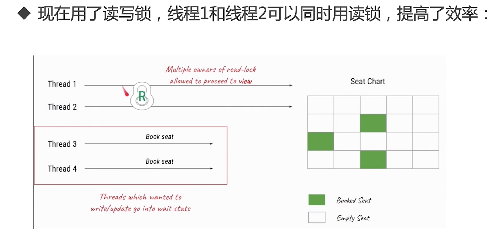


```java
package lock.readwrite;

import java.util.concurrent.locks.ReentrantReadWriteLock;

/**
 * 描述：     TODO
 */
public class CinemaReadWrite {

    private static ReentrantReadWriteLock reentrantReadWriteLock = new ReentrantReadWriteLock();
    private static ReentrantReadWriteLock.ReadLock readLock = reentrantReadWriteLock.readLock();
    private static ReentrantReadWriteLock.WriteLock writeLock = reentrantReadWriteLock.writeLock();

    private static void read() {
        readLock.lock();
        try {
            System.out.println(Thread.currentThread().getName() + "得到了读锁，正在读取");
            Thread.sleep(1000);
        } catch (InterruptedException e) {
            e.printStackTrace();
        } finally {
            System.out.println(Thread.currentThread().getName() + "释放读锁");
            readLock.unlock();
        }
    }

    private static void write() {
        writeLock.lock();
        try {
            System.out.println(Thread.currentThread().getName() + "得到了写锁，正在写入");
            Thread.sleep(1000);
        } catch (InterruptedException e) {
            e.printStackTrace();
        } finally {
            System.out.println(Thread.currentThread().getName() + "释放写锁");
            writeLock.unlock();
        }
    }

    public static void main(String[] args) {
        new Thread(()->read(),"Thread1").start();
        new Thread(()->read(),"Thread2").start();
        new Thread(()->write(),"Thread3").start();
        new Thread(()->write(),"Thread4").start();
    }
}
```

## 读锁和写锁的交互方式


## ReentrantReadWriteLock的实现


不允许读锁插队


允许降级，不允许升级

## 读锁插队策略


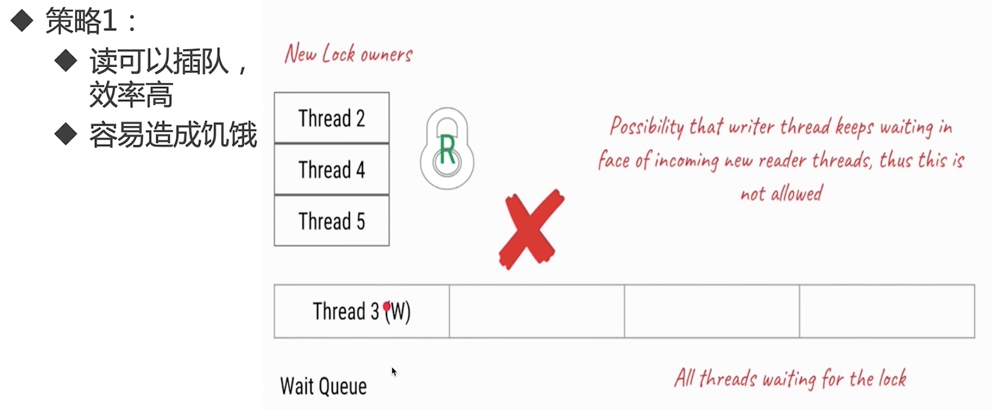


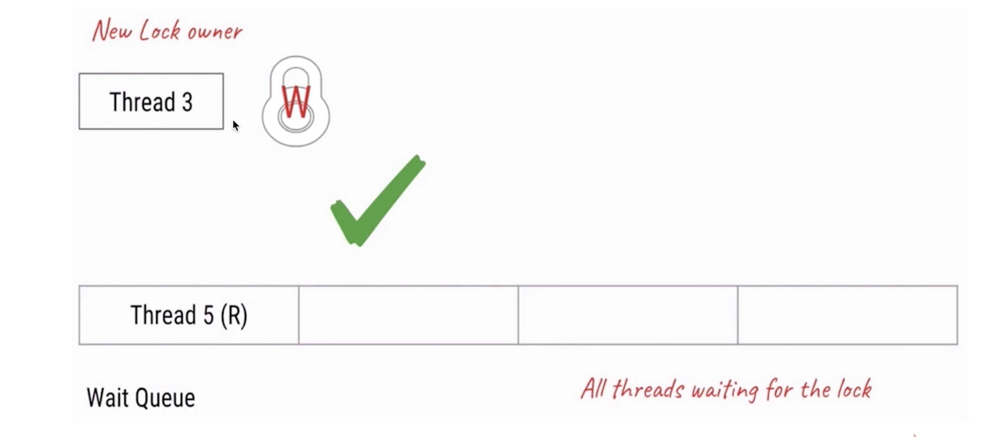


## 读锁插队策略


```java
package lock.readwrite;

import java.util.concurrent.locks.ReentrantReadWriteLock;

/**
 * 描述：     演示非公平和公平的ReentrantReadWriteLock的策略
 */
public class NonfairBargeDemo {

    private static ReentrantReadWriteLock reentrantReadWriteLock = new ReentrantReadWriteLock(
            true);

    private static ReentrantReadWriteLock.ReadLock readLock = reentrantReadWriteLock.readLock();
    private static ReentrantReadWriteLock.WriteLock writeLock = reentrantReadWriteLock.writeLock();

    private static void read() {
        System.out.println(Thread.currentThread().getName() + "开始尝试获取读锁");
        readLock.lock();
        try {
            System.out.println(Thread.currentThread().getName() + "得到读锁，正在读取");
            try {
                Thread.sleep(20);
            } catch (InterruptedException e) {
                e.printStackTrace();
            }
        } finally {
            System.out.println(Thread.currentThread().getName() + "释放读锁");
            readLock.unlock();
        }
    }

    private static void write() {
        System.out.println(Thread.currentThread().getName() + "开始尝试获取写锁");
        writeLock.lock();
        try {
            System.out.println(Thread.currentThread().getName() + "得到写锁，正在写入");
            try {
                Thread.sleep(40);
            } catch (InterruptedException e) {
                e.printStackTrace();
            }
        } finally {
            System.out.println(Thread.currentThread().getName() + "释放写锁");
            writeLock.unlock();
        }
    }

    public static void main(String[] args) {
        new Thread(()->write(),"Thread1").start();
        new Thread(()->read(),"Thread2").start();
        new Thread(()->read(),"Thread3").start();
        new Thread(()->write(),"Thread4").start();
        new Thread(()->read(),"Thread5").start();
        new Thread(new Runnable() {
            @Override
            public void run() {
                Thread thread[] = new Thread[1000];
                for (int i = 0; i < 1000; i++) {
                    thread[i] = new Thread(() -> read(), "子线程创建的Thread" + i);
                }
                for (int i = 0; i < 1000; i++) {
                    thread[i].start();
                }
            }
        }).start();
    }
}
```

## 锁的升降级


```java
package lock.readwrite;

import java.util.concurrent.atomic.AtomicInteger;
import java.util.concurrent.locks.ReentrantReadWriteLock;

/**
 * 描述：     演示ReentrantReadWriteLock可以降级，不能升级
 */
public class Upgrading {

    private static ReentrantReadWriteLock reentrantReadWriteLock = new ReentrantReadWriteLock(
            false);
    private static ReentrantReadWriteLock.ReadLock readLock = reentrantReadWriteLock.readLock();
    private static ReentrantReadWriteLock.WriteLock writeLock = reentrantReadWriteLock.writeLock();

    private static void readUpgrading() {
        readLock.lock();
        try {
            System.out.println(Thread.currentThread().getName() + "得到了读锁，正在读取");
            Thread.sleep(1000);
            System.out.println("升级会带来阻塞");
            writeLock.lock();
            System.out.println(Thread.currentThread().getName() + "获取到了写锁，升级成功");
        } catch (InterruptedException e) {
            e.printStackTrace();
        } finally {
            System.out.println(Thread.currentThread().getName() + "释放读锁");
            readLock.unlock();
        }
    }

    private static void writeDowngrading() {
        writeLock.lock();
        try {
            System.out.println(Thread.currentThread().getName() + "得到了写锁，正在写入");
            Thread.sleep(1000);
            readLock.lock();
            System.out.println("在不释放写锁的情况下，直接获取读锁，成功降级");
        } catch (InterruptedException e) {
            e.printStackTrace();
        } finally {
            readLock.unlock();
            System.out.println(Thread.currentThread().getName() + "释放写锁");
            writeLock.unlock();
        }
    }

    public static void main(String[] args) throws InterruptedException {
//        System.out.println("先演示降级是可以的");
//        Thread thread1 = new Thread(() -> writeDowngrading(), "Thread1");
//        thread1.start();
//        thread1.join();
//        System.out.println("------------------");
//        System.out.println("演示升级是不行的");
        Thread thread2 = new Thread(() -> readUpgrading(), "Thread2");
        thread2.start();
    }
}

```


## 总结

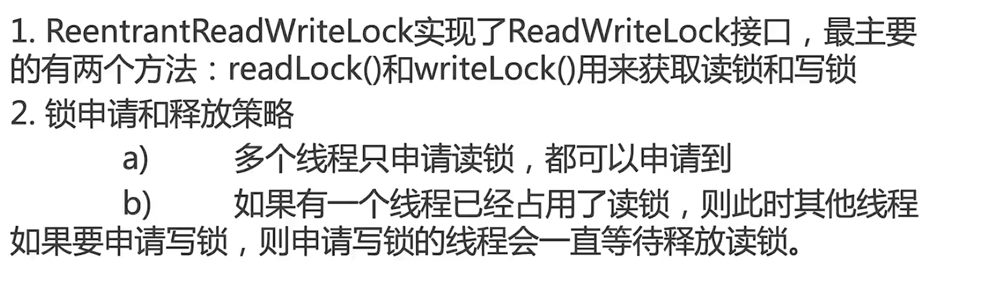


# 自旋锁和阻塞锁

## 概念


## 缺点


## 原理和源码分析


```java
package lock.spinlock;

import java.util.concurrent.atomic.AtomicReference;

/**
 * 描述：     自旋锁
 */
public class SpinLock {

    private AtomicReference<Thread> sign = new AtomicReference<>();

    public void lock() {
        Thread current = Thread.currentThread();
        while (!sign.compareAndSet(null, current)) {
            System.out.println("自旋获取失败，再次尝试");
        }
    }

    public void unlock() {
        Thread current = Thread.currentThread();
        sign.compareAndSet(current, null);
    }

    public static void main(String[] args) {
        SpinLock spinLock = new SpinLock();
        Runnable runnable = new Runnable() {
            @Override
            public void run() {
                System.out.println(Thread.currentThread().getName() + "开始尝试获取自旋锁");
                spinLock.lock();
                System.out.println(Thread.currentThread().getName() + "获取到了自旋锁");
                try {
                    Thread.sleep(300);
                } catch (InterruptedException e) {
                    e.printStackTrace();
                } finally {
                    spinLock.unlock();
                    System.out.println(Thread.currentThread().getName() + "释放了自旋锁");
                }
            }
        };
        Thread thread1 = new Thread(runnable);
        Thread thread2 = new Thread(runnable);
        thread1.start();
        thread2.start();
    }
}

```

## 适用场景


# 可中断锁


```java
package lock.lock;

import java.util.concurrent.ThreadPoolExecutor;
import java.util.concurrent.locks.Lock;
import java.util.concurrent.locks.ReentrantLock;

/**
 * 描述：     TODO
 */
public class LockInterruptibly implements Runnable {

    private Lock lock = new ReentrantLock();
public static void main(String[] args) {
    LockInterruptibly lockInterruptibly = new LockInterruptibly();
    Thread thread0 = new Thread(lockInterruptibly);
    Thread thread1 = new Thread(lockInterruptibly);
    thread0.start();
    thread1.start();

    try {
        Thread.sleep(2000);
    } catch (InterruptedException e) {
        e.printStackTrace();
    }
    thread1.interrupt();
}
    @Override
    public void run() {
        System.out.println(Thread.currentThread().getName() + "尝试获取锁");
        try {
            lock.lockInterruptibly();
            try {
                System.out.println(Thread.currentThread().getName() + "获取到了锁");
                Thread.sleep(5000);
            } catch (InterruptedException e) {
                System.out.println(Thread.currentThread().getName() + "睡眠期间被中断了");
            } finally {
                lock.unlock();
                System.out.println(Thread.currentThread().getName() + "释放了锁");
            }
        } catch (InterruptedException e) {
            System.out.println(Thread.currentThread().getName() + "获得锁期间被中断了");
        }
    }
}

```

# 锁优化

## JVM对锁的优化


## 我们在写代码时如何优化锁和提高并发性能


# 总结：千变万化的锁


	


	
