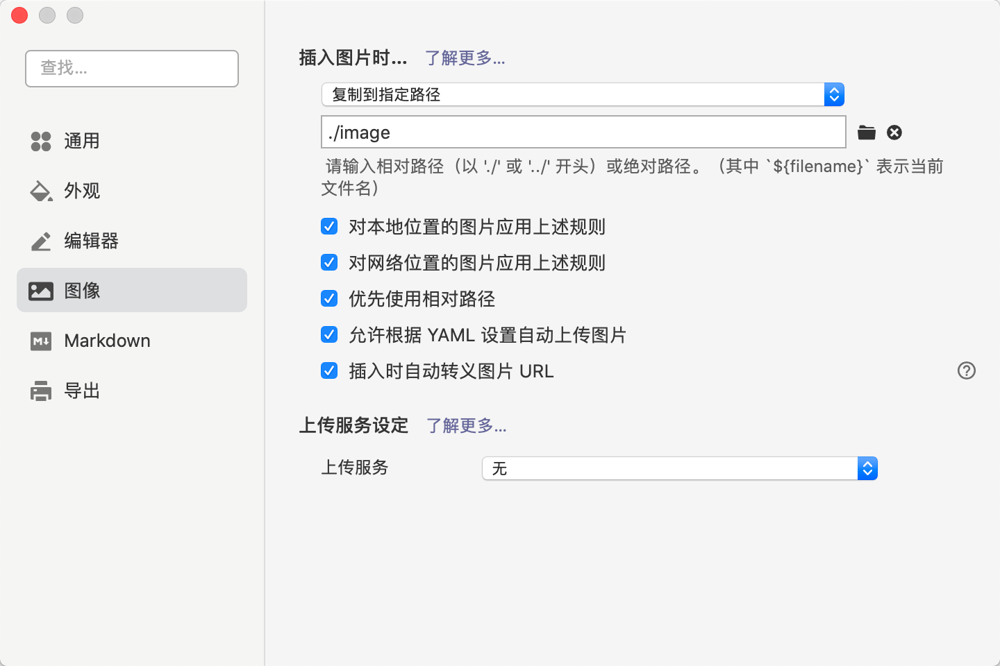
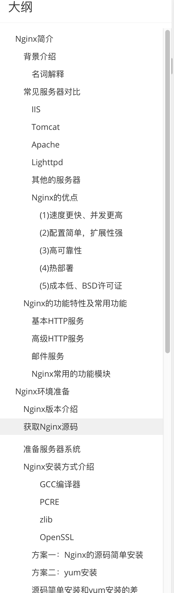

# 编码方面

### 强制所有人使用 UTF - 8 格式，防止后期出现编码问题

常见问题

-  Windows 平台下使用的是 GBK 格式在别的使用 UTF-8 的电脑会乱码
- 后台日志和控制台乱码

# 文档方面

建议每一次部署都书写对应的文档，有必要时请配上相应的截图和维护时需要注意的事项

文档方面强制使用 MarkDown 作为文档的格式

# 代码方面

请各位组长尽快讨论出对应的代码规范不限于以下几个方面

- **命名格式**

	采用驼峰或者下划线分割，这个一定要统一

- **代码审查机制** 

	每个人提交的代码，要自己去测试，确保能添加进项目不会导致项目的崩溃

- **代码格式的要求**

	详情可参考大厂的代码格式要求
	
	例如
	
	阿里巴巴的代码规范
	
	强制每个人书写的代码都包含作者信息和创建时间......

- 还有其他方面的就不一一展开

# IDE 方面

请各位组长尽快讨论出要使用的对应的 IDE

例

VSCode

IDEA

# 进度方面

如果有项目，组长需要定期检查项目的进度并提交报告

如果是在学习，组长需要定期纪录成员的学习情况，并针对每个组员的特点布置学习计划

这些信息需要定时上交和维护 ( 时间最长为：半个月 )

# 笔记方面

## 统一使用Typora作为笔记记录工具

### 有一下几点要求

1. 图片统一使用本体存储禁止使用本地缓存，防止图片无法加载

	具体设置格式如下

	

2. 书写尽量具有排版，使文章具有目录方便查阅

	具体如下

	

3. 代码等必须使用

	代码块

	```java
	int age;
	```

	或者行内代码块`String name;` 经常使用在书写代码文件上上

4. 使用数学公式必须使用Latex

	示例如下

	公式块
	$$
	1+2+3+\cdots \cdot+n^{2}=n^{2} *\left(n^{2}+1\right) / 2
	$$
	行内公式块

	时间复杂度为$O(N)$