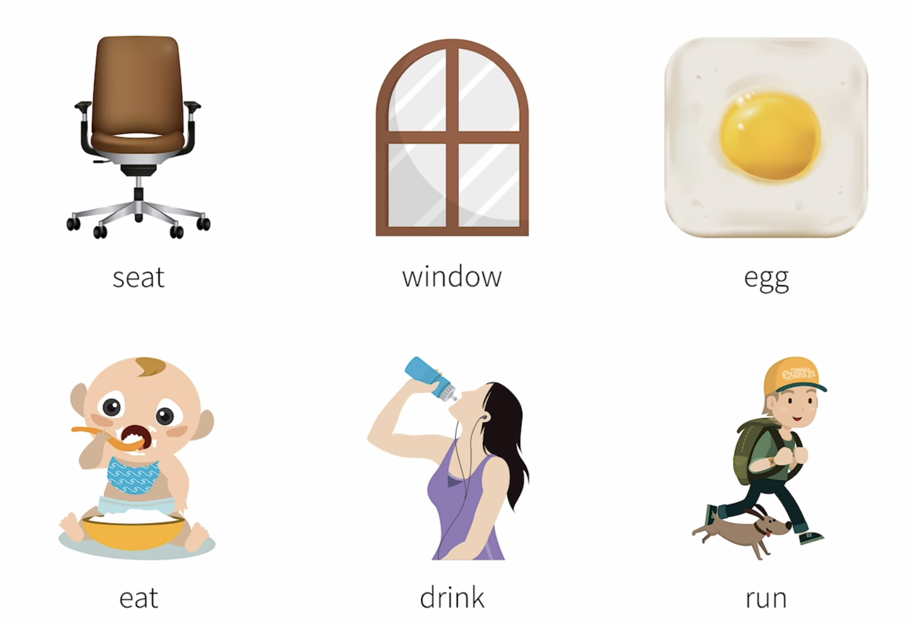

# 前言

- 英语介词可以说是最让人抓狂的一类词，名词和动词在现实世界往往看得见摸得着，但是介词不一样，往往抽象并且难以理解。你可以试着向非英语母语人士解释介词 of

- 或者试着比较介词 in 和 on

- 又或者比较一些有着相同翻译的介词

- 在之后我们一起来尝试理解不同英语介词的细节和微妙的区别

- 介词可以说是英语中最常见，最重要的一类词。

- 牛津英语词典对 10 亿单词做出分析后，列出了英语中最常见的单词，最常用的 25 个英语饭吃里有 10 个是介词。

- 可以看出介词在英语中的使用频率超级高。虽然数量不多，但是学好它们的性价比很高。但是，介词又是最难掌握的一类词。

- 你肯定会疑惑，为什么那么多介词都有那么多不同的含义？而且长得都很像，尤其是做题时，感觉选项都是对的。

- 而且英语介词的构成似乎也比我们中文介词复杂，with 是介词，in 是介词，within 也是介词，along with 还是介词，甚至还有 including 和 notwithstanding 这样的介词。

- 然后 in the tree 和 on the tree 含义不同？那 in the street 和 on the street呢？既然 in the year，on the day，at the hour，范围由大到小，那为啥是 in the morning？

- 而最让人头痛的介词搭配莫过于带介词的动词短语，如以下动词在之后加了介词 out（out 通常作副词，这里是介词用法），就变成了这些动词短语，似乎是风马牛不相及，有些甚至还有多重含义，你也许要问，这莫非就是所谓固定搭配？需要死记硬背？其实很多情况下并非如此。英语介词还是有迹可循的。

# 介词的原理

- 其实介词这个术语本身就有点让人摸不着头脑，介词的介到底是什么意思？据说介词这个术语是来自清朝末年的语言学家马建忠老师，原话如下图

- 这句话的意思就是说，介词属于虚词，就是为了介绍实词存在的，那什么是虚词和实词

- 实词大多代表具体的，有实际意义的，甚至是看得见，摸得着的东西。

- 虚词基本上都是抽象的概念。所以介词是为了介绍实词的虚词。

- 不得不说，这个介词和系动词这样的术语一样，让很多人见了很多次都不知道背后真正的含义。

- 再说了，虚词除了介词，还包括连词、助词、叹词等，这个定义还是让我们不理解虚词

- 那我们再看英文介词，preposition。之前在构词法中讲述了派生词，而 preposition 恰好就符合派生构词法，这个前缀 pre 表示在...之前，position表示位置。说白了英语介词，preposition，就是放置在前面的词，即前置词。

- 大概这就是为什么，曾经不少人认为，写作时应该避免将介词放在句末。但是丘吉尔就反驳说

- 所以说，前置词的前置好像只表达了一半的意思，更进一步说，介词preposition就是通常放置在名词、代词之前给他们增添附加信息的词。那么附加信息又包括哪些呢？比如时间信息、空间信息、方式信息、逻辑信息（原因、目的、对象...），等等

- 在中文中也是类似的，介词可以理解为前置词，用来提供补充信息。如下图，因为介词不同，表达的附加意思都是不同的。这是时间信息

- 换成空间信息

- 也可以补充逻辑信息

- 刚才这些都是我们中文的例子。英文中当然也有相似的介词表达

- 这样的介词表达，归根结底，都是作为某个内容的前置词，通过与其之后的内容的关系，来表达某种信息。这便是介词的原理。

- 正因为如此，完整的信息必须要有介词之后的部分参与。如果仅仅只有介词，因为与之后的内容关系缺失，自然也表达不了完整的意思，这也就是为什么，介词不能单独作为句子成分存在

# 介词的构成形式

- 在我们理解了，所谓介词不就是前置词而已，那么就不难理解，为什么介词的构成形式多种多样，因为就是放在其他信息之前建立关系。

## 简单介词

- 我们最常见的英文介词，是单个词，如下图

- 这些都是所谓简单介词

## 短语介词

- 介词还可以和其他类的词共同构成短语介词，即一个短语充当介词的功能，如下图，这样的短语介词构成也多样，请特别注意，这里的短语介词和我们之后要讲的介词短语是不同的概念。短语介词相当于介词，不能单独表示完整意思，而介词短语已经是完整意思了，往往相当于副词，这个后文会提到

## 合成介词

- 还有的介词可以相互合成，如下图

## 分词介词

- 这一类介词是由动词的分词充当的，如下图，也就是说，这些原本是动词的词，变个形，就有了介词的功效。

- 还是这个道理，介词之所以这个多样，就是因为介词本质上不过是前置词，和后面的信息构成关系而已，所以以上的结构都能满足这一点，所以都可以充当介词。

# 介词学习的误区

- 正因为介词是作为前置词，通过与之后内容的关系，来表达信息的，所以当这样的关系在中英文里的思维方式相似时，中英文介词有些对应程度很高，如下图，都只有一个或几个主要含义，这些介词相对好掌握一些。

- 反之，当介词使用时中英文思维不同时，就没有找到完全对应的介词翻译。这一点和名词，动词等实词往往能找到对应翻译很不同。比如 兔子 和 Rabbit 基本上可以说是对应的，而英文中的某些介词，比如 in、on、with... 恰恰因为常用，所以引申义很多，导致有很多中文无法对应上的含义，无法用里面，上面，和，字面上对应

- 换句话说，学习英语介词，最忌讳，最需要避免的，就是拼命去找个中文介词去对号入座，因为这往往是不可能的。中国人学英语介词最常见的问题就是，为啥某某某介词既可以是 A 这个意思，有可能是 B 这个意思，还有很多意思，而以上就是这些造成这些困扰的根源

- 其实不是介词的问题，而是多意词的问题。任何语言中，越常用的词，往往意思越多。就那中文中的打字举例，人家老外肯定要问了，为什么这个字这么多意思

- 那如果这个外国人一定要找个英语单词和打对应，是不是不可能找到，那同样的，hit 这个词，除了中文中的打，还有以下的含义

- 以上都使用动词举例，介词也是一样的道理，并非和中文一一对应。比如在中文中说在这种情况下，以至于大多数中国人会很自然的说

- 可是在英文思维中，situation 会用 in ，也就是在...里去描述。正确的说法如下图，其实我和你说，在这个情况里，估计你也能理解

- 但是英语中还有一个词 circumstance 和情况有点像，这个词反而就和我们中文思维一致，是...下，所以英文说

- 像这样的例子还有很多，重点是，我们千万不要试图把中文介词和英文介词一一对应着生搬硬套。

# 介词学习的诀窍

- 学习介词有两个很大的麻烦
	1. 很多介词意义太多
	- 同一介词出现在不同的分类里，也就是说，它们和之后的内容构成不同类别的关系，从而表达差别很大，甚至表达毫不相关的含义。
	2. 很多介词相互之前容易混淆
	- 在同一个类别里的介词有时候看起来很像，比如 in、on、at 都可以表示时间和空间信息。这就导致非母语人士往往觉得它们过于相似，从而弄混淆。

## 本意和引申义

- 要解决或者说要缓解这两个问题，我们往往要从介词的本意，以及引申义入手。具体说来介词的本意，也就是根源意义，通常能表达明确的空间含义；而在这些空间含义的基础上，又引申出了许多非空间的延伸含义。

## 介词多含义

### about

- 比如 about 这个介词，原来在古英语中是 onbutan （相当于 on by utan）最后这里是 outside 的意思，所以 about 的原意是 on the outside of ，即在...外面（之处）。这也是这个介词最原始，最根源的空间含义。

- 这个在...外面（之处）接着就引申出了，以下一系列相关的含义，

#### 关于（外围，有涉及，非核心）

- 但往往不是核心关键，因为在外面

#### 大约（从外大范围/大致数一数）

#### 针对（从外向内的解决）

#### 某人某事有某种特征

- 就像是外包了一层包装，有某种气质

#### 到处（在外面来来回回）

### on

- 再来看 on 这个介词，它有以下几个用法

`Dinner is on me.`  晚餐我付钱
这里之所以用介词 on（在...之上）,可以理解为付账的重任在我身上，即
`The burden of paying for dinner is on me.`

### beyond

- 又比如介词 beyond 

`It's beyond me.` 我无法理解
这里之所以用介词 beyond（在...之外）,可以理解为某件事在我 “能理解的范围之外” ，即
`It is beyond the things that I can understand`

### 小结

- 甚至一些毫无道理的介词，往往也能用这种方式进行解释，即使介词的某些含义的确会和本源的空间含义差别很大

- 比如 in 这个介词还有以下的用法，看上去似乎毫无道理，不过这里的 `in the sun` 可以用 `in the sunlight` ，即包裹在阳光里来解释，`dressed in white` 自然可以用 `in the white clothes` 来理解，`in English` 可以理解为说的话写的字都在一堆英文话语或文字中。

- 所以说，那些介词虽然看上去有着风马牛不相及的含义，但实际上往往都是从根源的，有着空间性质的含义引申出来的。
- 不过话说回来，每个介词的含义都硬是要从空间含义去推导也不太现实，有时候这种推导更像是记忆技巧。
- 以上说的是介词多含义这个难点，下文就来介绍下“某些介词之间容易混淆”这个问题。

## 介词之前容易混淆

- 它也可以用咱们刚才这种追本溯源的方法来缓解。
- 比如 in、on、at 都能前置于时间和空间，表达相关含义。但是正因为这样，我们很多人来时记不住 hour、day、year、corner、street、city 到底哪个和哪个介词搭配。
- 但是如果咱们从这三个介词的空间含义入手

`in` 一般是在一堆东西中间，或者说，上下前后左右都能够移动，说明是在一个大范围内
`on` 一般表示在...之上,说明物体的有一面已经确认了。只能在这个平面上移动，自然范围小一点
`at` 通常只在很明确的一点上

- 那既然范围由大到小，我们就很好理解了

`at the corner、at the shop` 因为角落，商店很明确，不会到处移动
`in the city、in the country` 因为在城市和国家可以大范围的移动

- 那么，the street 前到底是 at、on 还是 in？这取决于你要表达什么含义

如果你要表达很明确的某处，比如两条街的交界，你就可以说 `Right now I'm at Carrot Street and Apple Street`
如果你要表达在街道的表面上，就可以说 `There is some trash on the street`
如果你要表达在某条街道的范围内移动，就可以说 `I'm walking in the street` 相当于 `I'm walking in the area of the street`

- 其实你应该感觉得到 on the street 和 in the street 其实都能说的通，只有微妙的区别，更多美国人会说 on the street ，而英国人往往会偏向于 in the street。
- 我们国家英语教学最早是以英式英语为标准，这也就是为什么以前的老师会很固执的认为，只有 in the street  是可以接受的答案，其实不然
- 相似的，把这个空间概念引申到时间上，一年很久，所以 in a year 表示大范围的一年内。
- 这样的大范围也包括月份、星期，所以 in the month、in the week。
- 一天的话，就明确多了，如果把一天以上比作一个空间，那一天只是一个平面，所以 on that day、on Monday、on April 1st。
- 而一天中的时刻就非常明确了，相当于一个点，所以是 at 8 o'clock、at that moment。

- 但是千万不要生搬硬套，教条主义的认为，看见 hour 就一定要用 on。
- 我们一定要想清楚，我们要表达的是一个范围，还是具体的一个点
- 比如我们说一个小时里有 60 分钟，那我们肯定是把小时和分钟做比较，即分钟是在小时的范围里，这里的 hour 显然不是一个点，如下图

- 这样的范围是相对的，所以再往下还是

- 另外，很多人都会奇怪，为什么是 in the morning？morning 比 day 还小啊？问题就出在，当我们使用 in the morning 这个短语时，通常是表达一个时间段的范围，相当于刚才的举例，所以我说 I eat carrots in the morning 时，我表达的意思是我在早晨这个时间范围里里吃胡萝卜。

- 而如果你要表达的是相对明确的一个点，就要说 on the morning 了，如下图，这里要表达的意思是，在四月一日早晨这个时间，和一天差不多的范围。

- 所以既然是 on that day，那自然也有 on that morning。那为啥是 at noon？你稍微想一想就明白了，因为这里的时间很明确，noon 之前的上午和之后的上午都是相对的大范围，但是 noon 相对来说是一个点，所以才和 at 搭配

# 常见英语介词用法

- 接下来快速过一遍介词的最常见含义，我们还是按照刚才提到的时间、空间、方式等，把这些常用介词分个类。

## 表示空间的介词

- 先说表示空间的介词

### in

- 表示在...里面，表示在一个空间的内部

### on

- 表示在一个物体的表面上，如下图，其实 on 在古英语里是 in 的另一个形式，所以往往和 in 的含义有交叉。只不过在现代英语中，on 做空间介词是有在某个面之上的含义。

- 在此注意一下 on the tree 和 in the tree 的区别，按照刚才的理解，on 表示与物体有接触，所以我们可以引申为长在树上的，是树本身所有的。
- 而 in 只是在树里，外来的事物进入树里。所以可以这样说

### at
- at 在表示地点的时候，指一个确定的具体的点。

### over

- 当 over 做空间介词时，表示在...上方。
- 这个在...上方，有可能接触，也可能不接触。
- 如果表示物体与物体接触的话，一般表示覆盖，全部遮住的意思，如下图

- 如果不与物体接触的话，表示在...的正上方，比如：

- 而更常见的表达上空这个含义的over，是表示一个动态的越过上空，比如：

### above

- 表示高于某个平面之上。比如：

- 这一含义和 over 的静态含义是很相似的。只不过 over 往往还特指正上方，而 above 一般只要高出就行。虽然 on、over、above 这几个词，都有表示在...上面的含义，但是是有区别的
- on 表示物体与物体接触

- over 和 above 在表示（不与物体接触的）上方时，除了 over 往往更加正上方，最大的区别是 over 可以描述动态，而 above 不行，如下图

### under

- 表示在...下面。与 over 相对。比如

### below

- 表示在...下面。与 above 相对。比如

- under 表示物体之间可以接触，也可以留有一定空间。指在某物的正下方，含垂直在下方的意思。

- below 表示低于某个平面，可以是正下方，也可以不是。

### near

- 在...附近，在...周边，比如

### by / beside

- 做空间介词时，两者都表示在...旁边，通常两者可以互换。

### next to

- 靠近，紧挨着

- 辨析：near、by、beside、next to
- 这几个介词都可以表示在...旁边。

#### near

- near 表示附近的，往往有些距离

#### by

- 都表示比较接近，往往可互换

- 其中 by 的词意最多，除了空间还有其他很多词义，我们之后会提到。

#### beside

- 强调的是在...边上，可以引申为非空间含义的和...比较

#### next to

- 强调的是下一个，紧接着的相邻

### across

- 一般指从表面穿过，与介词 on 哪个表面相似，是在物体表面发生的行为，如下图

### through

- 一般指从内部穿过，与介词 in 那个内部相似，是从物体内部发生的动作，如下图

### past

- 表示经过，路过

### in front of

- 表示在...前方

### before

- 虽然 before 和 in front of 一般都翻译成在...之前，但是 before 其实不太作空间介词，除非是表达在众人、观众前

### behind

- 与 in front of 相对的是 behind，在...之后

### between

- 一般来说，between 侧重在两者之间，有时候会与 and 一起用，构成 between...and... 的结构

- 但千万不要以为它不可用于多者之间，在三者及以上之间两两比较时也可以用 between

### among

- 一般指在三者及更多人和物之间

- 不过在当代英语里，尤其是口语，往往很多母语人士也会用 between 来表示多数的之间（即取代 among）。

### round、around

- 表示围绕、环绕，两者作介词意思相近，可互换

### alone

- 沿着，顺着

### to

- 向，朝...

### toward、towards

- 朝着...的方向，跟 to 在此意上意思相近

### onto

- 到...上面

### into

- 到...里面，到...内部

### out of

- 从里向外，从里面出来

### opposite

- 在...对面

### against

#### 与...相反

#### 倚，靠

### up

- 一下几个词除了作副词，也可以做介词

- 沿...向上

### down

- 沿...向下

### off

- 离...有一些距离

## 表示时间的介词

- 不少表示时间的介词和它们表示空间的本源用法是对应的，之前讲过 in，on at 表示的时间范围是由大到小的。

### in

- in 本意是在...里面，在范围相对较大的时间内

### on

- on 的本意是在...之上，范围相对就小一些，一般表示在具体的某一天

### at

- at 因为空间范围很小，所以引申到时间上也类似，表示非常确定的时间点，一般说几点钟用 at ，而下面这些时间也是明确的时间点

### during

- during 本意就是持续，表示持续一段时间

### for

- for 在古英语里有之前，由于的意思，作非时间介词时一般和原因相关。这里用作时间介词，可以引申为（因为...）持续

### since 

- 自从

### before

- before 一般就是用于表示时间（以及次序）的在...之前

- 注意 before 很少用于空间的在...之前

### after

- after 和 before 相对，一般表示时间（以及次序）上的在...之后

### from...to...

- 从...（时候）到...（时候）

### by

- by 的本意表示在...附近 / 旁边，引申为时间上的不超过...的边，即不迟与... / 在...之前

### before

- 在表示时间点之前，by 和 before 的含义近似，但是 before 是泛指某个时间点之前，而 by 相当于限定了一条时间线，更侧重于不超过，不迟于这条时间线
- 下面的句子都表示了希望你在 8 点前做完作业，但是 by 更强调了 8 点是截止时间，不能再迟了。

### until

- 直到...为止

## 表示方式的介词

- 之前我们从介词的空间本义入手，进而引申到时间意义上，还算是比较好理解的。
- 接下来我们看看更抽象的介词。

### in

- in 有方式的含义，比如 in 后跟语言，就是有用某种语言（的方式）... 

- in 的本意是在...里面，in English 可以引申为我们说的话，写的字，都是在其他一堆英语对话里，也就成了我们说英语的意思

### through

- through 可以表示通过某种方式

- through 的本意是从中间穿过，引申为通过某种方式或经历，也就不奇怪了。

### by

- 先看这个句子，by 怎么有通过...的意思呢？by的本意是在...旁边，引申出相关，离不开，倚靠...的含义。
- 我们学英语是依靠看视频的，也就是通过视频学英语

- 意思就是我依靠汽车这个交通工具去上班。这里要再次特别指出，介词的本源空间含义一般是很具体的。当这种具体的含义去引申抽象的含义，自然不会对应的十分完美，往往还会有点牵强。
- 希望做到的是让你从介词的本意联想到引申义，从而更好理解记忆介词的各种不同含义，而并不是做学术上的词源研究
- 请注意这一点

### with

- with 后一般加具体的有形工具
- 这是因为 with 本意有和...一起的意思
- 下图中这其实不就是我们和笔一起，完成写字这个行为的意思嘛

### on

- on 后接电子通讯设备比较多。
- on 的本意是在上面。其实想想 online，线上，你就能明白了，为什么说我们交流是通过线上传播的，而电话上不就是最早的线上

## 表示原因的介词

- 下面我们说几个最主要的表示原因的介词

### for

- for 本来就有因为，由于的含义

### with

- with 的本意是和，一起，这里引申为...是和...分不开的原因，下图的意思是说，冷和发抖对于兔子来说，是分不开的，也就是在阐述原因，冷的打抖起时就是在描述，因为太冷了所以发抖

### because of

- 一提到 because of，你一定会想起 because，因为两者都是因为的意思，because 做连词连接从句，becuse of 后接名词（或代词等）

- 另外下图中都表示由于，因为之意

- 你可能注意到了，这几个都不是单独的一个介词，而是介词所谓固定搭配，之后还会提到

## 表示关于的介词

- 接下来介绍几个最主要表示关于...的介词

### about

- 之前说过 about 本意在...外面，关于某人或某事的一些情况，不就是外围相关信息吗？

### of

- of 在古英语中的本义是离开。
- 离开了的在这里引申为此外的，附加的，即相关的信息，这一点和 about 有些像
- 只不过，think about 是想到了关于...的一些事，而 think of 仅仅是想起了...

### on

- on 的本意是在...上面。把一个具体的事当成平面，其上的讨论也是关于的意思

- 上图中，是在学习英语这件事上寻求建议，也就是关于学习英语的建议

## 表示数值的介词

- 下面说几个最主要的表示数值（点）的介词

### at

- 可以表示价格，比率等数值点，这个用法自然是从 at 表示空间的某个点引申而来，因为以上这些都是数值的点。

### by

- 之后可以接某种度量标准，By 的空间本意是旁边，这里可以引申为相关，某种属性的意思，进一步引申为使用某种标准。所以按小时计算就可以理解为与每小时相关，按小时的属性。

### for

- 可以表示以...的价钱
- 其实虽然这里的 for 被分到了数值的介词这个类别，但是我们还是能把它理解为之前讲的表原因的 for，也就是因为付了...钱，所以得到了...
- 下面这句可以理解为，因为我付了 100 元，所以得到了这些书

## 表示状态的介词

### in

- 表示在某个状态中。这很好理解
- 就是由 in 表示在...里的空间含义引申而来

### on

- 空间本意为在...之上，可以引申理解为收到之下的...支持（这种状态）

### at

- 本意是在某个地点，可以引申为在某个状态，这里都是表示明确的某个状态点。
- at work 表示在吃饭的地点/状态
- at dinner 表示在吃饭的地点/状态

### under

- under 本意表示在...下面这里引申为在一个框架，前提之下
- under construction 工地上的施工，不就是在脚手架，吊车之类的施工器具之下
- under discussion 一般也是在某个前提或者共识之下

## 表示排除的介词

### besides

- 表示除了...还...

### except

- 表示除了... 这也是最直接的排除的含义

### except for

- 也翻译做除了... 用法也和 except 相似，但是往往用来对之前的内容进行反驳，也就是说，except 通常表示从整体中剔除出去，所以之前那句表示兔子没去参加聚会，except for 这里是要给出与 the party is great 相反的原因，相当于美中不足的是...

### 总结

- 以上就是常见英语介词的常见用法
- 正如之前说的，英语介词非常复杂，各种引申义多如牛毛，肯定不能通过本文来知道所有介词
- 要是细讲，那就太多了
- 主要是为你提供一个思路，让你更容易理解和记忆英语介词

# 介词短语

- 我们一直说到，介词其实就是前置词

- 必须后跟某种信息，才能表达完整含义，否则意义缺失

- 当然某些从句除外，因为语序已经收到调整

- 换句话说，介词需要之后有承受对象，是不是听起来有点耳熟，很像我们之前说及物动词需要有动作承受者，即动词的宾语。
- 没错，介词后面的确也需要宾语，即介词宾语

- 介词宾语就和通常宾语一样，可以由多种词类充当

- 快速总结一下就是，介词就是前置词，而这个前置的对象，即承受者，就是之后的宾语，而介词和介词宾语结合起来，就组成介词短语

- 比如，我们之前看到的介词 in、on、at 后跟着宾语 room、roof、table，合起来就成了介词短语

- 这显然和我们之前说到的[短语介词](#短语介词)不同，因为短语介词相当于介词，意思不完整，而这里的介词短语意思已经完整。
- 实际上，这样的介词短语可以充当各种句子成分

- 而介词短语最常见的是充当状语，来修饰动词，描述动作的时间、地点、方式，等等。
- 这一点也是也是和介词分类一致的

# 介词固定搭配

- 从介词的空间含义去推导引申意，并非百分百适用,有些介词的引申义很直接，有些则不然
- 比如 in tears 哭了，也许可以理解为，因为痛哭流涕眼泪流了一身所以被眼泪包裹
- 但是这样的确有些牵强，更像是一个记忆技巧
- 所以说你也不必任何介词的任何含义都去绞尽脑汁往空间含义上套
- 不过用这种追本溯源的方法学介词，一定能让你更好的理解和记忆介词的多重含义，这也就是为什么我们会在这里提到许多所谓的固定搭配

- 虽然也有可能去用空间含义推导，但是这样的例子算作固定搭配也未尝不可。

- 更进一步说，很多名词，动词，形容词都是约定俗成的和某些介词搭配使用。
- 比如 the need for something 对...的需要，不会说成 need of、need in、need on、need from
- long for 渴望不会说成 long of、long in、long on、long from
- ready for 为...准备不会说成 ready of、ready in、ready on、ready from

- 不过这些所谓固定搭配不是绝对的，具体的语境往往还会决定到底用哪个介词最合适。
- 而这也恰恰说明了，从介词本源的空间含义去理解引申义的重要性。
- 但是，要特别指出，有一类介词固定搭配即当动词和介词搭配在一起，往往会产生非常神奇的变化，营造出看似完全无关的含义，这就是所谓短语动词，Phrasal verbs。

- 我们开头提到的那些词组就属于这个范畴，其实以上这些，或多或少可以用 out（外面）这个空间引申义来解释，但是很多短语动词是需要特别记忆，即使用上记忆，而不是很容易通过字面意思就能理解
- 短语动词是英语的一大难点，往往动词本身和之后的介词你都明白是什么意思，当凑在一起时完全猜不到意思，相当于一个全新的单词，这一点需要特别注意

