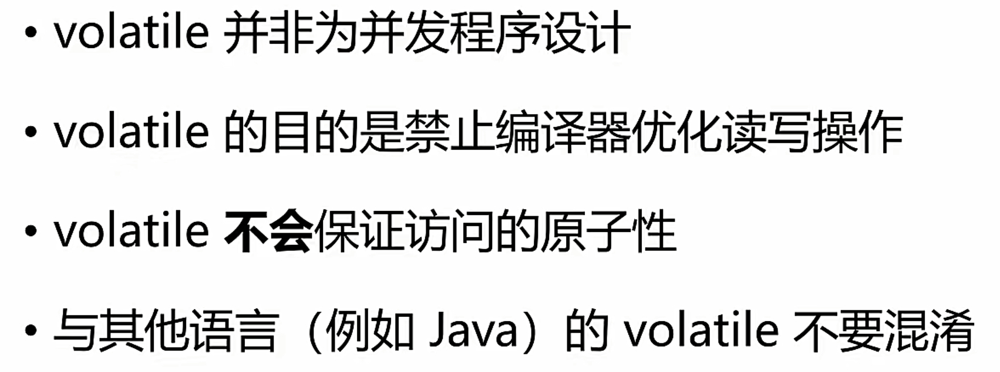
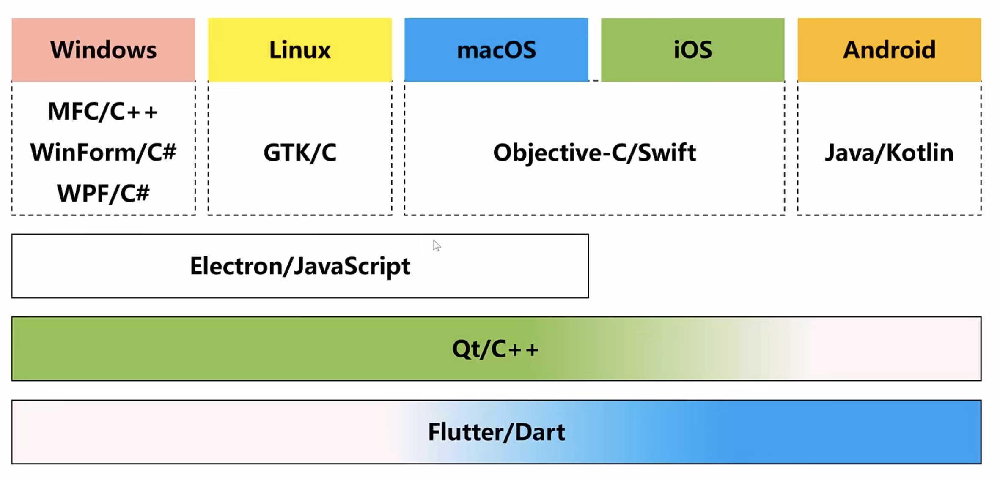
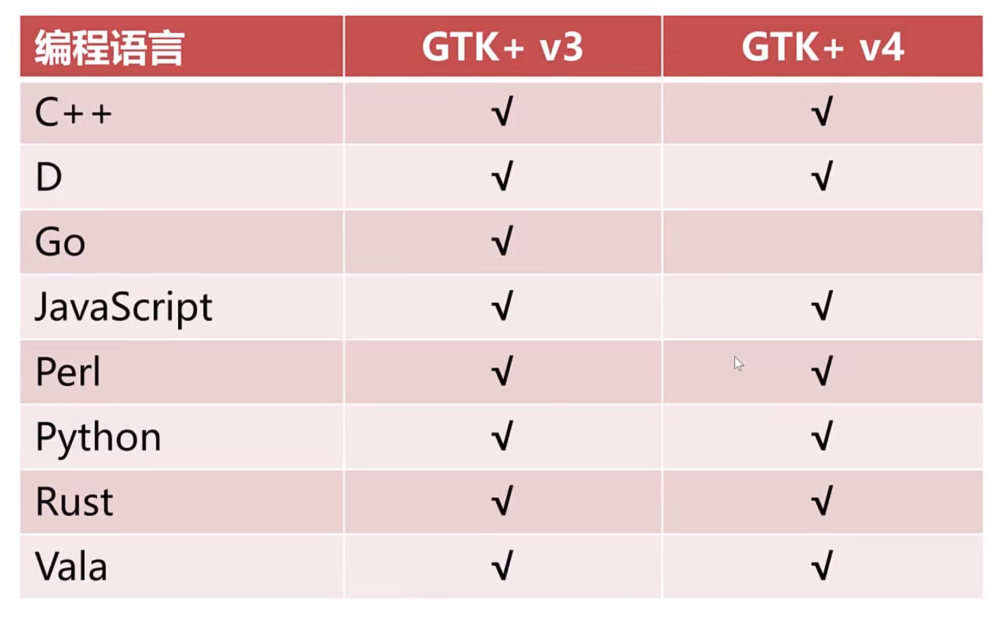

# 数据类型

## int

```c
#include <stdio.h>  
#include <limits.h>  
  
int main() {  
  short short_int = 0;  
  int i = 100;  
  long long_int = 0;  
  
  long long longlong_int = 0;  
  
  unsigned int unsigned_int = 123;  
  
  unsigned long unsigned_long = 111;  
  
  printf("short int %d\n", short_int);  
  printf("int in oct: %o\n", i);  
  
  // d = decimal  
  // x = hex  // o = oct  
  // hd%: short decimal  
  // %d: decimal  
  // %ld: long decimal  
  // %lld: long long decimal  
  // %hu: unsigned short decimal  
  // \n: new line  
  // size_t  size_t size_of_int = sizeof(int);  
  
  printf("short int: %lu\n", sizeof(short int));  
  printf("int: %lu\n", sizeof(int));  
  printf("long int: %lu\n", sizeof(long int));  
  printf("long long: %lu\n", sizeof(long long int));  
  
  printf("max int %d, min %d\n", INT_MAX, INT_MIN);  
  printf("max int %ld, min %ld\n", LONG_MAX, LONG_MIN);  
  printf("unsigned max int %u, unsigned min %d\n", UINT_MAX, 0);  
  return 0;  
}
```

```shell
short int 0
int in oct: 144
short int: 2
int: 4
long int: 8
long long: 8
max int 2147483647, min -2147483648
max int 9223372036854775807, min -9223372036854775808
unsigned max int 4294967295, unsigned min 0
```

## char

```c
#include <stdio.h>  
#include <locale.h>  
#include <wchar.h>  
  
int main() {  
  // 字符集 ASCII 127  
  char a = 'a'; // 97  
  char char_1 = '1';// 49  
  char char_0 = '0';// 48  
  
  char i = 0; // \0, NULL  
  
  // 字面量 literal  
  // \n : newline  
  // \b : backspace  
  // \r : return  
  // \t : table  
  // \' : ' 字符字面量  
  // \" : " 字符串字面量  
  char char_1_escape_oct = '\61';  
  char char_1_escape_hex = '\x31';  
  char newline = '\n';  
  
  printf("char a: %d\n", a);  
  printf("char 1: %d\n", char_1);  
  printf("char 'i': %d\n", i);  
  
  printf("char 1: %c\n", char_1);  
  printf("char 1: %c\n", char_1_escape_oct);  
  printf("char 1: %c\n", char_1_escape_hex);  
  
  // Unicode  CJK Code point.  
  // C95  wchar_t zhong = L'中';  
  wchar_t zhong_hex = L'\u4E2D';  
  printf("中：%d\n", zhong);  
  printf("中：%d\n", zhong_hex);  
  
  //让wprintf可以输出中文  
  setlocale(LC_ALL, "zh_CN.UTF-8");       //注意这里的zh_CN.UTF-8不能写成chs  
  wprintf(L"%lc\n", zhong);  
  wprintf(L"%lc\n", zhong_hex);  
  // 字符串  
  char *string = "中";  
  printf("%s", string);  
  return 0;  
}
```

```shell
char a: 97
char 1: 49
char 'i': 0
char 1: 1
char 1: 1
char 1: 1
中：20013
中：20013
中
中
中
```

## float

```c
#include <stdio.h>  
int main() {  
  float a_float = 3.14f; // 6, 7~8 +-10^-37 ~ 10^37  
  printf("size of float: %lu\n", sizeof(float));  
  double a_double = 3.14; // 15~16  
  printf("size of double: %lu\n", sizeof(double));  
  
  float lat = 39.90815f; //当允许丢失精度的情况下，可以转化为整数进行运算  
  int lat_2_int = (int) (lat * 1e6);  
  
  printf("%f", 39.908156f - lat);  
  
  float money = 3.14f; // error, never use float or double to describe money  
  return 0;  
}
```

```shell
size of float: 4
size of double: 8
0.000008
```

# 变量

- 地址其实也是一个整数

```c
#include <stdio.h>  
  
int main() {  
  // <type> <name>;  
  int value;  
  
  // <type> <name> = <initialized value>  
  int value_init = 3;  
  
  value = 4;  
  value_init = 5;  
  
  printf("value: %d\n", value);  
  
  value_init = value;  
  
  printf("size of value: %lu\n", sizeof(value));  
  
  printf("address of value: %#lx\n", &value);  
  
  // key words 标识符 identifier  
  // 1. a-zA-Z0-9_  
  // 2. 数不能在第一个  
  // 3*. Google code style, a-z_a-z，person_name  float a_float_3 = 3.14f;  
  float a_float = 3.14f;  
  return 0;  
}
```

```shell
value: 4
size of value: 4
address of value: 0x7ffee2216fd8
```

## 变量的类型和作用域

```c
#include <stdio.h>  
// file scope  
int global_var = 1;  
  
void LocalStaticVar(void) {  
  // 静态变量  
  // 1. 作用域全局，内存不会因函数退出而销毁  
  // 2. int 初值默认为 0  static int static_var;  
  
  // 自动变量  
  // 1. 函数、块作用域，随着函数和块退出而销毁  
  // 2. 没有默认初值  int non_static_var;  
  
  printf("static var: %d\n", static_var++);  
  printf("non static var: %d\n", non_static_var++);  
}  
  
double Add(double a, double b);  
  
void CleanMemory() {  
  int eraser = -1;  
}  
  
// proto scope  
//double Sort(int size, int array[size]);  
  
void PassByMemory(int parameter) {  
  printf("%d\n", parameter);  
}  
  
void PassByRegister(register int parameter) {  
  printf("%d\n", parameter);  
}  
  
int main(void) { 
  // function scope  
  // 自动变量  auto int value = 0;  
  
  { // block scope  
    auto int a = 0;  
    printf("%d\n", a);  
  }  
  //printf("%d\n", a);  
  
  if (value > 0) {  
    int is_value_equals_0 = 0, b = is_value_equals_0;  
  }    // is_value_equals_0 success  
  else {  
  
  }  
  LocalStaticVar();  
  CleanMemory();  
  LocalStaticVar();  
  CleanMemory();  
  LocalStaticVar();  
  return 0;  
}
```

# 常量

```c
#include <stdio.h>  
  
#define COLOR_RED 0xFF0000  
#define COLOR_GREEN 0x00FF00  
#define COLOR_BLUE 0x0000FF  
  
int main() {  
  // const <type> readonly variable  
  const int kRed = 0xFF0000;  
  const int kGreen = 0x00FF00;  
  const int kBlue = 0x0000FF;  
  printf("kRed: %d\n", kRed);  
  
  int *p_k_red = &kRed;  
  *p_k_red = 0;  
  printf("kRed: %d\n", kRed);  
  
  // macro  
  printf("COLOR_RED: %d\n", COLOR_RED);  
  
#undef COLOR_RED  
  
  // 字面量 literal  
  3;  
  3u;  
  3l;  
  3.f;  
  3.9;  
  'c';  
  "cs";  
  L'中';  
  L"中国";  
  
  // 硬编码 hard code  
  int background_color = COLOR_GREEN;  
  return 0;  
}
```

# 运算符（坑多）

```c
#include <stdio.h>  
#include <stdbool.h>  
  
int main() {  
  int first = 0;  
  int second;  
  int third;  
  
  // =  
  // 赋值方向为 <-  third = second = first;  
  
  int left, right;  
  left = 2;  
  right = 3;  
  
  int sum;  
  sum = left + right; // 5  
  int diff = left - right; // -1  
  int product = left * right; // 6  
  int quotient = left / right; // 0 被截断了  
  float quotient_float = left / right; // 0  
  float quotient_float_correct = left * 1.f / right; // 0.666666....  
  int remainder = left % right; // 2  
  
  int quotient_1 = 100 / 30; // 3  
  
  printf("sum: %d\n", sum);  
  printf("diff: %d\n", diff);  
  printf("product: %d\n", product);  
  printf("quotient: %d\n", quotient);  
  printf("quotient_1: %d\n", quotient_1);  
  printf("quotient_float: %f\n", quotient_float);  
  printf("quotient_float_correct: %f\n", quotient_float_correct);  
  printf("remainder: %d\n", remainder);  
  
  // > < >= <= == !=  
  // true: 1, false: 0  
  printf("3 > 2: %d\n", 3 > 2);  
  printf("3 < 2: %d\n", 3 < 2);  
  printf("3 <= 3: %d\n", 3 <= 3);  
  printf("3 >= 3: %d\n", 3 >= 3);  
  printf("3 == 3: %d\n", 3 == 3);  
  printf("3 != 3: %d\n", 3 != 3);  
  
  // && 与 || 或  
  printf("3 > 2 && 3 < 2: %d\n", 3 > 2 && 3 < 2);  
  printf("3 > 2 || 3 < 2: %d\n", 3 > 2 || 3 < 2);  
  
  // ++ --  
  int i = 1;  
  int j = i++; // j = 1, i = 2;  
  int k = ++i; // k = 3, i = 3;  
  
  printf("i: %d\n", i);  
  printf("j: %d\n", j);  
  printf("k: %d\n", k);  
  
  // bit operators & | ^ ~  
#define FLAG_VISIBLE 0x1 // 2^0, 0001  
#define FLAG_TRANSPARENT 0x2 // 2^1, 0010  
#define FLAG_RESIZABLE 0x4 // 2^2, 0100  
  int window_flags = FLAG_RESIZABLE | FLAG_TRANSPARENT; // 0110  
  int resizable = window_flags & FLAG_RESIZABLE; // 0100  
  int visible = window_flags & FLAG_VISIBLE; // 0000  
  
  // << >>
#define FLAG_VISIBLE 1 << 0 // 2^0, 0001  
#define FLAG_TRANSPARENT 1 << 1// 2^1, 0010  
#define FLAG_RESIZABLE 1 << 2 // 2^2, 0100  
  
  int x = 1000;  
  x * 2;  
  x << 1;  
  
  x / 2;  
  x >> 1;  
  
  //  
  x *= 2; // x = x * 2;  
  x /= 2; // x = x / 2;  
  x += 2;  
  x -= 2;  
  x %= 2;  
  
  x >>= 1;  
  x <<= 1;  
  
  // ,  
  int y;  
  y = x = x * 2, x = x + 3; // warning  
  
  // bool  
  bool is = true;  
  
  return 0;  
}
```

# 条件分支语句

```c
#include <stdio.h>  
#include <stdbool.h>  
  
int main() {  
  // Bool  
  // true: 1, false: 0  // _Bool, bool  
  _Bool is_enabled = true;  
  is_enabled = 10;  
  printf("is_enabled: %d\n", is_enabled);  
  is_enabled = false;  
  
  bool is_visible = false;  
  
  //if else  
  /*   * if (<condition>) {   *   ... true statement   * } else {   *   ... false statement   * }   *   * if (<condition1>) {   *   ... true statement   * } else if (<condition2>) {   *   ...   * } else {   *   ... false statement   * }   */
  #define MAGIC_NUMBER 10  
  int user_input;  
  printf("Please input a number: \n");  
  scanf("%d", &user_input);  
  if (user_input > MAGIC_NUMBER) {  
    printf("Your number is bigger!");  
  } else if (user_input < MAGIC_NUMBER) {  
    printf("Your number is smaller!");  
  } else {  
    printf("Yes! You got it!");  
  }  
  // use bracket!  
  if (is_enabled) {  
    if (is_visible) printf("is_visible");  
    else printf("is_invisible");  
  }  
  // ?: -> <expr> ? <expr1> : <expr2>  
  // expr == true, expr1  // expr == false, expr2  int is_open = is_enabled && is_visible ? 1 : 0;  
  printf("is_open: %d\n", is_open);  
  
  // switch  
  /*   * switch (<cond>) {   *  case 0: {   *    ...   *  }   *  break;   *  case 1: {   *    ...   *  }   *  break;   *  default: {   *    ...   *  }   *   * }  
   *   */  
  
#define ADD '+'  
#define SUB '-'  
#define MULTIPLY '*'  
#define DIVIDE '/'  
#define REM '%'  
  
  int left;  
  int right;  
  
  char operator;  
  printf("Please input an expression: \n");  
  scanf("%d %c %d", &left, &operator, &right);  
  
  int result;  
  switch (operator) {  
    case ADD:result = left + right;  
      break;  
    case SUB:result = left - right;  
      break;  
    case MULTIPLY:result = left * right;  
      break;  
    case DIVIDE:result = left / right;  
      break;  
    case REM:result = left % right;  
      break;  
    default:printf("Unsupported operation: %c\n", operator);  
      return 1;  
  }  
  printf("Result: %d\n", result);  
  return 0;  
}
```

# 循环语句

```c
#include <stdio.h>  
  
int main() {  
  /*  
   * while (<condition>) {   *   ... statement   * }   */  
  /*   * do {   *  ... statement   * } while (<condition>);   */  
//#define ADD '+'  
//#define SUB '-'  
//#define MULTIPLY '*'  
//#define DIVIDE '/'  
//#define REM '%'  
//  
//  int left;  
//  int right;  
//  
//  char operator;  
//  
//  char command;  
//  do {  
//  
//    printf("Please input an expression: \n");  
//    scanf("%d %c %d", &left, &operator, &right);  
//  
//    int result;  
//    switch (operator) {  
//      case ADD:result = left + right;  
//        break;  
//      case SUB:result = left - right;  
//        break;  
//      case MULTIPLY:result = left * right;  
//        break;  
//      case DIVIDE:result = left / right;  
//        break;  
//      case REM:result = left % right;  
//        break;  
//      default:printf("Unsupported operation: %c\n", operator);  
//        return 1;  
//    }  
//  
//    printf("Result: %d\n", result);  
//  
//    printf("Again? Type 'q' for quit: \n");  
//    // puts("Again? Type 'q' for quit: ");  
//  
//    // scanf("%c", &command);  
//    getchar();  
//    command = getchar();  
//  
//    printf("%d\n", command);  
//  } while (command != 'q');  
  
  /*   * for (<initialization>; <condition>; <state>) {   *  ... statement   * }   *   *  < C99   *  initialization 不能有变量定义   */  
//  int num = 1;  
//  int sum = 0;  
  
//  while (num < 100) {  
//    sum += num;  
//    num++;  
//  }  
  
  // < C99//  int num;  
//  int sum = 0;  
//  for (num = 1; num < 100; ++num) {  
//    sum += num;  
//  }  
  
  // since C99  int sum = 0;  
  for (int num = 1; num < 100; ++num) {  
    sum += num;  
  }  
  printf("sum of [1, 100]:%d\n", sum);  
  
  int sumij = 0;  
  for (int i = 0, j = 0; i <= 100 && j <= 100; ++i, ++j) {  
    sumij += i * (i + j);  
  }  printf("sumij: %d\n", sumij);  
  
  // continue break  
  for (int i = 0; i < 10; ++i) {  
    if (i == 2) continue;  
    if (i == 8) break;  
    printf("i: %d\n", i);  
  }  
  // goto  
  int i = 0;  
  begin:  
  printf("%d\n", i);  
  if (i++ < 5) {  
    goto begin;  
  }  return 0;  
}
```

# 函数

## 形参和实参

```c
#include <stdio.h>  
  
// x 形式参数  
double F(double x) {  
  return x * x + x + 1;  
}  
  
double G(double x, double y, double z) {  
  return x * x + y * y + z * z;  
}  
  
int main(void) {  
  /*  
   * <return type> <name> (<parameters>) {   *    ... statement   *    return <return value>;   * }   */  puts("HelloWorld");  
  
  // 2.0: 实际参数  
  double result_f = F(2.0);  
  double result_g = G(3.0, 4.0, 5.0);  
  
  // Add  
  // Sum  // FindNumber  
  printf("result of f: %F\n", result_f);  
  printf("result of G: %F\n", result_g);  
  
  return 0;  
}
```

## 函数原型

```c
#include <stdio.h>  
  
void EmptyParamList(void);  
  
/*  
 * 1. 函数名 
 * 2. 函数返回值类型，如果没写，默认为 int 
 * 3. 函数参数列表，参数类型，和参数的顺序，参数形参名不重要 
 * */

int Add(int, int);    

int main(void) {  
  puts("");  
  EmptyParamList();  
  
  int result = Add(1, 2);  
  printf("result of add: %d\n", result);  
  return 0;  
}  
  
void EmptyParamList(void) {  
  puts("Hello");  
}
```

## 变长参数

```c
#include <stdio.h>  
#include <stdarg.h>  
  
void HandleVarargs(int arg_count, ...) {  
  // 1. 定义 va_list 用于获取我们变长参数  
  va_list args;  
  
  // 2. 开始遍历  
  va_start(args, arg_count);  
  for (int i = 0; i < arg_count; ++i) {  
    // 3. 取出对应参数，(va_list, type)  
    int arg = va_arg(args, int);  
    printf("%d: %d\n", i, arg);  
  }  // 4. 结束遍历  
  va_end(args);  
}  
  
int main(void) {  
  printf("Hello World\n");  
  
  HandleVarargs(4, 1, 2, 3.0, 4);  
  return 0;  
}
```

## 递归

```c
#include <stdio.h>  
  
unsigned int Factorial(unsigned int n) {  
  if (n == 0) {  
    return 1; // f(0) = 1  
  } else {  
    return n * Factorial(n - 1); // f(n) = nf(n - 1)  
  }  
}  
  
unsigned int FactorialByIteration(unsigned int n) {  
  unsigned int result = 1;  
  for (unsigned int i = n; i > 0; --i) {  
    result *= i;  
  }  return result;  
}  
  
unsigned int Fibonacci(unsigned int n) {  
  if (n == 1 || n == 0) {  
    return n; // f(0) = 0, f(1) = 1  
  } else {  
    return Fibonacci(n - 1) + Fibonacci(n - 2); // f(n) = f(n - 1) + f(n - 2)  
  }  
}  
  
unsigned int FibonacciByIteration(unsigned int n) {  
  if (n == 1 || n == 0) {  
    return n; // f(0) = 0, f(1) = 1  
  }  
  
  unsigned int last = 0;  
  unsigned int current = 1;  
  
  for (int i = 0; i <= n - 2; ++i) {  
    unsigned int temp = current;  
    current += last;  
    last = temp;  
  }  return current;  
}  
  
int main(void) {  
  printf("3! : %d\n", Factorial(3));  
  printf("5! : %d\n", Factorial(5));  
  printf("10! : %d\n", FactorialByIteration(10));  
  
  printf("Fibonacci(3): %d\n", Fibonacci(3));  
  printf("Fibonacci(5): %d\n", Fibonacci(5));  
  printf("Fibonacci(10) : %d\n", Fibonacci(10));  
  printf("Fibonacci(10) : %d\n", FibonacciByIteration(10));  
  
  return 0;  
}
```

# 预处理和宏

## C语言的编译过程


## 自定义头文件

- 头文件

```c
#ifndef CHAPTER5_INCLUDE_FACTORIAL_H_  
#define CHAPTER5_INCLUDE_FACTORIAL_H_  
  
unsigned int Factorial(unsigned int n);  
  
unsigned int FactorialByIteration(unsigned int n);  
  
#endif //CHAPTER5_INCLUDE_FACTORIAL_H_
```

- 实现

```c
#include "../include/factorial.h"  
  
unsigned int Factorial(unsigned int n) {  
  if (n == 0) {  
    return 1;  
  } else {  
    return n * Factorial(n - 1);  
  }}  
  
unsigned int FactorialByIteration(unsigned int n) {  
  unsigned int result = 1;  
  unsigned int i = n;  
  for (; i > 0; --i) {  
    result *= i;  
  }  return result;  
}
```

-  使用

```c
#include <stdio.h>  
#include "factorial.h"  
  
int main() {  
  printf("3! = %d\n", Factorial(3));  
  return 0;  
}
```

## 宏函数


```c
#include <stdio.h>  
  
#define MAX(a, b) (a) > (b) ? (a) : (b)  
  
#define IS_HEX_CHARACTER(ch) \  
((ch) >= '0' && (ch) <= '9') || \  
((ch) >= 'A' && (ch) <= 'F') || \  
((ch) >= 'a' && (ch) <= 'f')  
  
int Max(int a, int b) {  
  return a > b ? a : b;  
}  
  
int main() {  
  int max = MAX(1.0, 3);  
  int max2 = MAX(1, MAX(3, 4));  
  
  int max3 = Max(1, Max(3, 4));  
  
  int max4 = MAX(max++, 5);  
  
  printf("max2: %d\n", max2);  
  
  printf("is A a hex character? %d\n", IS_HEX_CHARACTER('A'));  
  return 0;  
}
```

## 条件编译

- 多次引入相同的头文件，会导致编译报错
- 或者是针对不同的环境和不同的编译器还有不同的C标准编译出不同的程序

```c
#include <stdio.h>  
  
#ifdef __cplusplus  
extern "C" {  
#endif  
//.....  
int Add(int left, int right);  
#ifdef __cplusplus  
};  
#endif  
  
/*  
 * 1. #ifdef 如果定义了 * 2. #ifndef 如果没定义 * 3. #if 如果 ... * * #endif * *  #if defined(MACRO) ==> #ifdef MACRO */  
void dump(char *message) {  
#ifdef DEBUG  
  puts(message);  
#endif  
}  
  
int main() {  
  dump("main start");  
  
  printf("Hello world!");  
  
  dump("main end.");  
  
#if __STDC_VERSION__ >= 201112  
  puts("C11!!");  
#elif __STDC_VERSION__ >= 199901  
  puts("C99!!");  
#else  
  puts("maybe C90?");  
#endif  
  return 0;  
}
```

## 简化开发

```c
#include <stdio.h>  
#include <stdarg.h>  
  
void Printlnf(const char *format, ...) {  
  va_list args;  
  va_start(args, format);  
  vprintf(format, args);  
  printf("\n");  
  va_end(args);  
}  
  
// "Hello ""world" ==> "Hello world"  
// __FILE__  
// __LINE__  
// __FUNCTION__  
// (../05.printlnf.c:20) main :  
  
#define PRINTLNF(format, ...) printf("("__FILE__":%d) %s : "format"\n",__LINE__, __FUNCTION__, ##__VA_ARGS__)  
  
#define PRINT_INT(value) PRINTLNF(#value": %d", value)  
  
int main() {  
  
  int value = 2;  
  Printlnf("Hello World! %d", value);  
  PRINTLNF("Hello World! %d", value);  
  PRINTLNF("Hello World!");  
  
  PRINT_INT(value); // value: 2  
  int x = 3;  
  PRINT_INT(x);  
  
  PRINT_INT(3 + 4);  
  return 0;  
}
```

# 数组

```c
#ifndef BASICC_IO_UTILS_IO_UTILS_H_  
#define BASICC_IO_UTILS_IO_UTILS_H_  
  
#include <stdio.h>  
#include <limits.h>  
  
void PrintBinary(unsigned int value);  
  
//#define PRINT_METADATA  
#ifdef PRINT_METADATA  
# define PRINTLNF(format, ...) printf("("__FILE__":%d) %s: "format"\n", __LINE__, __FUNCTION__ , ##__VA_ARGS__)  
#else  
# define PRINTLNF(format, ...) printf(format"\n", ##__VA_ARGS__)  
#endif  
  
#define PRINT_CHAR(char_value) PRINTLNF(#char_value": %c", char_value)  
#define PRINT_WCHAR(char_value) PRINTLNF(#char_value": %lc", char_value)  
#define PRINT_INT(int_value) PRINTLNF(#int_value": %d", int_value)  
#define PRINT_LONG(long_value) PRINTLNF(#long_value": %ld", long_value)  
#define PRINT_LLONG(long_value) PRINTLNF(#long_value": %lld", long_value)  
#define PRINT_BINARY(int_value) PrintBinary((unsigned int) (int_value));  
#define PRINT_HEX(int_value) PRINTLNF(#int_value": %#x", int_value)  
#define PRINT_BOOL(bool_value) PRINTLNF(#bool_value": %s", (bool_value) ? "true" : "false")  
#define PRINT_DOUBLE(double_value) PRINTLNF(#double_value": %g", double_value)  
#define PRINT_STRING(string_value) PRINTLNF(#string_value": %s", string_value)  
  
#define PRINT_ARRAY(format, array, length) \  
{ int array_index; \  
for (array_index = 0; array_index < (length); ++array_index) { \  
  printf(format, (array)[array_index]); \  
};\  
printf("\n"); }  
  
#define PRINT_INT_ARRAY_LN(array, length) \  
{ int i; \  
for (i = 0; i < (length); ++i) { \  
  PRINTLNF(#array"[%d]: %d", i, (array)[i]); \  
}}  
  
#define PRINT_INT_ARRAY(array, length) PRINT_ARRAY("%d, ", array, length)  
#define PRINT_CHAR_ARRAY(array, length) PRINT_ARRAY("%c, ", array, length)  
#define PRINT_DOUBLE_ARRAY(array, length) PRINT_ARRAY("%g, ", array, length)  
  
#endif //BASICC_IO_UTILS_IO_UTILS_H_
```

## 基础

```c
#include <stdio.h>  
#include "io_utils.h"  
  
#define ARRAY_SIZE 10  
  
int global_array[ARRAY_SIZE];  
  
int main() {  
  // index from 0!!!  
  auto int array[ARRAY_SIZE];  
  
  for (int i = 0; i < ARRAY_SIZE; ++i) {  
    //array[i] = i;  
    PRINT_HEX(global_array[i]);  
  }  
  int array_2[ARRAY_SIZE] = {0, 1, 2, 3, 4, 5, 6, 7, 8, 9};  
  for (int i = 0; i < ARRAY_SIZE; ++i) {  
    PRINT_INT(array_2[i]);  
  }  
  double array_double[5] = {0.1, 2.3};  
  for (int i = 0; i < 5; ++i) {  
    PRINT_DOUBLE(array_double[i]);  
  }  
  // C99  
  char array_char[5] = {[2] = 'o', 'l', 'l'};  
  for (int i = 0; i < 5; ++i) {  
    PRINT_CHAR(array_char[i]);  
  }  return 0;  
}
```

## 数组的边界

```c
#include <stdio.h>  
#include "io_utils.h"  
  
#define ARRAY_SIZE 5  
  
int main() {  
  int array[ARRAY_SIZE];  
  int array_with_expression[3 + 2];  
  PRINT_INT(array[0]);  
  PRINT_INT(array[5]);  
  
  int value = 2;  
  
  // ....  
  // C99, VLA; gcc OK; MSVC ERROR  int array_size_of_value[value];  
  
  const int kSize = 5; // C++ OK  
  int array_size_of_const[kSize]; // C99, VLA; gcc OK; MSVC ERROR  
  
  // array[5] => array + 5  return 0;  
}
```

## 字符串

```c
#include <stdio.h>  
#include <stddef.h>  
#include "io_utils.h"  
  
int main() {  
  char string[] = "Hello World";  
  
  for (int i = 0; i < 11; ++i) {  
    PRINT_CHAR(string[i]);  
  }  // short %hd  
  // NULL \0  PRINTLNF("%s", string);  
  
  char string_zh[] = "你好，中国";  
  
  wchar_t ws[] = L"你好，中国";  
  return 0;  
}
```

## 函数的数组类型长度

```c
#include <stdio.h>  
#include "io_utils.h"  
  
#define LENGTH 10  
  
int SumIntArray(const int array[], int length) {  
  int sum = 0;  
  for (int i = 0; i < length; ++i) {  
    sum += array[i];  
  }  return sum;  
}  
  
int main() {  
  int array[LENGTH] = {1, 4, 7, 0, 10, 33, 654, 392, 23, 43};  
  PRINT_INT(SumIntArray(array, 10));  
  
  int smaller_array[5] = {1, 2, 3, 4, 5};  
  PRINT_INT(SumIntArray(smaller_array, 5));  
  
  int bigger_array[15] = {3, 6, 4, 7, 0, 10, 33, 654, 6, 4, 7, 0, 10, 33, 654};  
  PRINT_INT(SumIntArray(bigger_array, 15));  
  return 0;  
}
```

## 二维数组

```c
#include <stdio.h>  
#include "io_utils.h"  
  
// vla C99; gcc; msvc x  
void SumIntArrays(int rows, int columns, int array[][columns], int result[]) {  
  for (int i = 0; i < rows; ++i) {  
    for (int j = 0; j < columns; ++j) {  
      result[i] += array[i][j];  
    }  }}  
  
int main() {  
  int vehicle_limits[5][2] = {  
      0, 5, 1, [1][1] = 6, 2, 7, 3, 8, 4, 9  
  };  
  
  //int [2]  
  //vehicle_limits[0]  
  for (int i = 0; i < 5; ++i) {  
    for (int j = 0; j < 2; ++j) {  
      vehicle_limits[i][j] = i + j;  
    }  }  
  int scores[5][4] = {  
      {135, 135, 138, 277},  
      {105, 134, 108, 265},  
      {113, 107, 145, 232},  
      {123, 99, 140, 227},  
      {98, 118, 127, 242}  
  };  
  int result[5] = {0};  
  SumIntArrays(5, 4, scores, result);  
  PRINT_INT_ARRAY(result, 5);  
  return 0;  
}
```

# 指针

## 指针基础

```c
#include <stdio.h>  
#include <io_utils.h>  
  
int main() {  
  int a;  
  scanf("%d", &a);  
  
  int *p = &a;  
  PRINT_HEX(p);  
  PRINT_HEX(&a);  
  
  PRINT_LONG(sizeof(int *));  
  
  PRINT_INT(*p);  
  PRINT_INT(a);  
  
  int **pp = &p;  
  // *pp => p;  
  return 0;  
}
```

## 只读指针变量与只读变量指针

```c
#include <stdio.h>  
#include <io_utils.h>  
  
int main() {  
  int a;  
  int b;  
  int *p = &a;  
  PRINT_HEX(p);  
  PRINT_HEX(&a);  
  
  PRINT_INT(sizeof(int *));  
  
  PRINT_INT(*p);  
  PRINT_INT(a);  
  
  int **pp = &p;  
  // *pp => p;  
  
  *p = 20;  
  PRINT_INT(*p);  
  PRINT_INT(a);  
  
  int *const cp = &a;  
  *cp = 2; // OK  
  //cp = &b; ERROR  int const * cp2 = &a;  
  // *cp2 = 2; ERROR  
  cp2 = &b; // OK  
  
  int const *const ccp = &a;  
  // ccp = &b; ERROR  
  //*ccp = 2; ERROR  return 0;  
}
```

## 注意事项

1. 不要将硬编码赋值给指针
2. 空指针NULL的用法
3. 注意避免产生野指针

```c
#include <stdio.h>  
#include <io_utils.h>  
  
int *pointer_at_large;  
  
void DangerousPointer() {  
  int a = 2;  
  pointer_at_large = &a;  
  // ...  
  
  pointer_at_large = NULL;  
}  
  
int main() {  
//  int *p = (int *)0x65fe18; // DANGEROUS !!!  
//  PRINT_INT(p);  
//  PRINT_HEX(&p);  
//  PRINT_INT(*p);  
  
  int *p = NULL;  
  //*p = 3; // error!!  
  
  if (p) {  
  
  }  
  
  DangerousPointer();  
  if (pointer_at_large) {  
    PRINT_INT(*pointer_at_large);  
  }  
  return 0;  
}
```

## 指针的运算

```c
#include <stdio.h>  
#include <io_utils.h>  
  
int main() {  
  {    int a = 2;  
    int *p = &a;  
  
    PRINT_LONG(p + 1);  
    PRINT_LONG(p);  
    PRINT_LONG(sizeof(int));  
  }  
  {    double a = 2.0;  
    double *p = &a;  
  
    PRINT_LONG(p + 1);  
    PRINT_LONG(p);  
    PRINT_LONG(sizeof(double ));  
  }  
  {    double a = 2.0;  
    double *p = &a;  
    double **pp = &p;  
  
    PRINT_LONG(pp + 1);  
    PRINT_LONG(pp);  
    PRINT_LONG(sizeof(double *));  
  }  
  {    int array[] = {0, 1, 2, 3, 4};  
    int *p = array;  
    PRINT_INT(*(p + 3));  
    PRINT_INT(*(array + 3));  
    PRINT_INT(*(3 + array));  
    PRINT_INT(3[array]); // not recommend  
    PRINT_INT(array[3]);  
    PRINT_INT(p[3]);  
  
    int *const array_p = array;  
  
    PRINT_BOOL(p + 3 > p + 1);  
    PRINT_BOOL(p + 3 == p + 3);  
  
    int array2[] = {3,4};  
    int *p2 = array2;  
    PRINT_BOOL(p + 3 == p2 + 1); // meaningless  
    PRINT_BOOL(p + 3 > p2 + 1); // meaningless  
  }  
  return 0;  
}
```

## 左值和右值

```c
#include <stdio.h>  
#include <io_utils.h>  
  
int main() {  
  int a;  
  a = 2;  
  
  int *p = &a;  
  *p = 2;  
  
  int b = *p;  
  
  // &a = p; // ERROR!  
  // *p + 1 = 3; // ERROR!  int array[4] = {0};  
  int *pa = array;  
  *pa = 2;  
  *(pa++) = 3;  
  *(pa + 2) = 4;  
  PRINT_INT_ARRAY(array, 4);  
  
  // left: storage  
  // right: value  return 0;  
}
```

## 指针参数作为返回值

- 在函数进行返回值的时候会进行拷贝，尤其是大对象的情况下，频繁的调用返回大对象的函数会导致性能低下，于是就需要使用指针了
- 通过在函数参数上传递指针作为返回值或者修改变量
- 还有一个好处就是让 C 函数拥有返回多个值的能力，当你使用 JNI 通过 Java 来调用 C 函数，会用到一些 JNI 的接口函数原型，有些时候一些参数也是作为返回值的，来提供一些额外的信息


```c
#include <stdio.h>  
#include <io_utils.h>  
  
int SumIntArray(int array[], int length) {  
  int sum = 0;  
  for (int i = 0; i < length; ++i) {  
    sum += array[i];  
  }  return sum;  
}  
  
void SumIntArray2(int array[], int length, int *sum) {  
  *sum = 0;  
  for (int i = 0; i < length; ++i) {  
    *sum += array[i];  
  }}  
  
__int128 TestBigValue() {  
  return 0;  
}  
  
typedef struct {  
  char *name;  
  int gender;  
  int age;  
  char *school_name;  
} Student;  
  
Student TestStruct() {  
  Student student = {"bennyhuo", 1, 30, "bupt"};  
  return student;  
}  
  
int main() {  
  int array[] = {0, 1, 2, 3, 4};  
  int sum = SumIntArray(array, 5);  
  int sum2;  
  SumIntArray2(array, 5, &sum2);  
  
  PRINT_INT(sum);  
  PRINT_INT(sum2);  
  
  __int128 big_int = TestBigValue();  
  
  Student student = TestStruct();  
  return 0;  
}
```


## 动态内存分配

- 当你需要手动控制某些变量的生命周期，你就需要手动管理堆区内存

```c
#include <stdio.h>  
#include <stdlib.h>  
#include <io_utils.h>  
  
#define PLAYER_COUNT 10  
  
void InitPointer(int **ptr, int length, int default_value) {  
  *ptr = malloc(sizeof(int) * length);  
  for (int i = 0; i < length; ++i) {  
    (*ptr)[i] = default_value;  
  }}  
  
int main() {  
  int *players;  
  //InitPointer(&players, PLAYER_COUNT, 0);  
  players = calloc(PLAYER_COUNT, sizeof(int));  
  for (int i = 0; i < PLAYER_COUNT; ++i) {  
    PRINT_INT(players[i]);  
    players[i] = i;  
  }  PRINT_INT_ARRAY(players, PLAYER_COUNT);  
  
  players = realloc(players, PLAYER_COUNT * 2 * sizeof(int));  
  PRINT_INT_ARRAY(players, PLAYER_COUNT * 2);  
  
  if (players) {  
  
    free(players);  
  } else {  
  
  }  
  return 0;  
}
```

### 常见的指针使用错误

- 忘记在使用完毕之后释放内存
- 使用已经释放的内存
- 使用超出边界的内存
- 改变内存的指针，导致无法正常释放

### 动态内存的使用建议

- 避免修改指向已经分配的内存的指针
- 对于 free 后的指针主动置为 NULL
- 避免将过多的指针指向动态分配的内存
- 动态内存遵循谁分配谁释放的原则

## 函数指针

```cpp
#include <stdio.h>  
#include <stdlib.h>  
#include <io_utils.h>  
  
// 1  
int *(f1(int, double));  
  
// 2  
int (*f2)(int, double);  
  
// 3  
int *(*f3)(int, double);  
  
// 4  
// int (*f4)(int, double)[];  
  
// 5  
// int (*f5)[](int, double);  
  
typedef int (*Func)(int, double);  
  
typedef int Boolean;  
typedef int *IntPtr;  
typedef int IntArray[];  
  
int Add(int left, double right) {  
  return (int) (left + right);  
}  
  
void InitPointer(int **ptr, int length, int default_value) {  
  *ptr = malloc(sizeof(int) * length);  
  for (int i = 0; i < length; ++i) {  
    (*ptr)[i] = default_value;  
  }}  
  
int main() {  
  int a;  
  IntPtr p;  
  IntArray players = {1, 3, 4, 5};  
  PRINT_HEX(&main);  
  PRINT_HEX(&InitPointer);  
  
  void (*func)(int **ptr, int length, int default_value) = &InitPointer;  
  
  func(&p, 10, 0);  
  InitPointer(&p, 10, 0);  
  
  (*func)(&p, 10, 0);  
  (*InitPointer)(&p, 10, 0);  
  
  PRINT_INT_ARRAY(p, 10);  
  
  free(p);  
  
  Func func1 = &Add;  
  int result = func1(1, 3.0);  
  PRINT_INT(result);  
  return 0;  
}
```

## 交换两个变量的值

```c
#include <stdio.h>  
#include <stdlib.h>  
#include <string.h>  
#include <io_utils.h>  
  
void SwapInt(int *a, int *b) {  
  int temp = *a;  
  *a = *b;  
  *b = temp;  
}  
  
void Swap(void *first, void *second, size_t size) {  
  void *temp = malloc(size);  
  if (temp) {  
    memcpy(temp, first, size);  
    memcpy(first, second, size);  
    memcpy(second, temp, size);  
  
    free(temp);  
  } else {  
    // ...  
  }  
}  
  
// msvc C++ decltype(a)  
#define SWAP(a, b, type) do { type temp = a; a = b; b = temp; }while (0)  
#define SWAP_EXT(a, b) do { typeof(a) temp = a; a = b; b = temp; }while (0)  
  
int main() {  
  int a = 0;  
  int b = 1;  
  
  double x = 3.0;  
  double y = 4.0;  
  
  // SwapInt  
  SwapInt(&a, &b);  
  Swap(&x, &y, sizeof(double ));  
  
  if(a) SWAP(a, b, int); else {  
    puts("no swap.");  
  }  //SWAP_EXT(x, y); // gcc OK; msvc ERROR  
  
  //typeof(a) number = 0; // gcc OK; msvc ERROR  // int number = 0;  
  PRINT_INT(a);  
  PRINT_INT(b);  
  PRINT_DOUBLE(x);  
  PRINT_DOUBLE(y);  
  return 0;  
}
```

# 聚合数据类型

## 结构体

### 基础操作

```c
#include <stdio.h>  
#include <io_utils.h>  
  
int main() {  
  /*  
   * struct <结构体名> {   *  <成员类型> <成员名>;   *  ...   * } <结构体变量>;   */  
  typedef struct Company {  
    char *name;  
    char *id;  
    char *location;  
  } Company;  
  
  typedef struct Person {  
    char *name;  
    int age;  
    char *id;  
    Company *company;  
    Company company2;  
    struct {  
      int extra;  
      char *extra_str;  
    } extra_value;  
    struct Person *partner;  
  } Person;  
  
  struct Company company = {.name="imooc", .id="1212121"};  
  struct Person person = {.name="bennyhuo", .id="12113322222", .company=&company,  
      .company2={.name="imooc", .id="32323232"}  
  };  
  PRINT_INT(person.age);  
  person.age = 30;  
  
  //person.company->name  
  //person.extra_value.extra  
  PRINT_HEX(&person);  
  
  Person *person_ptr = &person;  
  
  puts(person_ptr->name);  
  
  PRINT_LONG(sizeof(Person));  
  PRINT_LONG(sizeof(person));  
  
  struct {  
    char *name;  
    int age;  
    char *id;  
  } anonymous_person;  
  
  Person person1 = {.name = "andy", .age = 20};  
  PRINT_INT(person1.age);  
  
  return 0;  
}
```

### 内存对齐

- 可以加快访问

```c
#include <stdio.h>  
#include <io_utils.h>  
#include <stddef.h>  
//#pragma pack(2)  
int main() {  
  typedef struct Person {  
    char *name;  
    int age;  
    char *id;  
  } Person;  
  
  struct Person person = {.name="bennyhuo", .id="12113322222"};  
  
  PRINT_INT(person.age);  
  person.age = 30;  
  
  typedef struct {  
    char a; // 1  
    char b; // 1  
//    __attribute((aligned(2))) int c; // 4 gcc only  
//    _Alignas(8) int c; // 4 c11  
    int c;  
    short d; // 2  
    double e; // 8  
  } Align;  
  
  typedef struct {  
    char a; // 1  
    char b; // 1  
    short d; // 2  
    int c; // 4  
    double e; // 8  
  } OptimizedAlign;  
  
  Align align = {'a', 'b', 3, 4, 5.0};  
  PRINT_LONG(_Alignof(align.c));  
  PRINT_LONG(offsetof(Align, c));  
  return 0;  
}
```

## 联合体

```c
#include <io_utils.h>  
  
#define OP_PRINT_INT 0  
#define OP_PRINT_DOUBLE 1  
#define OP_PRINT_STRING 2  
  
typedef union Operand {  
  int int_operand; // 4  
  double double_operand; // 8  
  char *string_operand; // 8  
} Operand;  
  
typedef struct Instruction {  
  int operator;  
  Operand operand;  
} Instruction;  
  
void Process(Instruction *instruction) {  
  switch (instruction->operator) {  
    case OP_PRINT_INT: PRINT_INT(instruction->operand.int_operand);  
      break;  
    case OP_PRINT_DOUBLE: PRINT_DOUBLE(instruction->operand.double_operand);  
      break;  
    case OP_PRINT_STRING: puts(instruction->operand.string_operand);  
      break;  
    default:fprintf(stderr, "Unsupported operator: %d\n", instruction->operator);  
  }}  
  
int main() {  
  PRINT_INT(sizeof(Operand));  
  
  Operand operand; // = {.int_operand=5, .double_operand=2.0};  
  operand.int_operand = 5;  
  operand.double_operand = 2.0;  
  PRINT_INT(operand.int_operand);  
  PRINT_DOUBLE(operand.double_operand);  
  
  Instruction instruction = {  
      .operator = OP_PRINT_STRING,  
      .operand = {  
          .string_operand = "Hello World!"  
      }  
  };  
  Process(&instruction);  
  return 0;  
}
```

## 枚举

```c
#include <io_utils.h>  
  
typedef enum FileFormat {  
  PNG, JPEG = 1, BMP = 2, UNKNOWN = 4  
} FileFormat;  
  
FileFormat GuessFormat(char *file_path) {  
  FILE *file = fopen(file_path, "rb");  
  FileFormat file_format = UNKNOWN;  
  if (file) {  
    char buffer[8] = {0};  
    size_t bytes_count = fread(buffer, 1, 8, file);  
    if (bytes_count == 8) {  
      // bmp: 42 4D  
      // png: 89 50 4E 47 0D 0A 1A 0A      // jpeg: FF D8 FF E0      if (*((short *) buffer) == 0x4D42) {  
        file_format = BMP;  
      } else if (*((long long *) buffer) == 0x0A1A0A0D474E5089) {  
        file_format = PNG;  
      } else if (*((int *) buffer) == 0xE0FFD8FF) {  
        file_format = JPEG;  
      }    }    fclose(file);  
  }  return file_format;  
}  
  
int main() {  
  FileFormat file_format = PNG;  
  FileFormat file_format_1 = 1;  
  
  PRINT_INT(GuessFormat("images/c.png"));  
  PRINT_INT(GuessFormat("images/c.jpeg"));  
  PRINT_INT(GuessFormat("images/c.bmp"));  
  PRINT_INT(GuessFormat("images/c.webp"));  
  
  return 0;  
}
```

## 判断字节序

- 大端序通常用于网络传输
- 小端通常用于 CPU 处理数据
- 我们需要有效的判断字节序，C 语言也对大端还是小端没有定语


- 当需要解析 Java 中的字节流，就需要判断大小端

```c
#include <io_utils.h>  
  
int IsBigEndian() {  
  union {  
    char c[2];  
    short s;  
  } value = {.s=0x100};  
  
  return value.c[0] == 1;  
}  
  
int IsBigEndian2() {  
  short s = 0x100;  
  char *p = (char *) &s;  
  return p[0] == 1;  
}  
  
int ToggleEndian(int original) {  
  union {  
    char c[4];  
    int i;  
  } value = {.i=original};  
  
  char temp = value.c[0];  
  value.c[0] = value.c[3];  
  value.c[3] = temp;  
  temp = value.c[1];  
  value.c[1] = value.c[2];  
  value.c[2] = temp;  
  
  return value.i;  
}  
  
int ToggleEndian2(int original) {  
  char *p = (char *) &original;  
  char temp = p[0];  
  p[0] = p[3];  
  p[3] = temp;  
  temp = p[1];  
  p[1] = p[2];  
  p[2] = temp;  
  
  return original;  
}  
  
int main() {  
  PRINT_INT(IsBigEndian());  
  
  int original = 0x12345678;  
  PRINT_HEX(ToggleEndian(original));  
  return 0;  
}
```

# 字符串的应用

## 判断字符的类型


```c
#include <io_utils.h>  
#include <ctype.h>  
  
int IsDigit(char c) {  
  return c >= '0' && c <= '9';  
}  
  
int main() {  
  PRINT_INT(isdigit('0'));  
  PRINT_INT(isspace(' '));  
  PRINT_INT(isalpha('a'));  
  PRINT_INT(isalnum('f'));  
  PRINT_INT(isalnum('1'));  
  PRINT_INT(ispunct(','));  
  
  return 0;  
}
```

## 字符串与其他类型的转换

### 转换为数值类型

- atoXXX 使用简单，适用于简单、要求不高的场景
- strtoXXX 可重复解析，更安全，功能更强大


```c
int main() {  
//  PRINT_INT(atoi("1234")); // 1234  
//  PRINT_INT(atoi("-1234")); // -1234  
//  PRINT_INT(atoi("   1234abcd")); // 1234  
//  PRINT_INT(atoi("0x10")); // 0  
//  
//  PRINT_DOUBLE(atof("12.34")); // 12.34  
//  PRINT_DOUBLE(atof("-12e34")); // -1.2e+35  
//  PRINT_DOUBLE(atof("   1.234abcd")); // 1.234  
//  PRINT_DOUBLE(atof("0x10")); // 16  
//  PRINT_DOUBLE(atof("0x10p3.9")); // 128  
  
  char const *const kInput = "1 200000000000000000000000000000 3 -4 5abcd bye";  
  PRINTLNF("Parse: %s", kInput);  
  
  char const *start = kInput;  
  char *end;  
  
  while (1) {  
    errno = 0;  
  
    const long i = strtol(start, &end, 10);  
  
    if (start == end) {  
      break;  
    }  
    // 对于想打印指定长度的字符串，使用 %.*s 多出来的第一个参数就是打印多少字符  
    printf("'%.*s'\t ==> %ld.", (int) (end - start), start, i);  
  
    if (errno == ERANGE) {  
      perror("");  
    }  
    putchar('\n');  
    start = end;  
  }  
  PRINTLNF("Left: %s", end);  
  return 0;  
}
```

## 字符串的长度和比较

- 带 n 的是安全版本

```c
#include <io_utils.h>  
#include <stdlib.h>  
#include <time.h>  
#include <string.h>  
  
void SwapString(char **first, char **second) {  
  char *temp = *first;  
  *first = *second;  
  *second = temp;  
}  
  
void Shuffle(char **array, int length) {  
  srand(time(NULL));  
  
  for (int i = length - 1; i > 0; --i) {  
    int random_number = rand() % i;  
    SwapString(array + i, array + random_number);  
  }}  
  
char **Partition(char **low, char **high) {  
  char *pivot = *(low + (high - low) / 2);  
  char **p = low;  
  char **q = high;  
  
  while (1) {  
    while (strcmp(*p, pivot) < 0) p++;  
    while (strcmp(*q, pivot) > 0) q--;  
  
    if (p >= q) break;  
    SwapString(p, q);  
  }  
  return q;  
}  
  
void QuickSort(char **low, char **high) {  
  if (low >= high) return;  
  char **partition = Partition(low, high);  
  QuickSort(low, partition - 1);  
  QuickSort(partition + 1, high);  
}  
  
int main() {  
  char *string = "Hello World!";  
  PRINT_LONG(strlen(string));  
//  PRINT_LONG(strnlen_s(string, 100)); // C11, msvc  
  PRINT_LONG(strnlen(string, 100)); // gcc  
  
  char *left = "Hello World!";  
  char *right = "Hello C Programmers!";  
  
  PRINT_INT(strcmp(left, right));  
  PRINT_INT(strncmp(left, right, 5));  
  
  // int array[];  
  char *names[] = {  
      "Cindy",  
      "Don",  
      "Andrey",  
      "Elsa",  
      "George",  
      "Frank",  
      "Benny",  
  };  
  QuickSort(names, names + 6);  
  PRINT_ARRAY("%s, ", names, 7);  
  return 0;  
}
```

## 查找字符和子串

```c
#include <io_utils.h>  
#include <string.h>  
  
int main() {  
  char *string = "Hello World!";  
  char *result = strchr(string, 'l');  
  char *result_reverse = strrchr(string, 'l');  
  puts(result);  
  puts(result_reverse);  
  
  char *substring_position = strstr(string, "Wor");  
  puts(substring_position);  
  PRINT_LONG(substring_position - string);  
  
  char *string2 = "C, 1972; C++, 1983; Java, 1995; Rust, 2010; Kotlin, 2011";  
  char *break_set = ",;";  
  
  int count = 0;  
  char *p = string2;  
  
  do {  
    p = strpbrk(p, break_set);  
    if (p) {  
      puts(p);  
      p++;  
      count++;  
    }  } while (p);  
  
  PRINTLNF("Found %d characters.", count);  
  return 0;  
}
```

## 字符串的拆分

```c
#include <io_utils.h>  
#include <string.h>  
#include <stdlib.h>  
  
int main() {  
  char string[] = "C, 1972; C++, 1983; Java, 1995; Rust, 2010; Kotlin, 2011";  
  
  typedef struct {  
    char *name;  
    int year;  
  } Language;  
  
  const char *language_break = ";";  
  const char *field_break = ",";  
  
  int language_capacity = 3;  
  int language_size = 0;  
  
  Language *languages = malloc(sizeof(Language) * language_capacity);  
  if (!languages) {  
    abort();  
  }  
  // 这个函数会保存之前装入的字符串  
  char *next = strtok(string, field_break);  
  while (next) {  
    Language language;  
    language.name = next;  
  
    next = strtok(NULL, language_break);  
    if (next) {  
      language.year = atoi(next);  
  
      if (language_size + 1 >= language_capacity) {  
        language_capacity *= 2;  
        languages = realloc(languages, sizeof(Language) * language_capacity);  
        if (!languages) {  
          abort();  
        }      }  
      languages[language_size++] = language;  
  
      next = strtok(NULL, field_break);  
    }  }  
  PRINTLNF("languages: %d", language_size);  
  PRINTLNF("languages capacity: %d", language_capacity);  
  
  for (int i = 0; i < language_size; ++i) {  
    PRINTLNF("Language[name=%s, year=%d]", languages[i].name, languages[i].year);  
  }  
  free(languages);  
  
  return 0;  
}
```

## 字符串的连接和复制

```c
#include <io_utils.h>  
#include <string.h>  
  
int main() {  
  char src[] = "HelloWorld";  
  char dest[20] = "C said: ";  
  //strcat(dest, src);  
  strcpy(dest + strlen(dest), src);  
  puts(dest);  
  return 0;  
}
```

## 内存操作函数

```c
#include <io_utils.h>  
#include <string.h>  
#include <stdlib.h>  
  
int main() {  
//  memchr()  
//  strchr()  
  
//  memcmp()  
//  strcmp()  
  
  //memset()  char *mem = malloc(10);  
  memset(mem, 0, 10);  
  
  PRINT_INT_ARRAY(mem, 10);  
  free(mem);  
  
  //memcpy  
  //strcpy  
  // 他们的作用是一样的，唯一的区别是，当内存发生局部重叠的时候  
  // memmove保证拷贝的结果是正确的  
  // memcpy不保证拷贝的结果的正确  //memmove()  
  char src[] = "HelloWorld";  
  char *dest = malloc(11);  
  memset(dest, 0, 11);  
  memcpy(dest, src, 11);  
  puts(dest);  
  memcpy(dest + 3, dest + 1, 4);  
  puts(dest);  
  free(dest);  
  return 0;  
}
```

## C99的restrict

- 这个参数的含义就是说内存空间不允许重叠，也就是说告诉编译器操作的内存地址不会重复

## C11安全版本的函数

- 注意有的编译器未实现

```c
#define __STDC_WANT_LIB_EXT1__ 1  
#include <io_utils.h>  
#include <string.h>  
#include <stdlib.h>  
  
int main() {  
#ifdef __STDC_LIB_EXT1__  
  puts("support C11 safe version.");  
#else  
  puts("No support for C11 safe version.");  
#endif  
  
  char dst[2];  
  int error_no = strcpy_s(dst, 2, "Too long!");  
  PRINT_INT(error_no); // 34  
  if (error_no) {  
    perror("strcpy_s returns: "); // strcpy_s returns: : Result too large  
  }  
  return 0;  
}
```

## 宽字符和窄字符的转换


- 命名方式


```c
#include <io_utils.h>  
#include <stdlib.h>  
#include <wchar.h>  
#include <wctype.h>  
#include <locale.h>  
  
int main() {  
  // support for wide string  
  {  
    PRINT_BOOL(iswalpha(L'A'));  
    PRINT_BOOL(iswdigit(L'2'));  
  
    wchar_t *wcs = L"你好 Hello";  
    size_t length = wcslen(wcs);  
    PRINT_INT(length);  
  
    wchar_t src[] = L"HelloWorld";  
    wchar_t *dest = malloc(sizeof(wchar_t) * 11);  
    wmemset(dest, 0, 11);  
    wmemcpy(dest, src, 11);  
    wprintf(dest);  
    wmemcpy(dest + 3, dest + 1, 4);  
    wprintf(dest);  
    free(dest);  
  }  
  // conversions  
  char *new_locale = setlocale(LC_ALL, "zh_CN.utf8");  
  if (new_locale) {  
    puts(new_locale);  
  }  
  {    char mbs[] = "你好";  
    wchar_t wcs[10];  
    mbstowcs(wcs, mbs, 10);  
    wprintf(L"%s\n", wcs);  
  }  return 0;  
}
```

# 时间的应用

## 基本概念


```c
#include <io_utils.h>  
#include <time.h>  
  
#include <sys/timeb.h>  
  
#ifdef __unix__  
#  include <sys/time.h>  
#endif  
  
int main() {  
  time_t;  
  clock_t;  
  struct tm;  
  struct timespec; // C11; MSVC  
  struct timeb;  
#ifdef __unix__  
  struct timeval;  
#endif  
  return 0;  
}
```

## 获取系统时间

```c
#ifndef CHAPTER10_INCLUDE_TIME_UTILS_H_  
#define CHAPTER10_INCLUDE_TIME_UTILS_H_  
  
#if defined(_WIN32)  
#include <sys/timeb.h>  
#elif defined(__unix__) || defined(__APPLE__)  
#include <sys/time.h>  
#endif  
  
typedef long long long_time_t;  
  
long_time_t TimeInMillisecond(void) {  
#if defined(_WIN32)  
  struct timeb time_buffer;  
  ftime(&time_buffer);  
  return time_buffer.time * 1000LL + time_buffer.millitm;  
#elif defined(__unix__) || defined(__APPLE__)  
  struct timeval time_value;  
  gettimeofday(&time_value, NULL);  
  return time_value.tv_sec * 1000LL + time_value.tv_usec / 1000;  
#elif defined(__STDC__) && __STDC_VERSION__ == 201112L  
  struct timespec timespec_value;  
  timespec_get(&timespec_value, TIME_UTC);  
  return timespec_value.tv_sec * 1000LL + timespec_value.tv_nsec / 1000000;  
#else  
  time_t current_time = time(NULL);  
  return current_time * 1000LL;  
#endif  
}  
  
#endif //CHAPTER10_INCLUDE_TIME_UTILS_H_
```

```c
#include <io_utils.h>  
#include <time_utils.h>  
#include <time.h>  
  
int main() {  
  time_t current_time;  
  time(&current_time);  
  PRINT_LONG(current_time);  
  
  current_time = time(NULL);  
  PRINT_LONG(current_time);  
  
  PRINT_LLONG(TimeInMillisecond());  
  PRINT_LLONG(TimeInMillisecond());  
  PRINT_LLONG(TimeInMillisecond());  
  PRINT_LLONG(TimeInMillisecond());  
  
  return 0;  
}
```

## 获取日历时间

```c
#include <io_utils.h>  
#include <time_utils.h>  
#include <time.h>  
  
int main() {  
  time_t current_time;  
  time(&current_time);  
  PRINT_LONG(current_time);  
  struct tm *calendar_time = localtime(&current_time);  
  PRINT_INT(calendar_time->tm_year);  
  PRINT_INT(calendar_time->tm_mon);  
  PRINT_INT(calendar_time->tm_mday);  
  PRINT_INT(calendar_time->tm_hour);  
  PRINT_INT(calendar_time->tm_min);  
  PRINT_INT(calendar_time->tm_sec);  
  
  calendar_time->tm_sec = 70;  
  
  time_t current_time2 = mktime(calendar_time);  
  PRINT_LLONG(current_time2);  
  PRINT_INT(calendar_time->tm_year);  
  PRINT_INT(calendar_time->tm_mon);  
  PRINT_INT(calendar_time->tm_mday);  
  PRINT_INT(calendar_time->tm_hour);  
  PRINT_INT(calendar_time->tm_min);  
  PRINT_INT(calendar_time->tm_sec);  
  struct tm *gmt = gmtime(&current_time);  
  
  PRINT_INT(gmt->tm_year);  
  PRINT_INT(gmt->tm_mon);  
  PRINT_INT(gmt->tm_mday);  
  PRINT_INT(gmt->tm_hour);  
  PRINT_INT(gmt->tm_min);  
  PRINT_INT(gmt->tm_sec);  
  return 0;  
}
```

## 格式化时间

```c
#include <io_utils.h>  
#include <time_utils.h>  
#include <time.h>  
  
int main() {  
  long_time_t current_time_in_ms = TimeInMillisecond();  
  int current_time_millisecond = current_time_in_ms % 1000;  
  time_t current_time;  
  time(&current_time);  
  PRINT_LLONG(current_time);  
  
  struct tm *calendar_time = localtime(&current_time);  
  PRINT_INT(calendar_time->tm_year);  
  PRINT_INT(calendar_time->tm_mon);  
  PRINT_INT(calendar_time->tm_mday);  
  PRINT_INT(calendar_time->tm_hour);  
  PRINT_INT(calendar_time->tm_min);  
  PRINT_INT(calendar_time->tm_sec);  
  
  puts(asctime(calendar_time));  
  puts(ctime(&current_time));  
  
  //2020-11-09 06:59:47  
  char current_time_s[20];  
//  size_t size = strftime(current_time_s, 20, "%Y-%m-%d %H:%M:%S", calendar_time);  
  size_t size = strftime(current_time_s, 20, "%F %T", calendar_time);  
  PRINT_INT(size);  
  puts(current_time_s);  
  
  //20201109070456  
  size_t size2 = strftime(current_time_s, 20, "%Y%m%d%H%M%S", calendar_time);  
  sprintf(current_time_s + 14, "%03d", current_time_millisecond);  
  PRINT_INT(size2);  
  puts(current_time_s);  
  return 0;  
}
```

## 解析时间

```c
#define _XOPEN_SOURCE  
  
#include <io_utils.h>  
#include <time_utils.h>  
#include <time.h>  
  
int main() {  
  long_time_t current_time_in_ms = TimeInMillisecond();  
  int current_time_millisecond = current_time_in_ms % 1000;  
  time_t current_time;  
  time(&current_time);  
  PRINT_LLONG(current_time);  
  
  struct tm *calendar_time = localtime(&current_time);  
  PRINT_INT(calendar_time->tm_year);  
  PRINT_INT(calendar_time->tm_mon);  
  PRINT_INT(calendar_time->tm_mday);  
  PRINT_INT(calendar_time->tm_hour);  
  PRINT_INT(calendar_time->tm_min);  
  PRINT_INT(calendar_time->tm_sec);  
  
  puts(asctime(calendar_time));  
  puts(ctime(&current_time));  
  
  //2020-11-09 06:59:47  
  char current_time_s[20];  
//  size_t size = strftime(current_time_s, 20, "%Y-%m-%d %H:%M:%S", calendar_time);  
  size_t size = strftime(current_time_s, 20, "%F %T", calendar_time);  
  PRINT_INT(size);  
  puts(current_time_s);  
  
  char *time = "2020-11-10 90:80:32.123";  
  struct tm parsed_time;  
  int millisecond;  
//   unix  
//  char *unparsed_string = strptime(time, "%F %T", &parsed_time);  
  
// msvc  
  sscanf(time, "%4d-%2d-%2d %2d:%2d:%2d.%3d",  
         &parsed_time.tm_year,  
         &parsed_time.tm_mon,  
         &parsed_time.tm_mday,  
         &parsed_time.tm_hour,  
         &parsed_time.tm_min,  
         &parsed_time.tm_sec,  
         &millisecond);  
  
  parsed_time.tm_year -= 1900;  
  parsed_time.tm_mon -= 1;  
  
  // 使用这个函数来规范时间，这个函数会将不规范的时间规范化  
  mktime(&parsed_time);  
  
  PRINT_INT(parsed_time.tm_year);  
  PRINT_INT(parsed_time.tm_mon);  
  PRINT_INT(parsed_time.tm_mday);  
  PRINT_INT(parsed_time.tm_hour);  
  PRINT_INT(parsed_time.tm_min);  
  PRINT_INT(parsed_time.tm_sec);  
  
//  puts(unparsed_string);  
//  sscanf(unparsed_string, ".%3d", &millisecond);  
  
  PRINT_INT(millisecond);  
  
  //20201109070456  
//  size_t size2 = strftime(current_time_s, 20, "%Y%m%d%H%M%S", calendar_time);  
//  sprintf(current_time_s + 14, "%03d", current_time_millisecond);  
//  PRINT_INT(size2);  
//  puts(current_time_s);  
  return 0;  
}
```

## 计算时间差

- `clock()`返回的是处理器消耗的时间，更能真实地反映程序运行的耗时
- `time()`返回的是系统时间，更适合描述真实世界的时间变化

```c
#include <io_utils.h>  
#include <time_utils.h>  
#include <time.h>  
  
#define PI 3.1415926  
  
void DoHardWork() {  
  double sum = 0;  
  for (int i = 0; i < 10000000; ++i) {  
    sum += i * i / PI;  
  }  PRINT_DOUBLE(sum);  
}  
  
int main() {  
  time_t start_time = time(NULL);  
  DoHardWork();  
  time_t end_time = time(NULL);  
  double diff = difftime(start_time, end_time);  
  PRINT_DOUBLE(diff);  
  
  long_time_t start_time_ms = TimeInMillisecond();  
  DoHardWork();  
  long_time_t end_time_ms = TimeInMillisecond();  
  PRINT_LLONG(end_time_ms - start_time_ms);  
  
  clock_t start_time_c = clock();  
  DoHardWork();  
  clock_t end_time_c = clock();  
  PRINT_DOUBLE((end_time_c - start_time_c) * 1.0 / CLOCKS_PER_SEC);  
  return 0;  
}
```

# IO流

## 输入输出流


```c
#include <stdio.h>  
#include <io_utils.h>  
#include <errno.h>  
#include <string.h>  
  
int main() {  
  FILE *file = fopen("CMakeLists.txt", "r");  
  if (file) {  
    //...  
    puts("Open successfully.");  
    int err = ferror(file);  
    PRINT_INT(err);  
    int eof = feof(file);  
    PRINT_INT(eof);  
    fclose(file);  
  } else {  
    PRINT_INT(errno);  
    puts(strerror(errno));  
    perror("fopen");  
  }  
//  for (int i = 0; i < 10; ++i) {  
//    PRINT_INT(i);  
//    puts(strerror(i));  
//  }  
  
  stdout;  
  stderr;  
  stdin;  
  return 0;  
}
```

## 文件流的缓冲

- 为了降低 CPU 的占用

```c
#include <stdio.h>  
#include <io_utils.h>  
#include <errno.h>  
#include <string.h>  
  
char std_buffer[BUFSIZ];  
  
int main() {  
  setbuf(stdout, std_buffer);  
  
  FILE *file = fopen("CMakeLists.txt", "r");  
  char buf[8192];  
  //setbuf(file, NULL);  
  if (file) {  
    setvbuf(file, buf, _IOLBF, 8192);  
    //...  
    puts("Open successfully.");  
    int err = ferror(file);  
    PRINT_INT(err);  
  
    int eof = feof(file);  
    PRINT_INT(eof);  
    fflush(stdout);  
    fclose(file);  
  } else {  
    PRINT_INT(errno);  
    puts(strerror(errno));  
    perror("fopen");  
  }  return 0;  
}
```

## 读取一个字符

- 在控制台打出 EOF 是 c + d


```c
#include <stdio.h>  
#include <io_utils.h>  
#include <errno.h>  
#include <string.h>  
  
void ReadFile() {  
  FILE *file = fopen("CMakeLists.txt", "r");  
  if (file) {  
  
    int next_char = getc(file);  
    while (next_char != EOF) {  
      putchar(next_char);  
      next_char = getc(file);  
    }    fclose(file);  
  } else {  
    PRINT_INT(errno);  
    puts(strerror(errno));  
    perror("fopen");  
  }}  
  
int main() {  
//  while (1) {  
//    int next_input = getchar();  
//    if (next_input == EOF) {  
//      break;  
//    } else if(next_input == '\n') {  
//      continue;  
//    }  
//    putchar(next_input);  
//  }  
  
  ReadFile();  
  
  return 0;  
}
```

## 读写一行字符

- 这个函数通常都是涉及到字符的读写，所以不要用来读取二进制

```c
#include <stdio.h>  
#include <io_utils.h>  
#include <errno.h>  
#include <string.h>  
  
void ReadFile() {  
  FILE *file = fopen("CMakeLists.txt", "r");  
  if (file) {  
    char buffer[BUFSIZ];  
    while (fgets(buffer, BUFSIZ, file)) {  
      printf("%s", buffer);  
    }    fclose(file);  
  } else {  
    PRINT_INT(errno);  
    puts(strerror(errno));  
    perror("fopen");  
  }}  
  
void Echo() {  
  char buffer[4];  
  while (1) {  
    if (!fgets(buffer, 4, stdin)) {  
      break;  
    }    //puts(buffer);  
    printf("%s", buffer);  
  }}  
  
int main() {  
  //Echo();  
  ReadFile();  
  return 0;  
}
```

## 读写指定大小的字节

```c
#include <stdio.h>  
#include <io_utils.h>  
#include <errno.h>  
#include <string.h>  
  
void Echo() {  
#define BUFFER_SIZE 4  
  int buffer[BUFFER_SIZE];  
  while (1) {  
    size_t bytes_read = fread(buffer, sizeof(buffer[0]), BUFFER_SIZE, stdin);  
    PRINT_INT_ARRAY(buffer, 4);  
    if (bytes_read < BUFFER_SIZE) {  
      if (feof(stdin)) {  
        puts("EOF");  
        fwrite(buffer, sizeof(char), bytes_read, stdout);  
      } else if (ferror(stdin)) {  
        perror("Error read from stdin");  
      }      break;  
    }    fwrite(buffer, sizeof(buffer[0]), BUFFER_SIZE, stdout);  
  }}  
  
int main() {  
  Echo();  
  return 0;  
}
```

## 实现序列化和反序列化

-  直接复制内存更快
- 如果有更复杂的序列化需求可以使用 json 或者是 其他序列化库

```c
#include <stdio.h>  
#include <io_utils.h>  
#include <errno.h>  
#include <string.h>  
  
#define ERROR 0  
#define OK 1  
  
typedef struct {  
  int visibility;  
  int allow_notification;  
  int refresh_rate;  
  int region;  
  int font_size;  
} Settings;  
  
void PrintSettings(Settings *settings) {  
  PRINT_INT(settings->visibility);  
  PRINT_INT(settings->allow_notification);  
  PRINT_INT(settings->refresh_rate);  
  PRINT_INT(settings->region);  
  PRINT_INT(settings->font_size);  
}  
  
int SaveSettings(Settings *settings, char *settings_file) {  
  FILE *file = fopen(settings_file, "wb");  
  if (file) {  
    fwrite(&settings->visibility, sizeof(settings->visibility), 1, file);  
    fwrite(&settings->allow_notification, sizeof(settings->allow_notification), 1, file);  
    fwrite(&settings->refresh_rate, sizeof(settings->refresh_rate), 1, file);  
    fwrite(&settings->region, sizeof(settings->region), 1, file);  
    fwrite(&settings->font_size, sizeof(settings->font_size), 1, file);  
    fclose(file);  
    return OK;  
  } else {  
    perror("Failed to save settings.");  
    return ERROR;  
  }}  
  
void LoadingSettings(Settings *settings, char *settings_file) {  
  FILE *file = fopen(settings_file, "rb");  
  if (file) {  
    fread(&settings->visibility, sizeof(settings->visibility), 1, file);  
    fread(&settings->allow_notification, sizeof(settings->allow_notification), 1, file);  
    fread(&settings->refresh_rate, sizeof(settings->refresh_rate), 1, file);  
    fread(&settings->region, sizeof(settings->region), 1, file);  
    fread(&settings->font_size, sizeof(settings->font_size), 1, file);  
    fclose(file);  
  } else {  
    settings->visibility = 1;  
    settings->allow_notification = 1;  
    settings->refresh_rate = 30;  
    settings->region = 86;  
    settings->font_size = 18;  
  }}  
  
int SaveSettings2(Settings *settings, char *settings_file) {  
  FILE *file = fopen(settings_file, "wb");  
  if (file) {  
    fwrite(settings, sizeof(Settings), 1, file);  
    fclose(file);  
    return OK;  
  } else {  
    perror("Failed to save settings.");  
    return ERROR;  
  }}  
  
void LoadingSettings2(Settings *settings, char *settings_file) {  
  FILE *file = fopen(settings_file, "rb");  
  if (file) {  
    fread(settings, sizeof(Settings), 1, file);  
    fclose(file);  
  } else {  
    settings->visibility = 1;  
    settings->allow_notification = 1;  
    settings->refresh_rate = 30;  
    settings->region = 86;  
    settings->font_size = 18;  
  }}  
  
int main() {  
  Settings settings;  
  LoadingSettings2(&settings, "settings.bin");  
  PrintSettings(&settings);  
  settings.font_size = 40;  
  settings.allow_notification = 2;  
  SaveSettings2(&settings, "settings.bin");  
  return 0;  
}
```

## 格式化文本的输入输出

- 自己看文档


## 复制文件

### 一个字符一个字符的读取

```c
#include <stdio.h>  
#include <io_utils.h>  
  
#define COPY_SUCCESS 0  
#define COPY_ILLEGAL_ARGUMENTS -1  
#define COPY_SRC_OPEN_ERROR -2  
#define COPY_SRC_READ_ERROR -3  
#define COPY_DEST_OPEN_ERROR -4  
#define COPY_DEST_WRITE_ERROR -5  
#define COPY_UNKNOWN_ERROR -100  
  
int CopyFile(char const *src, char const *dest) {  
  if (!src || !dest) {  
    return COPY_ILLEGAL_ARGUMENTS;  
  }  
  FILE *src_file = fopen(src, "rb");  
  if (!src_file) {  
    return COPY_SRC_OPEN_ERROR;  
  }  
  FILE *dest_file = fopen(dest, "wb");  
  if (!dest_file) {  
    fclose(src_file);  
    return COPY_DEST_OPEN_ERROR;  
  }  
  int result;  
  
  while (1) {  
    int next = fgetc(src_file);  
    if (next == EOF) {  
      if (ferror(src_file)) {  
        result = COPY_SRC_READ_ERROR;  
      } else if (feof(src_file)) {  
        result = COPY_SUCCESS;  
      } else {  
        result = COPY_UNKNOWN_ERROR;  
      }      break;  
    }  
    if (fputc(next, dest_file) == EOF) {  
      result = COPY_DEST_WRITE_ERROR;  
      break;  
    }  }  
  fclose(src_file);  
  fclose(dest_file);  
  
  return result;  
}  
  
int main() {  
  int result = CopyFile("data/io_utils.h", "data_copy/io_utils.h");  
  PRINT_INT(result);  
  result = CopyFile("data/logo.bmp", "data_copy/logo.bmp");  
  PRINT_INT(result);  
  return 0;  
}
```

### 按行读取

```c
#include <stdio.h>  
#include <io_utils.h>  
#include <time_utils.h>  
#include <locale.h>  
  
#define COPY_SUCCESS 0  
#define COPY_ILLEGAL_ARGUMENTS -1  
#define COPY_SRC_OPEN_ERROR -2  
#define COPY_SRC_READ_ERROR -3  
#define COPY_DEST_OPEN_ERROR -4  
#define COPY_DEST_WRITE_ERROR -5  
#define COPY_UNKNOWN_ERROR -100  
  
int CopyFile(char const *src, char const *dest) {  
  if (!src || !dest) {  
    return COPY_ILLEGAL_ARGUMENTS;  
  }  
  FILE *src_file = fopen(src, "r");  
  if (!src_file) {  
    return COPY_SRC_OPEN_ERROR;  
  }  
  FILE *dest_file = fopen(dest, "w");  
  if (!dest_file) {  
    fclose(src_file);  
    return COPY_DEST_OPEN_ERROR;  
  }  
  int result;  
  
  while (1) {  
    int next = fgetc(src_file);  
    if (next == EOF) {  
      if (ferror(src_file)) {  
        result = COPY_SRC_READ_ERROR;  
      } else if (feof(src_file)) {  
        result = COPY_SUCCESS;  
      } else {  
        result = COPY_UNKNOWN_ERROR;  
      }      break;  
    }  
    if (fputc(next, dest_file) == EOF) {  
      result = COPY_DEST_WRITE_ERROR;  
      break;  
    }  }  
  fclose(src_file);  
  fclose(dest_file);  
  
  return result;  
}  
  
#define BUFFER_SIZE 512  
  
int CopyFile2(char const *src, char const *dest) {  
  if (!src || !dest) {  
    // 参数至少有一个为 NULL  
    return COPY_ILLEGAL_ARGUMENTS;  
  }  
  FILE *src_file = fopen(src, "r");  
  if (!src_file) {  
    // src 打开失败  
    return COPY_SRC_OPEN_ERROR;  
  }  
  FILE *dest_file = fopen(dest, "w");  
  if (!dest_file) {  
    // dest 打开失败，记得关闭 src  
    fclose(src_file);  
    return COPY_DEST_OPEN_ERROR;  
  }  
  int result = COPY_SUCCESS;  
  char buffer[BUFFER_SIZE];  
  char *next;  
  while (1) {  
    next = fgets(buffer, BUFFER_SIZE, src_file);  
    if (!next) {  
      if (ferror(src_file)) {  
        result = COPY_SRC_READ_ERROR;  
      } else if (feof(src_file)) {  
        result = COPY_SUCCESS;  
      } else {  
        result = COPY_UNKNOWN_ERROR;  
      }      break;  
    }  
    if (fputs(next, dest_file) == EOF) {  
      result = COPY_DEST_WRITE_ERROR;  
      break;  
    }  }  
  fclose(src_file);  
  fclose(dest_file);  
  return result;  
}  
  
int main() {  
  setlocale(LC_ALL, "zh_CN.utf-8");  
  char *srcs[] = {"data/io_utils.h", "data/三国演义.txt"};  
  char *dsts[] = {"data_copy/io_utils.h", "data_copy/三国演义.txt"};  
  
  for (int i = 0; i < 2; ++i) {  
    TimeCost(NULL);  
    CopyFile(srcs[i], dsts[i]);  
    TimeCost(srcs[i]);  
    PRINT_IF_ERROR("CopyFile: %s", srcs[i]);  
  }  
  for (int i = 0; i < 2; ++i) {  
    TimeCost(NULL);  
    CopyFile2(srcs[i], dsts[i]);  
    TimeCost(srcs[i]);  
    PRINT_IF_ERROR("CopyFile2: %s", srcs[i]);  
  }  return 0;  
}
```

### 通过二进制来复制

```c
#include <stdio.h>  
#include <io_utils.h>  
#include <time_utils.h>  
#include <locale.h>  
  
#define COPY_SUCCESS 0  
#define COPY_ILLEGAL_ARGUMENTS -1  
#define COPY_SRC_OPEN_ERROR -2  
#define COPY_SRC_READ_ERROR -3  
#define COPY_DEST_OPEN_ERROR -4  
#define COPY_DEST_WRITE_ERROR -5  
#define COPY_UNKNOWN_ERROR -100  
  
int CopyFile(char const *src, char const *dest) {  
  if (!src || !dest) {  
    return COPY_ILLEGAL_ARGUMENTS;  
  }  
  FILE *src_file = fopen(src, "r");  
  if (!src_file) {  
    return COPY_SRC_OPEN_ERROR;  
  }  
  FILE *dest_file = fopen(dest, "w");  
  if (!dest_file) {  
    fclose(src_file);  
    return COPY_DEST_OPEN_ERROR;  
  }  
  int result;  
  
  while (1) {  
    int next = fgetc(src_file);  
    if (next == EOF) {  
      if (ferror(src_file)) {  
        result = COPY_SRC_READ_ERROR;  
      } else if (feof(src_file)) {  
        result = COPY_SUCCESS;  
      } else {  
        result = COPY_UNKNOWN_ERROR;  
      }      break;  
    }  
    if (fputc(next, dest_file) == EOF) {  
      result = COPY_DEST_WRITE_ERROR;  
      break;  
    }  }  
  fclose(src_file);  
  fclose(dest_file);  
  
  return result;  
}  
  
#define BUFFER_SIZE 512  
  
int CopyFile2(char const *src, char const *dest) {  
  if (!src || !dest) {  
    // 参数至少有一个为 NULL  
    return COPY_ILLEGAL_ARGUMENTS;  
  }  
  FILE *src_file = fopen(src, "r");  
  if (!src_file) {  
    // src 打开失败  
    return COPY_SRC_OPEN_ERROR;  
  }  
  FILE *dest_file = fopen(dest, "w");  
  if (!dest_file) {  
    // dest 打开失败，记得关闭 src  
    fclose(src_file);  
    return COPY_DEST_OPEN_ERROR;  
  }  
  int result = COPY_SUCCESS;  
  char buffer[BUFFER_SIZE];  
  char *next;  
  while (1) {  
    next = fgets(buffer, BUFFER_SIZE, src_file);  
    if (!next) {  
      if (ferror(src_file)) {  
        result = COPY_SRC_READ_ERROR;  
      } else if (feof(src_file)) {  
        result = COPY_SUCCESS;  
      } else {  
        result = COPY_UNKNOWN_ERROR;  
      }      break;  
    }  
    if (fputs(next, dest_file) == EOF) {  
      result = COPY_DEST_WRITE_ERROR;  
      break;  
    }  }  
  fclose(src_file);  
  fclose(dest_file);  
  return result;  
}  
  
int CopyFile3(char const *src, char const *dest) {  
  if (!src || !dest) {  
    // 参数至少有一个为 NULL  
    return COPY_ILLEGAL_ARGUMENTS;  
  }  
  FILE *src_file = fopen(src, "rb");  
  if (!src_file) {  
    // src 打开失败  
    return COPY_SRC_OPEN_ERROR;  
  }  
  FILE *dest_file = fopen(dest, "wb");  
  if (!dest_file) {  
    // dest 打开失败，记得关闭 src  
    fclose(src_file);  
    return COPY_DEST_OPEN_ERROR;  
  }  
  int result = COPY_SUCCESS;  
  char buffer[BUFFER_SIZE];  
  
  while (1) {  
    size_t bytes_read = fread(buffer, sizeof(buffer[0]), BUFFER_SIZE, src_file);  
    if (fwrite(buffer, sizeof(buffer[0]), bytes_read, dest_file) < bytes_read) {  
      result = COPY_DEST_WRITE_ERROR;  
      break;  
    }  
    if (bytes_read < BUFFER_SIZE) {  
      if (ferror(src_file)) {  
        result = COPY_SRC_READ_ERROR;  
      } else if (feof(src_file)) {  
        result = COPY_SUCCESS;  
      } else {  
        result = COPY_UNKNOWN_ERROR;  
      }      break;  
    }  }  
  fclose(src_file);  
  fclose(dest_file);  
  return result;  
}  
  
int main() {  
  setlocale(LC_ALL, "zh_CN.utf-8");  
  char *srcs[] = {"data/io_utils.h", "data/三国演义.txt"};  
  char *dsts[] = {"data_copy/io_utils.h", "data_copy/三国演义.txt"};  
  
  for (int i = 0; i < 2; ++i) {  
    TimeCost(NULL);  
    CopyFile(srcs[i], dsts[i]);  
    TimeCost(srcs[i]);  
    PRINT_IF_ERROR("CopyFile: %s", srcs[i]);  
  }  
  for (int i = 0; i < 2; ++i) {  
    TimeCost(NULL);  
    CopyFile2(srcs[i], dsts[i]);  
    TimeCost(srcs[i]);  
    PRINT_IF_ERROR("CopyFile2: %s", srcs[i]);  
  }  
  for (int i = 0; i < 2; ++i) {  
    TimeCost(NULL);  
    CopyFile3(srcs[i], dsts[i]);  
    TimeCost(srcs[i]);  
    PRINT_IF_ERROR("CopyFile3: %s", srcs[i]);  
  }  return 0;  
}
```

## 重定向输入输出流

- 开发程序也不都是和控制台交互，也可能是文件和上一个程序执行的结果

- 发现使用标准库函数，会导致重定向之后无法变更，于是就去 POSIX 标准中找找看，就有以下的函数


```c
#include <stdio.h>  
#include <io_utils.h>  
#include <time_utils.h>  
#include <locale.h>  
  
#if defined(__APPLE__) || defined(__linux__)  
#  include <unistd.h>  
#elif defined(_WIN32)  
#  include <io.h>  
#endif  
  
void RedirectStdout(char const *filename) {  
  static int saved_stdout_no = -1;  
  
  if (filename) {  
    if (saved_stdout_no == -1) {  
      saved_stdout_no = dup(fileno(stdout));  
    }  
    fflush(stdout);  
    freopen(filename, "a", stdout);  
  } else {  
    if (saved_stdout_no != -1) {  
      fflush(stdout);  
      dup2(saved_stdout_no, fileno(stdout));  
      close(saved_stdout_no);  
      saved_stdout_no = -1;  
    }  }}  
  
int main() {  
//  freopen("output.log", "a", stdout);  
//  puts("This will be written to file 'output.log'");  
//  fclose(stdout);  
  
  puts("1");  
  RedirectStdout("output.log");  
  puts("2");  
  RedirectStdout(NULL);  
  puts("3");  
  RedirectStdout("output.log");  
  puts("4");  
  RedirectStdout(NULL);  
  puts("end");  
  
  // python x.py > output.log 2>&1  
  return 0;  
}
```

## 统计文件字符个数

```c
#include <stdio.h>  
#include <io_utils.h>  
#include <locale.h>  
#include <wchar.h>  
  
#define ERROR_ILLEGAL_FILENAME -1  
#define ERROR_CANNOT_OPEN_FILE -2  
#define ERROR_READ_FILE -3  
#define ERROR_UNSUPPORTED_CHARSET -99  
  
#define CHARSET_UTF8 0  
#define CHARSET_GBK 1  
  
int CountCharactersInFile(char const *filename, int charset) {  
  if (!filename) return ERROR_ILLEGAL_FILENAME;  
  
  FILE *file;  
  
  switch (charset) {  
    case CHARSET_GBK:  
#ifdef _WIN32  
      setlocale(LC_ALL, "chs");  
#else  
      setlocale(LC_ALL, "zh_CN.gbk");  
#endif  
      file = fopen(filename, "r");  
      break;  
    case CHARSET_UTF8:setlocale(LC_ALL, "zh_CN.utf-8");  
#ifdef _WIN32  
      file = fopen(filename, "r, ccs=utf-8");  
#else  
      file = fopen(filename, "r");  
#endif  
      break;  
    default:return ERROR_UNSUPPORTED_CHARSET;  
  }  
  if (!file) return ERROR_CANNOT_OPEN_FILE;  
  
#define BUFFER_SIZE 512  
  wchar_t wcs[BUFFER_SIZE];  
  int count = 0;  
  while (fgetws(wcs, BUFFER_SIZE, file)) {  
    count += wcslen(wcs);  
  }  
  if (ferror(file)) {  
    perror("CountCharactersInFile error");  
    fclose(file);  
    return ERROR_READ_FILE;  
  }  
  fclose(file);  
  
  return count;  
}  
  
int main() {  
  PRINT_INT(CountCharactersInFile("data/sanguo_utf8.txt", CHARSET_UTF8));  
  PRINT_INT(CountCharactersInFile("data/sanguo_gbk.txt", CHARSET_GBK));  
  return 0;  
}
```

## 输入输出流的位置

```c
#include <stdio.h>  
#include <io_utils.h>  
  
int main() {  
  FILE *file = fopen("CMakeLists.txt", "rb");  
  long position = ftell(file);  
  PRINT_LONG(position);  
  char buffer[128];  
  fread(buffer, 1, 128, file);  
  PRINT_LONG(ftell(file));  
  fseek(file, 10, SEEK_SET);  
  PRINT_LONG(ftell(file));  
  fseek(file, 10, SEEK_CUR);  
  PRINT_LONG(ftell(file));  
  fseek(file, -10, SEEK_END);  
  PRINT_LONG(ftell(file));  
  fseek(file, 0, SEEK_END);  
  PRINT_LONG(ftell(file));  
  
  fclose(file);  
  
  PRINT_LONG(ftell(stdout));  
  perror("ftell(stdout)");  
  
  return 0;  
}
```

## 其他常见的文件操作

- 涉及非英文字符的操作都必须设置语言 `setlocale(LC_ALL, "zh_CN.utf-8");  `

```c
#include <stdio.h>  
#include <io_utils.h>  
#include <locale.h>  
#include <sys/stat.h>  
  
typedef struct __crt_stdio_stream_data  
{  
  union  
  {  
    FILE  _public_file;  
    char* _ptr;  
  };  
  char*            _base;  
  int              _cnt;  
  long             _flags;  
  long             _file;  
  int              _charbuf;  
  int              _bufsiz;  
  char*            _tmpfname;  
  
} WinFile;  
  
long GetFileSize(char const *filename) {  
  struct stat st;  
  stat(filename, &st);  
  return st.st_size;  
}  
  
int IsDirectory(char const *filename) {  
  struct stat st;  
  stat(filename, &st);  
  return st.st_mode & S_IFDIR;  
}  
  
int main() {  
//  int result = remove("data_copy/io_utils.h");  
//  PRINT_INT(result);  
//  result = remove("data_copy/io_utils2.h");  
//  PRINT_INT(result);  
  
  setlocale(LC_ALL, "zh_CN.utf-8");  
//  rename("data_copy/三国演义.txt", "data_copy/sanguo.txt");  
  
//  FILE *file = tmpfile();  
//  WinFile *win_file = (WinFile *) file;  
//  puts(win_file->_tmpfname);  
//  fclose(file);  
  
  PRINT_LONG(GetFileSize("data/三国演义.txt"));  
  PRINT_INT(IsDirectory("data/三国演义.txt"));  
  PRINT_INT(IsDirectory("data"));  
  return 0;  
}
```

# 线程与并发

## 线程基础

- 代码中使用的线程库为tinycthread https://tinycthread.github.io/


## 线程的基本用法

```c
#include <io_utils.h>  
#include <tinycthread.h>  
  
int SayHello(char *name) {  
  PRINTLNF("Run in new thread[%#x]: Hello, %s", thrd_current(), name);  
  return 1;  
}  
  
int main(void) {  
  thrd_t new_thread;  
  int result = thrd_create(&new_thread, SayHello, "C lang");  
  if (result == thrd_success) {  
    PRINTLNF("Run in Main thread[%#x], created new_thread[%#x]", thrd_current(), new_thread);  
  } else {  
    PRINTLNF("Run in Main Thread[%#x], failed to create new_thread", thrd_current());  
  }//  thrd_sleep(&(struct timespec) {.tv_sec = 0, .tv_nsec = 100000000}, NULL);  
  
  int res;  
  thrd_join(new_thread, &res);  
  PRINTLNF("Run in Main Thread[%#x], result from thread[%#x]: %d", thrd_current(), new_thread, res);  
  
//  thrd_detach(new_thread);  
}
```

## 资源的线程安全问题


- 重排序代码在在不影响当前线程执行结果的情况下，进行优化，并没有考虑多线程下因为代码优化产生的问题，所以要加入关键字给编译器提示，防止优化

```c
#include <io_utils.h>  
#include <tinycthread.h>  
  
int count = 0;  
  
int Counter(void *arg) {  
  PRINTLNF("Counter.");  
  for (int i = 0; i < 1000000; ++i) {  
    count++;  
  
    // int temp = count, count = temp + 1, temp;  
  }  
  return 0;  
}  
  
int main(void) {  
  thrd_t t_1, t_2;  
  thrd_create(&t_1, Counter, NULL);  
  thrd_create(&t_2, Counter, NULL);  
  
  thrd_join(t_1, NULL);  
  thrd_join(t_2, NULL);  
  
  PRINT_INT(count);  
}
```

```c
#include <io_utils.h>  
#include <tinycthread.h>  
  
int flag = 0;  
  
int a = 0;  
int x = 0;  
  
int T1(void *arg) {  
  a = 2;  
  flag = 1;  
  a = a + 3;  
  return 0;  
}  
  
int T2(void *arg) {  
  while (!flag) {}  
  x = a * a;  
  return 0;  
}  
  
int main(void) {  
  thrd_t t_1, t_2;  
  thrd_create(&t_1, T1, NULL);  
  thrd_create(&t_2, T2, NULL);  
  
  thrd_join(t_1, NULL);  
  thrd_join(t_2, NULL);  
  
  PRINT_INT(x);  
}
```

```c
#include <io_utils.h>  
#include <tinycthread.h>  
  
int flag = 0;  
  
int a = 0;  
int x = 0;  
  
int T1(void *arg) {  
  a = 2;  
  flag = 1;  
  return 0;  
}  
  
int T2(void *arg) {  
  while (!flag) {}  
  x = a * a;  
  return 0;  
}  
  
int main(void) {  
  thrd_t t_1, t_2;  
  thrd_create(&t_1, T1, NULL);  
  thrd_create(&t_2, T2, NULL);  
  
  thrd_join(t_1, NULL);  
  thrd_join(t_2, NULL);  
  
  PRINT_INT(x);  
}
```

## volatile

- 给编译器看的，但是并不确保可见性



- 在 Java 中是能保证可见性的，不要弄混了，C 语言的没有这个功能

```c
#include <io_utils.h>  
#include <tinycthread.h>  
  
volatile int flag = 0;  
  
volatile int a = 0;  
int x = 0;  
  
int T1(void *arg) {  
  a = 2;  
  flag = 1;  
  a = a + 3;  
  return 0;  
}  
  
int T2(void *arg) {  
  while (!flag) {}  
  x = a * a;  
  return 0;  
}  
  
int main(void) {  
  thrd_t t_1, t_2;  
  thrd_create(&t_1, T1, NULL);  
  thrd_create(&t_2, T2, NULL);  
  
  thrd_join(t_1, NULL);  
  thrd_join(t_2, NULL);  
  
  PRINT_INT(x);  
}
```

## 原子类型

- 使用原子类型可以保证可见性和原子性，但是对于可见性的保证 C 标准有着更详细的定义，就是内存序的定义 https://zh.cppreference.com/w/c/atomic/memory_order

```c
#include <io_utils.h>  
#include <tinycthread.h>  
#include <stdatomic.h>  
#include <time_utils.h>  
  
atomic_int count = 0;  
  
int Counter(void *arg) {  
  PRINTLNF("Counter.");  
  for (int i = 0; i < 1000000; ++i) {  
    count++;  
  
    // int temp = count, count = temp + 1, temp;  
  }  
  return 0;  
}  
  
int main(void) {  
  TimeCost(NULL);  
  thrd_t t_1, t_2;  
  thrd_create(&t_1, Counter, NULL);  
  thrd_create(&t_2, Counter, NULL);  
  
  thrd_join(t_1, NULL);  
  thrd_join(t_2, NULL);  
  
  PRINT_INT(count);  
  TimeCost("atomic");  
  
  // 返回 true 是通过 CPU 的原子指令实现的  
  PRINT_BOOL(atomic_is_lock_free(&count));  
}
```

```c
#include <io_utils.h>  
#include <tinycthread.h>  
#include <stdatomic.h>  
  
atomic_flag resume_flag = ATOMIC_FLAG_INIT;  
  
int PrintNumbers(void *arg) {  
  int current = 0;  
  while (atomic_flag_test_and_set(&resume_flag)) {  
    current++;  
    PRINT_INT(current);  
    thrd_sleep(&(struct timespec) {.tv_sec=1}, NULL);  
  }  return current;  
}  
  
int main(void) {  
  atomic_flag_test_and_set(&resume_flag);  
  
  thrd_t t;  
  thrd_create(&t, PrintNumbers, NULL);  
  
  thrd_sleep(&(struct timespec) {.tv_sec=5}, NULL);  
  
  atomic_flag_clear(&resume_flag);  
  int last_number;  
  thrd_join(t, &last_number);  
  PRINT_INT(last_number);  
  return 0;  
}
```

## 锁

```c
#include <io_utils.h>  
#include <tinycthread.h>  
#include <time_utils.h>  
  
int count = 0;  
mtx_t mutex;  
  
int Counter(void *arg) {  
  PRINTLNF("Counter.");  
  for (int i = 0; i < 1000000; ++i) {  
    mtx_lock(&mutex);  
    count++;  
    mtx_unlock(&mutex);  
  
    // int temp = count, count = temp + 1, temp;  
  }  
  return 0;  
}  
  
int main(void) {  
  mtx_init(&mutex, mtx_plain);  
  TimeCost(NULL);  
  
  thrd_t t_1, t_2;  
  thrd_create(&t_1, Counter, NULL);  
  thrd_create(&t_2, Counter, NULL);  
  
  thrd_join(t_1, NULL);  
  thrd_join(t_2, NULL);  
  
  PRINT_INT(count);  
  TimeCost("lock");  
  mtx_destroy(&mutex);  
}
```

## Thread Local

```c
#include <io_utils.h>  
#include <tinycthread.h>  
#include <stdlib.h>  
  
tss_t count_key;  
  
void MyFree(void *ptr) {  
  PRINTLNF("Free %#x", *(int *) ptr);  
  free(ptr);  
}  
  
int Counter(void *step) {  
  int *count = malloc(sizeof(int));  
  *count = 0;  
  if (tss_set(count_key, count) == thrd_success) {  
    for (int i = 0; i < 1000000; ++i) {  
      *count += *(int *) step;  
    }  }  PRINT_INT(*count);  
  //PRINT_INT(*((int *)tss_get(count_key)));  
  return 0;  
}  
  
int main(void) {  
  if (tss_create(&count_key, MyFree) == thrd_success) {  
    thrd_t t_1, t_2;  
    int step_1 = 1, step_2 = 2;  
    thrd_create(&t_1, Counter, &step_1);  
    thrd_create(&t_2, Counter, &step_2);  
  
    thrd_join(t_1, NULL);  
    thrd_join(t_2, NULL);  
  
    puts("t_1/t_2 ended.");  
    tss_delete(count_key);  
  
    PRINTLNF("count_key deleted.");  
  }}
```

## 副作用和纯函数

- 我们知道表达式的作用就是提供结果，除了提供值以外的影响都叫做副作用，比如 `count++` 的作用应该是返回 `count + 1` 但是副作用却是影响了本身的值。
- 如果一个函数不产生副作用，只产生结果，不会访问外部的共享变量或资源，那就不会有线程安全的问题，这也就是函数式编程在并发领域颇受青睐的一个原因，当然程序不可能完全不存在副作用，但是我们可以将这些副作用的范围缩小，如果都能够缩小到同一个线程，那线程的同步设计复杂度将会大大减小，甚至也会带来性能上的提升，现在很多的GUI框架开发设计思路就是这样的。

```c
#include <io_utils.h>  
#include <tinycthread.h>  
  
int Counter(void *arg) {  
  int local_count = 0;  
  PRINTLNF("Counter.");  
  for (int i = 0; i < 1000000; ++i) {  
    local_count++;  
  
    // int temp = count, count = temp + 1, temp;  
  }  
  return local_count;  
}  
  
int main(void) {  
  thrd_t t_1, t_2;  
  thrd_create(&t_1, Counter, NULL);  
  thrd_create(&t_2, Counter, NULL);  
  
  int count = 0;  
  int result;  
  thrd_join(t_1, &result);  
  count += result;  
  thrd_join(t_2, &result);  
  count += result;  
  
  PRINT_INT(count);  
}
```

## 处理复杂的线程返回结果

```c
#include <io_utils.h>  
#include <tinycthread.h>  
#include <stdlib.h>  
  
typedef struct {  
  int a;  
  char *b;  
} ComplexResult;  
  
typedef struct {  
  int arg;  
  ComplexResult result;  
} ComplexArg;  
  
  
int ComplexReturnValue(ComplexArg *arg) {  
  ComplexResult *complex_result = &arg->result;  
  complex_result->a = 2;  
  complex_result->b = "HelloWorld";  
  return 0;  
}  
  
int main(void) {  
  ComplexArg complex_arg = {.arg = 1};  
  thrd_t t;  
  thrd_create(&t, (thrd_start_t) ComplexReturnValue, &complex_arg);  
  
  int result;  
  thrd_join(t, &result);  
  ComplexResult *complex_result = &complex_arg.result;  
  PRINT_INT(complex_result->a);  
  puts(complex_result->b);  
}
```

## 并发任务执行与函数回调

```c
#include <io_utils.h>  
#include <tinycthread.h>  
#include <time_utils.h>  
  
/**  
 * mutex 用来保护 download_left 数据 */typedef struct Context {  
  mtx_t mutex;  
  int download_left;  
} Context;  
  
/**  
 * 用来模拟每一个下载请求需要的信息 */typedef struct DownloadRequest {  
  Context *context;  
  char const *url;  
  char const *filename;  
  int progress;  
  int interval;  
  void (*callback)(struct DownloadRequest *);  
} DownloadRequest;  
  
int DownloadFile(DownloadRequest *request) {  
  PRINTLNF("\rDownloading file from: %s into %s ...", request->url, request->filename);  
  
  // 用来增加下载进度  
  for (int i = 0; i < 100; ++i) {  
    request->progress = i;  
    // 间隔时间  
    SleepMs(request->interval);  
  }  
  // 当完成下载后，使用回调函数通知下载完成  
  request->callback(request);  
  return 0;  
}  
  
void DownloadCallback(DownloadRequest *request) {  
  mtx_lock(&request->context->mutex);  
  // 将剩余任务数目减 1  
  request->context->download_left--;  
  PRINTLNF("\rDownload file from: %s into %s successfully, left: %d",  
           request->url,  
           request->filename,  
           request->context->download_left);  
  
  mtx_unlock(&request->context->mutex);  
}  
  
#define DOWNLOAD_TASKS 5  
  
int main(void) {  
  char *urls[] = {  
      "https://www.bennyhuo.com/file1",  
      "https://www.bennyhuo.com/file2",  
      "https://www.bennyhuo.com/file3",  
      "https://www.bennyhuo.com/file4",  
      "https://www.bennyhuo.com/file5",  
  };  
  char *filenames[] = {  
      "download/file1",  
      "download/file2",  
      "download/file3",  
      "download/file4",  
      "download/file5",  
  };  
  DownloadRequest requests[DOWNLOAD_TASKS];  
  Context context = {.download_left = DOWNLOAD_TASKS};  
  mtx_init(&context.mutex, mtx_plain);  
  
  for (int i = 0; i < DOWNLOAD_TASKS; ++i) {  
    requests[i] = (DownloadRequest) {  
        .context = &context,  
        .url = urls[i],  
        .filename = filenames[i],  
        .progress = 0,  
        .interval = i * 50 + 100,  
        .callback = DownloadCallback  
    };  
  
    thrd_t t;  
    thrd_create(&t, (thrd_start_t) DownloadFile, &requests[i]);  
    thrd_detach(t);  
  }  
  while (1) {  
    mtx_lock(&context.mutex);  
    int download_left = context.download_left;  
    mtx_unlock(&context.mutex);  
    if (download_left == 0) {  
      break;  
    }  
    printf("\r");  
  
    for (int i = 0; i < DOWNLOAD_TASKS; ++i) {  
      printf("%s -- %3d%% \t", requests[i].filename, requests[i].progress);  
    }  
    fflush(stdout);  
    SleepMs(100);  
  }  
  mtx_destroy(&context.mutex);  
  return 0;  
}
```

# 编译、链接和库


# GUI 开发

## 一些常见的 GUI 框架



## GTK+ 的语言支持（基于C接口）



## 安装 GTK

1. 安装好 GTK+3
2. 安装好 glade（图形开发工具）

