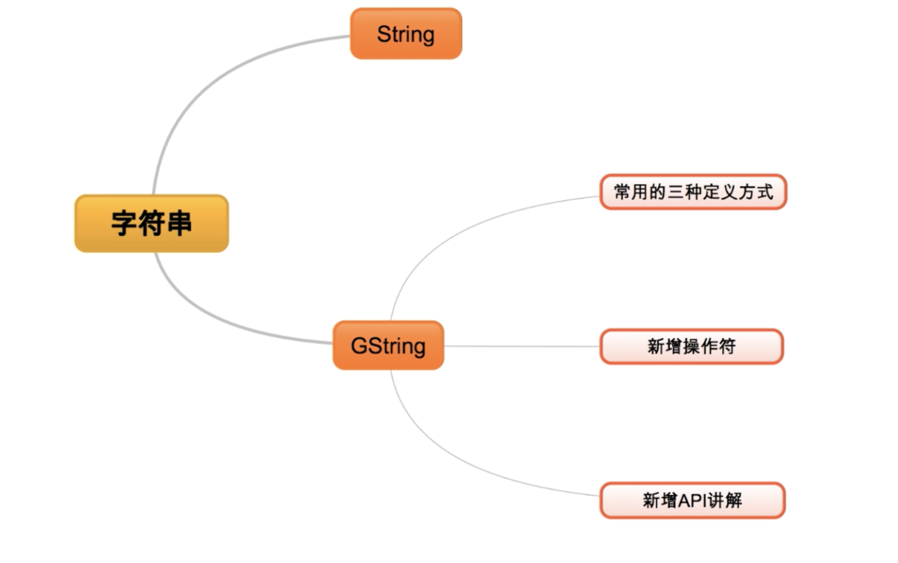
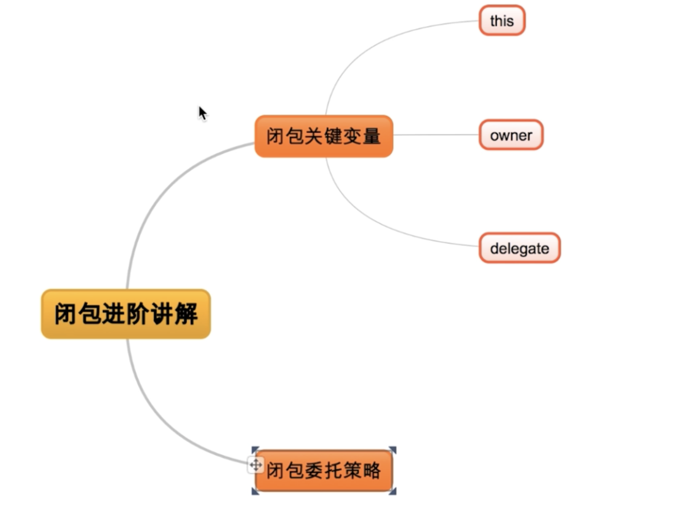

# Groovy基础语法

## Groovy变量讲解

全是对象类型，没有基本类型


```groovy
package variable

int x = 10

//println x.class

double y = 3.14

//println y.class

def x_1 = 11
//println x_1.class
def y_1 = 3.1415
//println y_1.class
def name = 'Qndroid'
//println name.class

x_1 = 'Test'
println x_1.class

```

## Groovy字符串讲解




```groovy
package variable

//def name = 'a single \'a\'string'
//println name.class

def thupleName = '''\
line one
line two
line three
'''
//println thupleName

def doubleName = "this a common String"
//println doubleName.class

def name = "Qndroid"
def sayHello = "Hello: ${name}"
//println sayHello
//println sayHello.class

def sum = "the sum of 2 and 3 equals ${2 + 3}" //可扩展做任意的表达式
//println sum
def result = echo(sum)
//println result.class

String echo(String message) {
    return message
}
/* ==================字符串的方法=================== */
def str = "groovy Hello"
//println str.center(8)
//println str.padLeft(8, 'a')
def str2 = 'Hello'
//println str > str2
//println str[0]
//println str[0..1]
//println str - str2

//println str.reverse()
//println str.capitalize()
//println str.
```

## 逻辑控制


```groovy
package variable

def x = 1.23
def result
switch (x) {
    case 'foo':
        result = 'found foo'
        break
    case 'bar':
        result = 'bar'
        break
    case [1.23, 4, 5, 6, 'inlist']: //列表
        result = 'list'
        break
    case 12..30:
        result = 'range' //范围
        break
    case Integer:
        result = 'integer'
        break
    case BigDecimal:
        result = 'big decimal'
        break
    default: result = 'default'
}

println result

//对范围的for循环
def sum = 0
for (i in 0..9) {
    sum += i
}
//println sum
sum = 0
/**
 * 对List的循环
 */
for (i in [1, 2, 3, 4, 5, 6, 7, 8, 9]) {
    sum += i
}
/**
 * 对Map进行循环
 */
for (i in ['lili': 1, 'luck': 2, 'xiaoming': 3]) {
    sum += i.value
}

def calculate(int number) {
    def result = 1
    1.upto(number) { num ->
        result *= num
    }
    return result
}

```

# Groovy闭包讲解

## Grovy中闭包基础详解


## Grovy中闭包使用详解


## Grovy中闭包进阶详解



# Groovy数据结构

和java差不多

# Groovy面向对象

和java差不多