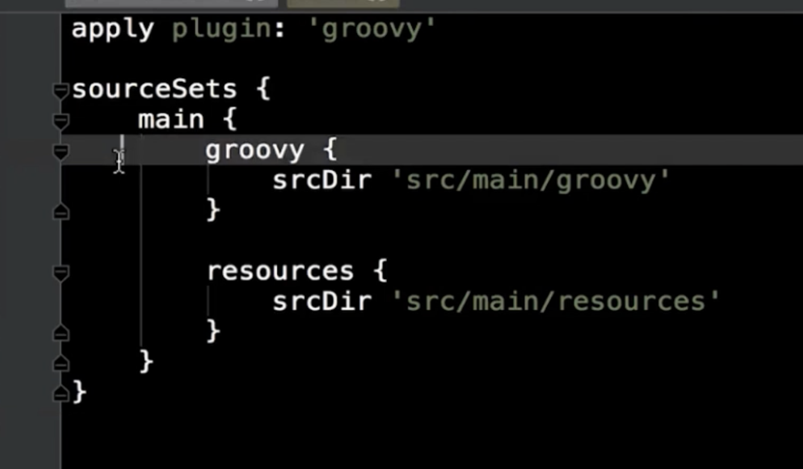
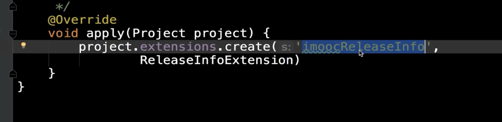

# Setting类讲解

## 初始化最重要的类

Settings.gradle在gradle初始化阶段执行

# SourceSet类讲解及实战

## 跟编译源码有关的设置，都可以设置

## 可以修改库文件的存放位置

## 可以对文件进行分包

# Plugin讲解及自定义Plugin

## 对封装思想的实现

## 如何书写插件

## 进行了相关的设置

## 自定义插件

## 声明别人如何使用插件

和包名一致

## 引入插件

## 写入扩展类进行通信

## 让对应扩展类初始化

## 设置扩展类相应属性

## 书写对应的Task

# android插件对gradle扩展

我不学安卓

# 如何迁移到gradle

