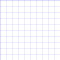

## 介绍

前端可视化技术

- 底层图形引擎： Skia 、OpenGL 等
- W3C提供：CSS3、Canvas、SVG、WebGL
- 第三方的可视化库： ZRender、Echarts、 AntV 、Highcharts、D3.js 、Three.js 和 百度地图、高德地图等等
- 低代码可视化平台：阿里云（DataV）、腾讯云图、网易有数（EasyScreen）、帆软等
- Canvas、SVG 基于 Skia，WebGL 基于 OpenGL，Three.js 就是对 WebGL 的封装

# CSS

## 2D动画 - transform

参考[CSS知识总结](#形变和动画)里有关介绍

CSS3 transform 属性允许你旋转，缩放，倾斜或平移给定元素

Transform 是形变的意思（通常也叫变换），transformer 就是变形金刚

常见的函数 transform function 有

- 平移：translate(x, y)
- 缩放：scale(x, y)
- 旋转：rotate(deg)
- 倾斜：skew(deg, deg)

通过上面的几个函数，我们就可以改变某个元素的 2D 形变

CSS3 transform 属性允许你在 二维 或 三维 空间中直观地变换元素

- ransform 属性会转换元素的坐标系，使元素在空间中转换
- 用 transform 属性变换的元素会受 transform-origin 属性值的影响，该属性用于指定形变的原点

## 坐标系

CSS3 transform属性允许你在二维或三维空间中直观地变换元素。

- transform 属性会转换元素的坐标系，使元素在空间中转换
- 用transform 属性变换的元素会受 transform-origin 属性值的影响，该属性用于指定形变的原点

元素的坐标系

- CSS 中的每个元素都有一个坐标系，其原点位于元素的左上角，左上角这被称为初始坐标系
- 用 transform 时，坐标系的原点默认会移动到元素的中心
- 因为 transform-origin 属性的默认值为 50%  50% ，即该原点将会作为变换元素的中心点
- 用 transform 属性旋转或倾斜元素，会变换或倾斜元素的坐标系。并且该元素所有后续变换都将基于新坐标系的变换
- 因此，transform 属性中变换函数的顺序非常重要，不同的顺序会导致不同的变换结果。

例如

- 如果将一个元素绕 y 轴旋转 90 度，那么它的 x 轴将指向屏幕内部，即远离你
	- 此时如再沿着 x 轴平移，元素不会向右移动，它会向内远离我们

- 因此，要注意编写转换函数的顺序，其中 transform 属性中的第一个函数将首先应用，最后一个函数将最后应用


这是背景图片，方便查看坐标系变化



当旋转的时候坐标轴也会旋转，下面代码就是演示，在进行操作时需要知道坐标轴

```html
<!DOCTYPE html>

<html lang="en">

  

<head>

  <meta charset="UTF-8">

  <meta http-equiv="X-UA-Compatible" content="IE=edge">

  <meta name="viewport" content="width=device-width, initial-scale=1.0">

  <title>Document</title>

  <style>

    body {

      margin: 0;

      padding: 0;

      background-image: url(../images/grid.png);

    }

  

    .box {

      width: 200px;

      height: 100px;

      background-color: skyblue;

  

      /* 形变 */

      /* transform: translateX(100px) rotate(45deg); */

      transform: rotate(45deg) translateX(100px);

    }

  </style>

</head>

  

<body>

  

  <div class="box">div</div>

</body>

  

</html>
```


## transform-origin

transform-origin：变形的原点（即坐标系0 , 0点）

- 一个值
	- 设置 x轴 的原点， y轴为默认值 50%。

- 两个值
	- 设置 x轴 和 y轴 的原点

- 三个值
	- 设置 x轴、 y轴 和 z轴 的原点

必须是`<length>`，`<percentage>`，或 left, center, right, top, bottom关键字中的一个

- left, center, right, top, bottom关键字
- length：从左上角开始计算
- 百分比：参考元素本身大小

```html
<!DOCTYPE html>

<html lang="en">

<head>

  <meta charset="UTF-8">

  <meta http-equiv="X-UA-Compatible" content="IE=edge">

  <meta name="viewport" content="width=device-width, initial-scale=1.0">

  <title>Document</title>

  <style>

    body{

      margin: 0;

      padding: 0;

      background-image: url(../images/grid.png);

    }

    .box{

      width: 200px;

      height: 100px;

      background-color: skyblue;

  

      /* 形变 */

      transform: rotate(45deg);

      /* left -> 0, 50% */

      /* bottom -> 50%, 100% */

      /* 修改坐标的原点 */

      transform-origin: bottom;

    }

  </style>

</head>

<body>

  <div class="box">div</div>

</body>

</html>
```

## 3D动画 - transform

CSS3 transform属性不但允许你进行2D的旋转，缩放或平移指定的元素，还支持3D变换元素

常见的函数transform function有

- 平移：translate3d(tx, ty, tz)
	- translateX(tx) 、translateY(ty)、translateZ(tz)

- 缩放：scale3d(sx, sy, sz)
	- scaleX(sy)、scaleY(sy)、scaleZ(sz)

- 旋转：rotate3d(x, y, z, a)
	- rotateX(x)、rotateY(y)、rotateZ(z)

通过上面的几个函数，我们可以改变某个元素的3D形变

3D形变函数会创建一个合成层来启用GPU硬件加速，比如： translate3d、 translateZ、 scale3d、rotate3d ...

## 3D旋转 

### rotateZ 、rotateX、rotateY

旋转：rotateX(deg)、rotateY(deg)、rotateZ(deg)

- 该CSS函数定义一个变换，它将元素围绕固定轴旋转。旋转量由指定的角度确定; 为正，旋转将为顺时针，为负，则为逆时针

值个数

- 只有一个值，表示旋转的角度（单位 deg ）

值类型

- deg：`<angle>` 类型，表示旋转角度（不是弧度）
- 正数为顺时针
- 负数为逆时针

简写：rotate3d( x , y , z , deg )

注意：旋转的原点受 transform-origin 影响

```html
<!DOCTYPE html>

<html lang="en">

<head>

  <meta charset="UTF-8">

  <meta http-equiv="X-UA-Compatible" content="IE=edge">

  <meta name="viewport" content="width=device-width, initial-scale=1.0">

  <title>Document</title>

  <style>

    body{

      margin: 0;

      padding: 0;

      background-image: url(../images/grid.png);

    }

    .box{

      width: 200px;

      height: 100px;

      background-color: skyblue;

  

      /* 形变 */

      /* transform: rotateZ(45deg); */

  

      /* 简写 */

      /* transform: rotate(45deg); */

      transform: rotate3d(0, 0, 1, 45deg);

    }

  </style>

</head>

<body>

  <div class="box">div</div>

</body>

</html>
```

这刚好就是立方体的侧视图的一个面

```html
<!DOCTYPE html>

<html lang="en">

<head>

  <meta charset="UTF-8">

  <meta http-equiv="X-UA-Compatible" content="IE=edge">

  <meta name="viewport" content="width=device-width, initial-scale=1.0">

  <title>Document</title>

  <style>

    body{

      margin: 0;

      padding: 100px;

      background-image: url(../images/grid.png);

    }

    .box{

      width: 100px;

      height: 100px;

      background-color: skyblue;

  

      /* 形变 */

      transform: rotateX(-33.5deg) rotateY(45deg);

    }

  </style>

</head>

<body>

  <div class="box">div</div>

</body>

</html>
```

### rotate3d

旋转：rotate3d(x, y, z, a)

- 该CSS 函数定义一个变换，它将元素围绕固定轴旋转。旋转量由指定的角度定义为正，运动将为顺时针，为负则为逆时针

值个数

- 一个值时，表示 z轴 旋转的角度
- 四个值时，表示在 3D 空间之中，旋转有 x,y,z 个旋转轴和一个旋转角度

值类型

- x：`<number>` 类型，可以是 0 到 1 之间的数值，表示旋转轴 X 坐标方向的矢量( 用来计算形变矩阵中的值 )
- y：`<number>` 类型，可以是 0 到 1 之间的数值，表示旋转轴 Y 坐标方向的矢量
- z：`<number>` 类型，可以是 0 到 1 之间的数值，表示旋转轴 Z 坐标方向的矢量
- a：`<angle>` 类型，表示旋转角度。正的角度值表示顺时针旋转，负值表示逆时针旋转

注意：旋转的原点受 transform-origin 影响

### rotateXYZ VS rotate3d


## 3D透视 - perspective

透视：perspective

- 定了观察者与 z=0 平面的距离，**使具有三维位置变换的元素产生透视效果**（z表示Z轴）
- z>0 的三维元素比正常的大，而 z<0 时则比正常的小，大小程度由该属性的值决定

值个数

- 只有一个值，表示观察者距离 z=0 的平面距离 和 none

必须是`<none> <length>`中的一个

- none：没有应用 perspective 样式时的默认值
- length：定观察者距离 z=0 平面的距离(如右图d的距离，单位px)
	- 为元素及其内容应用透视变换。当值为 0 或负值时，无透视变换。

透视的两种使用方式

1. 在父元素上定义 CSS 透视属性
2. 如果它是子元素或单元素子元素，可以使用函数 perspective()

透视演练场

- https://codepen.io/mburakerman/pen/wrZKwe
- https://codepen.io/enxaneta/pen/ZQbNMx


父元素中使用透视

```html
<!DOCTYPE html>

<html lang="en">

<head>

  <meta charset="UTF-8">

  <meta http-equiv="X-UA-Compatible" content="IE=edge">

  <meta name="viewport" content="width=device-width, initial-scale=1.0">

  <title>Document</title>

  <style>

    body{

      margin: 0;

      padding: 0;

      background-image: url(../images/grid.png);

    }

    .box{

      position: relative;

      width: 200px;

      height: 100px;

      background-color: skyblue;

      /* 在父元素添加透视效果 */

      perspective: 200px;

    }

  

    .item{

      position: absolute;

      top: 0;

      left: 0;

      width: 100%;

      height: 100%;

      background-color: pink;

      /* 形变 */

      transform: rotateY(60deg);

    }

  </style>

</head>

<body>

  <div class="box">div

    <div class="item">10</div>

  </div>

</body>

</html>
```

子元素中使用透视

```html
<!DOCTYPE html>

<html lang="en">

<head>

  <meta charset="UTF-8">

  <meta http-equiv="X-UA-Compatible" content="IE=edge">

  <meta name="viewport" content="width=device-width, initial-scale=1.0">

  <title>Document</title>

  <style>

    body{

      margin: 0;

      padding: 0;

      background-image: url(../images/grid.png);

    }

    .box{

      position: relative;

      width: 200px;

      height: 100px;

      background-color: skyblue;

      /* 在当前元素中直接添加透视效果 */

      transform: perspective(200px) rotateY(60deg);

    }

  

  </style>

</head>

<body>

  <div class="box">div

  </div>

</body>

</html>
```

## 3D位移

### translateX、translateY、translateZ

平移：translateX(x)、translateY(y)、translateZ(z)

- 该函数表示在二、三维平面上移动元素

值个数

- 只有一个值，设置对应轴上的位移

值类型

- 数字：100 px
- 百分比：参照元素本身（ refer to the size of bounding box ）

### translate3d

平移：translate3d(tx, ty, tz)

- 该CSS 函数在 3D 空间内移动一个元素的位置。这个移动由一个三维向量来表达，分别表示他在三个方向上移动的距离

值个数

- 三个值时，表示在 3D 空间之中， tx , ty , tz 分别表示他在三个方向上移动的距离

值类型

- tx：是一个 `<length>` 代表移动向量的横坐标
- ty：是一个`<length>` 代表移动向量的纵坐标
- tz：是一个 `<length>` 代表移动向量的 z 坐标。它不能是 `<percentage>` 值；那样的移动是没有意义的

注意

- translateX(tx)等同于 translate(tx, 0) 或者 translate3d(tx, 0, 0)
- translateY(ty) 等同于translate(0, ty) 或者 translate3d(0, ty, 0)
- translateZ(zx)等同于 translate3d(0, 0, tz)

```html
<!DOCTYPE html>

<html lang="en">

<head>

  <meta charset="UTF-8">

  <meta http-equiv="X-UA-Compatible" content="IE=edge">

  <meta name="viewport" content="width=device-width, initial-scale=1.0">

  <title>Document</title>

  <style>

    body{

      margin: 0;

      padding: 0;

      background-image: url(../images/grid.png);

    }

    .box{

      width: 200px;

      height: 100px;

      background-color: skyblue;

  

      /* 形变 */

      /* transform: translateX(100px) translateY(100px); */

  

      /* 简写 */

      transform: translate3d(100px, 100px, 0);

    }

  </style>

</head>

<body>

  <div class="box">div</div>

</body>

</html>
```

```html
<!DOCTYPE html>

<html lang="en">

<head>

  <meta charset="UTF-8">

  <meta http-equiv="X-UA-Compatible" content="IE=edge">

  <meta name="viewport" content="width=device-width, initial-scale=1.0">

  <title>Document</title>

  <style>

    body{

      margin: 0;

      padding: 0;

      background-image: url(../images/grid.png);

    }

    .box{

      width: 200px;

      height: 100px;

      background-color: skyblue;

  

      /* 形变 */

      transform: perspective(300px) translateZ(200px);

    }

  </style>

</head>

<body>

  <div class="box">div</div>

</body>

</html>
```

## 3D缩放

### scaleX、scaleY、scaleZ

缩放：scaleX、scaleY、scaleZ

- 函数指定了一个沿 x 、y 、z 轴调整元素缩放比例因子

值个数

- 一个值时，设置对应轴上的缩放（无单位）

值类型

- 数字
	- 1：保持不变
	- 2：放大一倍
	- 0.5：缩小一半

- 百分比：不支持百分比

### scale3d

缩放：scale3d(sx, sy，sz)

该CSS函数定义了在 3D 空间中调整元素的缩放比例因子

值个数

- 三个值时，表示在 3D 空间之中， sx, sy, sz 分别表示他在三个方向上缩放的向量

值类型

- sx：是一个`<number>`代表缩放向量的横坐标
- sy：是一个`<number>`表示缩放向量的纵坐标
- sz：是`<number>`表示缩放向量的 z 分量的 a（再讲到3D正方体再演示）

注意：

- scaleX(sx) 等价于scale(sx, 1) 或 scale3d(sx, 1, 1) 
- scaleY(sy)等价于 scale(1, sy) 或 scale3d(1, sy, 1)
- scaleZ(sz)等价于 scale3d(1, 1, sz)

```html
<!DOCTYPE html>

<html lang="en">

<head>

  <meta charset="UTF-8">

  <meta http-equiv="X-UA-Compatible" content="IE=edge">

  <meta name="viewport" content="width=device-width, initial-scale=1.0">

  <title>Document</title>

  <style>

    body{

      margin: 0;

      padding: 0;

      background-image: url(../images/grid.png);

    }

    .box{

      width: 200px;

      height: 100px;

      background-color: skyblue;

  

      /* 形变 */

     transform: scaleX(2) scaleY(2);

     /* 简写 */

     transform: scale3d(2, 2, 1);

     transform-origin: 0 0;

    }

  </style>

</head>

<body>

  <div class="box">div</div>

</body>

</html>
```

## 3D空间 - transform-style

变换式：transform-style

- 该 CSS 属性用于设置**元素的子元素是定位在 3D 空间中还是平展在元素的 2D 平面中**
- 在 3D 空间中同样是可以使用透视效果

值类型

- flat 表示元素的子元素位于元素本身的平面内
- preserve-3d 表示元素的子元素应位于 3D 空间中


```html
<!DOCTYPE html>

<html lang="en">

<head>

  <meta charset="UTF-8">

  <meta http-equiv="X-UA-Compatible" content="IE=edge">

  <meta name="viewport" content="width=device-width, initial-scale=1.0">

  <title>Document</title>

  <style>

    body{

      margin: 0;

      padding: 0;

      background-image: url(../images/grid.png);

    }

    .box{

      position: relative;

      width: 200px;

      height: 100px;

      background-color: skyblue;

      /* 在父元素中添加 transform-style来启用3D空间 */

      transform-style: preserve-3d;

      /* 在父元素添加透视效果 */

      perspective: 300px;

  

    }

  

    .item{

      position: absolute;

      top: 0;

      left: 0;

      width: 100%;

      height: 100%;

      background-color: pink;

  

      /* 形变 */

       transform: rotateX(70deg) translateX(50px);

    }

  </style>

</head>

<body>

  <div class="box">div

    <div class="item">10</div>

  </div>

</body>

</html>
```


## 3D背面可见性 - backface-visibility

背面可见性：backface-visibility

- 该CSS 属性 backface-visibility 指定某个元素当背面朝向观察者时是否可见。

值类型

- visible：背面朝向用户时可见
- hidden：背面朝向用户时不可见

```html
<!DOCTYPE html>

<html lang="en">

<head>

  <meta charset="UTF-8">

  <meta http-equiv="X-UA-Compatible" content="IE=edge">

  <meta name="viewport" content="width=device-width, initial-scale=1.0">

  <title>Document</title>

  <style>

    body{

      margin: 0;

      padding: 0;

      background-image: url(../images/grid.png);

    }

    .box{

      position: relative;

      width: 200px;

      height: 100px;

      background-color: skyblue;

      /* 在父元素添加透视效果 */

      perspective: 800px;

    }

  

    .item{

      position: absolute;

      top: 0;

      left: 0;

      width: 100%;

      height: 100%;

      background-color: pink;

      /* 形变 */

      /* transform: rotateY(180deg); */

  

      /* 元素背向是否可见 */

      backface-visibility: hidden;

  

      /* 帧动画 */

      animation: loop 6s linear infinite;

    }

  

    @keyframes loop{

      0%{

        transform: rotateY(0deg);

      }

  

      100%{

        transform: rotateY(-360deg);

      }

    }

  </style>

</head>

<body>

  <div class="box">div

    <div class="item">10</div>

  </div>

</body>

</html>
```

## 案例

### 3D空间 - 制作正方体

需求：制作一个正方体

- 绘制正方体的侧面图
- 绘制正方体的个六面


```html
<!DOCTYPE html>

<html lang="en">

<head>

  <meta charset="UTF-8">

  <meta http-equiv="X-UA-Compatible" content="IE=edge">

  <meta name="viewport" content="width=device-width, initial-scale=1.0">

  <title>Document</title>

  <style>

    body{

      margin: 0;

      padding: 100px;

      background-image: url(../images/grid.png);

    }

    .box{

      position: relative;

      width: 100px;

      height: 100px;

      background-color: red;

      /* 在父元素中添加 transform-style来启用3D空间 */

      transform-style: preserve-3d;

      transform: rotateX(-33.5deg) rotateY(45deg) scaleZ(2);

    }

  

    .item{

      position: absolute;

      top: 0;

      left: 0;

      width: 100%;

      height: 100%;

    }

     .top{

      background-color: rgba(255, 0, 0, 0.4);

      transform: rotateX(90deg) translateZ(50px);

    }

    .bottom{

      background-color: rgba(0, 255, 0, 0.4);

      transform: rotateX(-90deg) translateZ(50px);

    }

    .front{

      background-color: rgba(100, 100, 100, 0.4);

      transform: rotateY(0deg) translateZ(50px);

    }

    .back{

      background-color: rgba(0, 255, 255, 0.4);

      transform: rotateY(-180deg) translateZ(50px);

    }  

  

    .left{

      background-color: rgba(255, 255, 0, 0.4);

      transform: rotateY(-90deg) translateZ(50px);

    }

    .right{

      background-color: rgba(0, 0, 255, 0.4);

      transform: rotateY(90deg) translateZ(50px);

    }

  

  </style>

</head>

<body>

  <!-- 父元素(舞台) -->

  <div class="box">div

    <!-- 子元素 -->

    <div class="item top">1</div>

    <div class="item bottom">2</div>

    <div class="item front">3</div>

    <div class="item back">4</div>

    <div class="item left">5</div>

    <div class="item right">6</div>

  </div>

</body>

</html>
```

### 3D动画 - 制作webpack logo

需求：制作一个 webpack logo

- 绘制小正方体的侧面图
- 绘制小正方体的个六面
- 绘制大正方体的侧面图
- 绘制大正方体的个六面
- 添加旋转动画


```html

```

### 2.5D动画 - 数据平台可视化


HTML 部分，主要是通过图片来实现

```html
<!DOCTYPE html>

<html lang="en">

  <head>

    <meta charset="UTF-8" />

    <meta http-equiv="X-UA-Compatible" content="IE=edge" />

    <meta name="viewport" content="width=device-width, initial-scale=1.0" />

    <title>Document</title>

    <link rel="stylesheet" href="style.css" />

    <!-- 1.基本样式 -->

    <style>

      html,

      body,

      div,

      span,

      applet,

      object,

      iframe,

      h1,

      h2,

      h3,

      h4,

      h5,

      h6,

      p,

      blockquote,

      pre,

      a,

      abbr,

      acronym,

      address,

      big,

      cite,

      code,

      del,

      dfn,

      em,

      font,

      img,

      ins,

      kbd,

      q,

      s,

      samp,

      small,

      strike,

      strong,

      sub,

      sup,

      tt,

      var,

      b,

      u,

      i,

      center,

      dl,

      dt,

      dd,

      ol,

      ul,

      li,

      fieldset,

      form,

      label,

      legend,

      table,

      caption,

      tbody,

      tfoot,

      thead,

      tr,

      th,

      td {

        margin: 0;

        padding: 0;

        border: 0;

        outline: 0;

        font-size: 100%;

        vertical-align: baseline;

        background: transparent;

      }

      html,

      body {

        width: 100%;

        position: relative;

      }

      #banner {

        position: absolute;

        min-width: 100%;

        min-height: 500px;

        height: auto;

        width: auto;

        right: 0;

        left: 0;

        top: 0;

        bottom: 0;

        z-index: -10;

        background-image: url(./images/banbj.jpeg);

        background-repeat: no-repeat;

        background-position: center;

      }

      .maxCon {

        height: 500px;

        width: 100%;

        max-width: 1200px;

        position: relative;

        overflow: hidden;

        margin: 0 auto;

      }

    </style>

  

    <!-- 2.图片布局样式 -->

    <style>

      /* 动画的舞台 */

      .rtMove {

        width: 444px;

        height: 430px;

        position: absolute;

        right: 70px;

        top: 40px;

        background-image: url(./images/banner.png);

        background-position: center bottom;

        background-repeat: no-repeat;

      }

  

      /* 动画的子元素 */

      .rtMove .tuC {

        position: absolute;

        top: 228px;

        left: 168px;

        opacity: 1;

        animation: tuC 1.6s linear infinite;

      }

  

      .rtMove .tuB {

        position: absolute;

        top: 123px;

        left: 111px;

        animation: tuB 2s linear infinite;

      }

  

      .rtMove .guangA {

        position: absolute;

        top: 309px;

        left: 279px;

        animation: guangA 1.3s linear infinite;

      }

  

      .rtMove .guangB {

        position: absolute;

        top: 263px;

        left: 239px;

        animation: guangB 1.1s linear infinite;

      }

  

      .rtMove .lingxA {

        position: absolute;

        top: 194px;

        left: 126px;

        opacity: 1;

        animation: lingxA 2s linear infinite;

      }

  

      .rtMove .lingxB {

        position: absolute;

        top: 163px;

        left: 79px;

        opacity: 1;

        animation: lingxB 2.2s linear infinite;

      }

  

      .rtMove .lingxC {

        position: absolute;

        top: 179px;

        left: 189px;

        opacity: 1;

        animation: lingxC 1.7s linear infinite;

      }

  

      .rtMove .lingxD {

        position: absolute;

        top: 103px;

        left: 160px;

        opacity: 1;

        animation: lingxC 2.7s linear infinite;

      }

  

      .rtMove .lingxE {

        position: absolute;

        top: 104px;

        left: 95px;

        opacity: 1;

        animation: lingxB 1.2s linear infinite;

      }

  

      .rtMove .lingxF {

        position: absolute;

        top: 84px;

        left: 144px;

        opacity: 1;

        animation: lingxA 1.4s linear infinite;

      }

  

      .rtMove .chaunB {

        position: absolute;

        top: 38px;

        left: 318px;

        animation: chaunB 1.2s linear infinite;

      }

  

      .rtMove .chaunC {

        position: absolute;

        top: 60px;

        left: 318px;

        animation: chaunC 0.7s linear infinite;

      }

  

      .rtMove .tuA {

        position: absolute;

        top: 140px;

        left: 316px;

        animation: tuA 1.3s linear infinite;

      }

  

      .rtMove .tuAa {

        position: absolute;

        top: 140px;

        left: 316px;

        animation: tuAa 1.3s linear infinite;

      }

  

      .rtMove .ziA {

        position: absolute;

        top: 114px;

        left: 320px;

        animation: ziA 2.6s linear infinite;

      }

  

      .rtMove .ziB {

        position: absolute;

        top: 144px;

        left: 339px;

        animation: ziB 2s linear infinite;

      }

  

      .rtMove .ziC {

        position: absolute;

        top: 91px;

        left: 349px;

        animation: ziC 1.7s linear infinite;

      }

  

      .rtMove .ma {

        position: absolute;

        top: 247px;

        left: 303px;

      }

  

      .rtMove .tuMing {

        opacity: 0;

        animation: tuMing 0.6s linear infinite;

      }

  

      .rtMove .ren {

        position: absolute;

        top: 283px;

        left: 330px;

      }

    </style>

  </head>

  <body>

    <div id="banner">

      <div class="an">

        <div class="maxCon">

          <div class="rtMove">

            

            

            

            

  

            

            

            

            

            

            

  

            

            

            

            

  

            

            

            

  

            

            

  

            

          </div>

        </div>

      </div>

    </div>

  </body>

</html>
```

对应的动画CSS

```css
@keyframes tuB {

  0% {

    transform: translateY(0);

  }

  

  50%{

    transform: translateY(20px);

  }

  

  100% {

    transform: translateY(0);

  }

}

  
  

@keyframes guangA{

  0% {

    opacity: 1;

    transform: translate(0, 0);

  }

  50%{

    opacity: 1;

  }

  100%{

    opacity: 0;

    transform: translate(-55px, -34px);

  }

}

  

@keyframes guangB{

  0% {

    opacity: 1;

    transform: translate(0, 0);

  }

  50%{

    opacity: 1;

  }

  100%{

    opacity: 0;

    transform: translate(60px, 33px);

  }

}

  

@keyframes tuC{

  0%{

    opacity: 0;

    transform: translate(0,0);

  }

  40%{

    opacity: 1;

  }

  90%,

  100%{

    opacity: 1;

    transform: translate(40px, 20px);

  }

}

  

@keyframes lingxA{

  0%{

    opacity: 1;

    transform: translateY(-8px);

  }

  60% {

    opacity: 1;

  }

  100%{

    opacity: 0;

    transform: translateY(-60px);

  }

}

  

@keyframes lingxB{

  0%{

    opacity: 1;

    transform: translateY(-8px);

  }

  40%{

    opacity: 1;

  }

  

  90%,100%{

    opacity: 0;

    transform: translateY(-60px);

  }

}

  

@keyframes lingxC{

  0%{

    opacity: 1;

    transform: translateY(-8px);

  }

  50%{

    opacity: 1;

  }

  

  50%,100%{

    opacity: 0;

    transform: translateY(-50px);

  }

}

  

@keyframes chaunB{

  0%{

    opacity: 1;

    transform: translateY(0px);

  }

  

  100%{

    opacity: 0;

    transform: translateY(-70px);

  }

}

  

@keyframes chaunC{

  0%{

    opacity: 1;

    transform: translateY(0px);

  }

  

  100%{

    opacity: 0;

    transform: translateY(-40px);

  }

}

  

@keyframes tuA{

  0%{

    opacity: 1;

    transform: translateY(0px);

  }

  60%{

    opacity: 1;

  }

  

  100%{

    opacity: 0;

    transform: translateY(-120px);

  }

}

  

@keyframes tuAa{

  0%, 30%{

    opacity: 1;

    transform: translateY(0px);

  }

  60%{

    opacity: 1;

  }

  100%{

    opacity: 0;

    transform: translateY(-60px);

  }

}

  

@keyframes ziA{

  0%, 20%, 40%, 60%, 80% {

    transform: translateY(0);

  }

  10%, 50% {

      transform: translateY(-4px);

  }

  30%, 70% {

      transform: translateY(4px);

  }

}

  

@keyframes ziB{

  0%, 20%, 40%, 60%, 80% {

    transform: translateY(0);

  }

  10%, 50% {

      transform: translateY(3px);

  }

  30%, 70% {

      transform: translateY(-3px);

  }

}

  

@keyframes ziC{

  0%, 20%, 40%, 60%, 80% {

    transform: translateY(0);

  }

  10%, 50% {

      transform: translateY(-2px);

  }

  30%, 70% {

      transform: translateY(3px);

  }

}

  

@keyframes tuMing{

  0%{

    opacity: 0;

  }

  50%{

    opacity: 1;

  }

  100%{

    opacity: 0;

  }

}
```

## 浏览器渲染流程

1. 解析HTML，构建DOM Tree

2. 对CSS文件进行解析，解析出对应的规则树

3. DOM Tree + CSSOM 生成 Render Tree

4. 布局（Layout）：计算出每个节点的宽度、高度和位置信息

- 页面元素位置、大小发生变化，往往会导致其他节点联动，需要重新计算布局，这个过程称为回流（Reflow）。

5. 绘制（Paint）：将可见的元素绘制在屏幕中

- 默认标准流是在同一层上绘制，一些特殊属性会创建新的层绘制，这些层称为渲染层
- 一些不影响布局的 CSS 修改也会导致该渲染层重绘（Repaint），回流必然会导致重绘

6. Composite 合成层：一些特殊属性会创建一个新的合成层（ CompositingLayer ），并可以利用GPU 来加速绘制，这是浏览器的一种优化手段。合成层确实可以提高性能，但是它以消耗内存为代价，因此不能滥用作为 web 性能优化策略和过度使用。


## CSS3动画性能优化

1. 创建一个新的渲染层（减少回流）

- 有明确的定位属性（relative、fixed、sticky、absolute）
- 透明度（opacity 小于 1）
- 有 CSS transform 属性（不为 none）
- 当前有对于 opacity、transform、fliter、backdrop-filter 应用动画
- backface-visibility 属性为 hidden
- ....

2. 创建合成层。合成层会开始GPU加速页面渲染，但不能滥用

- 对 opacity、transform、fliter、backdropfilter 应用了 animation 或 transition（需要是 active 的 animation 或者 transition ）
- 有 3D transform 函数：比如： translate3d 、 translateZ 、 scale3d 、 rotate3d ...
- will-change 设置为 opacity 、transform 、top 、left 、bottom 、right ，比如：`will-change: opacity , transform`
	- 其中 top 、left 等需要设置明确的定位属性，如 relative 等

### 查看有哪些层


# Canvas

## 了解 Canvas

什么是Canvas

- Canvas 最初由Apple于2004 年引入，用于Mac OS X WebKit组件，为仪表板小部件和Safari浏览器等应用程序提供支持，后来，它被Gecko内核的浏览器（尤其是Mozilla Firefox），Opera和Chrome实现，并被网页超文本应用技术工作小组提议为下一代的网络技术的标准元素（HTML5新增元素）
- Canvas提供了非常多的JavaScript绘图API（比如：绘制路径、矩形、圆、文本和图像等方法），与`<canvas>`元素可以绘制各种2D图形
- Canvas API 主要聚焦于 2D 图形。当然也可以使用`<canvas>`元素对象的 WebGL API 来绘制 2D 和 3D 图形

Canvas的应用场景

- 可以用于动画、游戏画面、数据可视化、图片编辑以及实时视频处理等方面。

## 优缺点

Canvas 优点

- Canvas提供的功能更原始，适合像素处理，动态渲染和数据量大的绘制，如：图片编辑、热力图、炫光尾迹特效等
- Canvas非常适合图像密集型的游戏开发，适合频繁重绘许多的对象
- Canvas能够以 .png 或 .jpg 格式保存结果图像，适合对图片进行像素级的处理

Canvas 缺点

- 在移动端可以能会因为Canvas数量多，而导致内存占用超出了手机的承受能力，导致浏览器崩溃
- Canvas 绘图只能通过JavaScript脚本操作（all in js）
- Canvas 是由一个个像素点构成的图形，放大会使图形变得颗粒状和像素化，导致模糊。

## 初体验Canvas

使用Canvas的注意事项

- `<canvas>` 和 `` 元素很相像，唯一的不同就是它并没有 src 和 alt 属性
- `<canvas>` 标签只有两个属性 width 和 height ( 单位默认为 px ) 当没有设置宽度和高度时，canvas 会初始化宽为 300 px 和高为 150 px
- 与 `` 元素不同，`<canvas>` 元素必须需要结束标签 (`</canvas>`)。如结束标签不存在，则文档其余部分会被认为是替代内容，将不会显示出来
- 测试 canvas.getContext() 方法的存在，可以检查浏览器是否支持Canvas

初体验Canvas

1. Canvas通用模板


2. Canvas绘制正方形


## Canvas Grid 和 坐标空间

在开始画图之前，我们需要了解一下Canvas网格（ canvas grid ）和 坐标系

Canvas Grid 或 坐标空间

- 假如，HTML 模板中有个宽 150 px, 高 150 px 的 `<canvas>` 元素，`<canvas>`元素默认被网格所覆盖
- 通常来说网格中的一个单元相当于 canvas 元素中的一像素
- 该网格的原点位于坐标 (0,0) 的左上角。所有元素都相对于该原点放置
- 网格也可以理解为坐标空间（坐标系），坐标原点位于canvas元素的左上角，被称为初始坐标系
-  如图中蓝色正方形，左上角的坐标为距离左边 x 像素，距离上边 y 像素，坐标为（ x, y ）
- 网格或坐标空间是可以变换的，后面会讲如何将原点转换到不同的位置，旋转网格甚至缩放它
	- 注意：移动了原点后，默认所有后续变换都将基于新坐标系的变换。


## 绘制矩形( Rectangle )

Canvas支持两种方式来绘制矩形：矩形方法 和 路径方法

- 路径是通过不同颜色和宽度的线段或曲线相连形成的不同形状的点的集合
- 除了矩形，其他的图形都是通过一条或者多条路径组合而成的
- 通常我们会通过众多的路径来绘制复杂的图形

Canvas 绘图的矩形方法

- fillRect(x, y, width, height)： 绘制一个填充的矩形
- strokeRect(x, y, width, height)： 绘制一个矩形的边框
- clearRect(x, y, width, height)： 清除指定矩形区域，让清除部分完全透明

方法参数

- 上面的方法都包含了相同的参数
- x 与 y 指定了在canvas画布上所绘制矩形的左上角（相对于原点）的坐标（不支持 undefined ）
- width 和 height 设置矩形的尺寸。

## 认识路径

什么是路径

- 图形的基本元素是路径
	- 路径是通过不同颜色和宽度的线段或曲线相连形成的不同形状的点的集合
- 路径是可由很多子路径构成，这些子路径都是在一个列表中，列表中所有子路径（线、弧形等）将构成图形
- 一个路径，甚至一个子路径，通常都是闭合的

使用路径绘制图形的步骤

1. 首先需要创建路径起始点（beginPath）
2. 然后使用画图命令去画出路径( arc 、lineTo )
3. 之后把路径闭合( closePath , 不是必须)
4. 一旦路径生成，就能通过描边(stroke)或填充路径区域(fill)来渲染图形。

以下是绘制路径时，所要用到的函数

- beginPath()：新建一条路径，生成之后，图形绘制命令被指向到新的路径上绘图，不会关联到旧的路径
- closePath()：闭合路径之后图形绘制命令又重新指向到 beginPath之前的上下文中
- stroke()：通过线条来绘制图形轮廓/描边（针对当前路径图形）
- fill()：通过填充路径的内容区域生成实心的图形（针对当前路径图形）

### 绘制直线

移动画笔（moveTo）方法

- moveTo 方法是不能画出任何东西，但是它也是路径列表的一部分
- moveTo 可以想象为在纸上作业，一支钢笔或者铅笔的笔尖从一个点到另一个点的移动过程
- moveTo(x, y)： 将笔移动到指定的坐标 x 、 y 上
- 当 canvas 初始化或者beginPath()调用后，我们通常会使用moveTo(x, y)函数设置起点
- 使用moveTo函数能够绘制一些不连续的路径

绘制直线（lineTo）方法

- lineTo(x, y)： 绘制一条从当前位置到指定 (x ，y)位置的直线
	- 该方法有两个参数(x ， y)代表坐标系中直线结束的点
- 开始点和之前的绘制路径有关，之前路径的结束点就是接下来的开始点
	- 当然开始点也可以通过moveTo(x, y)函数改变。

绘制一条直线

1. 调用 beginPath() 来生成路径。本质上，路径是由很多子路径（线、弧形、等）构成
2. 调用moveTo、lineTo函数来绘制路径（路径可以是连续也可以不连续）
3. 闭合路径 closePath()，不是必需

### 绘制三角形( Triangle )

绘制一个三角形步骤

1. 调用 beginPath() 来生成路径
2. 调用moveTo()、lineTo()函数来绘制路径
3. 闭合路径 closePath()，不是必需的
	- closePath() 方法会通过绘制一条从当前点到开始点的直线来闭合图形
	- 如果图形是已经闭合了的，即当前点为开始点，该函数什么也不做。
4. 调用stroke()函数来给线描边，或者调用fill()函数来填充（使用填充 fill 时，路径会自动闭合，而 stroke 不会）

### 绘制圆弧（Arc）、圆 ( Circle)

绘制圆弧或者圆，使用arc()方法

- arc(x, y, radius, startAngle, endAngle, anticlockwise)，该方法有六个参数
	- x、y：为绘制圆弧所在圆上的圆心坐标
	- radius：为圆弧半径
	- startAngle、endAngle：该参数用弧度定义了开始以及结束的弧度。这些都是以 x 轴为基准
	- anticlockwise：为一个布尔值。为 true ，是逆时针方向，为false，是顺时针方向，默认为false

计算弧度

- arc() 函数中表示角的单位是弧度，不是角度
- 角度与弧度的 JS 表达式：弧度=( Math.PI / 180 ) * 角度 ，即 1角度 = Math.PI / 180 个弧度
	- 旋转 90 ° ：Math.PI / 2
	- 旋转 180 ° ：Math.PI 
	- 旋转 360 ° ：Math.PI * 2
	- 旋转 - 90 ° ：- Math.PI / 2；

绘制一个圆弧的步骤

1. 调用 beginPath() 来生成路径
2. 调用arc()函数来绘制圆弧
3. 闭合路径 closePath()，不是必需的
4. 调用stroke()函数来描边，或者调用fill()函数来填充（使用填充 fill 时，路径会自动闭合）

### 矩形（Rectangle）

绘制矩形的另一个方法

- 调用rect() 函数绘制，即将一个矩形路径增加到当前路径上
- rect(x, y, width, height)
	- 绘制一个左上角坐标为（x,y），宽高为 width 以及 height 的矩形。
注意

- 当该方法执行的时候，moveTo(x, y) 方法自动设置坐标参数（0,0）
- 也就是说，当前笔触自动重置回默认坐标

## 色彩 Colors

前面已经学过了很多绘制图形的方法。如果我们想要给图形上色，有两个重要的属性可以做到

- fillStyle = color： 设置图形的填充颜色，需在 fill() 函数前调用
- strokeStyle = color： 设置图形轮廓的颜色，需在 stroke() 函数前调用

color颜色

- color 可以是表示 CSS 颜色值的字符串，支持：关键字、十六进制、rgb、rgba格式
- 默认情况下，线条和填充颜色都是黑色（CSS 颜色值 `#000000`）

注意

- 一旦设置了 strokeStyle 或者 fillStyle 的值，那么这个新值就会成为新绘制的图形的默认值
- 如果你要给图形上不同的颜色，你需要重新设置 fillStyle 或 strokeStyle 的值。

额外补充

- fill() 函数是图形填充，fillStyle属性是设置填充色
- stroke() 函数是图形描边，strokeStyle属性是设置描边色

## 透明度 Transparent

 除了可以绘制实色图形，我们还可以用 canvas 来绘制半透明的图形

1. strokeStyle 和 fillStyle属性结合RGBA
2. 方式二：globalAlpha 属性
	- globalAlpha = 0 ~ 1
		- 这个属性影响到 canvas 里所有图形的透明度
		- 有效的值范围是 0.0（完全透明）到 1.0（完全不透明），默认是 1.0。

## 线型 Line styles

调用lineTo()函数绘制的线条，是可以通过一系列属性来设置线的样式

- lineWidth = value： 设置线条宽度
- lineCap = type： 设置线条末端样式
- lineJoin = type： 设定线条与线条间接合处的样式

lineWidth

- 设置线条宽度的属性值必须为正数。默认值是 1.0px，不需单位。（ 零、负数、Infinity和NaN值将被忽略）
- 线宽是指给定路径的中心到两边的粗细。换句话说就是在路径的两边各绘制线宽的一半
- 如果你想要绘制一条从 (3,1) 到 (3,5)，宽度是 1.0 的线条，你会得到像第二幅图一样的结果
	- 路径的两边个各延伸半个像素填充并渲染出1像素的线条（深蓝色部分）
	- 两边剩下的半个像素又会以实际画笔颜色一半色调来填充（浅蓝部分）
	- 实际画出线条的区域为（浅蓝和深蓝的部分），填充色大于1像素了，这就是为何宽度为 1.0 的线经常并不准确的原因
- 要解决这个问题，必须对路径精确的控制
- 1px的线条会在路径两边各延伸半像素，那么像第三幅图那样绘制从 (3.5 ,1) 到 (3.5,5) 的线条，其边缘正好落在像素边界，填充出来就是准确的宽为 1.0 的线条


lineCap： 属性的值决定了线段端点显示的样子。它可以为下面的三种的其中之一

- butt 截断，默认是 butt
- round 圆形
- square 正方形

lineJoin： 属性的值决定了图形中线段连接处所显示的样子。它可以是这三种之一

- round 圆形
- bevel 斜角
- miter 斜槽规，默认是 miter


## 绘制文本

canvas 提供了两种方法来渲染文本：

- fillText(text, x, y [, maxWidth])
	- 在 (x,y) 位置，填充指定的文本
	- 绘制的最大宽度（可选）

- strokeText(text, x, y [, maxWidth])
	- 在 (x,y) 位置，绘制文本边框
	- 绘制的最大宽度（可选）

文本的样式（需在绘制文本前调用）

- font = value： 当前绘制文本的样式。这个字符串使用和 CSS font 属性相同的语法。默认的字体是：10px sans-serif
- textAlign = value：文本对齐选项。可选的值包括：start, end, left, right or center. 默认值是 start
- textBaseline = value：基线对齐选项。可选的值包括：top, hanging ,  middle ,  alphabetic , ideographic, bottom
	- 默认值是 alphabetic。


## 绘制图片

◼ 绘制图片，可以使用 drawImage 方法将它渲染到 canvas 里。drawImage 方法有三种形态：
 drawImage(image, x, y)
✓ 其中 image 是 image 或者 canvas 对象，x 和 y 是其在目标 canvas 里的起始坐标。
 drawImage(image, x, y, width, height)
✓ 这个方法多了 2 个参数：width 和 height，这两个参数用来控制 当向 canvas 画入时应该缩放的大小
 drawImage(image, sx, sy, sWidth, sHeight, dx, dy, dWidth, dHeight)
✓ 第一个参数和其它的是相同的，都是一个图像或者另一个 canvas 的引用。其它 8 个参数最好是参照右边的图解，前 4 个
是定义图像源的切片位置和大小，后 4 个则是定义切片的目标显示位置和大小。
◼ 图片的来源，canvas 的 API 可以使用下面这些类型中的一种作为图片的源：
 HTMLImageElement：这些图片是由Image()函数构造出来的，或者任何的元素。
 HTMLVideoElement：用一个 HTML 的 `<video>`元素作为你的图片源，可以从视频中抓取当前帧作为一个图像。
 HTMLCanvasElement：可以使用另一个 `<canvas>` 元素作为你的图片源。

## 保存和恢复

◼ Canvas绘画状态
 是当前绘画时所产生的样式和变形的一个快照。
 Canvas在绘画时，会产生相应的绘画状态，其实我们是可以将某些绘画的状态存储在栈中来为以后复用。
 Canvas 绘画状态的可以调用 save 和 restore 方法是用来保存和恢复，这两个方法都没有参数，并且它们是成对存在的。
◼ 保存和恢复（Canvas）绘画状态
 save()：保存画布 (canvas) 的所有绘画状态
 restore()：恢复画布 (canvas) 的所有绘画状态
◼ Canvas绘画状态包括：
 当前应用的变形（即移动，旋转和缩放）
 以及这些属性：strokeStyle, fillStyle, globalAlpha, lineWidth, lineCap, lineJoin, miterLimit,
shadowOffsetX, shadowOffsetY, shadowBlur, shadowColor, font, textAlign, textBaseline ......
 当前的裁切路径（clipping path）

## 变形 Transform

◼ Canvas和CSS3一样也是支持变形，形变是一种更强大的方法，可以将坐标原点移动到另一点、形变可以对网格进行旋转和缩放。
◼ Canvas的形变有4种方法实现：
 translate(x, y)：用来移动 canvas 和它的原点到一个不同的位置。
✓ x 是左右偏移量，y 是上下偏移量（无需要单位），如右图所示。
 rotate(angle)：用于以原点为中心旋转 canvas，即沿着z轴旋转。
✓ angle是旋转的弧度，是顺时针方向，以弧度为单位。
 scale(x, y)：用来增减图形在 canvas 中像素数目，对图形进行缩小或放大。
✓ x 为水平缩放因子，y 为垂直缩放因子。如果比 1 小，会缩小图形，如果比 1 大会放大图形。默认值为 1，也支持负数。
 transform(a, b, c, d, e, f)： 允许对变形矩阵直接修改。这个方法是将当前的变形矩阵乘上一个基于自身参数的矩阵。
◼ 注意事项：
 在做变形之前先调用 save 方法保存状态是一个良好的习惯。
 大多数情况下，调用 restore 方法比手动恢复原先的状态要简单得多。
 如果在一个循环中做位移但没有保存和恢复canvas状态，很可能到最后会发现有些东西不见了，因为它很可能已超出canvas画布以外了。
 形变需要在绘制图形前调用。

## 移动 Translate

◼ translate方法，它用来移动 canvas 和它的原点到一个不同的位置。
 translate(x, y)
✓ x 是左右偏移量，y 是上下偏移量（无需单位）。
◼ 移动 canvas 原点的好处
 如不使用 translate方法，那么所有矩形默认都将被绘制在相同的（0,0）坐标原点。
 translate方法可让我们任意放置图形，而不需要手工一个个调整坐标值。
◼ 移动矩形案例
 第一步：先保存一下canvas当前的状态
 第二步：在绘制图形前translate移动画布
 第三步：开始绘制图形，并填充颜色

## 旋转 Rotate

◼ rotate方法，它用于以原点为中心旋转 canvas，即沿着 z轴 旋转。
 rotate(angle)
✓ 只接受一个参数：旋转的角度 (angle)，它是顺时针方向，以弧度为单位的值。
✓ 角度与弧度的 JS 表达式：弧度=( Math.PI / 180 ) * 角度 ，即 1角度 = Math.PI/180
个弧度。
✓ 比如：旋转90°：Math.PI / 2； 旋转180°：Math.PI ； 旋转360°：Math.PI * 2； 旋转-90°：-Math.PI / 2；
✓ 旋转的中心点始终是 canvas 的原坐标点，如果要改变它，我们需要用到 translate方法。
◼ 旋转案例
 第一步：先保存一下Canvas当前的状态，并确定旋转原点
 第二步：在绘制图形前旋转画布（坐标系会跟着旋转了）
 第三步：开始绘制图形，并填充颜色

## 缩放 Scale

◼ scale方法可以缩放画布。可用它来增减图形在 canvas 中的像素数目，对图形进行缩小或者放大。
 scale(x, y)
✓ x 为水平缩放因子，y 为垂直缩放因子，也支持负数。
✓ 如果比 1 小，会缩小图形，如果比 1 大会放大图形。默认值为 1。
◼ 注意事项
 画布初始情况下，是以左上角坐标为原点。如果参数为负实数，相当于以 x 或 y 轴作为对称轴镜像反转。
✓ 例如，使用translate(0, canvas.height); scale(1,-1); 以 y 轴作为对称轴镜像反转。
 默认情况下，canvas 的 1 个单位为 1 个像素。如果我们设置缩放因子是 0.5，1 个单位就变成对应 0.5 个像素，这样绘制出
来的形状就会是原先的一半。同理，设置为 2.0 时，1 个单位就对应变成了 2 像素，绘制的结果就是图形放大了 2 倍。
◼ 缩放案例实战
 第一步：先保存一下Canvas当前的状态，并确定缩放原点
 第二步：在绘制图形前缩放画布
 第三步：开始绘制图形，并填充颜色

## Canvas 动画

◼ Canvas绘图都是通过JavaScript 去操控的，如要实现一些交互性动画是相当容易的。那Canvas是如何做一些基本动画的？
 canvas可能最大的限制就是图像一旦绘制出来，它就是一直保持那样了。
 如需要执行动画，不得不对画布上所有图形进行一帧一帧的重绘（比如在1秒绘60帧就可绘出流畅的动画了）。
 为了实现动画，我们需要一些可以定时执行重绘的方法。然而在Canvas中有三种方法可以实现：
✓ 分别为 setInterval 、 setTimeout 和 requestAnimationFrame 三种方法来定期执行指定函数进行重绘。
◼ Canvas 画出一帧动画的基本步骤（如要画出流畅动画，1s 需绘60帧）：
 第一步：用 clearRect 方法清空 canvas ，除非接下来要画的内容会完全充满 canvas（例如背景图），否则你需要清空所有。
 第二步：保存 canvas 状态，如果加了 canvas 状态的设置（样式，变形之类的），又想在每画一帧之时都是原始状态的话，
你需要先保存一下，后面再恢复原始状态。
 第三步：绘制动画图形（animated shapes） ，即绘制动画中的一帧。
 第四步：恢复 canvas 状态，如果已经保存了 canvas 的状态，可以先恢复它，然后重绘下一帧。

### 绘制秒针 setInterval

◼ 绘制秒针动画，绘制一帧的步骤：
 第一步：用 clearRect(x,y, w,h)方法，清空 canvas 。
 第二步：保存 canvas 状态 。
 第三步：修改 canvas 状态 （样式、移动坐标、旋转等）。
 第四步：绘制秒针图形（即绘制动画中的一帧）。
 第五步：恢复 canvas 状态 ，准备重绘下一帧。
◼ setTimout定时器的缺陷
 setTimeout定时器不是非常精准的，因为setTimeout的回调函数是放到了宏任务中等待执行。
 如果微任务中一直有未处理完成的任务，那么setTimeout的回调函数就有可能不会在指定时间内触发回调。
 如果想要更加平稳和更加精准的定时执行某个任务的话，可以使用requestAnimationFrame函数。

### 绘制秒针 requestAnimationFrame

◼ requestAnimationFrame函数
 告诉浏览器——你希望执行一个动画，并且要求浏览器在下次重绘之前调用该函数的回调函数来更新动画。
 该方法需要传入一个回调函数作为参数，该回调函数会在浏览器下一次重绘之前执行
 若想在浏览器下次重绘之前继续更新下一帧动画，那么在回调函数自身内必须再次调用 requestAnimationFrame()
 通常每秒钟回调函数执行 60 次左右，也有可能会被降低。
◼ 绘制秒针动画，绘制一帧的步骤：
 第一步：用 clearRect(x,y, w,h)方法，清空 canvas 。
 第二步：保存 canvas 状态 。
 第三步：修改 canvas 状态 （样式、移动坐标、旋转等）。
 第四步：绘制秒针图形（即绘制动画中的一帧） 。
 第五步：恢复 canvas 状态 ，准备重绘下一帧。

## 案例

### 太阳系旋转

◼ 太阳系旋转动画，绘制一帧的步骤：
 第一步：用 clearRect(x,y, w,h)方法，清空 canvas ，并初始化全局样式。
 第二步：保存 canvas 状态 。
 第三步：绘制背景、绘制地球（绘制月球）、绘制阴影效果。
 第五步：恢复 canvas 状态 ，准备重绘下一帧。

### 时钟

◼ 求圆上x, y的坐标：
 圆上x, y轴坐标实际上就是右图的 ( AB, BC )，AC为时钟半径
 x= AB = cosa * AC => x = Math.cos(弧度) * R
 y= BC = sina * AC => y = Math.sin(弧度) * R
 角度与弧度的 JS 表达式：弧度=( Math.PI / 180 ) * 角度
=> 弧度= 1角度对应的弧度 * 角度 。
 比如：旋转90°：弧度为Math.PI / 2； 旋转180°：为Math.PI ； 旋转360°：为Math.PI * 2； 旋转-90°：为-Math.PI / 2；
 第 i 小时的坐标：
✓ x = Math.cos( Math.PI * 2 / 12 * i ) * R
✓
y = Math.sin( Math.PI * 2 / 12 * i ) * R
◼ 绘制时钟，绘制一帧的步骤：
 第一步：用 clearRect(x,y, w,h)方法，清空 canvas 。
 第二步：保存 canvas 状态 。
 第三步：绘制白背景、绘制数字、绘制时/分/秒针、绘制圆、绘制时分刻度。
 第四步：恢复 canvas 状态 ，准备重绘下一帧。

# SVG


