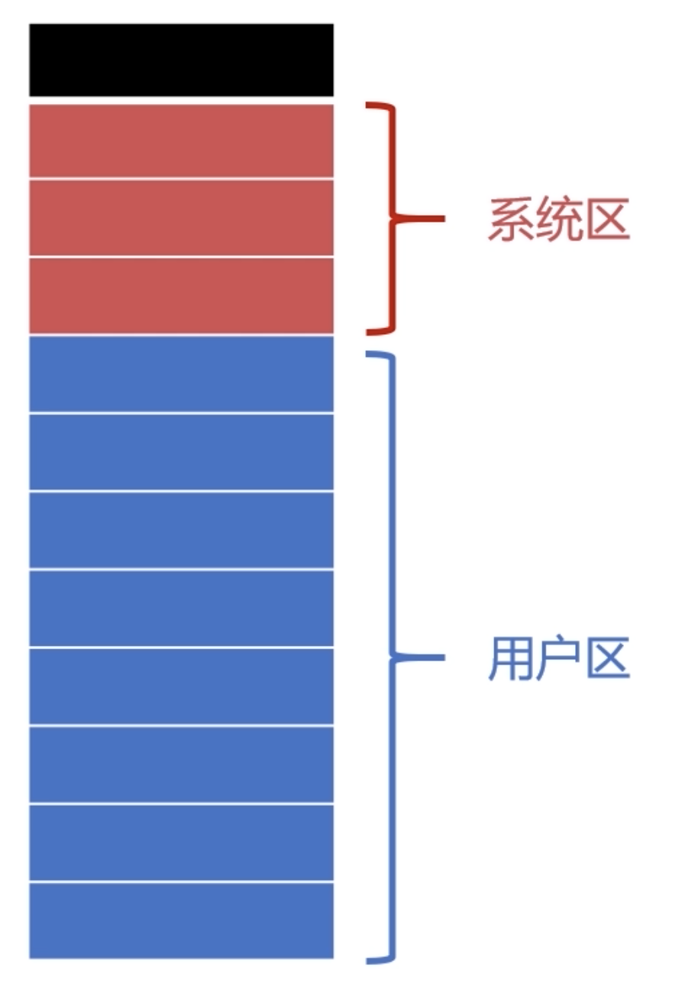

# 内存分配与回收

早期计算机编程并不需要过多的储存管理，随着计算机和程序越来越复杂，储存管理成为必要

- 确保计算机有足够的内存处理数据
- 确保程序可以从可用内存中获取一部分内存使用
- 确保程序可以归还使用后的内存以供其他程序使用

## 内存分配的过程

### 单一连续分配

- 单一连续分配是最简单的内存分配方式
- 只能在单用户、单进程的操作系统中使用

### 固定分区分配

- 固定分区分配是支持多道程序的最简单存储分配方式
- 内存空间被划分为若干个固定大小的区域
- 每个分区只提供给一个程序使用，互不干扰

### 动态分区分配

- 根据进程实际需要，动态分配内存空间

#### 相关数据结构和分配算法

##### 动态分区空闲表数据结构

- 0：未使用，1：使用

##### 动态分区空闲链数据结构

- 节点需要记录可储存的容量
- 如果空闲多个节点在物理上紧挨着可以合并成一个节点，减少节点数量

##### 动态分区分配算法

## 内存回收的过程