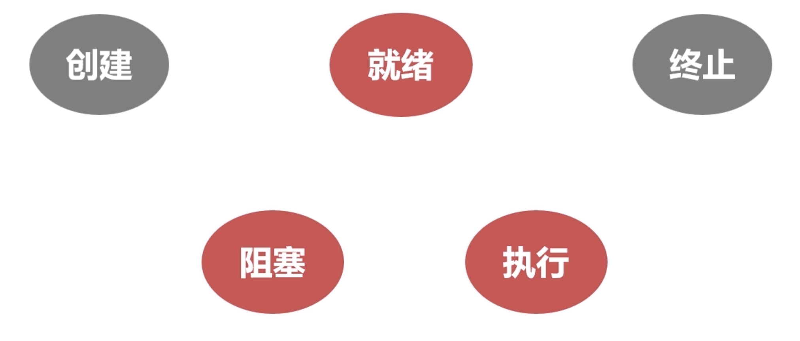
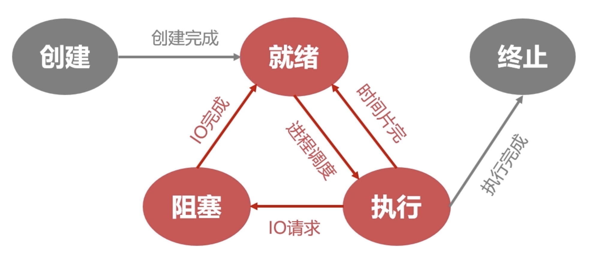
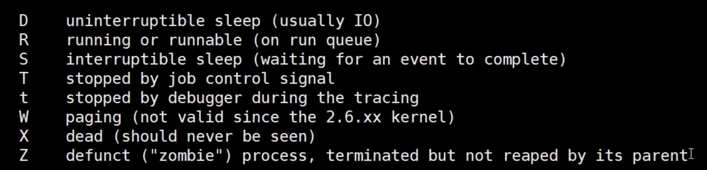
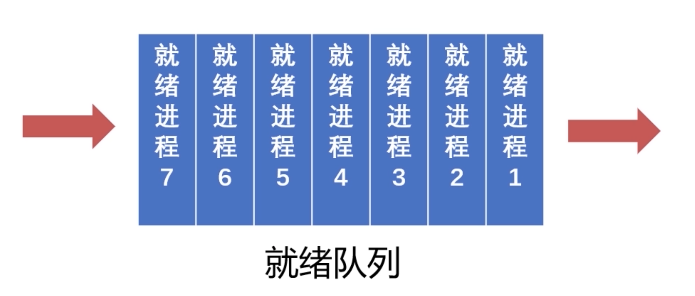
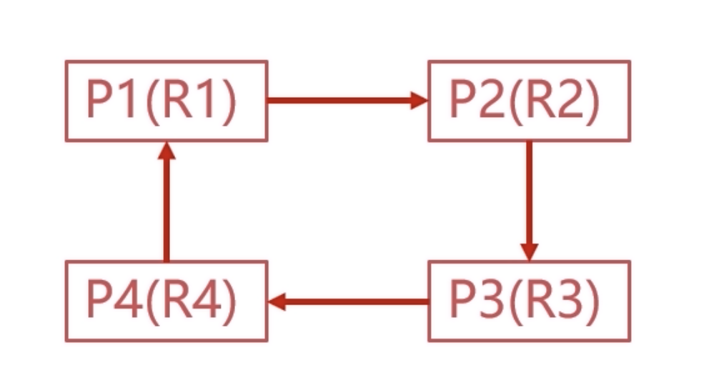
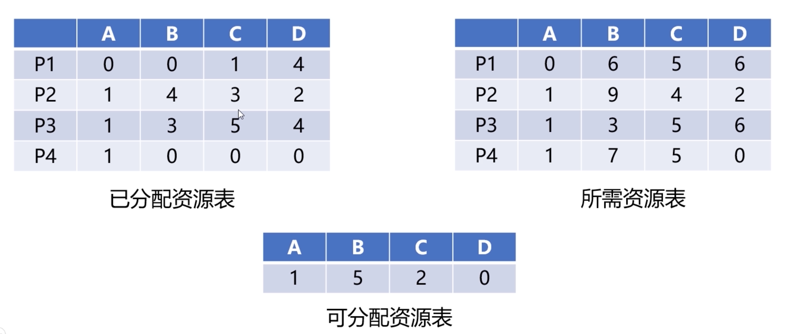
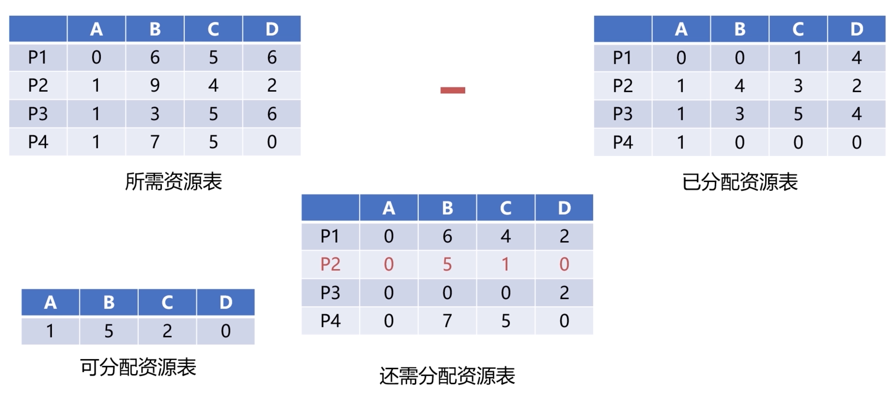

### 进程管理之进程实体

## 为什么需要进程

- 在没有配置 OS 之前，资源属于当前运行的程序
- 配置 OS 后，引入多道程序设计的概念
- 合理的隔离资源，运行环境，提升资源利用率 
- 进程是系统进行资源分配和调度的基本方案
- 进程作为程序独立运行的载体保障程序正常执行
- 进程的存在是的操作系统资源的利用率大幅提升

## 进程的实体

### 主存中的进程形态

### 相关信息

#### 标识符

标识符唯一标记一个进程，用于区别别的进程

#### 状态

标记进程的进程状态，如：运行态、阻塞态等

#### 程序计数器

进程即将被执行的下一条指令的地址

#### 内存指针

程序代码、进程数据相关指针

#### 上下文数据

进程执行时处理器储存的数据

### IO状态信息

被进程 IO 操作所占用的文件列表

#### 记账信息

使用处理器的时间，时钟数总和等

### 相关信息的分类

- 进程标识符
- 处理机状态
- 进程调度信息
- 进程控制信息

### 进程控制块（PCB）

- 用于描述和控制进程运行的通用数据结构
- 记录进程当前状态和控制进程运行的全部信息
-  PCB 使得进程时能够独立运行的基本单位
- PCB 是操作系统进行调度经常会被读取的信息
- PCB 是常驻在内存的，存放在系统专门开辟的 PCB 区域中

## 进程与线程

- 进程（Process）
- 线程（Thread）

一个进程可以有一个或多个线程

- 线程是操作系统进行运行调度的最小单位
- 包含在进程之中，是进程中实际运行工作的基本单位
- 一个进程可以并发多个线程，每个线程执行不同的任务

 进程的线程共享进程资源

|          |        进程        |         线程         |
| :------: | :----------------: | :------------------: |
|   资源   | 资源分配的基本单位 |      不拥有资源      |
|   调度   | 独立调度的基本单位 |  独立调度的最小单位  |
| 系统开销 |   进程系统开销大   |    进程系统开销小    |
|   通信   |      进程IPC       | 读写同一进程数据通信 |

# 进程管理之五状态模型

## 进程的五状态模型

### 就绪状态

- 当进程分配到除CPU以外所有的必要资源后
- 只要再获得CPU的使用权，就可以立即运行
- 其他资源都准备好，只差CPU资源的状态叫做**就绪状态**
- 在一个系统中多个处于就绪状态的进程通常排成一个队列

### 执行状态

- 进程获得CPU，其程序正在执行称为执行状态
- 在单核机器上，某个时刻只能有一个程序处于执行状态

### 阻塞状态

- 进程由于某种原因如：某些设备未就绪而无法继续执行
- 而放弃CPU的状态叫做阻塞状态
- 在一个系统中多个处于阻塞状态的进程排成一个队列

### 创建状态

- 创建进程时拥有 PCB 但**其他资源尚未就绪的**状态称为创建状态

### 归还状态

## 进程管理之进程同步

### 进程间的同步

- 生产者与消费者问题
- 哲学家就餐问题

上面的问题在于：相互彼此之间没有通信

#### 为什么需要进程间同步

同步就是多线程在对竞争资源的操作时进行协调，使得并发执行的多个进程之间可以有效的利用资源和相互协作

临界资源是指一些虽然作为共享资源但是无法被多个线程共同操作的共享资源，当有进程在使用临界资源时，其他进程必须依据操作系统的同步机制等待占用线程释放共享资源才可以重新竞争使用共享资源。

#### 进程间同步的原则

空闲让进：资源无占用，允许使用

忙则等待：资源有占用，请求进程等待

有限等待：保证有限等待时间能够使用资源

让权等待：等待时，进程需要让出CPU

#### 进程之间同步的方法

- 消息队列
- 共享储存
- 信号量

#### 线程同步

- 互斥量
- 读写锁
- 自旋锁
- 条件变量

# Linux的进程管理

## Linux进程的相关概念

### 进程的类型

#### 前台进程

- 前台进程就是具有终端，可以和用户交互的进程

#### 后台进程

- 后台进程基本不与用户交互，优先级比前台进程低

#### 守护进程

- 守护（daemon）进程是特殊的后台进程
- 很多守护进程在系统引导的时候启动，一只运行到系统关闭
- Linux有很多典型的守护程序
- 进程名字后面以 d 结尾的通常就是守护进程

### 进程的标记

####  进程ID

- 进程ID是进程的唯一标记，每个进程都拥有不同的ID
- 进程的ID表现为一个非负整数，最大值由操作系统指定

- 父子进程可以通过 `pstree` 命令来查看
- ID 为0的进程为 idle 进程，是系统创建的第一个进程
- ID 为1的进程为 init 进程，是0号进程的子进程，用于完成系统初始化，init 进程是所有用户进程的祖先进程

#### 进程状态标记

| 状态符号 |                           状态说明                           |
| :------: | :----------------------------------------------------------: |
|    R     |              （TASK_RUNNING）进程正处于运行状态              |
|    S     |            （TASK_INTERRUPTIBLE）进程处于睡眠状态            |
|    D     |     （TASK_UNINTERRUPTIBLE）进程正在处于IO等待的睡眠状态     |
|    T     |               （TASK_STOPPED）进程处于暂停状态               |
|    Z     | （TASK_DEAD or EXIT_ZOMBIE）进程正在处于退出状态或者僵尸状态 |

### 操作Linux进程的相关命令

#### ps

- ps命令常用于显示当前进程的状态
- ps命令常配合 -aux -ef 和 grep 命令检索特定进程

#### top

- 查看进程占用资源情况

#### kill

- kill命令可以发送指定信号给进程
- kill -l 可以查看操作系统支持的型号
- 只有 （SIGKILL 9）信号可以无条件终止进程，其他信号进程有权忽略

# 作业管理之进程调度

## 进程的调度

### 进程调度概述

进程调度是指计算机通过算法决策决定那个就绪进程可以获得CPU使用权

- 保留旧进程的运行信息，请出旧进程（收拾包袱）
- 选择新线程，准备运行环境并分配CPU（新入驻）

### 进程调度的机制

### 就绪队列的排队机制

将就绪进程按照一定方式排成队列，以便调度程序可以最快的找到就绪程序

#### 选择运行进程的委派机制

调度程序以一定的策略选择就绪程序，将CPU资源分配给它

#### 新老进程的上下文切换

保存当前进程的上下文信息，装入被委派执行进程的运行上下文

 

#### 抢占式调度

- 允许调度程序以一定的策略暂停当前运行的进程
- 保存好旧进程的上下文信息，分配处理器给新进程 

#### 非抢占式调度

- 处理器一旦分配给某个进程，就让该进程一只使用下去
- 调度程序不会以任何原因抢占当前正在被使用的处理器
- 直到进程完成工作前或因为IO阻塞才会让出处理器

|          | 抢占式调度       | 非抢占式调度       |
| -------- | ---------------- | ------------------ |
| 系统开销 | 频繁切换，开销大 | 切换次数少，开销小 |
| 公平性   | 相对公平         | 不公平             |
| 应用     | 通用系统         | 专用系统           |

### 进程调度算法

#### 先来先服务调度算法

- 用队列维护，先到先得

#### 短进程优先调度算法

- 优先选择占用CPU时间尽可能短的进程

#### 高优先权优先调度算法

- 维护优先队列，选择优先权高的进程

#### 时间片轮转调度算法

- 是先来先服务调度算法的改进版
- 对每个进程分配一个时间片，时间耗尽就将程序放到队尾
- 但是这个可能会导致用户响应不及时

# 作业管理之死锁

死锁是指两个或两个以上的进程在执行过程中，由于竞争资源或者由于彼此通信而造成的一种阻塞的现象，若无外力作用，它们都无法推进下去。此时称系统处于死锁状态或者系统产生了死锁，这些永远互相等待的进程称为死锁进程。

## 死锁的产生

### 竞争资源

- 共享资源数量不满足各进程需求

- 各个进程之间发生资源竞争导致死锁

### 进程调度顺序不当

- 调度顺序出出现冲突

### 死锁产生的四个必要条件

#### 互斥条件

- 进程对共享资源的使用是排他的（同时只能有一个进程操作）
- 其他进程需要使用时只能进行等待

#### 请求保持条件

- 进程至少保持一个资源，又提出新的资源请求
- 新的资源被占用，请求被阻塞
- 被阻塞的进程不释放自己持有的资源

#### 不可剥夺条件

- 进程获得的资源在未使用完成前不能被别的线程抢去
- 获得的资源只能有持有进程释放

#### 环路等待条件

- 发生死锁时，必然存在进程-资源环形链

	

## 死锁的处理

### 预防死锁的方法

- 只需要破坏上面所说的死锁产生的四个必要条件中的一个或者多个条件，死锁就不会产生

#### 破坏请求保持条件

- 系统规定运行进程之前，一次性申请所有需要的资源
- 进程在运行期间不会提出资源请求，从而破坏请求保持条件

#### 破坏不可剥夺条件

- 当一个进程请求新的资源得不到满足时，必须释放占有的资源
- 程序运行时占有的资源可以释放，意味着可以剥夺

#### 破坏环路等待条件

- 可用资源线性排列，申请必须按照需要递增申请
- 线性申请不再构成环路，从而破坏环路等待条件	

### 银行家算法

- 是一个可操作的著名的避免死锁的算法
- 以银行借贷系统分配策略为基础的算法

#### 算法思想

- 客户申请的贷款是有限的，每次申请必须声明最大资金量
- 银行家在满足贷款的时候，都应该给用户贷款
- 用户在使用完贷款后，能及时的归还贷款

#### 具体实现

- 底层有三个数据结构

	- 已分配资源表，行代表当前的资源，列代表申请资源的线程，数字就是每个进程当前拥有的资源
	- 所需资源表，行代表当前的资源，列代表申请资源的线程，数字就是每个进程所需要的资源
	- 可分配资源表，数字就是当前可分配的资源

	

- 将已分配资源表 - 所需资源表，得到还需分配资源表，将数据与可分配资源表进行对比，得到符合的进程，直到没有线程需要资源

	

