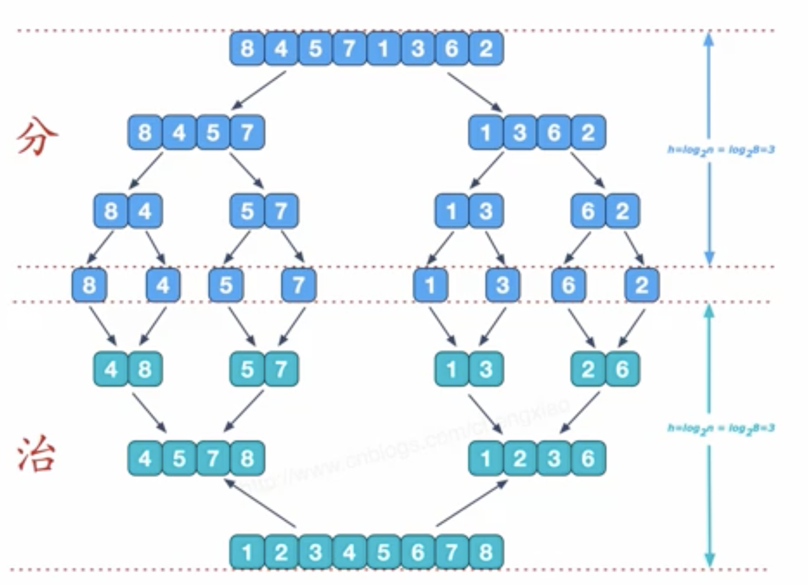

# 认识时间复杂度
常数时间的操作 一个操作如果和样本的数据量没有关系，每次都是固定时间内完成的操作，叫做常数操作。

时间复杂度为一个算法流程中，常数操作数量的一个指标。常用O(读作big O)来表示。具体来说，先要对一个算法流程非常熟悉，然后去写出这个算法流程中，发生了多少常数操作， 进而总结出常数操作数量的表达式。

在表达式中，只要高阶项，不要低阶项，也不要高阶项的系数，剩下的部分如果为f(N)，那 么时间复杂度为$O(f(N))$。

评价一个算法流程的好坏，先看时间复杂度的指标，然后再分析不同数据样本下的实际运行 时间，也就是“常数项时间”。

# 对数器的概念和使用（用于比赛和面试）

1. 有一个你想要测的方法
2. 实现一个绝对正确但是复杂度不好的方法
3. 实现一个随机样本产生器
4. 实现比对的方法
5. 把方法a和方法b比对很多次来验证方法a是否正确
6. 如果有一个样本使得比对出错，打印样本分析是哪个方法出错
7. 当样本数量很多时比对测试依然正确，可以确定方法a已经正确

# 冒泡排序细节的讲解与复杂度分析

时间复杂度  $O(N^2)$​  额外空间复杂度  $O(1)$​

```java
package class01;

import java.util.Arrays;

public class Code02_BubbleSort {

    public static void bubbleSort(int[] arr) {
        if (arr == null || arr.length < 2) {
            return;
        }
        for (int e = arr.length - 1; e > 0; e--) {
            for (int i = 0; i < e; i++) {
                if (arr[i] > arr[i + 1]) {
                    swap(arr, i, i + 1);
                }
            }
        }
    }

    public static void swap(int[] arr, int i, int j) {
        arr[i] = arr[i] ^ arr[j];
        arr[j] = arr[i] ^ arr[j];
        arr[i] = arr[i] ^ arr[j];
    }

    // for test
    public static void comparator(int[] arr) {
        Arrays.sort(arr);
    }

    // for test
    public static int[] generateRandomArray(int maxSize, int maxValue) {
        int[] arr = new int[(int) ((maxSize + 1) * Math.random())];
        for (int i = 0; i < arr.length; i++) {
            arr[i] = (int) ((maxValue + 1) * Math.random()) - (int) (maxValue * Math.random());
        }
        return arr;
    }

    // for test
    public static int[] copyArray(int[] arr) {
        if (arr == null) {
            return null;
        }
        int[] res = new int[arr.length];
        for (int i = 0; i < arr.length; i++) {
            res[i] = arr[i];
        }
        return res;
    }

    // for test
    public static boolean isEqual(int[] arr1, int[] arr2) {
        if ((arr1 == null && arr2 != null) || (arr1 != null && arr2 == null)) {
            return false;
        }
        if (arr1 == null && arr2 == null) {
            return true;
        }
        if (arr1.length != arr2.length) {
            return false;
        }
        for (int i = 0; i < arr1.length; i++) {
            if (arr1[i] != arr2[i]) {
                return false;
            }
        }
        return true;
    }

    // for test
    public static void printArray(int[] arr) {
        if (arr == null) {
            return;
        }
        for (int i = 0; i < arr.length; i++) {
            System.out.print(arr[i] + " ");
        }
        System.out.println();
    }

    // for test
    public static void main(String[] args) {
        int testTime = 500000;
        int maxSize = 100;
        int maxValue = 100;
        boolean succeed = true;
        for (int i = 0; i < testTime; i++) {
            int[] arr1 = generateRandomArray(maxSize, maxValue);
            int[] arr2 = copyArray(arr1);
            bubbleSort(arr1);
            comparator(arr2);
            if (!isEqual(arr1, arr2)) {
                succeed = false;
                break;
            }
        }
        System.out.println(succeed ? "Nice!" : "Fucking fucked!");

        int[] arr = generateRandomArray(maxSize, maxValue);
        printArray(arr);
        bubbleSort(arr);
        printArray(arr);
    }

}

```

# 选择排序的细节讲解与复杂度分析

时间复杂度  $O(N^2)$​​  额外空间复杂度  $O(1)$​​

```java
package class01;

import java.util.Arrays;

public class Code01_SelectionSort {

    public static void selectionSort(int[] arr) {
        if (arr == null || arr.length < 2) {
            return;
        }
        for (int i = 0; i < arr.length - 1; i++) {
            int minIndex = i;
            for (int j = i + 1; j < arr.length; j++) {
                minIndex = arr[j] < arr[minIndex] ? j : minIndex;
            }
            swap(arr, i, minIndex);
        }
    }

    public static void swap(int[] arr, int i, int j) {
        int tmp = arr[i];
        arr[i] = arr[j];
        arr[j] = tmp;
    }

    // for test
    public static void comparator(int[] arr) {
        Arrays.sort(arr);
    }

    // for test
    public static int[] generateRandomArray(int maxSize, int maxValue) {
        int[] arr = new int[(int) ((maxSize + 1) * Math.random())];
        for (int i = 0; i < arr.length; i++) {
            arr[i] = (int) ((maxValue + 1) * Math.random()) - (int) (maxValue * Math.random());
        }
        return arr;
    }

    // for test
    public static int[] copyArray(int[] arr) {
        if (arr == null) {
            return null;
        }
        int[] res = new int[arr.length];
        for (int i = 0; i < arr.length; i++) {
            res[i] = arr[i];
        }
        return res;
    }

    // for test
    public static boolean isEqual(int[] arr1, int[] arr2) {
        if ((arr1 == null && arr2 != null) || (arr1 != null && arr2 == null)) {
            return false;
        }
        if (arr1 == null && arr2 == null) {
            return true;
        }
        if (arr1.length != arr2.length) {
            return false;
        }
        for (int i = 0; i < arr1.length; i++) {
            if (arr1[i] != arr2[i]) {
                return false;
            }
        }
        return true;
    }

    // for test
    public static void printArray(int[] arr) {
        if (arr == null) {
            return;
        }
        for (int i = 0; i < arr.length; i++) {
            System.out.print(arr[i] + " ");
        }
        System.out.println();
    }

    // for test
    public static void main(String[] args) {
        int testTime = 500000;
        int maxSize = 100;
        int maxValue = 100;
        boolean succeed = true;
        for (int i = 0; i < testTime; i++) {
            int[] arr1 = generateRandomArray(maxSize, maxValue);
            int[] arr2 = copyArray(arr1);
            selectionSort(arr1);
            comparator(arr2);
            if (!isEqual(arr1, arr2)) {
                succeed = false;
                printArray(arr1);
                printArray(arr2);
                break;
            }
        }
        System.out.println(succeed ? "Nice!" : "Fucking fucked!");

        int[] arr = generateRandomArray(maxSize, maxValue);
        printArray(arr);
        selectionSort(arr);
        printArray(arr);
    }

}

```

# 插入排序的细节讲解与复杂度分析 

时间复杂度  $O(N^2)$​  额外空间复杂度  $O(1)$​

```java
package class01;

import java.util.Arrays;

public class Code03_InsertionSort {

    public static void insertionSort(int[] arr) {
        if (arr == null || arr.length < 2) {
            return;
        }
        for (int i = 1; i < arr.length; i++) {
            for (int j = i - 1; j >= 0 && arr[j] > arr[j + 1]; j--) {
                swap(arr, j, j + 1);
            }
        }
    }

    public static void swap(int[] arr, int i, int j) {
        arr[i] = arr[i] ^ arr[j];
        arr[j] = arr[i] ^ arr[j];
        arr[i] = arr[i] ^ arr[j];
    }


}

```

# 二分法的详解与扩展 

- 在一个有序数组中，找某个数是否存在 

- 在一个有序数组中，找>=某个数最左侧的位置 

- 局部最小值问题

```java
package class01;

public class Code04_BSExist {

    public static boolean exist(int[] sortedArr, int num) {
        if (sortedArr == null || sortedArr.length == 0) {
            return false;
        }
        int L = 0;
        int R = sortedArr.length - 1;
        int mid = 0;
        while (L < R) {
            mid = L + ((R - L) >> 1);
            if (sortedArr[mid] == num) {
                return true;
            } else if (sortedArr[mid] > num) {
                R = mid - 1;
            } else {
                L = mid + 1;
            }
        }
        return sortedArr[L] == num;
    }

}

```

```java
package class01;

public class Code05_BSNearLeft {

    // 在arr上，找满足>=value的最左位置
    public static int nearestIndex(int[] arr, int value) {
        int L = 0;
        int R = arr.length - 1;
        int index = -1;
        while (L < R) {
            int mid = L + ((R - L) >> 1);
            if (arr[mid] >= value) {
                index = mid;
                R = mid - 1;
            } else {
                L = mid + 1;
            }
        }
        return index;
    }

}

```

```java
package class01;

public class Code05_BSNearLeft {

    // 在arr上，找满足>=value的最左位置
    public static int nearestIndex(int[] arr, int value) {
        int L = 0;
        int R = arr.length - 1;
        int index = -1;
        while (L < R) {
            int mid = L + ((R - L) >> 1);
            if (arr[mid] >= value) {
                index = mid;
                R = mid - 1;
            } else {
                L = mid + 1;
            }
        }
        return index;
    }

}

```


# 异或运算的性质与扩展

- $0\wedge N == N	 N \wedge N == 0$​
- 相当于无进位二进制数相加
- 异或运算满足交换律和结合率
- 不用额外变量交换两个数
- 一个数组中有一种数出现了奇数次，其他数都出现了偶数次，怎么找到这一个数

- 一个数组中有两种数出现了奇数次，其他数都出现了偶数次，怎么找到这两个数

	```java
	package class01;
	
	public class Code07_EvenTimesOddTimes {
		//一个数组中有一种数出现了奇数次，其他数都出现了偶数次，怎么找到这一个数
		public static void printOddTimesNum1(int[] arr) {
			int eO = 0;
			for (int cur : arr) {
				eO ^= cur;
			}
			System.out.println(eO);
		}
		//一个数组中有两种数出现了奇数次，其他数都出现了偶数次，怎么找到这两个数
		public static void printOddTimesNum2(int[] arr) {
			int eO = 0, eOhasOne = 0;
			for (int curNum : arr) {
				eO ^= curNum;
			}
	      // 取出一个树最右边的一
			int rightOne = eO & (~eO + 1);
			for (int cur : arr) {
				if ((cur & rightOne) != 0) {
					eOhasOne ^= cur;
				}
			}
			System.out.println(eOhasOne + " " + (eO ^ eOhasOne));
		}
	
		public static void main(String[] args) {
			int a = 5;
			int b = 7;
	
			a = a ^ b;
			b = a ^ b;
			a = a ^ b;
	
			System.out.println(a);
			System.out.println(b);
	
			int[] arr1 = { 3, 3, 2, 3, 1, 1, 1, 3, 1, 1, 1 };
			printOddTimesNum1(arr1);
	
			int[] arr2 = { 4, 3, 4, 2, 2, 2, 4, 1, 1, 1, 3, 3, 1, 1, 1, 4, 2, 2 };
			printOddTimesNum2(arr2);
	
		}
	
	}
	
	```

# 剖析递归行为和递归行为时间复杂度的估算

**master公式的使用**

$T(N) = a*T(N/b) + O(N^d)$

1. $log(b,a) > d $   复杂度为  $O(N^log(b,a))$​
2. $log(b,a) = d$   复杂度为  $O(N^d * logN)$ 
3. $log(b,a) < d$   复杂度为  $O(N^d)$

# 归并排序的细节讲解与复杂度分析




时间复杂度  $O(N*logN)$​  额外空间复杂度  $O(N)$​

```java
package basic_class_01;

import java.util.Arrays;

public class Code_05_MergeSort {

    public static void mergeSort(int[] arr) {
        if (arr == null || arr.length < 2) {
            return;
        }
        mergeSort(arr, 0, arr.length - 1);
    }

    public static void mergeSort(int[] arr, int l, int r) {
        if (l == r) {
            return;
        }
        int mid = l + ((r - l) >> 1);
        mergeSort(arr, l, mid);
        mergeSort(arr, mid + 1, r);
        merge(arr, l, mid, r);
    }

    public static void merge(int[] arr, int l, int m, int r) {
        int[] help = new int[r - l + 1];
        int i = 0;
        int p1 = l;
        int p2 = m + 1;
        while (p1 <= m && p2 <= r) {
            help[i++] = arr[p1] < arr[p2] ? arr[p1++] : arr[p2++];
        }
        while (p1 <= m) {
            help[i++] = arr[p1++];
        }
        while (p2 <= r) {
            help[i++] = arr[p2++];
        }
        for (i = 0; i < help.length; i++) {
            arr[l + i] = help[i];
        }
    }

    // for test
    public static void comparator(int[] arr) {
        Arrays.sort(arr);
    }

    // for test
    public static int[] generateRandomArray(int maxSize, int maxValue) {
        int[] arr = new int[(int) ((maxSize + 1) * Math.random())];
        for (int i = 0; i < arr.length; i++) {
            arr[i] = (int) ((maxValue + 1) * Math.random()) - (int) (maxValue * Math.random());
        }
        return arr;
    }

    // for test
    public static int[] copyArray(int[] arr) {
        if (arr == null) {
            return null;
        }
        int[] res = new int[arr.length];
        for (int i = 0; i < arr.length; i++) {
            res[i] = arr[i];
        }
        return res;
    }

    // for test
    public static boolean isEqual(int[] arr1, int[] arr2) {
        if ((arr1 == null && arr2 != null) || (arr1 != null && arr2 == null)) {
            return false;
        }
        if (arr1 == null && arr2 == null) {
            return true;
        }
        if (arr1.length != arr2.length) {
            return false;
        }
        for (int i = 0; i < arr1.length; i++) {
            if (arr1[i] != arr2[i]) {
                return false;
            }
        }
        return true;
    }

    // for test
    public static void printArray(int[] arr) {
        if (arr == null) {
            return;
        }
        for (int i = 0; i < arr.length; i++) {
            System.out.print(arr[i] + " ");
        }
        System.out.println();
    }

    // for test
    public static void main(String[] args) {
        int testTime = 500000;
        int maxSize = 100;
        int maxValue = 100;
        boolean succeed = true;
        for (int i = 0; i < testTime; i++) {
            int[] arr1 = generateRandomArray(maxSize, maxValue);
            int[] arr2 = copyArray(arr1);
            mergeSort(arr1);
            comparator(arr2);
            if (!isEqual(arr1, arr2)) {
                succeed = false;
                printArray(arr1);
                printArray(arr2);
                break;
            }
        }
        System.out.println(succeed ? "Nice!" : "Fucking fucked!");

        int[] arr = generateRandomArray(maxSize, maxValue);
        printArray(arr);
        mergeSort(arr);
        printArray(arr);

    }

}

```

# 小和问题和逆序对问题

**小和问题**

在一个数组中，每一个数左边比当前数小的数累加起来，叫做这个数组的小和。求一个数组的小和。

例子:
 [1,3,4,2,5] 

1左边比1小的数      没有

3左边比3小的数      $1$

4左边比4小的数      $1、3 $

2左边比2小的数      $1$

5左边比5小的数      $1、3、4、2$ 

所以小和为              $1+1+3+1+1+3+4+2=16$​

**逆序对问题** 

在一个数组中，左边的数如果比右边的数大，则折两个数构成一个逆序对，请打印所有逆序对。

```java
package basic_class_01;

public class Code_12_SmallSum {

	public static int smallSum(int[] arr) {
		if (arr == null || arr.length < 2) {
			return 0;
		}
		return mergeSort(arr, 0, arr.length - 1);
	}

	public static int mergeSort(int[] arr, int l, int r) {
		if (l == r) {
			return 0;
		}
		int mid = l + ((r - l) >> 1);
		return mergeSort(arr, l, mid) + mergeSort(arr, mid + 1, r) + merge(arr, l, mid, r);
	}

	public static int merge(int[] arr, int l, int m, int r) {
		int[] help = new int[r - l + 1];
		int i = 0;
		int p1 = l;
		int p2 = m + 1;
		int res = 0;
		while (p1 <= m && p2 <= r) {
			res += arr[p1] < arr[p2] ? (r - p2 + 1) * arr[p1] : 0;
			help[i++] = arr[p1] < arr[p2] ? arr[p1++] : arr[p2++];
		}
		while (p1 <= m) {
			help[i++] = arr[p1++];
		}
		while (p2 <= r) {
			help[i++] = arr[p2++];
		}
		for (i = 0; i < help.length; i++) {
			arr[l + i] = help[i];
		}
		return res;
	}

	// for test
	public static int comparator(int[] arr) {
		if (arr == null || arr.length < 2) {
			return 0;
		}
		int res = 0;
		for (int i = 1; i < arr.length; i++) {
			for (int j = 0; j < i; j++) {
				res += arr[j] < arr[i] ? arr[j] : 0;
			}
		}
		return res;
	}

	// for test
	public static int[] generateRandomArray(int maxSize, int maxValue) {
		int[] arr = new int[(int) ((maxSize + 1) * Math.random())];
		for (int i = 0; i < arr.length; i++) {
			arr[i] = (int) ((maxValue + 1) * Math.random()) - (int) (maxValue * Math.random());
		}
		return arr;
	}

	// for test
	public static int[] copyArray(int[] arr) {
		if (arr == null) {
			return null;
		}
		int[] res = new int[arr.length];
		for (int i = 0; i < arr.length; i++) {
			res[i] = arr[i];
		}
		return res;
	}

	// for test
	public static boolean isEqual(int[] arr1, int[] arr2) {
		if ((arr1 == null && arr2 != null) || (arr1 != null && arr2 == null)) {
			return false;
		}
		if (arr1 == null && arr2 == null) {
			return true;
		}
		if (arr1.length != arr2.length) {
			return false;
		}
		for (int i = 0; i < arr1.length; i++) {
			if (arr1[i] != arr2[i]) {
				return false;
			}
		}
		return true;
	}

	// for test
	public static void printArray(int[] arr) {
		if (arr == null) {
			return;
		}
		for (int i = 0; i < arr.length; i++) {
			System.out.print(arr[i] + " ");
		}
		System.out.println();
	}

	// for test
	public static void main(String[] args) {
		int testTime = 500000;
		int maxSize = 100;
		int maxValue = 100;
		boolean succeed = true;
		for (int i = 0; i < testTime; i++) {
			int[] arr1 = generateRandomArray(maxSize, maxValue);
			int[] arr2 = copyArray(arr1);
			if (smallSum(arr1) != comparator(arr2)) {
				succeed = false;
				printArray(arr1);
				printArray(arr2);
				break;
			}
		}
		System.out.println(succeed ? "Nice!" : "Fucking fucked!");
	}

}

```

