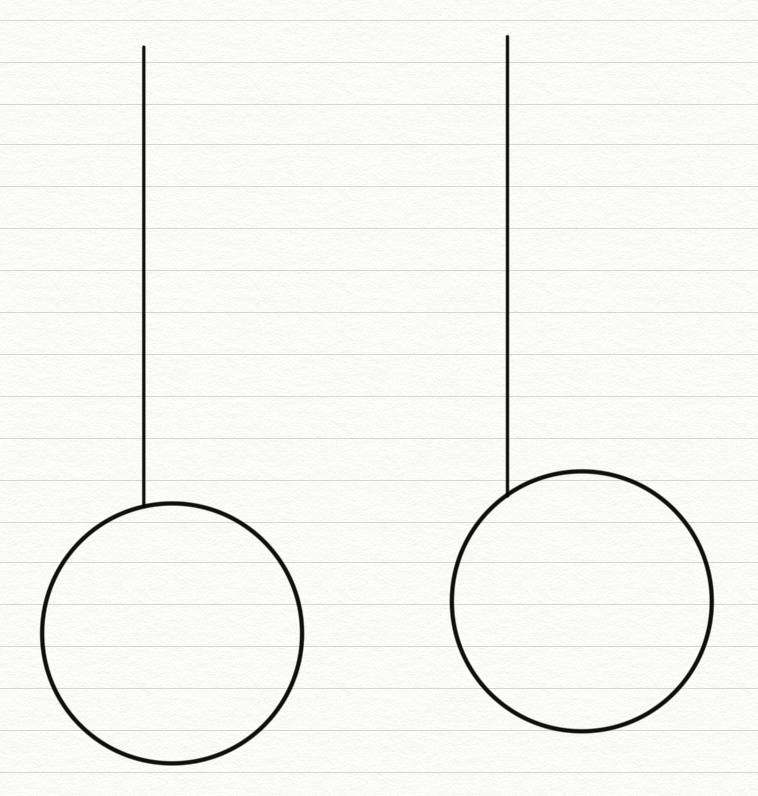
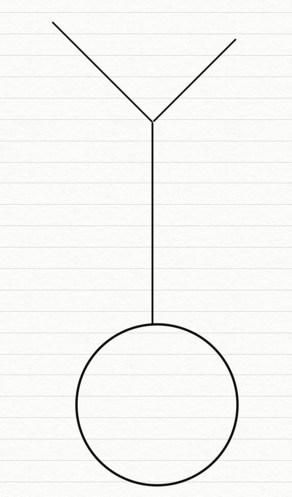
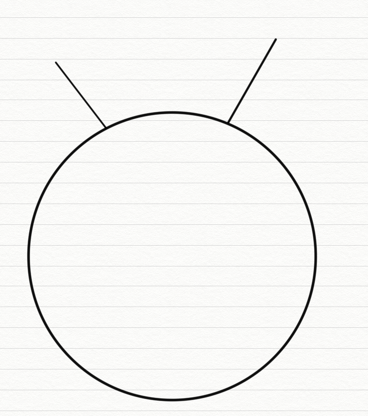

# 哈希表的简单介绍

- 哈希表在使用层面上可以理解为一种集合结构
- 如果只有key，没有伴随数据value，可以使用HashSet结构(C++中叫UnOrderedSet)
- 如果既有key，又有伴随数据value，可以使用HashMap结构(C++中叫UnOrderedMap)
- 有无伴随数据，是HashMap和HashSet唯一的区别，底层的实际结构是一回事
- 使用哈希表增(put)、删(remove)、改(put)和查(get)的操作，可以认为时间复杂度为 O(1)，但是常数时间比较大
- 放入哈希表的东西，如果是基础类型，内部按值传递，内存占用就是这个东西的大小
- 放入哈希表的东西，如果不是基础类型，内部按引用传递，内存占用是这个东西内存地址的大小

# 有序表的简单介绍

- 有序表在使用层面上可以理解为一种集合结构
- 如果只有key，没有伴随数据value，可以使用TreeSet结构(C++中叫OrderedSet)
- 如果既有key，又有伴随数据value，可以使用TreeMap结构(C++中叫OrderedMap)
- 有无伴随数据，是TreeSet和TreeMap唯一的区别，底层的实际结构是一回事
- 有序表和哈希表的区别是，有序表把key按照顺序组织起来，而哈希表完全不组织
- 红黑树、AVL树、size-balance-tree和跳表等都属于有序表结构，只是底层具体实现 不同
- 放入有序表的东西，如果是基础类型，内部按值传递，内存占用就是这个东西的大小
- 放入有序表的东西，如果不是基础类型，必须提供比较器，内部按引用传递，内存占用是这个东西内存地址的大小
- 不管是什么底层具体实现，只要是有序表，都有以下固定的基本功能和固定的时间复杂度

# 有序表的固定操作

```java
void put(K key, V value)   将一个(key，value)记录加入到表中，或者将key的记录 更新成value。
V get(K key)               根据给定的key，查询value并返回。
void remove(K key)         移除key的记录。
boolean containsKey(K key) 询问是否有关于key的记录。
K firstKey()               返回所有键值的排序结果中，最左(最小)的那个。
K lastKey()                返回所有键值的排序结果中，最右(最大)的那个。
K floorKey(K key)          如果表中存入过key，返回key;否则返回所有键值的排序结果中， key的前一个。
K ceilingKey(K key)        如果表中存入过key，返回key;否则返回所有键值的排序结果中， key的后一个。
```

以上所有操作时间复杂度都是 $O(logN)$，$N$ 为有序表含有的记录数

以上所有操作时间复杂度都是 $O(logN)$，$N$​ 为有序表含有的记录数

```java
package class04;

import java.util.Comparator;
import java.util.HashMap;
import java.util.HashSet;
import java.util.TreeMap;
import java.util.TreeSet;

public class Code01_HashAndTree {

    public static class Node {
        public int value;
        public Node next;

        public Node(int val) {
            value = val;
        }
    }

    private static class NodeComparator implements Comparator<Node> {

        @Override
        public int compare(Node o1, Node o2) {
            return o1.value - o2.value;
        }

    }

    public static void main(String[] args) {
        Node nodeA = null;
        Node nodeB = null;
        Node nodeC = null;

        // hashSet1的key是基础类型->int类型
        HashSet<Integer> hashSet1 = new HashSet<>();
        hashSet1.add(3);
        System.out.println(hashSet1.contains(3));
        hashSet1.remove(3);
        System.out.println(hashSet1.contains(3));
        System.out.println("========1=========");

        // hashSet2的key是非基础类型->Node类型
        nodeA = new Node(1);
        nodeB = new Node(1);
        HashSet<Node> hashSet2 = new HashSet<>();
        hashSet2.add(nodeA);
        System.out.println(hashSet2.contains(nodeA));
        System.out.println(hashSet2.contains(nodeB));
        hashSet2.remove(nodeA);
        System.out.println(hashSet2.contains(nodeA));
        System.out.println("========2=========");

        // hashMap1的key是基础类型->String类型
        HashMap<String, Integer> hashMap1 = new HashMap<>();
        String str1 = "key";
        String str2 = "key";
        hashMap1.put(str1, 1);
        System.out.println(hashMap1.containsKey(str1));
        System.out.println(hashMap1.containsKey(str2));
        System.out.println(hashMap1.get(str1));
        System.out.println(hashMap1.get(str2));

        hashMap1.put(str2, 2);
        System.out.println(hashMap1.containsKey(str1));
        System.out.println(hashMap1.containsKey(str2));
        System.out.println(hashMap1.get(str1));
        System.out.println(hashMap1.get(str2));

        hashMap1.remove(str1);
        System.out.println(hashMap1.containsKey(str1));
        System.out.println(hashMap1.containsKey(str2));
        System.out.println("========3=========");

        // hashMap2的key是非基础类型->Node类型
        nodeA = new Node(1);
        nodeB = new Node(1);
        HashMap<Node, String> hashMap2 = new HashMap<>();
        hashMap2.put(nodeA, "A节点");
        System.out.println(hashMap2.containsKey(nodeA));
        System.out.println(hashMap2.containsKey(nodeB));
        System.out.println(hashMap2.get(nodeA));
        System.out.println(hashMap2.get(nodeB));
        hashMap2.put(nodeB, "B节点");
        System.out.println(hashMap2.containsKey(nodeA));
        System.out.println(hashMap2.containsKey(nodeB));
        System.out.println(hashMap2.get(nodeA));
        System.out.println(hashMap2.get(nodeB));
        System.out.println("========4=========");

        // treeSet的key是非基础类型->Node类型
        nodeA = new Node(5);
        nodeB = new Node(3);
        nodeC = new Node(7);

        TreeSet<Node> treeSet = new TreeSet<>();
        // 以下的代码会报错，因为没有提供Node类型的比较器
        try {
            treeSet.add(nodeA);
            treeSet.add(nodeB);
            treeSet.add(nodeC);
        } catch (Exception e) {
            System.out.println("错误信息：" + e.getMessage());
        }

        treeSet = new TreeSet<>(new NodeComparator());
        // 以下的代码没问题，因为提供了Node类型的比较器
        try {
            treeSet.add(nodeA);
            treeSet.add(nodeB);
            treeSet.add(nodeC);
            System.out.println("这次节点都加入了");
        } catch (Exception e) {
            System.out.println(e.getMessage());
        }
        System.out.println("========5=========");

        // 展示有序表常用操作
        TreeMap<Integer, String> treeMap1 = new TreeMap<>();
        treeMap1.put(7, "我是7");
        treeMap1.put(5, "我是5");
        treeMap1.put(4, "我是4");
        treeMap1.put(3, "我是3");
        treeMap1.put(9, "我是9");
        treeMap1.put(2, "我是2");
        System.out.println(treeMap1.containsKey(5));
        System.out.println(treeMap1.get(5));
        System.out.println(treeMap1.firstKey() + ", 我最小");
        System.out.println(treeMap1.lastKey() + ", 我最大");
        System.out.println(treeMap1.floorKey(8) + ", 在表中所有<=8的数中，我离8最近");
        System.out.println(treeMap1.ceilingKey(8) + ", 在表中所有>=8的数中，我离8最近");
        System.out.println(treeMap1.floorKey(7) + ", 在表中所有<=7的数中，我离7最近");
        System.out.println(treeMap1.ceilingKey(7) + ", 在表中所有>=7的数中，我离7最近");
        treeMap1.remove(5);
        System.out.println(treeMap1.get(5) + ", 删了就没有了哦");
        System.out.println("========6=========");

    }

}

```

单链表的节点结构

```java
Class Node<V>{
    V value;
	Node next; 
}
```

由以上结构的节点依次连接起来所形成的链叫单链表结构。

双链表的节点结构

```java
Class Node<V>{
   V value;
   Node next;
	Node last; 
}
```

由以上结构的节点依次连接起来所形成的链叫双链表结构。 单链表和双链表结构只需要给定一个头部节点head，就可以找到剩下的所有的节点

# 反转单向和双向链表

**题目**  分别实现反转单向链表和反转双向链表的函数
**要求**  如果链表长度为 $N$，时间复杂度要求为 $O(N)$ ，额外空间复杂度要求为 $O(1)$

```java
package class04;

public class Code02_ReverseList {

    public static class Node {
        public int value;
        public Node next;

        public Node(int data) {
            this.value = data;
        }
    }

    public static Node reverseList(Node head) {
        Node pre = null;
        Node next = null;
        while (head != null) {
            next = head.next;
            head.next = pre;
            pre = head;
            head = next;
        }
        return pre;
    }

    public static class DoubleNode {
        public int value;
        public DoubleNode last;
        public DoubleNode next;

        public DoubleNode(int data) {
            this.value = data;
        }
    }

    public static DoubleNode reverseList(DoubleNode head) {
        DoubleNode pre = null;
        DoubleNode next = null;
        while (head != null) {
            next = head.next;
            head.next = pre;
            head.last = next;
            pre = head;
            head = next;
        }
        return pre;
    }

    public static void printLinkedList(Node head) {
        System.out.print("Linked List: ");
        while (head != null) {
            System.out.print(head.value + " ");
            head = head.next;
        }
        System.out.println();
    }

    public static void printDoubleLinkedList(DoubleNode head) {
        System.out.print("Double Linked List: ");
        DoubleNode end = null;
        while (head != null) {
            System.out.print(head.value + " ");
            end = head;
            head = head.next;
        }
        System.out.print("| ");
        while (end != null) {
            System.out.print(end.value + " ");
            end = end.last;
        }
        System.out.println();
    }

    public static void main(String[] args) {
        Node head1 = new Node(1);
        head1.next = new Node(2);
        head1.next.next = new Node(3);
        printLinkedList(head1);
        head1 = reverseList(head1);
        printLinkedList(head1);

        DoubleNode head2 = new DoubleNode(1);
        head2.next = new DoubleNode(2);
        head2.next.last = head2;
        head2.next.next = new DoubleNode(3);
        head2.next.next.last = head2.next;
        head2.next.next.next = new DoubleNode(4);
        head2.next.next.next.last = head2.next.next;
        printDoubleLinkedList(head2);
        printDoubleLinkedList(reverseList(head2));

    }

}
```

# 打印两个有序链表的公共部分

**题目**  给定两个有序链表的头指针head1和head2，打印两个链表的公共部分。 

**要求**  如果两个链表的长度之和为 $N$​，时间复杂度要求为 $O(N)$，额外空间复杂度要求为 $O(1)$​

```java
package class04;

public class Code03_PrintCommonPart {

    public static class Node {
        public int value;
        public Node next;

        public Node(int data) {
            this.value = data;
        }
    }

    public static void printCommonPart(Node head1, Node head2) {
        System.out.print("Common Part: ");
        while (head1 != null && head2 != null) {
            if (head1.value < head2.value) {
                head1 = head1.next;
            } else if (head1.value > head2.value) {
                head2 = head2.next;
            } else {
                System.out.print(head1.value + " ");
                head1 = head1.next;
                head2 = head2.next;
            }
        }
        System.out.println();
    }

    public static void printLinkedList(Node node) {
        System.out.print("Linked List: ");
        while (node != null) {
            System.out.print(node.value + " ");
            node = node.next;
        }
        System.out.println();
    }

    public static void main(String[] args) {
        Node node1 = new Node(2);
        node1.next = new Node(3);
        node1.next.next = new Node(5);
        node1.next.next.next = new Node(6);

        Node node2 = new Node(1);
        node2.next = new Node(2);
        node2.next.next = new Node(5);
        node2.next.next.next = new Node(7);
        node2.next.next.next.next = new Node(8);

        printLinkedList(node1);
        printLinkedList(node2);
        printCommonPart(node1, node2);

    }

}

```

# 面试时链表解题的方法论

- 对于笔试，不用太在乎空间复杂度，一切为了时间复杂度 

- 对于面试，时间复杂度依然放在第一位，但是一定要找到空间最省的方法

	重要技巧: 

	- 额外数据结构记录(哈希表等)
	- 快慢指针

# 判断一个链表是否为回文结构

**题目** 给定一个单链表的头节点head，请判断该链表是否为回文结构。 

**例子** 

1->2->1，返回true; 

1->2->2->1，返回true;

15->6->15，返回true; 1->2->3，返回false。 

**要求** 如果链表长度为$N$，时间复杂度达到 $O(N)$，额外空间复杂度达到 $O(1)$​​。

```java
package class04;

import java.util.Stack;

public class Code04_IsPalindromeList {

    public static class Node {
        public int value;
        public Node next;

        public Node(int data) {
            this.value = data;
        }
    }

    // need n extra space
    public static boolean isPalindrome1(Node head) {
        Stack<Node> stack = new Stack<Node>();
        Node cur = head;
        while (cur != null) {
            stack.push(cur);
            cur = cur.next;
        }
        while (head != null) {
            if (head.value != stack.pop().value) {
                return false;
            }
            head = head.next;
        }
        return true;
    }

    // need n/2 extra space
    public static boolean isPalindrome2(Node head) {
        if (head == null || head.next == null) {
            return true;
        }
        Node right = head.next;
        Node cur = head;
        while (cur.next != null && cur.next.next != null) {
            right = right.next;
            cur = cur.next.next;
        }
        Stack<Node> stack = new Stack<Node>();
        while (right != null) {
            stack.push(right);
            right = right.next;
        }
        while (!stack.isEmpty()) {
            if (head.value != stack.pop().value) {
                return false;
            }
            head = head.next;
        }
        return true;
    }

    // need O(1) extra space
    public static boolean isPalindrome3(Node head) {
        if (head == null || head.next == null) {
            return true;
        }
        Node n1 = head;
        Node n2 = head;
        while (n2.next != null && n2.next.next != null) { // find mid node
            n1 = n1.next; // n1 -> mid
            n2 = n2.next.next; // n2 -> end
        }
        n2 = n1.next; // n2 -> right part first node
        n1.next = null; // mid.next -> null
        Node n3 = null;
        while (n2 != null) { // right part convert
            n3 = n2.next; // n3 -> save next node
            n2.next = n1; // next of right node convert
            n1 = n2; // n1 move
            n2 = n3; // n2 move
        }
        n3 = n1; // n3 -> save last node
        n2 = head;// n2 -> left first node
        boolean res = true;
        while (n1 != null && n2 != null) { // check palindrome
            if (n1.value != n2.value) {
                res = false;
                break;
            }
            n1 = n1.next; // left to mid
            n2 = n2.next; // right to mid
        }
        n1 = n3.next;
        n3.next = null;
        while (n1 != null) { // recover list
            n2 = n1.next;
            n1.next = n3;
            n3 = n1;
            n1 = n2;
        }
        return res;
    }

    public static void printLinkedList(Node node) {
        System.out.print("Linked List: ");
        while (node != null) {
            System.out.print(node.value + " ");
            node = node.next;
        }
        System.out.println();
    }

    public static void main(String[] args) {

        Node head = null;
        printLinkedList(head);
        System.out.print(isPalindrome1(head) + " | ");
        System.out.print(isPalindrome2(head) + " | ");
        System.out.println(isPalindrome3(head) + " | ");
        printLinkedList(head);
        System.out.println("=========================");

        head = new Node(1);
        printLinkedList(head);
        System.out.print(isPalindrome1(head) + " | ");
        System.out.print(isPalindrome2(head) + " | ");
        System.out.println(isPalindrome3(head) + " | ");
        printLinkedList(head);
        System.out.println("=========================");

        head = new Node(1);
        head.next = new Node(2);
        printLinkedList(head);
        System.out.print(isPalindrome1(head) + " | ");
        System.out.print(isPalindrome2(head) + " | ");
        System.out.println(isPalindrome3(head) + " | ");
        printLinkedList(head);
        System.out.println("=========================");

        head = new Node(1);
        head.next = new Node(1);
        printLinkedList(head);
        System.out.print(isPalindrome1(head) + " | ");
        System.out.print(isPalindrome2(head) + " | ");
        System.out.println(isPalindrome3(head) + " | ");
        printLinkedList(head);
        System.out.println("=========================");

        head = new Node(1);
        head.next = new Node(2);
        head.next.next = new Node(3);
        printLinkedList(head);
        System.out.print(isPalindrome1(head) + " | ");
        System.out.print(isPalindrome2(head) + " | ");
        System.out.println(isPalindrome3(head) + " | ");
        printLinkedList(head);
        System.out.println("=========================");

        head = new Node(1);
        head.next = new Node(2);
        head.next.next = new Node(1);
        printLinkedList(head);
        System.out.print(isPalindrome1(head) + " | ");
        System.out.print(isPalindrome2(head) + " | ");
        System.out.println(isPalindrome3(head) + " | ");
        printLinkedList(head);
        System.out.println("=========================");

        head = new Node(1);
        head.next = new Node(2);
        head.next.next = new Node(3);
        head.next.next.next = new Node(1);
        printLinkedList(head);
        System.out.print(isPalindrome1(head) + " | ");
        System.out.print(isPalindrome2(head) + " | ");
        System.out.println(isPalindrome3(head) + " | ");
        printLinkedList(head);
        System.out.println("=========================");

        head = new Node(1);
        head.next = new Node(2);
        head.next.next = new Node(2);
        head.next.next.next = new Node(1);
        printLinkedList(head);
        System.out.print(isPalindrome1(head) + " | ");
        System.out.print(isPalindrome2(head) + " | ");
        System.out.println(isPalindrome3(head) + " | ");
        printLinkedList(head);
        System.out.println("=========================");

        head = new Node(1);
        head.next = new Node(2);
        head.next.next = new Node(3);
        head.next.next.next = new Node(2);
        head.next.next.next.next = new Node(1);
        printLinkedList(head);
        System.out.print(isPalindrome1(head) + " | ");
        System.out.print(isPalindrome2(head) + " | ");
        System.out.println(isPalindrome3(head) + " | ");
        printLinkedList(head);
        System.out.println("=========================");

    }

}

```

# 将单向链表按某值划分成左边小、中间相等、右边大的形式

**题目** 给定一个单链表的头节点head，节点的值类型是整型，再给定一个整 数pivot。

实现一个调整链表的函数，将链表调整为左部分都是值小于pivot的 节点，中间部分都是值等于pivot的节点，右部分都是值大于pivot的节点。

**进阶** 在实现原问题功能的基础上增加如下的要求 

**要求**

- 调整后所有小于pivot的节点之间的相对顺序和调整前一样
- 调整后所有等于pivot的节点之间的相对顺序和调整前一样
- 调整后所有大于pivot的节点之间的相对顺序和调整前一样
- 时间复杂度请达到 $O(N)$，额外空间复杂度请达到 $O(1)$​。

```java
package class04;

public class Code05_SmallerEqualBigger {

    public static class Node {
        public int value;
        public Node next;

        public Node(int data) {
            this.value = data;
        }
    }

    public static Node listPartition1(Node head, int pivot) {
        if (head == null) {
            return head;
        }
        Node cur = head;
        int i = 0;
        while (cur != null) {
            i++;
            cur = cur.next;
        }
        Node[] nodeArr = new Node[i];
        i = 0;
        cur = head;
        for (i = 0; i != nodeArr.length; i++) {
            nodeArr[i] = cur;
            cur = cur.next;
        }
        arrPartition(nodeArr, pivot);
        for (i = 1; i != nodeArr.length; i++) {
            nodeArr[i - 1].next = nodeArr[i];
        }
        nodeArr[i - 1].next = null;
        return nodeArr[0];
    }

    public static void arrPartition(Node[] nodeArr, int pivot) {
        int small = -1;
        int big = nodeArr.length;
        int index = 0;
        while (index != big) {
            if (nodeArr[index].value < pivot) {
                swap(nodeArr, ++small, index++);
            } else if (nodeArr[index].value == pivot) {
                index++;
            } else {
                swap(nodeArr, --big, index);
            }
        }
    }

    public static void swap(Node[] nodeArr, int a, int b) {
        Node tmp = nodeArr[a];
        nodeArr[a] = nodeArr[b];
        nodeArr[b] = tmp;
    }

    public static Node listPartition2(Node head, int pivot) {
        Node sH = null; // small head
        Node sT = null; // small tail
        Node eH = null; // equal head
        Node eT = null; // equal tail
        Node bH = null; // big head
        Node bT = null; // big tail
        Node next = null; // save next node
        // every node distributed to three lists
        while (head != null) {
            next = head.next;
            head.next = null;
            if (head.value < pivot) {
                if (sH == null) {
                    sH = head;
                    sT = head;
                } else {
                    sT.next = head;
                    sT = head;
                }
            } else if (head.value == pivot) {
                if (eH == null) {
                    eH = head;
                    eT = head;
                } else {
                    eT.next = head;
                    eT = head;
                }
            } else {
                if (bH == null) {
                    bH = head;
                    bT = head;
                } else {
                    bT.next = head;
                    bT = head;
                }
            }
            head = next;
        }
        // small and equal reconnect
        if (sT != null) {
            sT.next = eH;
            eT = eT == null ? sT : eT;
        }
        // all reconnect
        if (eT != null) {
            eT.next = bH;
        }
        return sH != null ? sH : eH != null ? eH : bH;
    }

    public static void printLinkedList(Node node) {
        System.out.print("Linked List: ");
        while (node != null) {
            System.out.print(node.value + " ");
            node = node.next;
        }
        System.out.println();
    }

    public static void main(String[] args) {
        Node head1 = new Node(7);
        head1.next = new Node(9);
        head1.next.next = new Node(1);
        head1.next.next.next = new Node(8);
        head1.next.next.next.next = new Node(5);
        head1.next.next.next.next.next = new Node(2);
        head1.next.next.next.next.next.next = new Node(5);
        printLinkedList(head1);
        // head1 = listPartition1(head1, 4);
        head1 = listPartition2(head1, 5);
        printLinkedList(head1);

    }

}
```

# 复制含有随机指针节点的链表

**题目** 一种特殊的单链表节点类描述如下 

```java
class Node {
    int value;
    Node next;
    Node rand;
    Node(int val) {
    value = val; 
    }
}
```

rand指针是单链表节点结构中新增的指针，rand可能指向链表中的任意一个节点，也可能指向null。

给定一个由Node节点类型组成的无环单链表的头节点 head，请实现一个函数完成这个链表的复制，并返回复制的新链表的头节点。

**要求** 时间复杂度$O(N)$，额外空间复杂度$O(1)$

```java
package class04;

import java.util.HashMap;

public class Code06_CopyListWithRandom {

    public static class Node {
        public int value;
        public Node next;
        public Node rand;

        public Node(int data) {
            this.value = data;
        }
    }

    public static Node copyListWithRand1(Node head) {
        HashMap<Node, Node> map = new HashMap<Node, Node>();
        Node cur = head;
        while (cur != null) {
            map.put(cur, new Node(cur.value));
            cur = cur.next;
        }
        cur = head;
        while (cur != null) {
            map.get(cur).next = map.get(cur.next);
            map.get(cur).rand = map.get(cur.rand);
            cur = cur.next;
        }
        return map.get(head);
    }

    public static Node copyListWithRand2(Node head) {
        if (head == null) {
            return null;
        }
        Node cur = head;
        Node next = null;
        // copy node and link to every node
        while (cur != null) {
            next = cur.next;
            cur.next = new Node(cur.value);
            cur.next.next = next;
            cur = next;
        }
        cur = head;
        Node curCopy = null;
        // set copy node rand
        while (cur != null) {
            next = cur.next.next;
            curCopy = cur.next;
            curCopy.rand = cur.rand != null ? cur.rand.next : null;
            cur = next;
        }
        Node res = head.next;
        cur = head;
        // split
        while (cur != null) {
            next = cur.next.next;
            curCopy = cur.next;
            cur.next = next;
            curCopy.next = next != null ? next.next : null;
            cur = next;
        }
        return res;
    }

    public static void printRandLinkedList(Node head) {
        Node cur = head;
        System.out.print("order: ");
        while (cur != null) {
            System.out.print(cur.value + " ");
            cur = cur.next;
        }
        System.out.println();
        cur = head;
        System.out.print("rand:  ");
        while (cur != null) {
            System.out.print(cur.rand == null ? "- " : cur.rand.value + " ");
            cur = cur.next;
        }
        System.out.println();
    }

    public static void main(String[] args) {
        Node head = null;
        Node res1 = null;
        Node res2 = null;
        printRandLinkedList(head);
        res1 = copyListWithRand1(head);
        printRandLinkedList(res1);
        res2 = copyListWithRand2(head);
        printRandLinkedList(res2);
        printRandLinkedList(head);
        System.out.println("=========================");

        head = new Node(1);
        head.next = new Node(2);
        head.next.next = new Node(3);
        head.next.next.next = new Node(4);
        head.next.next.next.next = new Node(5);
        head.next.next.next.next.next = new Node(6);

        head.rand = head.next.next.next.next.next; // 1 -> 6
        head.next.rand = head.next.next.next.next.next; // 2 -> 6
        head.next.next.rand = head.next.next.next.next; // 3 -> 5
        head.next.next.next.rand = head.next.next; // 4 -> 3
        head.next.next.next.next.rand = null; // 5 -> null
        head.next.next.next.next.next.rand = head.next.next.next; // 6 -> 4

        printRandLinkedList(head);
        res1 = copyListWithRand1(head);
        printRandLinkedList(res1);
        res2 = copyListWithRand2(head);
        printRandLinkedList(res2);
        printRandLinkedList(head);
        System.out.println("=========================");

    }

}

```

# 两个单链表相交的一系列问题

**题目** 给定两个可能有环也可能无环的单链表，头节点head1和head2。

请实现一个函数，如果两个链表相交，请返回相交的 第一个节点。

如果不相交，返回null 

**要求** 如果两个链表长度之和为$N$，时间复杂度请达到$O(N)$，额外空间复杂度 请达到$O(1)$。

首先要判断是否有环，并拿到Loop节点

- 使用Set集合

- 使用快慢指针

	快指针每次走两步，慢指针每次走一步

	如果快指针遇到null，则无环

	如果快指针与慢指针相遇，将快指针放在开头和慢指针一起每次走一步，直到相遇即可取到入环节点

再是判断是否相交，并拿到相交节点

- 当两个都为空

	拿到他们的尾节点和长度

	- 尾节点如果不同

		必定不相交

	- 尾节点相同

		必定相交

		让长的链表先走比短链表长的距离

		两个指针一定会相遇在相交节点

- 当有一个为空

	不可能相交

- 当都不为空

	一共有三种拓扑结构

	- 让其中的一个Loop节点继续向下走如果遇不到另外一个Loop节点则为此结构

		

		

	- 入环节点相同

		

	- 让其中的一个Loop节点继续向下走如果遇到另外一个Loop节点则为此结构

		

```java
package class04;

public class Code07_FindFirstIntersectNode {

    public static class Node {
        public int value;
        public Node next;

        public Node(int data) {
            this.value = data;
        }
    }

    public static Node getIntersectNode(Node head1, Node head2) {
        if (head1 == null || head2 == null) {
            return null;
        }
        Node loop1 = getLoopNode(head1);
        Node loop2 = getLoopNode(head2);
        if (loop1 == null && loop2 == null) {
            return noLoop(head1, head2);
        }
        if (loop1 != null && loop2 != null) {
            return bothLoop(head1, loop1, head2, loop2);
        }
        return null;
    }

    public static Node getLoopNode(Node head) {
        if (head == null || head.next == null || head.next.next == null) {
            return null;
        }
        Node n1 = head.next; // n1 -> slow
        Node n2 = head.next.next; // n2 -> fast
        while (n1 != n2) {
            if (n2.next == null || n2.next.next == null) {
                return null;
            }
            n2 = n2.next.next;
            n1 = n1.next;
        }
        n2 = head; // n2 -> walk again from head
        while (n1 != n2) {
            n1 = n1.next;
            n2 = n2.next;
        }
        return n1;
    }

    public static Node noLoop(Node head1, Node head2) {
        if (head1 == null || head2 == null) {
            return null;
        }
        Node cur1 = head1;
        Node cur2 = head2;
        int n = 0;
        while (cur1.next != null) {
            n++;
            cur1 = cur1.next;
        }
        while (cur2.next != null) {
            n--;
            cur2 = cur2.next;
        }
        if (cur1 != cur2) {
            return null;
        }
        cur1 = n > 0 ? head1 : head2;
        cur2 = cur1 == head1 ? head2 : head1;
        n = Math.abs(n);
        while (n != 0) {
            n--;
            cur1 = cur1.next;
        }
        while (cur1 != cur2) {
            cur1 = cur1.next;
            cur2 = cur2.next;
        }
        return cur1;
    }

    public static Node bothLoop(Node head1, Node loop1, Node head2, Node loop2) {
        Node cur1 = null;
        Node cur2 = null;
        if (loop1 == loop2) {
            cur1 = head1;
            cur2 = head2;
            int n = 0;
            while (cur1 != loop1) {
                n++;
                cur1 = cur1.next;
            }
            while (cur2 != loop2) {
                n--;
                cur2 = cur2.next;
            }
            cur1 = n > 0 ? head1 : head2;
            cur2 = cur1 == head1 ? head2 : head1;
            n = Math.abs(n);
            while (n != 0) {
                n--;
                cur1 = cur1.next;
            }
            while (cur1 != cur2) {
                cur1 = cur1.next;
                cur2 = cur2.next;
            }
            return cur1;
        } else {
            cur1 = loop1.next;
            while (cur1 != loop1) {
                if (cur1 == loop2) {
                    return loop1;
                }
                cur1 = cur1.next;
            }
            return null;
        }
    }

    public static void main(String[] args) {
        // 1->2->3->4->5->6->7->null
        Node head1 = new Node(1);
        head1.next = new Node(2);
        head1.next.next = new Node(3);
        head1.next.next.next = new Node(4);
        head1.next.next.next.next = new Node(5);
        head1.next.next.next.next.next = new Node(6);
        head1.next.next.next.next.next.next = new Node(7);

        // 0->9->8->6->7->null
        Node head2 = new Node(0);
        head2.next = new Node(9);
        head2.next.next = new Node(8);
        head2.next.next.next = head1.next.next.next.next.next; // 8->6
        System.out.println(getIntersectNode(head1, head2).value);

        // 1->2->3->4->5->6->7->4...
        head1 = new Node(1);
        head1.next = new Node(2);
        head1.next.next = new Node(3);
        head1.next.next.next = new Node(4);
        head1.next.next.next.next = new Node(5);
        head1.next.next.next.next.next = new Node(6);
        head1.next.next.next.next.next.next = new Node(7);
        head1.next.next.next.next.next.next = head1.next.next.next; // 7->4

        // 0->9->8->2...
        head2 = new Node(0);
        head2.next = new Node(9);
        head2.next.next = new Node(8);
        head2.next.next.next = head1.next; // 8->2
        System.out.println(getIntersectNode(head1, head2).value);

        // 0->9->8->6->4->5->6..
        head2 = new Node(0);
        head2.next = new Node(9);
        head2.next.next = new Node(8);
        head2.next.next.next = head1.next.next.next.next.next; // 8->6
        System.out.println(getIntersectNode(head1, head2).value);

    }

}

```

# 用数组结构实现大小固定的队列和栈

```java
package class_03;

public class Code_01_Array_To_Stack_Queue {

    public static class ArrayStack {
        private Integer[] arr;
        private Integer size;

        public ArrayStack(int initSize) {
            if (initSize < 0) {
                throw new IllegalArgumentException("The init size is less than 0");
            }
            arr = new Integer[initSize];
            size = 0;
        }

        public Integer peek() {
            if (size == 0) {
                return null;
            }
            return arr[size - 1];
        }

        public void push(int obj) {
            if (size == arr.length) {
                throw new ArrayIndexOutOfBoundsException("The queue is full");
            }
            arr[size++] = obj;
        }

        public Integer pop() {
            if (size == 0) {
                throw new ArrayIndexOutOfBoundsException("The queue is empty");
            }
            return arr[--size];
        }
    }

    public static class ArrayQueue {
        private Integer[] arr;
        private Integer size;
        private Integer first;
        private Integer last;

        public ArrayQueue(int initSize) {
            if (initSize < 0) {
                throw new IllegalArgumentException("The init size is less than 0");
            }
            arr = new Integer[initSize];
            size = 0;
            first = 0;
            last = 0;
        }

        public Integer peek() {
            if (size == 0) {
                return null;
            }
            return arr[first];
        }

        public void push(int obj) {
            if (size == arr.length) {
                throw new ArrayIndexOutOfBoundsException("The queue is full");
            }
            size++;
            arr[last] = obj;
            last = last == arr.length - 1 ? 0 : last + 1;
        }

        public Integer poll() {
            if (size == 0) {
                throw new ArrayIndexOutOfBoundsException("The queue is empty");
            }
            size--;
            int tmp = first;
            first = first == arr.length - 1 ? 0 : first + 1;
            return arr[tmp];
        }
    }

    public static void main(String[] args) {

    }

}

```

# 实现一个特殊的栈，在实现栈的基本功能的基础上，再实现返回栈中最小元素的操作。

要求

- pop、push、getMin操作的时间复杂度都是 $O(1)$ 
- 设计的栈类型可以使用现成的栈结构。

```java
package class_03;

import java.util.Stack;

public class Code_02_GetMinStack {
    public static class MyStack1 {
        private Stack<Integer> stackData;
        private Stack<Integer> stackMin;

        public MyStack1() {
            this.stackData = new Stack<Integer>();
            this.stackMin = new Stack<Integer>();
        }

        public void push(int newNum) {
            if (this.stackMin.isEmpty()) {
                this.stackMin.push(newNum);
            } else if (newNum <= this.getmin()) {
                this.stackMin.push(newNum);
            }
            this.stackData.push(newNum);
        }

        public int pop() {
            if (this.stackData.isEmpty()) {
                throw new RuntimeException("Your stack is empty.");
            }
            int value = this.stackData.pop();
            if (value == this.getmin()) {
                this.stackMin.pop();
            }
            return value;
        }

        public int getmin() {
            if (this.stackMin.isEmpty()) {
                throw new RuntimeException("Your stack is empty.");
            }
            return this.stackMin.peek();
        }
    }

    public static class MyStack2 {
        private Stack<Integer> stackData;
        private Stack<Integer> stackMin;

        public MyStack2() {
            this.stackData = new Stack<Integer>();
            this.stackMin = new Stack<Integer>();
        }

        public void push(int newNum) {
            if (this.stackMin.isEmpty()) {
                this.stackMin.push(newNum);
            } else if (newNum < this.getmin()) {
                this.stackMin.push(newNum);
            } else {
                int newMin = this.stackMin.peek();
                this.stackMin.push(newMin);
            }
            this.stackData.push(newNum);
        }

        public int pop() {
            if (this.stackData.isEmpty()) {
                throw new RuntimeException("Your stack is empty.");
            }
            this.stackMin.pop();
            return this.stackData.pop();
        }

        public int getmin() {
            if (this.stackMin.isEmpty()) {
                throw new RuntimeException("Your stack is empty.");
            }
            return this.stackMin.peek();
        }
    }

    public static void main(String[] args) {
        MyStack1 stack1 = new MyStack1();
        stack1.push(3);
        System.out.println(stack1.getmin());
        stack1.push(4);
        System.out.println(stack1.getmin());
        stack1.push(1);
        System.out.println(stack1.getmin());
        System.out.println(stack1.pop());
        System.out.println(stack1.getmin());

        System.out.println("=============");

        MyStack1 stack2 = new MyStack1();
        stack2.push(3);
        System.out.println(stack2.getmin());
        stack2.push(4);
        System.out.println(stack2.getmin());
        stack2.push(1);
        System.out.println(stack2.getmin());
        System.out.println(stack2.pop());
        System.out.println(stack2.getmin());
    }

}

```

# 如何仅用队列结构实现栈结构?

# 如何仅用栈结构实现队列结构?

```java
package class_03;

import java.util.LinkedList;
import java.util.Queue;
import java.util.Stack;

public class Code_03_StackAndQueueConvert {

    public static class TwoStacksQueue {
        private Stack<Integer> stackPush;
        private Stack<Integer> stackPop;

        public TwoStacksQueue() {
            stackPush = new Stack<Integer>();
            stackPop = new Stack<Integer>();
        }

        public void push(int pushInt) {
            stackPush.push(pushInt);
        }

        public int poll() {
            if (stackPop.empty() && stackPush.empty()) {
                throw new RuntimeException("Queue is empty!");
            } else if (stackPop.empty()) {
                while (!stackPush.empty()) {
                    stackPop.push(stackPush.pop());
                }
            }
            return stackPop.pop();
        }

        public int peek() {
            if (stackPop.empty() && stackPush.empty()) {
                throw new RuntimeException("Queue is empty!");
            } else if (stackPop.empty()) {
                while (!stackPush.empty()) {
                    stackPop.push(stackPush.pop());
                }
            }
            return stackPop.peek();
        }
    }

    public static class TwoQueuesStack {
        private Queue<Integer> queue;
        private Queue<Integer> help;

        public TwoQueuesStack() {
            queue = new LinkedList<Integer>();
            help = new LinkedList<Integer>();
        }

        public void push(int pushInt) {
            queue.add(pushInt);
        }

        public int peek() {
            if (queue.isEmpty()) {
                throw new RuntimeException("Stack is empty!");
            }
            while (queue.size() != 1) {
                help.add(queue.poll());
            }
            int res = queue.poll();
            help.add(res);
            swap();
            return res;
        }

        public int pop() {
            if (queue.isEmpty()) {
                throw new RuntimeException("Stack is empty!");
            }
            while (queue.size() > 1) {
                help.add(queue.poll());
            }
            int res = queue.poll();
            swap();
            return res;
        }

        private void swap() {
            Queue<Integer> tmp = help;
            help = queue;
            queue = tmp;
        }

    }

}

```

