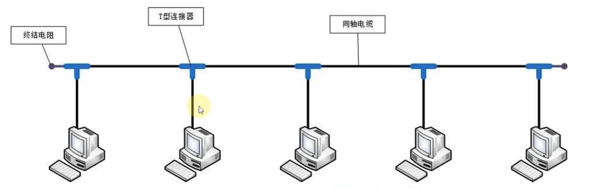
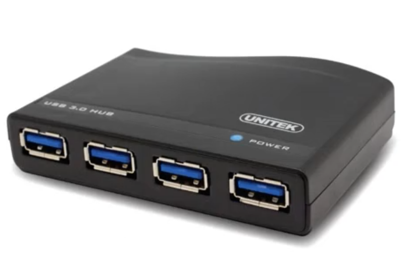
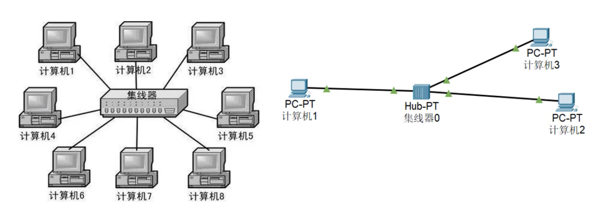
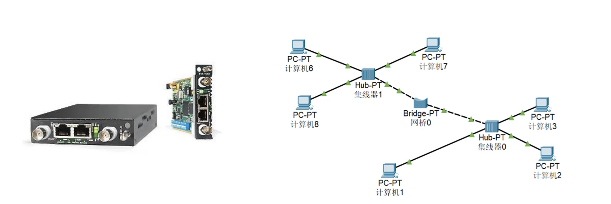
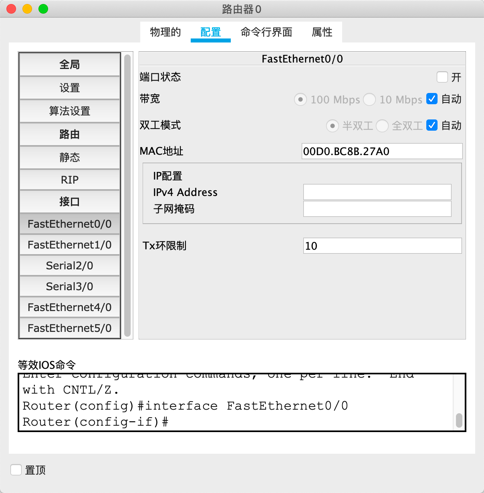
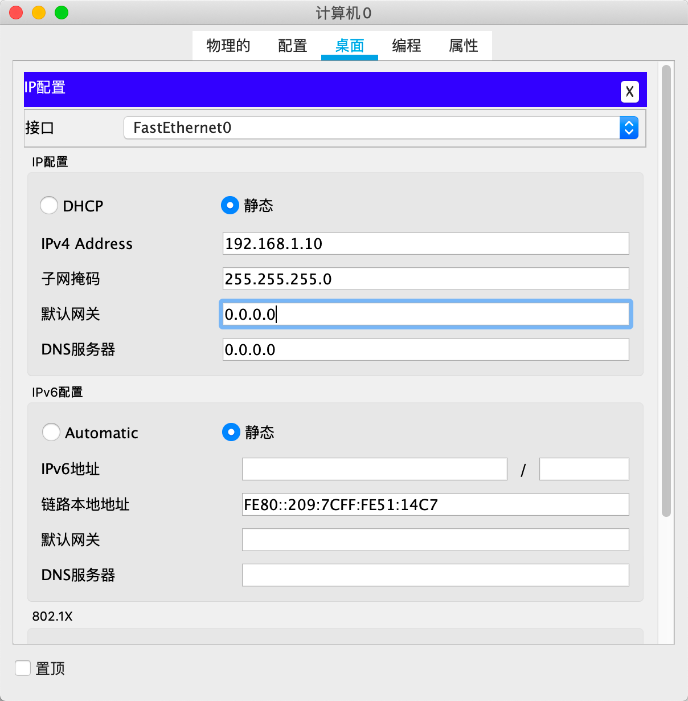
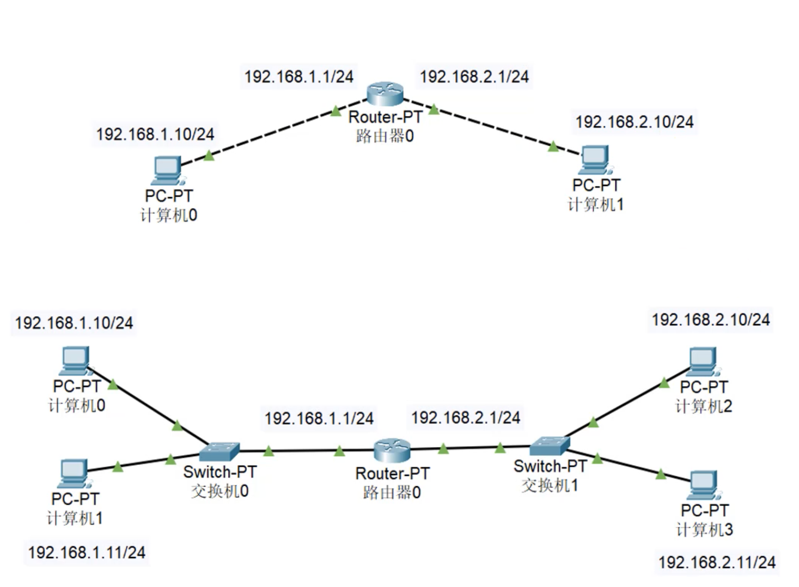

# 计算机网络有关概念

## 计算机之间的通信基础

1. 需要知道对方的 IP 地址

2. 最终是根据 MAC 地址（网卡地址），输送数据到网卡，被网卡接受

	- 如果网卡发现数据的目标 MAC 地址是自己，就会将数据传递到上一层进行处理

	- 如果网卡发现数据的目标 MAC 地址不是自己，就会将数据丢弃，不会将数据传递到上一层进行处理

## 计算机之间的连接方式

1. 直连线，即同一根网线的两端使用同样的线序 ,要么都是568A标准，要么都是568B标准。交叉线，即同一根网线的两段使用不同的线序。一头是568A标准，另外一头是568B标准。（568A标准：绿白，绿，橙白，蓝，蓝白，橙，棕白，棕 ，568B标准：橙白，橙，绿白，蓝，蓝白，绿，棕白，棕）

2. 直通线用来连接电脑和交换机（或HUB），路由器和交换机（或HUB）。
	交叉线用来连接电脑和电脑，路由器和路由器。
3. 同种类型设备之间使用交叉线连接，不同类型设备之间使用直通线连接。（PC因为具有路由功能，属于第三层网络层）

所以需要使用交叉线，（不是直通线）

## 对于Ping过程的解析

每次进行 Ping 的时候，由于不知道目标机器的 MAC 地址，其实消息是发不出去的，所以需要 ARP 协议知道对应 IP 电脑的 MAC 地址，之后再使用 ICMP 协议得到相关信息

ARP 协议就是对同一个网段的计算机进行广播，**获得目标 IP 的 MAC 地址**

## 计算机之间的连接方式

### 同轴电缆（Coaxial）

- 半双工通信
- 容易冲突
- 不安全
- 如果某条线路损坏，整个网络就会瘫痪

### 集线器（Hub）

- 半双工通信
- 容易冲突
- 不安全
- 和同轴电缆一样，没有智商。

### 网桥（Bridge）

- 能够通过自学习得知每个接口那侧的 MAC 地址

	从而起到隔绝冲突域的作用，两个拒绝域可以同时通信

### 交换机（Switch）

组建局域网的最佳方案（同一个网段的解决方案，但是设备过多还是会有问题）

- 相当于接口更多的网桥
- 全双工通信
- 比集线器安全

### 路由器（Router）

- 网线直连、同轴电缆、集线器、网桥、交换机
	- 连接的设备必须在同一个网段
	- 连接的设备还要再同一个广播域
- 路由器
	- 可以在不同网段之间发送数据
	- 隔绝广播域

在主机发数据之前，首先会判断目标主机的 IP 地址是否和它在同一个网段

- 在同一个网段

	通过 ARP 协议，同交换机/集线器传递数据

- 不在同一个网段

	通过路由器转发数据

这就要引出一个概念：网关（Gateway）

路由器不同的网关为不同的局域网进行服务，要跨网段发数据就必须经过路由器的网关

如何配置网关，IPV4写同一网段地址如：192.168.1.1，设置完成后记得打开端口

	

而且还需要设置主机的默认网关，这样就能通过指定的网关跨网段，在跨网段传输信息的时候，我们还是需要使用 ARP 协议，来知道网关的 MAC 地址（在同一个广播域），只有这样才能完成跨网段通信，第一次 ARP 通信完成后，当前主机就知道了路由器网关的 MAC 地址，就这样就可以使用其他协议来通信，发信息到路由器的网关上，但是路由器需要第二次 ARP 通信，来知道另一个网段下的对应 IP 主机的 MAC 地址，就这样双方就建立了联系，就这样就可以 Ping 通了

