# MAC 地址与 IP 地址

## MAC相关知识

- 每一个网卡都有一个6字节（48bit）的MAC 地址（Media Access Control Address）

- 全球唯一，固化在了网卡的 ROM 中，由IEEE802标准规定

	- 前三个字节：OUI（Organizationally Unique Identifier），组织唯一标识符，由IEEE注册管理机构分配给厂商
	- 后三个字节：网络接口标识符，由厂商自行分配

	| 组织唯一标识符 | 网络接口标识符 |
	| :------------: | :------------: |
	|    40-55-82    |    0A-8C-6D    |

	

- Mac 地址表示格式

	- Windows

		40-55-82-0A-8C-6D

	- Mac、Linux、Android、iOS

		40:55:82:0A:8C:6D

	- Packet tracer

		4055.820A.8C6D

- 当48位全为1时，代表广播地址

	FF-FF-FF-FF

- 查看 MAC 地址

	- Windows

		ipconfig /all

	- Mac、Linux

		ifconfig -a

- 可以人为的修改 MAC 地址

	- 可以通过修改 MAC 地址来蹭网

- 当我们不知道 MAC 地址的时候，我们可以发送 ARP 广播获取对方的 MAC 地址

	- 获取成功后，会缓存 IP 地址和 MAC 地址的映射关系，俗称：ARP 缓存
		- 通过 ARP 广播获取的 MAC 地址，属于动态（dynamic）缓存（储存时间比较短，默认是2分钟，过期就自动删除）

- 相关命令

	- arp -a [主机地址] 查询 ARP 缓存
	- arp -d [主机地址] 删除 ARP 缓存
	- arp -s [主机地址] [MAC地址] 增加一条静态缓存信息 

## ARP

- ARP（Address Resolution Protocol），译为：地址解析协议
	- 通过 IP 地址获取 MAC 地址
- RARP（Reverse Address Resolution Protocol），译为：逆地址解析协议
	- 使用与 ARP 相同的报头格式
	- 作用与 ARP 相反，用于将 MAC 地址转换为 IP 地址
	- 后来被 BOOTP、DHCP 所取代

## ICMP

- ICMP（Internet Control Message Protocol），译为：互联网控制消息协议
	- IPV4 中的 ICMP 被称为 ICMPv4，IPV6 中的 ICMP 被称为 ICMPv6
	- 通常用于返回错误信息
		- 比如 TTL值过期，目的不可达

## IP相关知识

- IP地址（Internet Protocol Address），互联网上每一台主机都有一个 IP 地址

	- 最初是 IPV4 版本，32bit（4字节），2019年11月25日，全球的 IP 地址已经用完

	- 后面推出 IPV6 版本，128bit（16字节）

	- 之后笔记中如果不指明版本，默认就是 IPV4 版本，后面单独讨论 IPV6

		

#### IP 地址的组成

- IP 地址由2部分组成

	网络标识（网络ID），我们有时候也叫网段

	主机标识（主机ID）

- 同一网段的计算机，网络ID相同

- 通过子网掩码（subnet mask）可以计算出网络ID = 子网掩码 & IP地址

- 对于知道了主机标识后，可分配的主机ID还要减去两个特殊的ID 0 和 255

- 计算机与其他计算机通信之前，会判断目标主机和自己是否在同一个网段

	- 同一网段：不需要路由器处理
	- 不同网段：交给路由器进行转发

## IP 地址的分类

- A类地址：默认子关掩码为255.0.0.0

	- 网络ID
		- 0不能用，127作为保留网段。其中 127.0.0.1 是本地环回地址（Loopback），代表本机地址
		- 可以分配给主机的第1部分的取值范围为：1 ～ 126
	- 主机ID
		- 第2、3、4部分的取值范围为：0 ～ 255
	- 每个A类网络能容纳的最大主机数是：$256*256*256*256 -2 = 2 ^{24} - 2 = 16777214 $ 台机器

	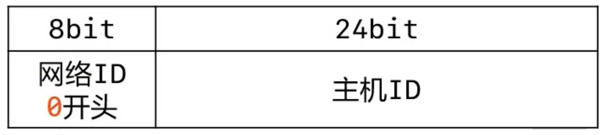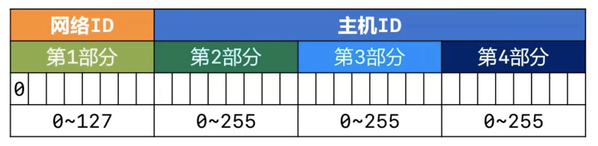

- B类地址：默认子关掩码为255.255.0.0

	- 网络ID
		- 可以分配给主机的第1部分的取值范围为：121 ～ 191
		- 可以分配给主机的第2部分的取值范围为：0 ～ 255
	- 主机ID
		- 第3、4部分的取值范围为：0 ～ 255
	- 每个B类网络能容纳的最大主机数是：$256*256 - 2 = 2 ^{16} - 2 = 65534 $ 台机器

	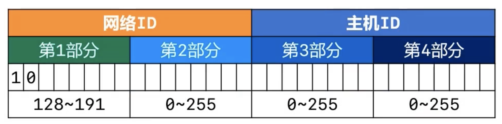

	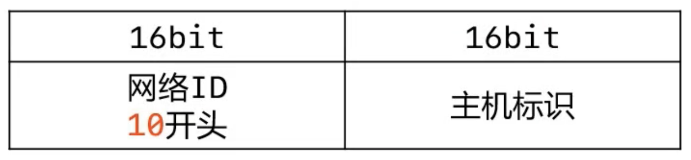

- C类地址：默认子关掩码为255.255.255.0

	- 网络ID
		- 可以分配给主机的第1部分的取值范围为：192 ～ 223
		- 可以分配给主机的第2、3部分的取值范围为：0 ～ 255
	- 主机ID
		- 第4部分的取值范围为：0 ～ 255
	- 每个B类网络能容纳的最大主机数是：$256 - 2 = 254 $ 台机器

	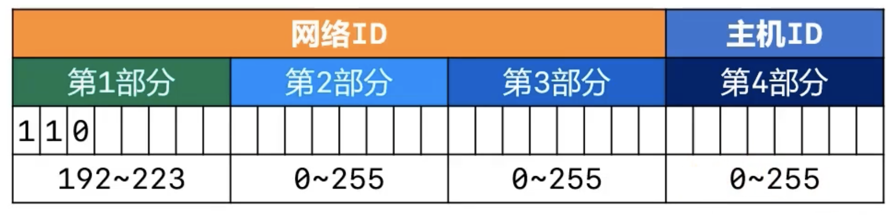

	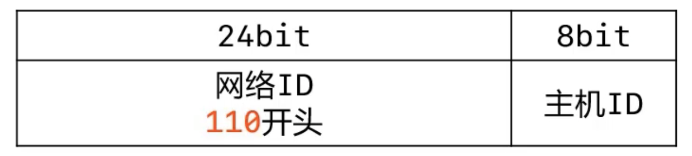

- D类地址：以1110开头，多播（组播）地址

	- 第1部分的取值范围为：224 ～ 239

	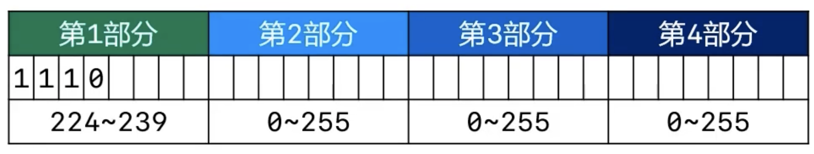

- E类地址：以1111开头，保留为今后使用

	- 第1部分的取值范围为：240 ～ 255

	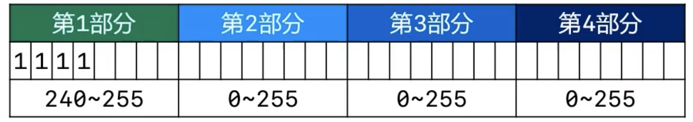

- 只有 A、B、C类地址才能分配个主机使用

- 主机标识全为0，表示主机所在的网段

- 主机标识全为1，表示主机所在网段的全部主机（广播）

	- 可以尝试 Ping 来给某个网段的全部主机发数据

### 子网掩码的CIDR表示方法

- CIRD（Classless Inter-Domain Routing）：无类别域间路由
- 子网掩码的CIDR表示方法
	- 192.168.1.100/24，代表子网掩码有24个1，也就是255.255.255.0
	- 123.210.100.200/16，代表子网掩码有16个1，也就是255.255.0.0

### 为什么要进行子网划分

- 如果需要让200台主机在同一个网段内，可以分配一个C类网段，比如192.168.1.0/24

	- 一共245个空闲的IP地址：191.100.0.1 ～ 191.100.0.254
	- 多出54个空闲的IP地址，这种情况并不算浪费

- 如果需要让500台主机在同一个网段内，可以分配一个B类网段，比如191.100.0.0/16

	- 一共65534个空闲的IP地址：191.100.0.1 ～ 191.100.255.254
	- 多出65034个空闲的IP地址，这种情况属于极大的浪费资源

- 如何避免浪费IP地址资源

	- 进行子网划分

- 子网划分：借用主机位作子网位，划分多个子网

	可分为

	- 等长子网划分

		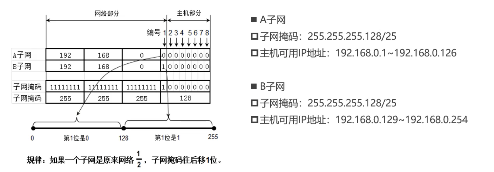

	- 变长子网划分

		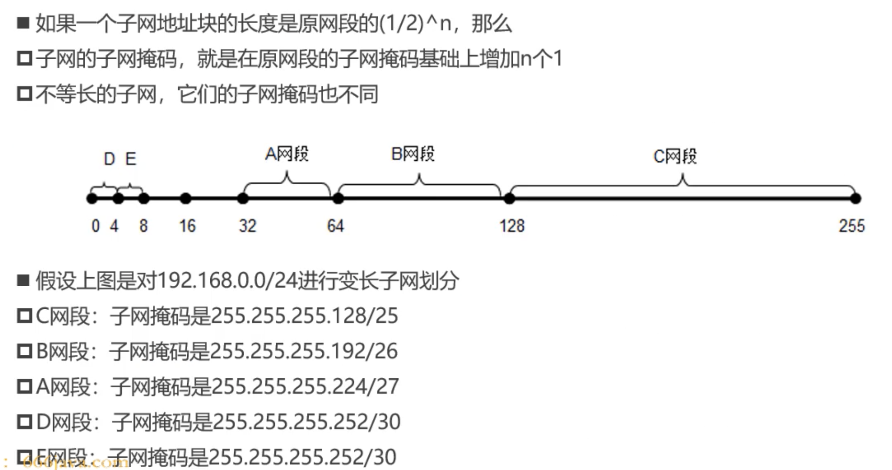

### 超网

- 跟子网反过来，它是将多个连续的网段合并成一个更大的网段

- 需求：原本有200台计算机使用192.168.0.0/24网段，现在希望增加200台设备到同一个网段

	- 200台在192.168.0.0/24网段，200台在192.168.1.0/24网段，合并192.168.0.0/24、192.168.1.0/24为一个网段：192.168.0.0/23（子网掩码向左移动一位）

		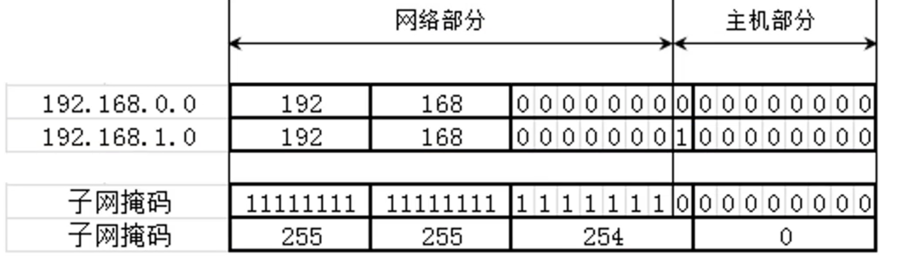

- 合并网段的规律

	- 假设n是2的K次幂（K > 0），子网掩码左移K位能够合并n个网段
	- 第一个网段的网络号以二进制0结尾,那么由它开始连续的2个网段,能通过左移1位子网掩码进行合并
	- 第一个网段的网络号以二进制00结尾,那么由它开始连续的4个网段,能通过左移2位子网掩码进行合并
	- 第一个网段的网络号以二进制00结尾,那么由它开始连续的8个网段,能通过左移3位子网掩码进行合并

	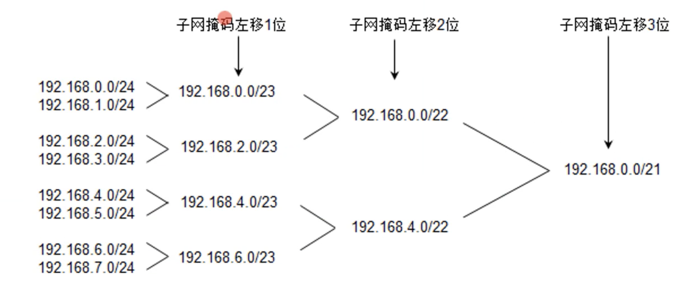

### 判断一个网段是子网还是超网

- 首先
	- 看看该网段的类型，是A类网络，B类网络，C类网络
	- 默认情况下，A类子网的子关掩码位数是8，B类子网的子关掩码位数是16，C类子网的子关掩码位数是24
- 然后
	- 如果该网段的子关掩码位数比默认子网掩码多，就是子网
	- 如果该网段的子关掩码位数比默认子网掩码少，就是超网
- 比如
	- 25.100.0.0/16是一个A类子网
	- 200.100.0.0/16是一个C类子网

