# 路由

- 在不同网段之间转发数据，需要路由器的支持
- 默认情况下，路由器只知道跟它直连的网段，非直连的网段需要通过静态路由，动态路由告诉它
	- 静态路由
		- 管理员手动添加路由信息
		- 适用于小规模网络
	- 动态路由
	- 路由器通过路由选择协议（比如RIP、OSPF）自动获取路由信息
	- 适用于大规模网络
- 其实网段相同也可以使用路由器，其功能就像一个交换机
- 不同的路由器它的功能也不一样

## 关于不同网段路由器转发第一个包的丢失

由于路由器刚刚搭建好，只知道双方的网段信息，并不知道对应的 MAC 地址，所以就需要知道对应的 MAC 地址，第一次发包的时候，由于路由器还不知道另一台主机的 MAC地址，于是丢弃了第一台主机的数据包，进行 ARP 广播得到第二台主机的 MAC 地址

### 思考题一

让这四台主机能够使相互通信

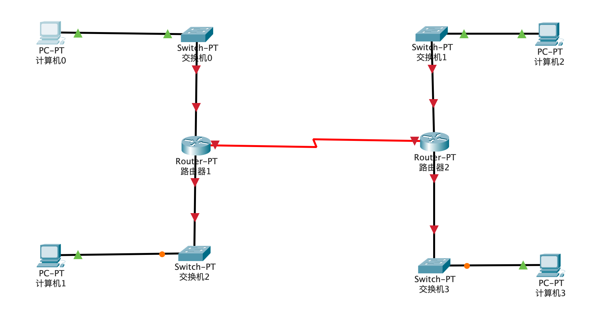

### 思考题二

让这四台主机能够相互通信

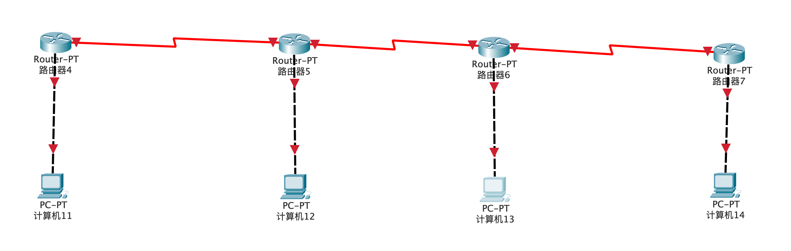

# 数据包的传输过程

- 这里就是简单说下数据包的传输过程，后面学到网络分层的时候，再会详细讲解数据包的传输过程

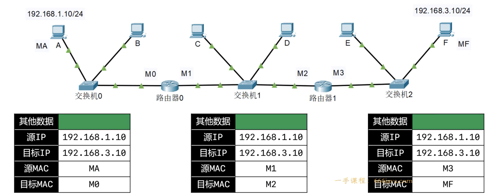

# 网络、互联网、因特网

##  网络（Network）

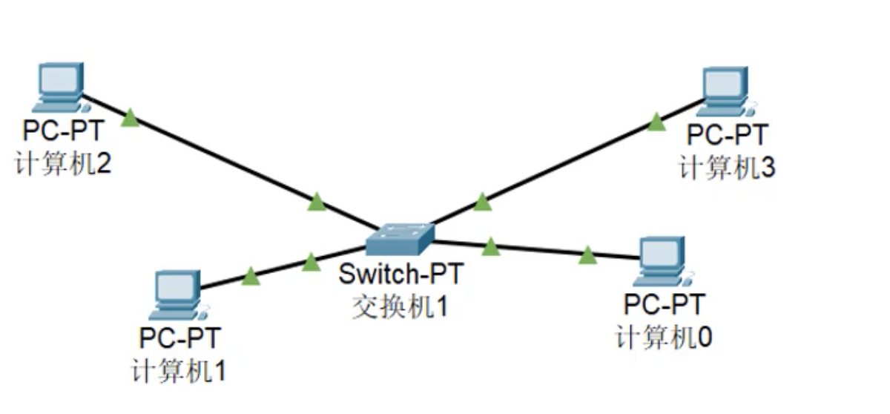

## 互联网（internet）

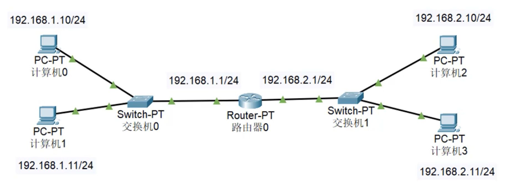

## 因特网（Internet）

- 全世界最大的互联网就是**因特网（Internet）**
	- 将全世界所有的计算机连接在一起
	- 一般使用大写 I 开头的 Internet 特指因特网
	- 日常生活中说，电脑上不了网，指的就是电脑没有连接到因特网	

# ISP

- ISP，Internet Service Provider，Internet服务提供商，不如移动，电信，网通，铁通等
	- 我们平时拉的宽带都是通过 ISP 连接到 Internet 的

# 服务器机房

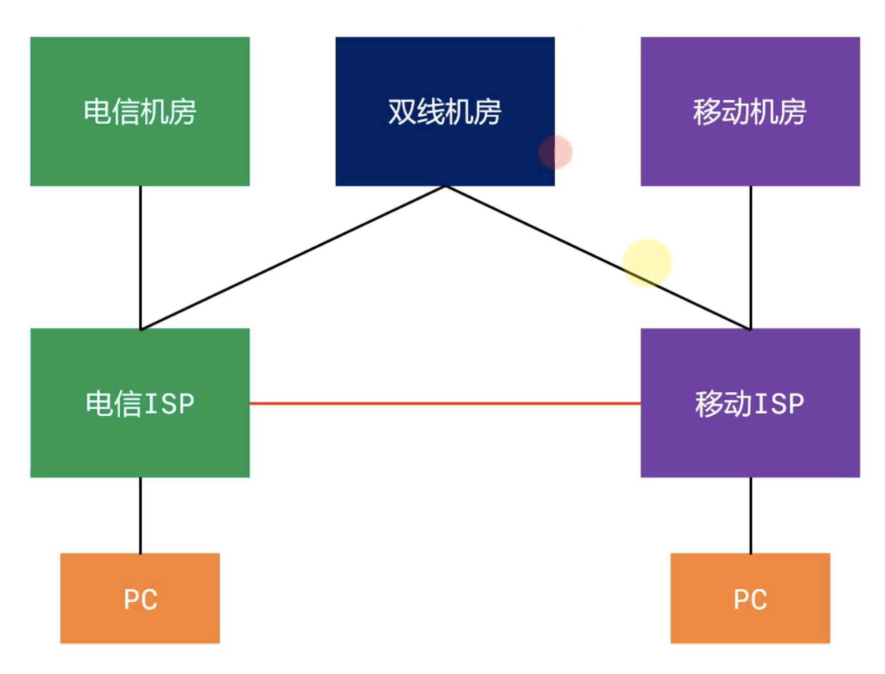

# 网络分类

按照网络的范围进行分类，可以分为：局域网，城域网，广域网

- 局域网（Local Area Network，**LAN**）	
	- 一般是范围在几百米到几十公里的计算机所构成的计算机网络
	- 常用于公司、家庭、学校、机关、一栋大楼等
	- 局域网中使用最广泛的网络技术叫 ：**以太网**（Ethernet）
	- 在电脑、手机上经常见到一个英文 **WLAN**（Wireless LAN），意思是无线局域网络
- 城域网（Metropolitan Area Network，**MAN**）
	- 一般范围是数十公里到数百公里，可以覆盖一个城市
- 广域网（Wide Area Network，**WAN**）
	- 一般范围是数百公里到几千公里，可以覆盖一个国家。通常都需要租用ISP的线路。

# 常见的几种接口

- FastEthernet
	- 快速以太网接口（100M）
- GigabitEthernet
	- 千兆以太网接口
- Serial
	- 串行接口

# 上网方式

## 电话线入户

- 这就是平时说的：ADSL电话拨号上网（Asymmetric Digital Subscriber Line）
	- 非对称数字用户线路，提供上、下行不对称的传输宽带
- 猫（Modem），调制解调器，进行数字信号和模拟信号的转换

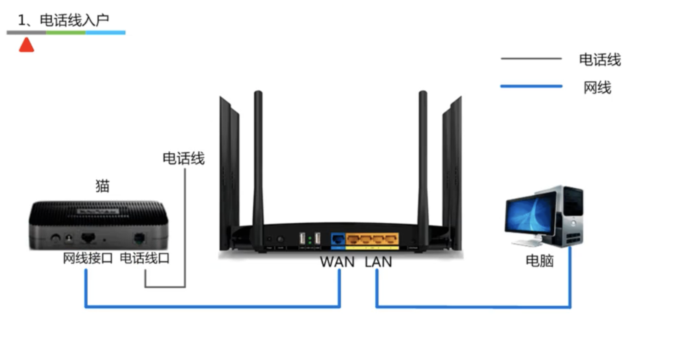

## 光纤入户

- 光猫（Optical Modem），光调制解调器，进行数字信号和光信号的转换

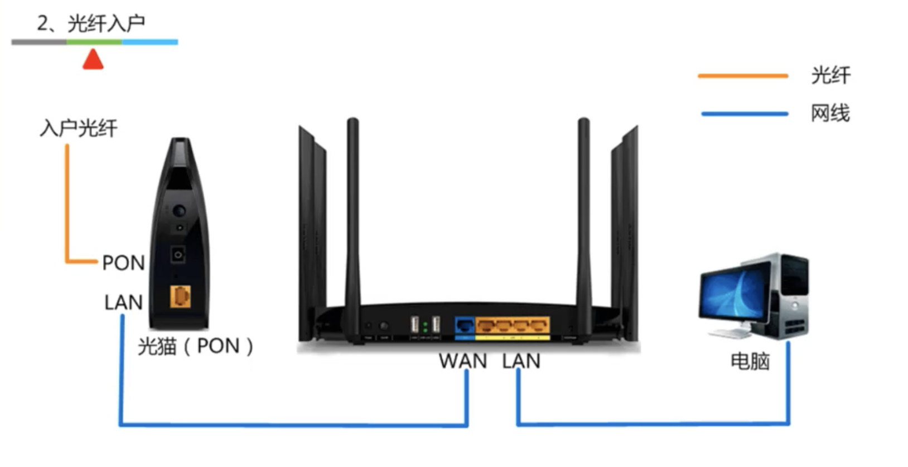

## 网线入户

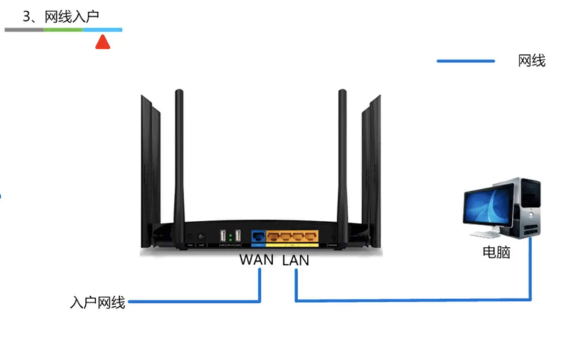

# 家用无线路由器的逻辑结构

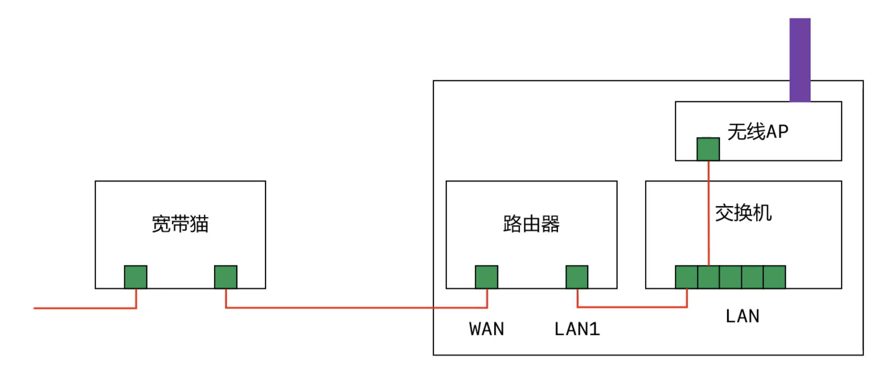

# 公网IP、私网IP

IP 地址分为：公网 IP、私网 IP

- 公网 IP（Public）

	- Internet 上的路由器只有到达公网的路由表，没有到达私网的路由表
	- 公网 IP 由因特网信息    中心（Internet Network Information Center，Inter NIC）统一分配和管理
	- ISP 需要向 Inter NIC 申请公网

- 私网 IP（Private）

	只要用于局域网，下面是保留的私网地址

	- A类：10.0.0.0/8 1个A类网络
	- B类：172.16.0.0/16 ～ 172.31.0.0/16，16个B类网络
	- C类：192.168.0.0/24 ～ 192.168.255.0/24，256个C类网络

# NAT

- 私网 IP 访问 Internet 需要进行 NAT 转换为公网 IP
	- NAT（Network Address Translation）
	- 这一步可以由路由器来完成
- NAT 的特点
	- 可以节约公网 IP 资源
	- 会隐藏内部真实 IP
- NAT 的分类
	- 静态转换
		- 手动配置 NAT 映射表
		- 一对一转换
	- 动态转换
		- 定义外部地址池，动态随机转换
		- 一对一转换
	- PAT（Port Address Translation）
		- 多对一转换，最大程度节约公网 IP 资源
		- 采用端口多路复用方式，通过端口号标识不同的数据流
		- 目前应用最广泛的 NAT 实现方式

# 网络分层

## 网络互连模型

-  为了更好地促进互联网的研究和发展，国际化标准组织 ISO 在 1985 年制定了网络互联模型

	- OSI 参考模型（Open System Interconnect Reference Model），具有 7 层结构

		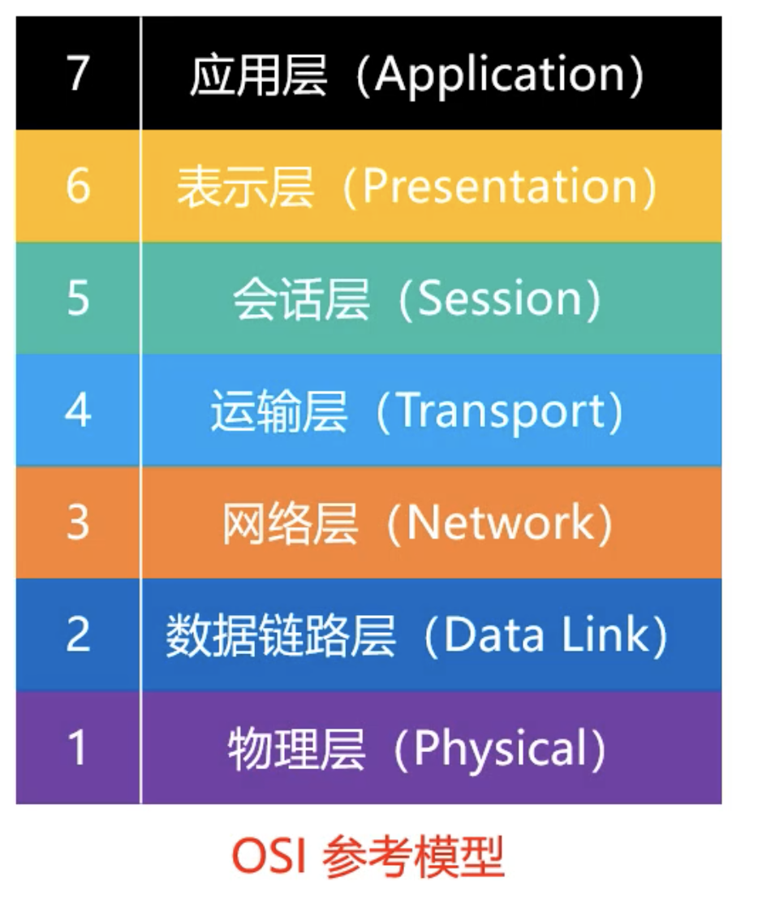

	- 但是各大厂商在实践中把参考模型进行了精简，于是有了 TCP/IP 协议

		

	- 但是在学习研究发现数据链路层的研究价值也很大于是就有了 5 层模型

		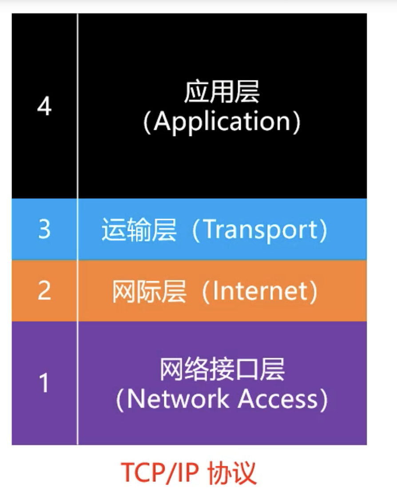

	

## 请求过程

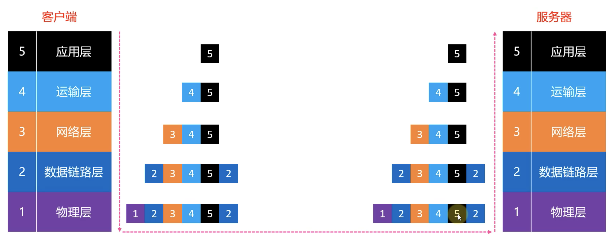

## 网络分层

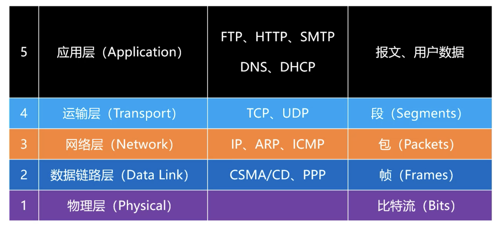
