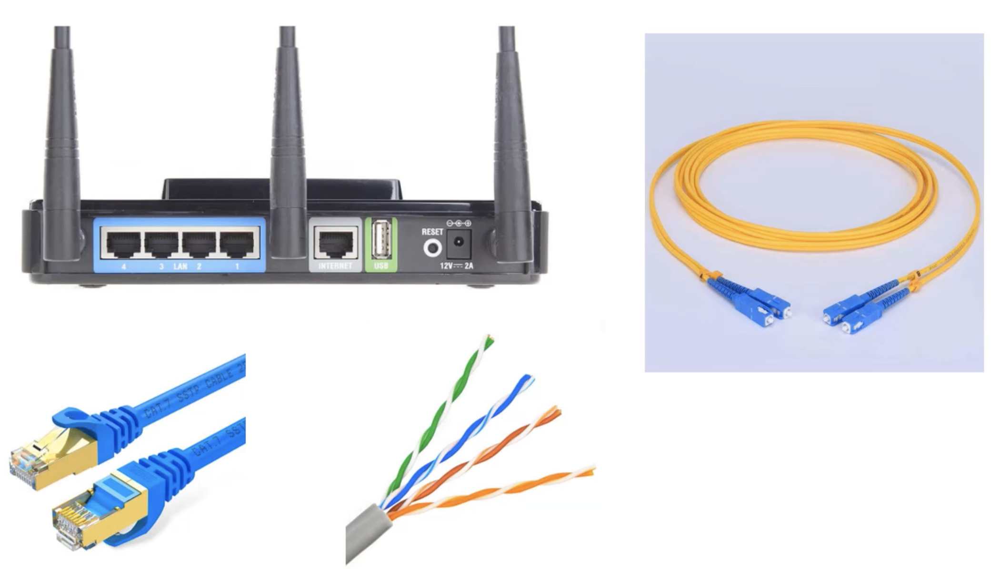
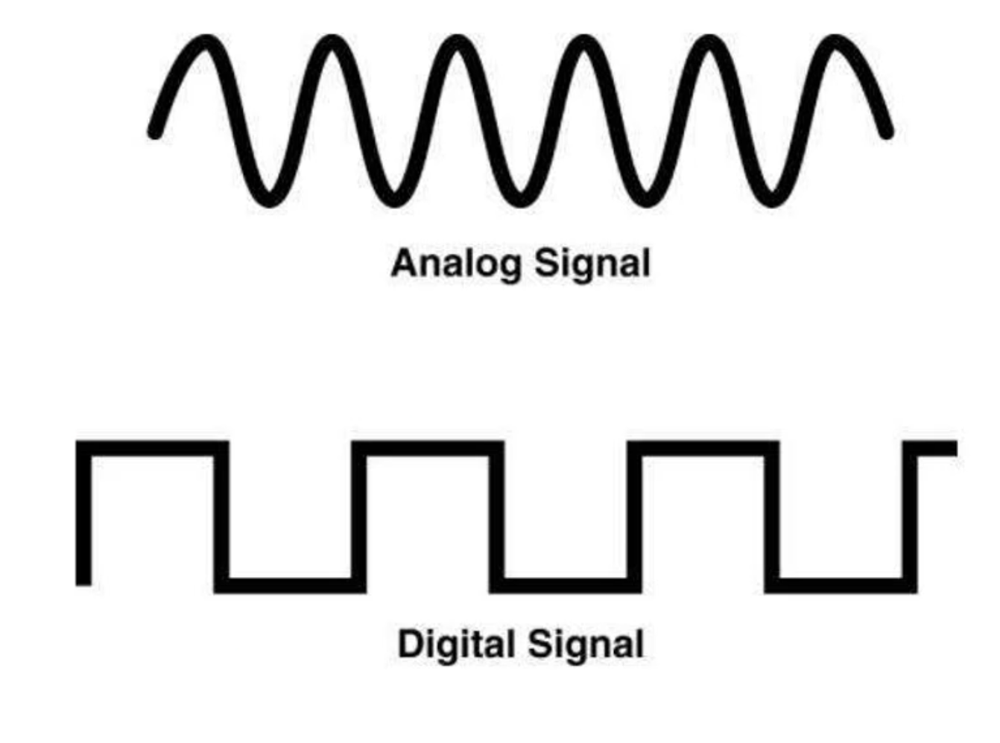
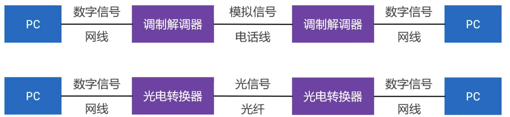

## 物理层（Physical）

- 物理层定义了接口标准、线缆标准、传输速率、传输方式等

	

## 数字信号、模拟信号

- 模拟信号（Analog Signal）
	- 连续的信号，适合长距离传输
	- 抗干扰能力差，受到干扰时波形变形很难纠正
- 数字信号（Digital Signal）
	- 离散的信号，不适合长距离传输
	- 抗干扰能力强，受到干扰时波形失真可以修复

## 数据通信模型

### 局域网通信模型

-  注意：网线长度不能超过 100 米

### 广域网通信模型

## 信道（Channel）

 信道：信息传输的通道，一条传输介质上（比如网线）上可以有多条信道

- 单工通信
	- 信号只能往一个方向传输，任何时候都不能改变信号的传输方向
	- 比如无线电广播、有限电视广播
- 半双工通信
	- 信号可以双向传输，但必须是交替进行，同一时间只能往一个方向传输
	- 比如对讲机
- 全双工通信
	- 信号可以同时双向传输
	- 比如手机（打电话，听说可以同时进行）
