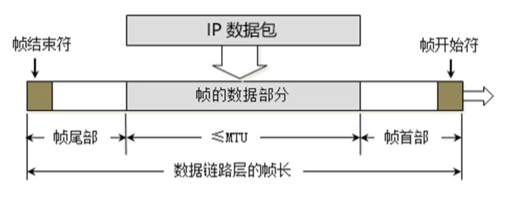
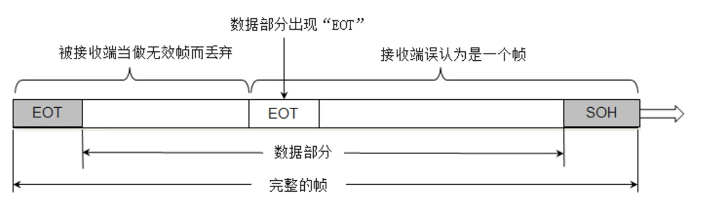
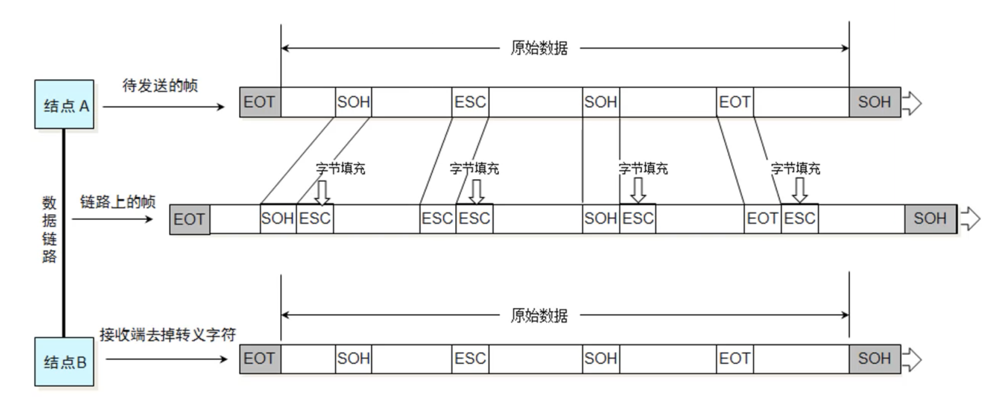
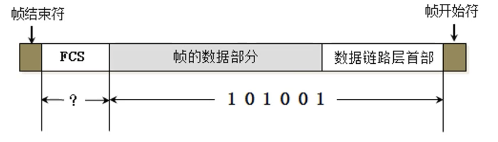
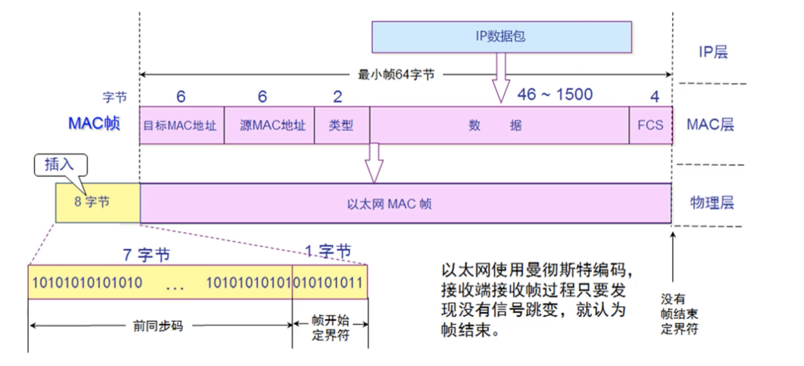
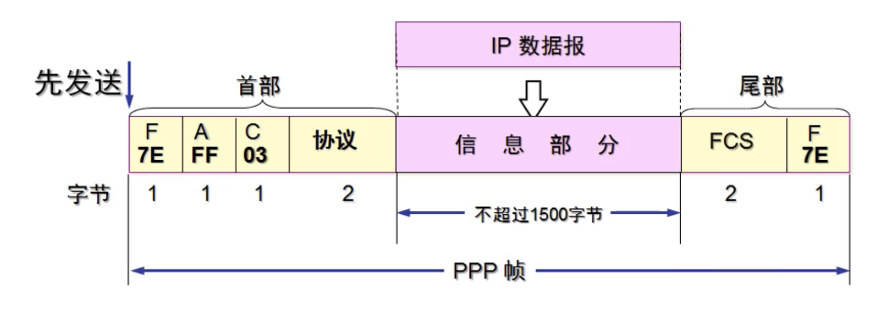
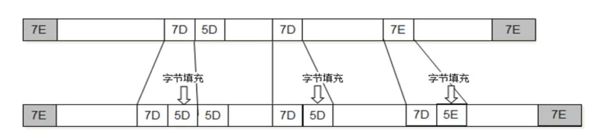
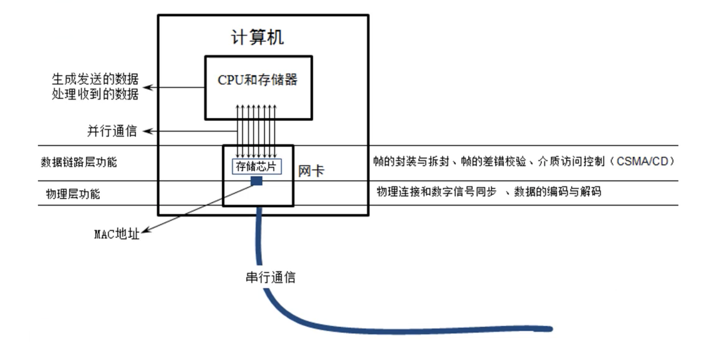

## 数据链路层（Data Link）

- 链路：从 1 个节点到相邻节点的一段物理线路（有线或者无线），中间没有其他交换节点（对于没有智商的东东我们就可以把它们当作网线）

	

- 数据链路：在一条链路上传输数据时，需要有对应的通信协议来控制数据的传输

	- 不同类型的数据链路，所有的通信协议可能是不同的
		- 广播信道：CSMA/CD协议（比如同轴电缆、集线器等组成的网络）
		- 点对点信道：PPP协议（比如 2 个路由器之间的信道）

- 数据链 路层的 3 个基本问题

	- 封装成帧
	- 透明传输
	- 差错检验

### 封装成帧

- 帧（Frame）的数据部分
	- 就是网络层传递下来的数据包（IP 数据包，Packet）
- 最大传输单元MYU（Maximum Transfer Unit）
	- 每一种数据链路层协议都规定了所能传输的帧的数据长度上限
	- 以太网的 MTU 为 1500 字节

### 透明传输

- 数据部分一旦出现了 SOH、EOT，就需要进行转义

### 差错检验

- FCS 是根据数据部分 + 首部计算得出的，只要不对应，网卡就会丢弃这个数据

## MSNA/CD 协议

-  MSNA/CD（Carrier Sense Multiple Access with Collision Detection）
	- 载波侦听多路访问/冲突检测
-  使用了 CSMA/CD 的网络可以称为是以太网（Ethernet），它传输的是以太网帧
	- 以太网帧的格式有：Ethernet V2标准，IEEE的802.3标准
	- 使用最多的的是：Ethernet V2标准
-  为了能够检测正在发送的帧是否产生了冲突，以太网的帧至少要 **64** 字节
-  交换机组建的网络，已经支持全双工通信，不需要再使用 CSMA/CD，但是它传输的帧依然是以太网帧
	- 所以，用交换机组建的网络，依然可以叫以太网

## Ethernet V2 帧的格式

- 首部：目标MAC + 源 MAC + 网络类型
- 以太网帧：首部 + 数据 + FCS
- 数据的长度至少是：$64 - 6 - 6 - 6 - 2 - 4 = 46$ 字节

## Ethernet V2 帧的格式

- 当数据部分的长度小于 46 字节时
	- 数据链路层会在数据后面加入一些字节填充
	- 接收端会添加的字节去掉
- 长度总结
	- 以太网帧的数据长度：46 ～ 1500 字节
	- 以太网帧的长度：64 ～ 1518 字节（目标 MAC + 源 MAC + 网络类型 + 数据 + FCS）

# PPP 协议（Point to Point Protocol）

- Address 字段：图中的值是 0XFF，形同虚设，点到点信道不需要源 MAC、目标 MAC 地址
- Control 字段：图中的值是 0X03，目前没有什么作用
- Protocol 字段：内部用到的协议类型
- 帧开始符、帧结束符：0X7E

### 字节填充

- 将 0X7E 替换成 0X7D5E
- 将 0X7D 替换成 0X7D5D

## 网卡

- 网卡接收到一个帧，首先会进行差错校验，如果校验通过则接收，否则丢弃
- Wireshark 抓到大的帧没有 FCS，因为它抓到的是差错检验校验通过的帧（帧尾的 FCS 会被硬件去掉）
	- Wireshark 抓不到差错校验失败的帧

