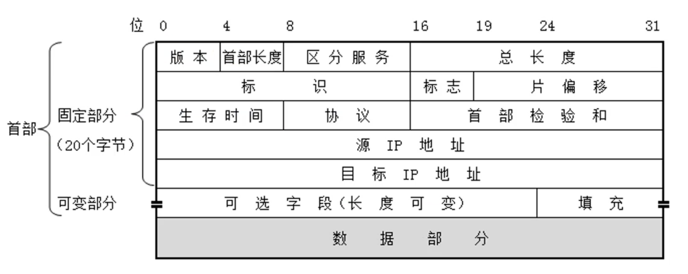
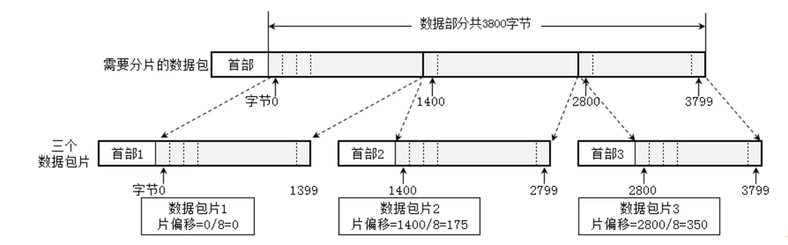
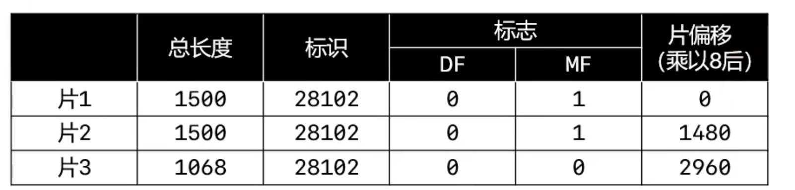
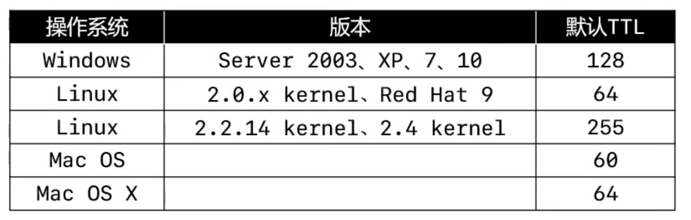
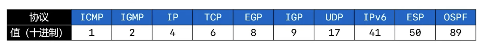

# 网络层（Network）

- 网络层数据包（IP 数据包，Packet）由首部、数据 2 部分组成
	- 数据：很多时候是由传输层传递下来的数据段（Segment）
	- 但是有的时候有的协议直接从网络层开始（ARP IP ICMP），或者数据链路层开始（CSMA/CD PPP）。

## 网络层首部

### 版本

- 占 4 位
	- 0B0100：IPV4
	- 0B0110：IPV6

### 首部长度

- 占 4 位，二进制乘以 4 才是最终长度
	- 0B0101：20（最小值）
	- 0B1111：60（最大值）

### 区分服务

- 区分服务（Differentiated Services Field）
	- 占 8 位
	- 可以用于提高网络的服务质量（QoS，Quality of Service）
	- 可以提供一些特殊的信息，让你的服务质量更好

### 总长度

- 总长度（Total Length）
	- 占16位 : 2个字节, 256 * 256 = 65535
	- 首部 + 数据的长度之和，最大值是 65535
- 由于帧的数据不能超过1500字节，所以过大的IP数据包，需要分片（fragments）传输给数据链路层
	- 每一片都有自己的网络层首部（IP首部）

### 标识

- 标识（Identification）
	- 占16位
	- 数据包的ID，当数据包过大进行分片时，同一个数据包的所有片的标识都是一样的 (用标识来合并分片)
	- 有一个计数器专门管理数据包的ID，每发出一个数据包，ID就加1

### 标志

- 标志（Flags）
	- 占3位
	- 第1位（Reserved Bit）：保留
	- 第2位（Don’t Fragment）：1代表不允许分片，0代表允许分片
	- 第3位（More Fragments）：1代表不是最后一片，0代表是最后一片

### 片偏移

- 片偏移（Fragment Offset）
	- 占 13 位
	- 片偏移 * 8 = 字节偏移
	- 每一片的长度一定是 8 的整数倍

### ping 的几个用法

- ping -h
	- 查看 ping 的用法
- ping ip地址 -l 数据包大小
	- 发送指定大小的数据包
- ping ip地址 -f
	- 不允许网络层分片
- ping ip地址 -i TTL
	- 设置 TTL 的值
- 通过 tracert、pathping 命令、可以跟踪数据包经过哪些路由器

### 生存时间

- 生存时间（Time To Live，TTL）

	- 占 8 位
	- 每个路由器在转发之前会将 TTL 减 1 ，一旦发现 TTL 减为 0 ，路由器就会返回错误报告
	- 这个主要是解决两个路由器互为对方的默认路由，当来了一个数据包在当前路由表中没有记录，就会导致这这一段线路的网络故障，防止路由死循环
	- 观察使用 ping 命令后的TTL，能够推测出对方的操作系统，中间经过了多少个路由器

	

### 协议

- 协议（Protocol）
	- 占 8 位
	- 表明封装的数据是使用了什么协议

### 首部校验和

- 用于检查首部是否有错误
