# 传输层（Transport）

- 传输层有 2 个协议
	- TCP（Transmission Control Protocol），传输控制协议
	- UDP（User Datagram Protocol）用户数据报协议

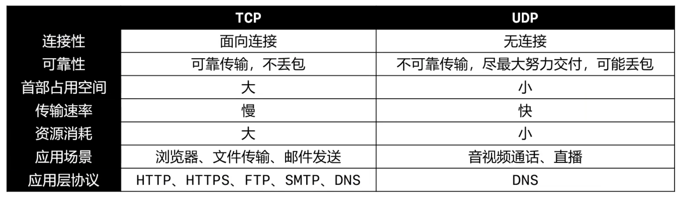

## UDP

### 数据格式

- UDP 是无连接的，减少了建立和释放连接的开销
- UDP尽最大能力交付，不保证可靠交付
	- 因此不需要维护一些复杂的参数，首部只有 8 个字节（TCP的首部至少20个字节）
- UDP长度（Length）
	- 占 16 位，首部的长度 + 数据的长度

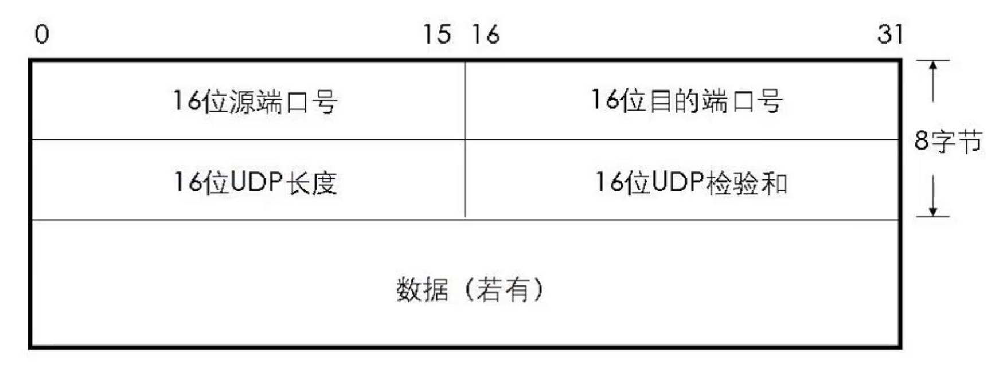

### 检验和（Checksum）

- 检验和的计算内容：伪首部 + 首部 + 数据
	- 伪首部：仅在计算校验和时起作用，并不会传递给网络层

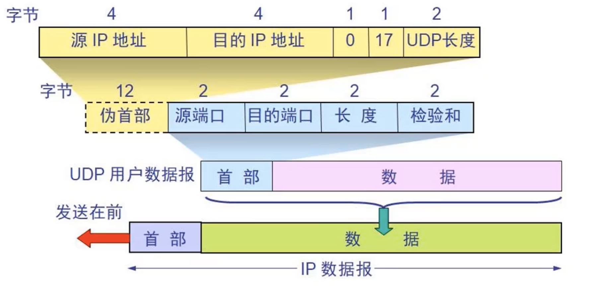

### 端口（Port）

- UDP 首部中端口占用 2 字节
	- 可以推测出端口号的取值范围是：0 ～ 65535
- 客户端的源端口是临时开启的随机端口
- 防火墙可以设置某些端口能否通过来提高安全性
- 常用命令行
	- netstat -an：查看被占用的端口
	- netstat -anb：查看被占用的端口，占用端口的应用程序
	- telnet 主机 端口：查看是可以访问主机的某个端口

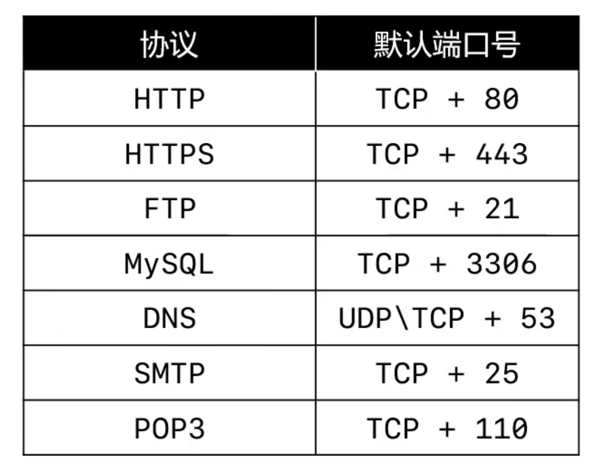

## TCP

### 数据格式

- 数据偏移
	- 占 4 位，取值范围是 0X0101 ～ 0x1111
	- 数据偏移 * 4 = 首部长度（Header Length）
	- 首部长度是 20 ～ 60 字节
- 保留
	- 占 6 位，目前全为 0

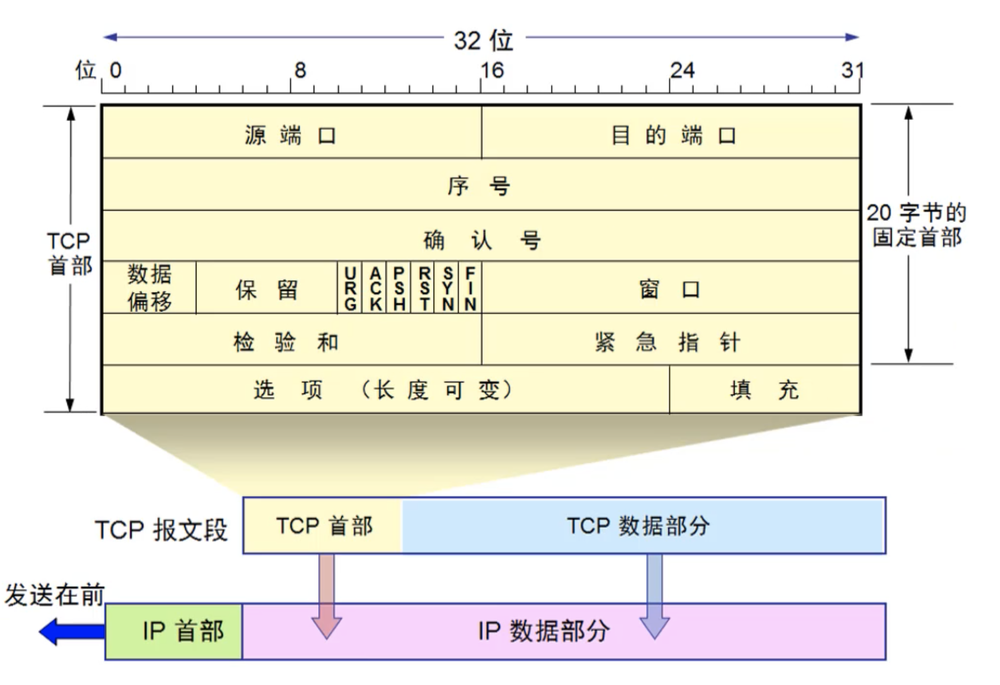

### 小细节

- 有些资料中，TCP 首部的保留（Reserved）字段占 3 位，标志（Flags）字段占 9 位
	- Wireshark 中也是这样

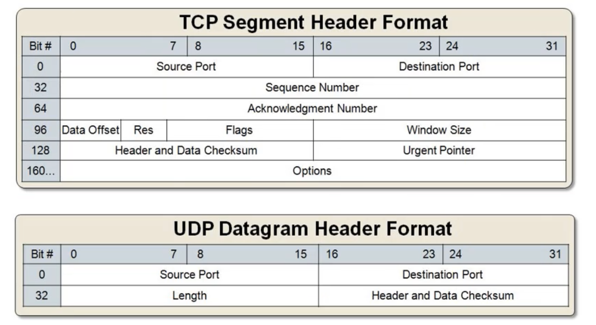

- UDP 的首部中有个 16 位的字段记录了整个 UDP 报文段的长度（首部 + 数据）
- 但是，TCP的首部中仅仅有个 4 位的字段记录了 TCP 报文段的首部长度，并没有字段记录 TCP 报文段的数据长度

- 分析
	- UDP 首部中占 16 位的长度字段是冗余的，纯粹是为了保证首部是 32 bit对齐
	- TCP/UDP的数据长度，完全可以由 IP 数据包的首部推测出来
	- 传输层的数据长度 = 网络层的总长度 - 网络层的总长度 -传输层的首部长度

### 检验和（Checksum）

- 跟 UDP 一样，TCP 检验和的计算内容：伪首部 + 首部 + 数据
	- 伪首部：占用 12 字节，仅在计算检验和时起作用，并不会传递给网络层

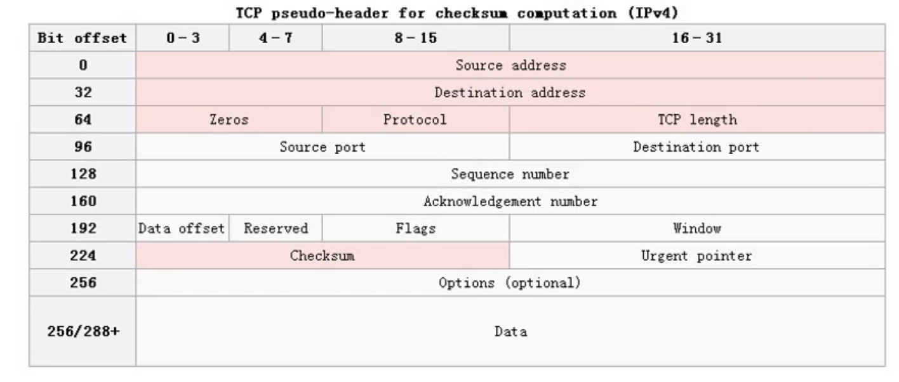

### 标志位（Flags）

- UGR（Urgent）
	- 当UGR = 1 时，紧急指针字段才有效，表明当前报文段中有紧急数据，应优先尽快传送
- ACK（Acknowledgment）
	- 当ACK = 1 时，确认号字段才有效
- PSH（Push）
	- 一般用于交互式网络上
- RST（Reset）
	- 当RST = 1 时，表明连接中出现严重差错，必须释放连接，然后再重新建立连接

- SYN（Synchronization）
	- 当SYN = 1、ACK = 0 时，表明这是一个建立连接的请求
	- 若对方同意建立连接，则回复SYN = 1、ACK = 1
- FIN（FInish）
	- 当FIN = 1时，表明数据已经发送完毕，要求释放连接

### 序号

- 序号（Sequence Number）
	- 占 4 字节
	- 首先，传输的每一个字节都会有一个编号
	- 在建立连接后，序号代表：这一次传给对方的 TCP 数据部分的第一个字节的编号

### 确认号

- 确认号（Acknowledgment Number）
	- 占 4 字节
	- 在建立连接后，确认号代表：期望对方下一次传来的 TCP 数据部分的第一个字节的编号

### 窗口号

- 窗口（Window）
	- 占 2 字节
	- 这个字段有流量控制功能，用来告知对方下一次允许发送的数据大小（字节为单位）

### 跟序号确认号有关的一些知识

- 在这里的发送方和接收方其实身份并不固定，因为在网络通信中双方都会有交互，不能死板的认为发送方一定是服务器，接收方一定是个人主机
	- 也就是说，返回 ACK 地的人有可能是服务器，有可能是个人主机

- 双方从建立连接的时候，就会发送对应的序号初始值，这个序号初始值是由算法生成的，没有一个固定值，等连接建立完成后，就是使用这个序号来生成对应的序号和 ACK，这个过程是双向的

- 举个例子：
	- 在建立连接的时候，客户端的序号初始值是 123456 ，服务器的序号初始值是 234567
	- 在客户端给主机发送数据的时候
		- seq = 123456 + 1 ，leng = 100
		- ACK = 123456 + 1 + 100
	- 在服务器给客户端发送数据的时候
		- seq =234567 + 1 ，len = 100
		- ACK = 234567 + 1 + 100

- 此时在三次握手的第一次，客户端向服务器发送数据，此时数据长度为 0
	- 此时发送过去的 seq 就是算法生成的值，由于没有服务器的数据，所以 ACK = 0

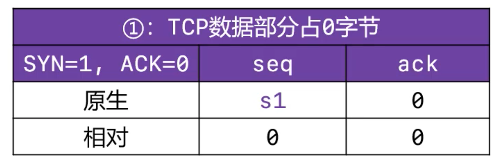

- 此时在三次握手的第二次，服务器向客户端发送信息，此时数据长度为 0
	- 由于接收到客户端的数据，于是得到了客户端的 seq ，而且服务器返回 ACK = 客户端的 seq + 1 ，表明服务器希望收到的数据

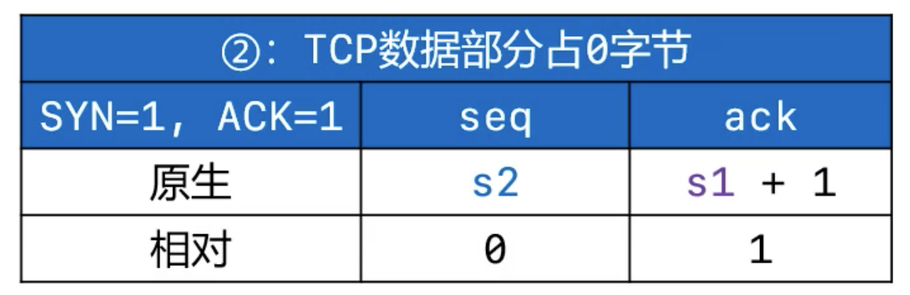

- 此时在三次握手的第三次，客户端向服务器发送信息，此时数据长度为 0
	- 由于接收到服务器的数据，于是得到了服务器的 seq ，而且服务器返回 ACK = 服务器的 seq + 1，表明客户端希望收到的数据

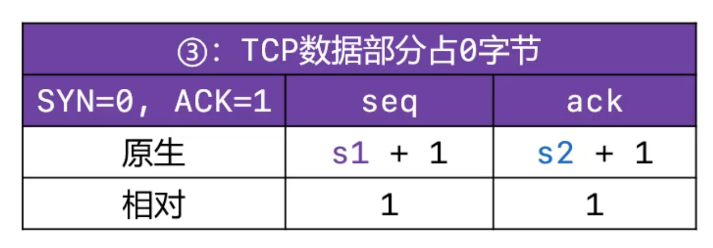

- 此时建立连接完成，客户端向服务器发送信息
	- 跟上一次客户端向服务器发送的首部信息很多是一样的，因为回应的还是上一次服务器发送给客户端的数据，只不过带上了数据

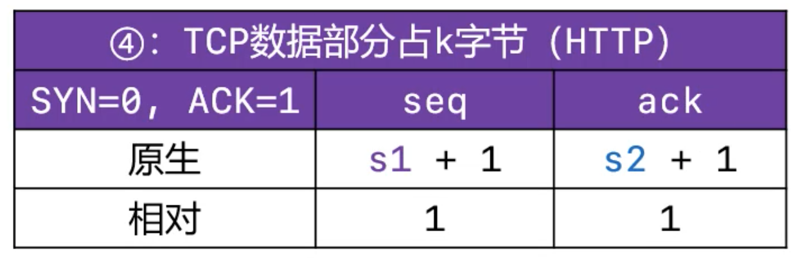

- 这是服务器发给客户端的第一个数据包

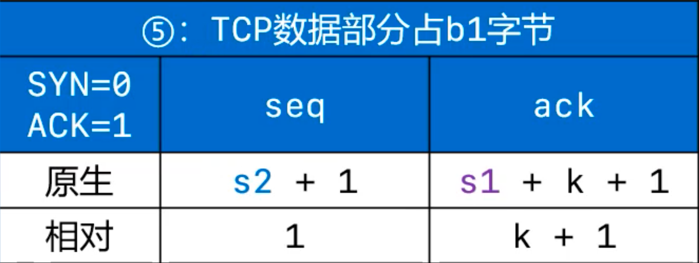

- 这是服务器发给客户端的第二个数据包

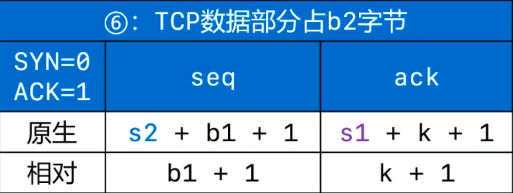

- 这是服务器发给客户端的第三个数据包

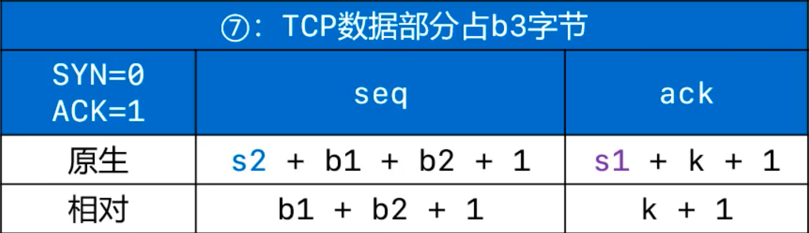

- 这是服务器发给客户端的第四个数据包

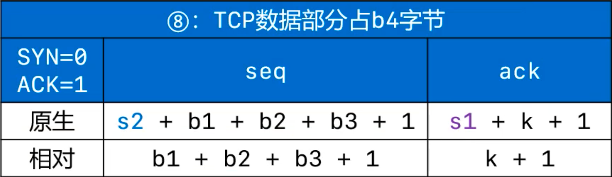

- 这个时候客户端接收到了来自服务器的四个数据包，做出了回应，所以 TCP 数据部分为 0 

- 总过程就是这样的

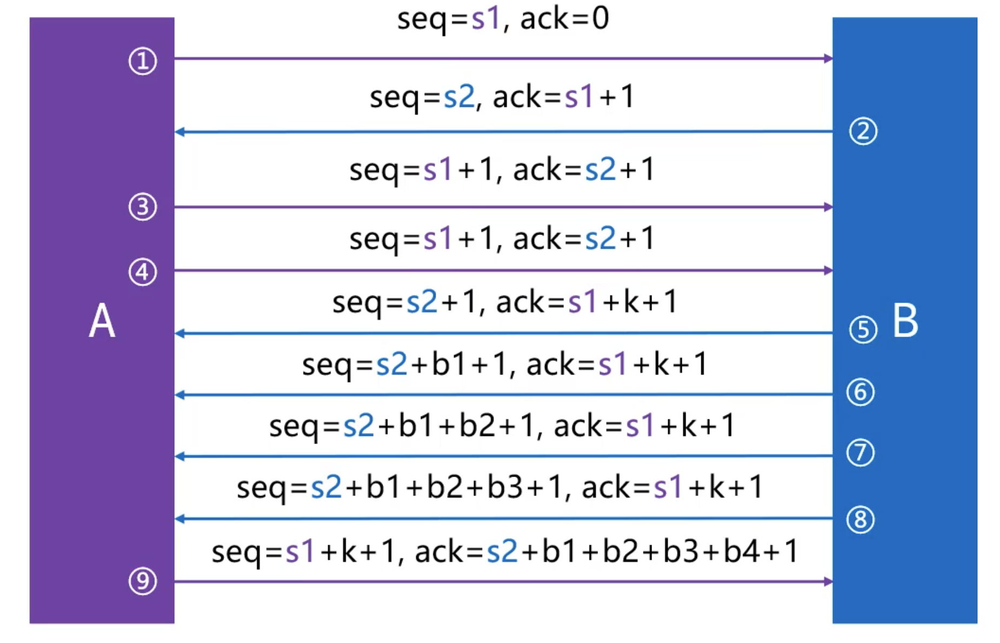

### TCP的几个要点

#### 可靠传输

##### 停止等待ARQ协议

- ARQ（Automagic Repeat-reQuest），自动重传请求

- 但是有个问题，就是效率太低下

	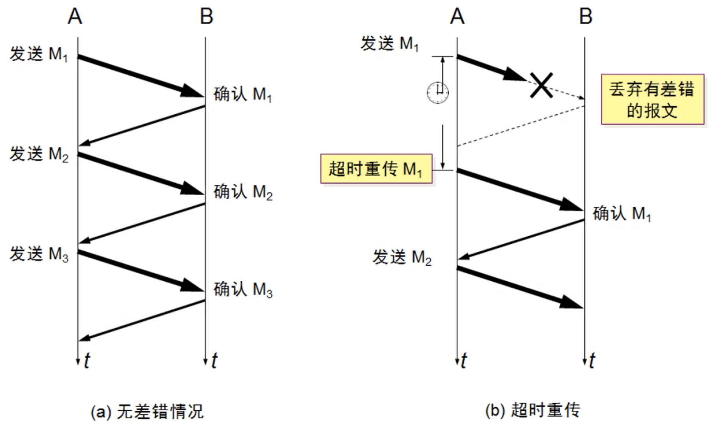

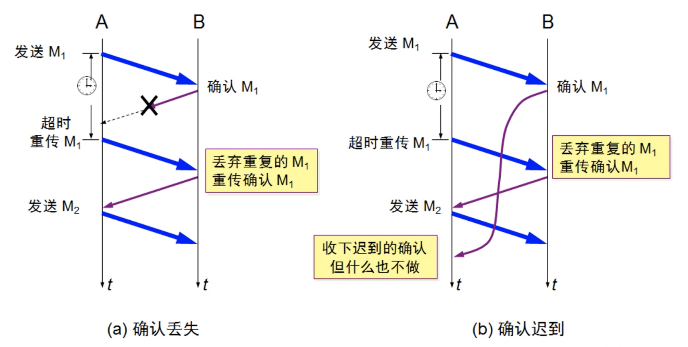

##### 联系 ARQ 协议 + 滑动窗口协议

- 提高了效率

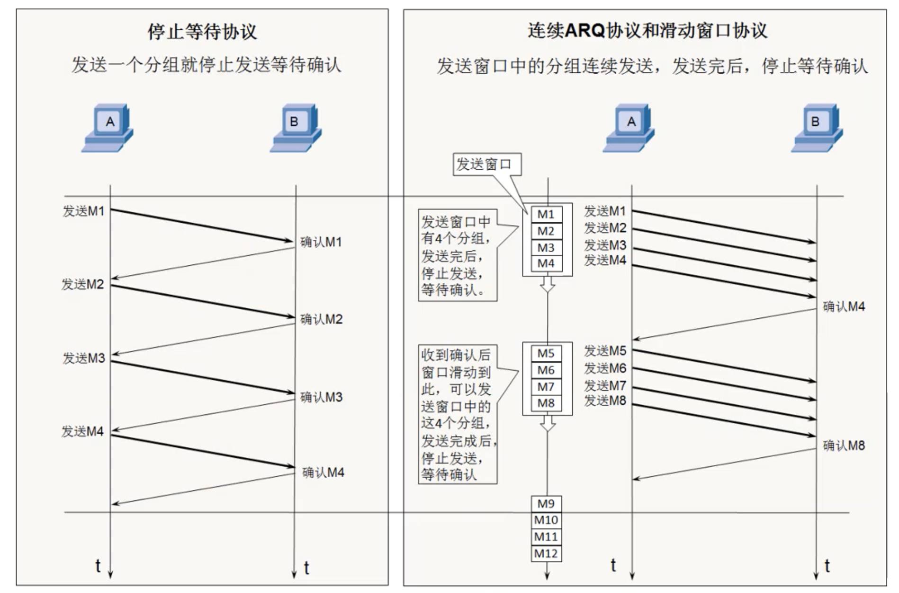

##### SACK（选择确认）

- 在 TCP 通信过程中，如果发送序列中间某个数据包丢失（比如1、2、3、4、5 中的 3 丢失了）
- TCP 会通过重传最后确定的分组后续的分组（最后确认的是2，会重传3、4、5）
- 这样原先已经正确传输的分组也可能重复发送（比如4，5），降低了 TCP 性能
- 为了改善上述情况，发展出了 SACK（Selective Acknowledgment，选择性确认）技术
	- 告诉发送当哪些数据丢失，哪些数据已经提前收到
	- 使 TCP 只重新发送丢失的包（比如3），不用发送后续所有的分组（比如4、5）
- SACK 信息会放在 TCP 首部的选项部分
	- Kind：占 1 字节，值为 5 代表这是 SACK 选项
	- Length：占 1 字节，表明 SACK 选项一共占用多少字节
	- Left Edge：占 4 字节，左边界
	- Right Edge：占 4 字节，右边界
- 一对边界信息需要占用 8 字节，由于 TCP 首部的选项部分最多 40 字节，所以
	- SACK 选项最多携带 4 组边界信息
	- SACK 选项的最大占用字节数 = 4 * 8 + 2 = 34

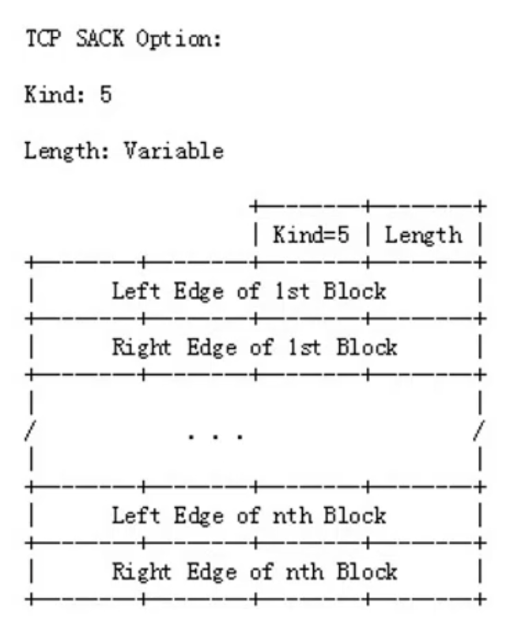

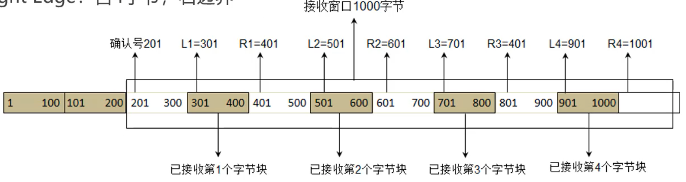

##### 疑问

- 如有个包重传了 N 次还是失败，会一直持续重传到成功为止吗？

	- 这取决于系统的设置，比如有的系统，重传 5 次还未成功就会发送 reset 报文（RST）

	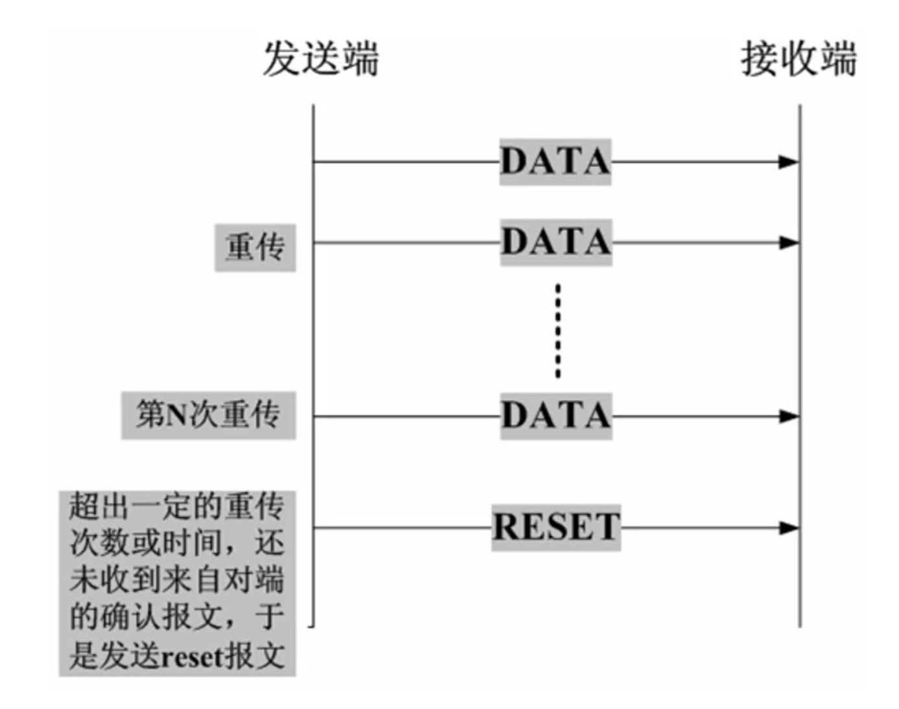

- 如果接收的数据不足接收窗口大小

	- 就是接收窗口最多能接收 4 个包，但是发送方就只发了两个包，接收方如何确定后面还有没有两个包
	- 那么就会等待一段时间后如果没有第三个包，就会返回确认收到 2 个包给发送方

- 为什么要在传输层就将数据 “大卸八块” 分成多个段，而不是等到网络层再分片传递给数据链路层

	- 因为这样可以提高重传的性能
	- 需要明确的是：可靠传输是在传输层进行控制的
	- 如果在传输层不分段，一旦出现数据丢失，整个传输层的数据都得重传
	- 如果在传输层分段，一旦出现数据丢失，只需要将丢失的那些段重传即可

#### 流量控制

- 如果接收方的缓存区满了，发送方还在疯狂的发送数据包

	- 接收方只能将收到的数据包丢掉，大量的丢包会极大的浪费网络资源
	- 所以需要流量控制

- 什么事流量控制

	- 让发送方的发送速率不要太快，让接收方来得及接收处理

- 原理

	- 通过确认报文中窗口字段来控制发送方的发送速率
	- 发送方的发送窗口大小不能超过接收方给出的窗口大小
	- 当发送方收到的接收窗口大小为 0 时，发送方就会停止发送数据
	
- 有一种特殊情况
	
	- 一开始，接收方给发送方发送了 0 窗口的报文段
	- 后面，接收方又有了一些储存空间，给发送方发送的非 0 窗口的报文段都死了
	- 发送方的发送窗口一直为 0 ，双方陷入僵局
	
- 解决方案
	
	- 当发送方收到 0 窗口通知时，这时发送方停止发送报文
	- 并且同时开启一个定时器，每隔一段时间就发送测试报文去询问接收方最新的窗口大小
	- 如果接收的窗口大小还是 0 ，则发送方再次刷新，启动计时器
	
	
	

#### 拥塞控制

- 拥塞控制
	- 防止过多的数据注入到网络中
	- 避免网络中的路由器或链路过载
- 拥塞控制是一个全局性的过程
	- 涉及到所有的主机、路由器
	- 以及降低网络传输性能有关的所有因素
	- 是大家共同努力的结果
- 相比而言，流量控制是点对点通信的控制

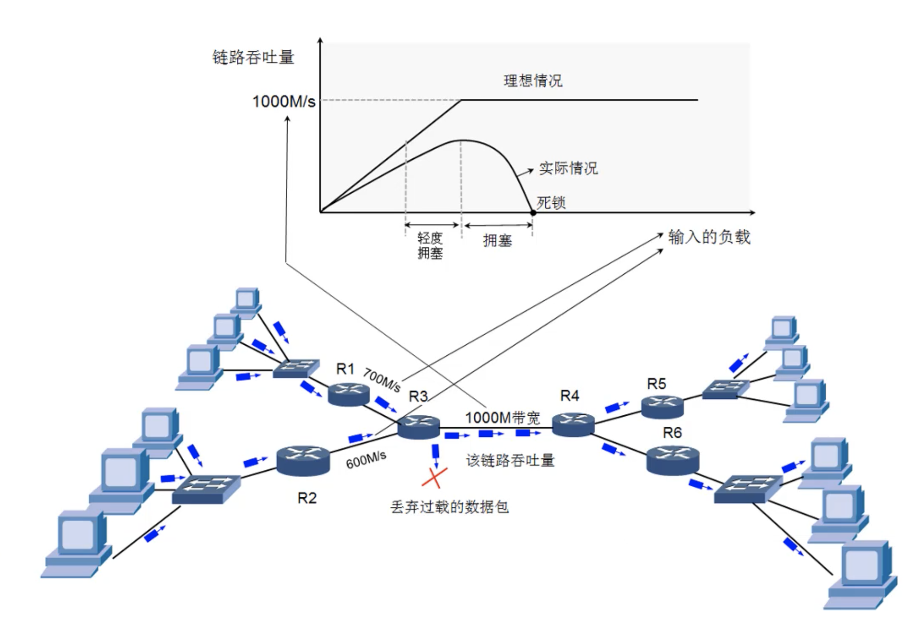

##### 如何实现

###### 慢开始（slow start，慢启动）

- cwnd 的初始值比较小，然后随着数据包被接收方确认（收到一个 ACK）
	- cwnd 就会成倍增长（指数级）

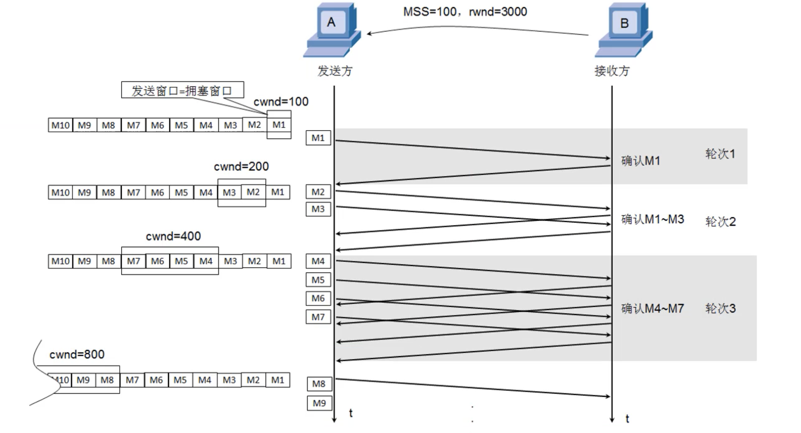

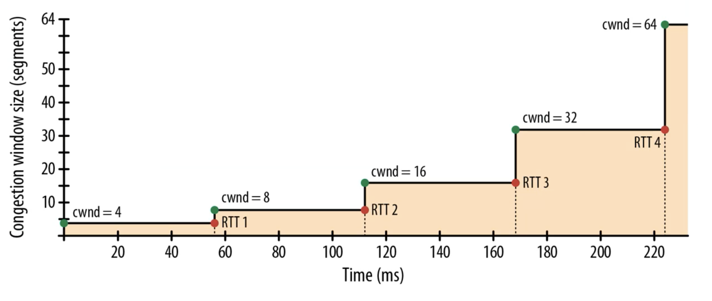

###### 拥塞避免（congestion avoidance）

- ssthresh（slow start threshold）：慢开始阈值，cwnd达到阈值后，以线性方式增加
- 拥塞避免（加法增大）：拥塞窗口缓慢增大，以防网络过早出现拥塞
- 乘法减少：只要网络出现拥塞，把 ssthresh 减半，与此同时，执行慢开始算法（cwnd又恢复到初始值）
	- 当网络出现频繁拥塞时，ssthresh 值下降的就很快

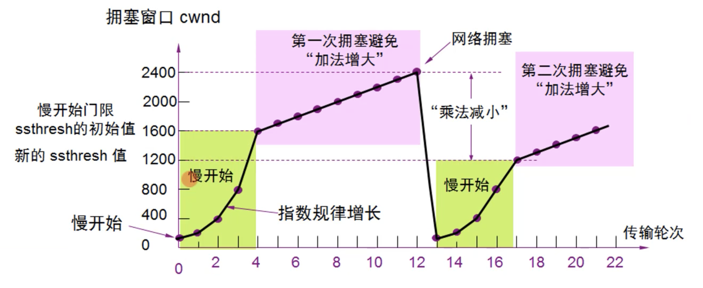

###### 快速重传（fast retransmit）

- 接收方

	- 每收到一个失序的分组后就立即发出重复确认
	- 是发送方及时知道有分组没有到达
	- 而不要等待自己发送数据时才进行确认

- 发送方

	- 只要连续收到三个重复确认（总共 4 个相同的确认），就应当立即重传对方尚未收到的报文段
	- 而不必继续等待重传计时器到期后再开始重传

	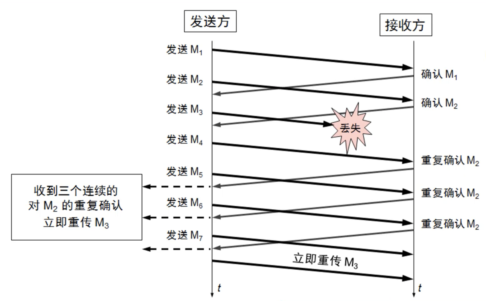

	

###### 快速恢复（fast recovery）

- 当发送方连续收到三个重复确认，就执行 “乘法减小” 算法，把 ssthresh 减半
	- 与慢开始不同之处是现在不执行慢开始算法，即 cwnd 现在不恢复到初始值
	- 而是把 cwnd 的值设置为 ssthresh 减半后的数值
	- 然后开始执行拥塞避免算法（ “加法增大” ），使拥塞窗口缓慢地线性增长

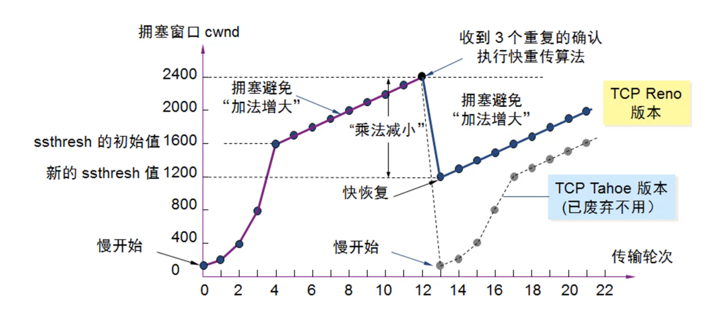

##### 几个缩写

- MSS（Maxium Segment Size）：每个段的数据部分大小
	- 在建立连接时确定
- cwnd（congestion window）：拥塞窗口
- rend（receive window）：接收窗口
- swnd（send window）：发送窗口
	- swnd = min ( cwnd , rwnd )

##### 发送窗口的最大值

- 发送窗口的最大值：swnd = min（cwnd，rwnd）
- 当 rwnd < cwnd时，是接收方的接收能力限制发送窗口的最大值
- 当 cwnd < rwnd时，则是网络的拥塞限制发送窗口的最大值 

####  连接管理

##### 建立连接

###### 3 次握手

- CLOSED：client处于关闭状态
- LISTEN：server处于监听状态，等待client连接
- SYN-RCVD：表示server接收到SYN报文，当收到client的ACK报文后，它会进入到ESTABLISHED状态
- SYN-SENT：表示client已经发送SYN报文，等待server的第 2 次握手
- ESTABLISHED：表示连接已经建立

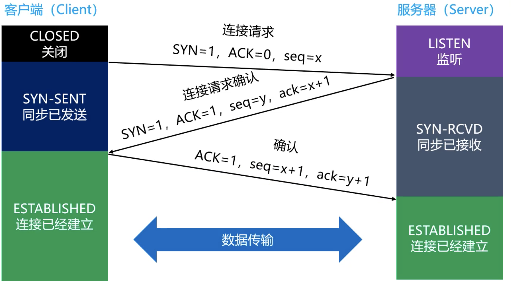

###### 前两次握手的特点

- SYN都设置为 1
- 数据部分长度都为 0
- TCP 头部长度一般是 32 字节
	- 固定头部 20 字节
	- 选项部分：12 字节
- 双方会在选项部分交换一些信息
	- 比如MSS
	- 是否支持SACK、Window scale（窗口缩放系数）等
	- 这些数据都存放在TCP头部的选项部分中（12字节）

###### 为什么不是进行两次握手，要进行三次握手

- 主要目的：防止 server 端一直等待，浪费资源
- 如果建立连接只需要 2 次握手，可能会出现的情况
	- 假设 client 发出的第一个连接请求报文段，因为网络延迟，在连接释放以后的某个时间才到达 server
	- 本来这是一个早已经失效的连接请求，但 server 收到此失效的请求后，误认为是client再次发出的一个新的连接请求
	- 于是 server 就像 client 发出确认报文段，统同意建立连接
	- 如果不采用 “三次握手” ，呢么只要 server 发出确认，新的连接就建立了
	- 由于现在 client 并没有连接服务器的意愿，因此并不会理睬 server 的确认，与不会向 server 发送数据
	- 但是 server 却以为新的连接已经建立，并一直等待 client 来发送数据，这样，server 的很多资源就被白白浪费掉了
- 采用 ‘三次握手’ 的办法可以防止上述现象发生
	- 例如上述情况，client 没有向 server 的确认发出确认，server 由于 收不到确认，就知道 client 没有意愿建立连接
- 第 3 次握手失败了，会发生什么
	- 此时 server 的状态为 SYN-RECV，若等不到 client 的 ACK，server 会重新发送 SYN + ACK 包
	- 如果 server 多次重发 SYN + ACK 都等不到 client 的 ACK，就会发送 RST 包，强制关闭连接

##### 释放连接

###### 四次挥手

- FIN-WAIT-1：表示想主动关闭连接
	- 向对方发送了 FIN 报文，此时进入到 FIN-WAIT-1 状态
- CLOSE-WAIT：表示在等待关闭
	- 当对方发送 FIN 给自己，自己会回应一个 ACK 报文给对方，此时则进入到 CLOSE-WAIT 状态
	- 在此状态下，需要考虑自己是否还有数据要发送给对方，如果没有，发送 FIN 报文给对方
- FIN-WAIT-2：只要对方发送 ACK 确认后，主动方就会处于 FIN-WAIT-2 状态，然后等待对方发送 FIN 报文
- CLOSING：一种比较罕见的例外状态
	- 表示你发送 FIN 报文后，并没有收到对方的 ACK 报文，反而却也收到了对方的 FIN 报文
	- 如果双方同时准备关闭连接的话，那么就出现了双方同时发送 FIN 报文的情况，也会出现 CLOSING 状态
	- 表示双方都正在关闭 SOCKET 连接
- LAST-ACK：被动关闭一方在发送 FIN 报文后，最后等待对方的 ACK 报文
	- 当收到 ACK 报文后，即可进入 CLOSED 状态了
- TIME-WAIT：表示收到了对方的 FIN 报文，并发送出了 ACK 报文，就等 2MSL 后即可进入 CLOSED 状态了
	- 如果 FIN-WAIT-1 状态下，收到了对方同时带 FIN 标志和 ACK 标志的报文时
		- 可以直接进入到 TIME-WAIT 状态，而且无需经过 FIN-WAIT-2 状态
- CLOSED：关闭状态
	- 由于有些状态的时间比较短暂，所以很能用 netstat 命令看到，比如 SYN-RCVD、FIN-WAIT-1 等

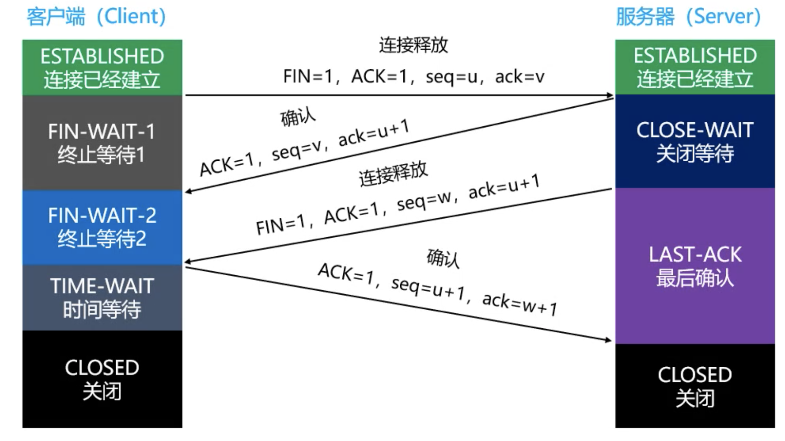

###### 细节

- TCP/IP 协议栈在设计上，允许任何一方先发起断开请求，这里说明的是 client 自动要求断开
- client发送 ACK 后，需要有个 TIME-WAIT 阶段，等待一段时间后，再真正关闭连接
	- 一般是等待 2 倍的 MSL（Maximum Segment Lifetime，最大分段生存期）
		- MSL 是 TCP 报文在 Internet 上最长生存时间
		- 每个具体的 TCP 实现都必须选择一个确定的 MSL值，RFC 1122 建议是 2 分钟
		- 可以防止本次连接中产生的数据包误传到下一次连接中（因为本次连接中的数据包都会在 2MSL 时间内消失了）
- 如果 client 发送 ACK 后马上释放了，然后又因为网络问题，server 没有收到 client 的 ACK，server 就会重发 FIN
	- 这时可能出现的情况是
		- client 没有任何响应，服务器那边会干等，甚至多次重发 FIN，浪费资源
		- client 有个新的应用程序刚好分配了同一个端口号，新的应用程序收到 FIN 后马上开始执行断开连接的操作，本来它可能是想跟 server 建立连接的

###### 一些问题

- 为什么释放连接的时候，要进行 4 次挥手

	TCP 是全双工模式

	- 第一次挥手：当 **主机1** 发出 FIN 报文段时
		- 表示 **主机1** 告诉 **主机2** ，**主机1** 已经没有数据要发送了，但是此时 **主机1**  还是可以接受来自 **主机2** 的数据
	- 第二次挥手：当 **主机2** 返回 ACK 报文段时
		- 表示 **主机2** 已经知道 **主机1** 没有数据要发送了，但是 **主机2** 还是可以发送数据到 **主机1** 的
	- 第三次挥手：当 **主机2** 也发送了 FIN 报文段时
		- 表示 **主机2** 告诉 **主机1**，主机为已经没有数据要发送了
	- 第四次挥手：当 主机1 返回 ACK 报文段时
		- 表明 **主机1** 已经知道 **主机2** 没有数据发送了，随后正式断开整个 TCP 连接

- 有的时候我们在使用抓包工具的时候，有可能会看到 “3 次挥手”

	- 这其实是将第 2，3 次握手合并了

- 当 server 接收到 client 的 FIN 时，如果 server 后面也没有数据要发送给 client 了

	- 这时，server 就可以将 2，3 次握手合并，同时告诉 client 两件事
		- 已经知道 client 没有数据要发送了
		- server 也没有数据要发送了

### 一些图片

---

---

