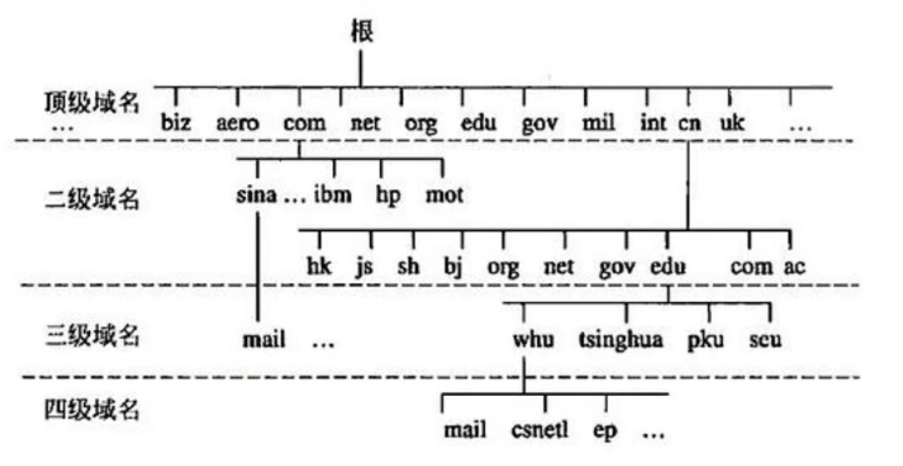
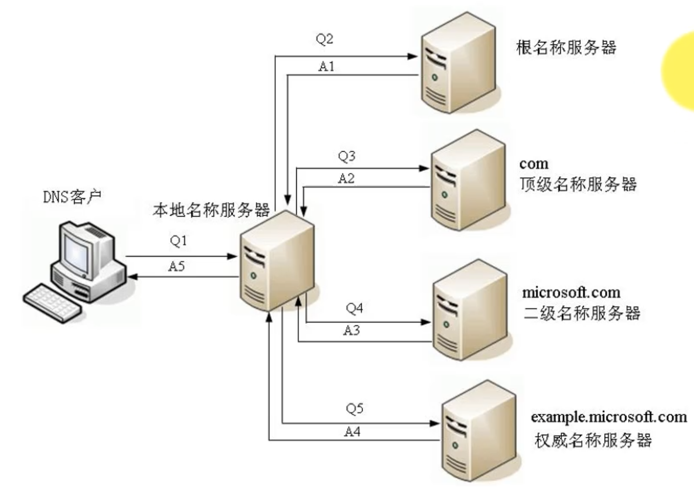
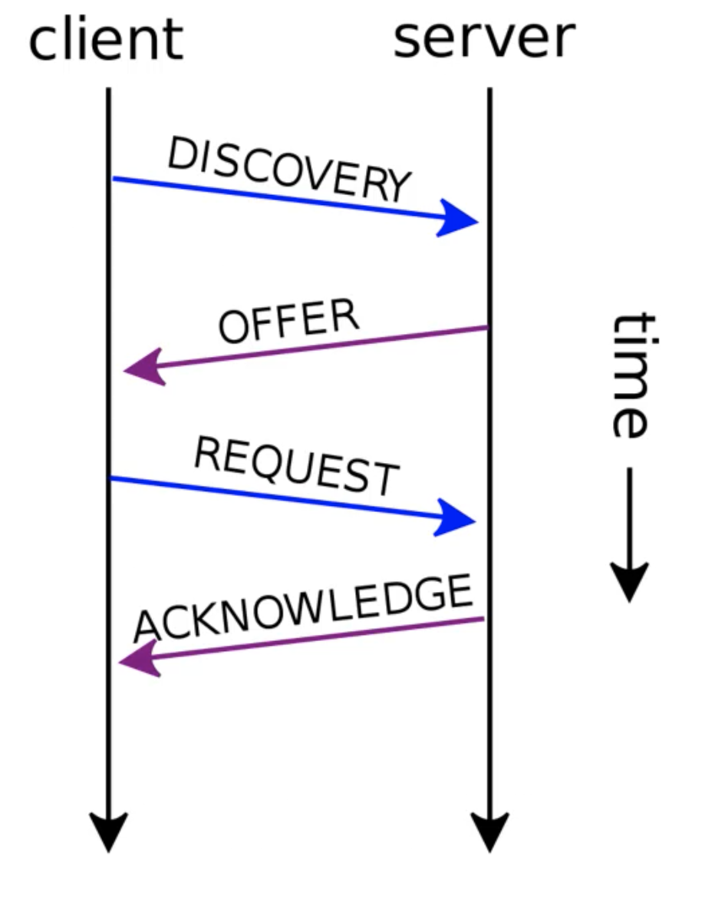
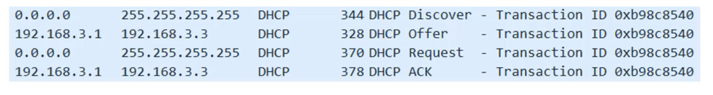
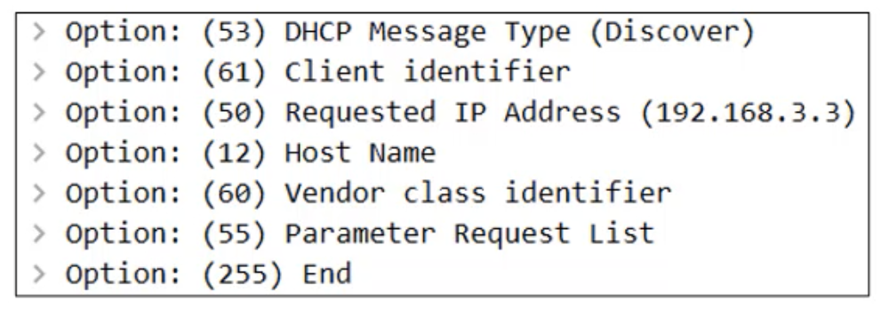
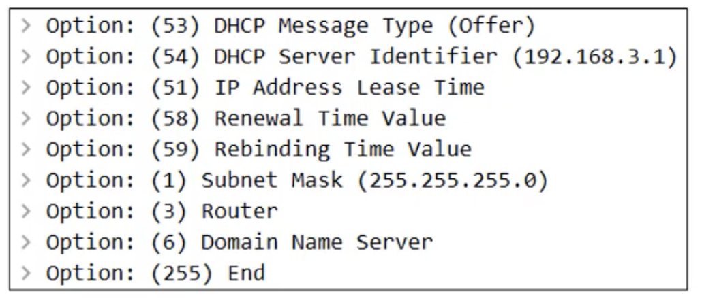
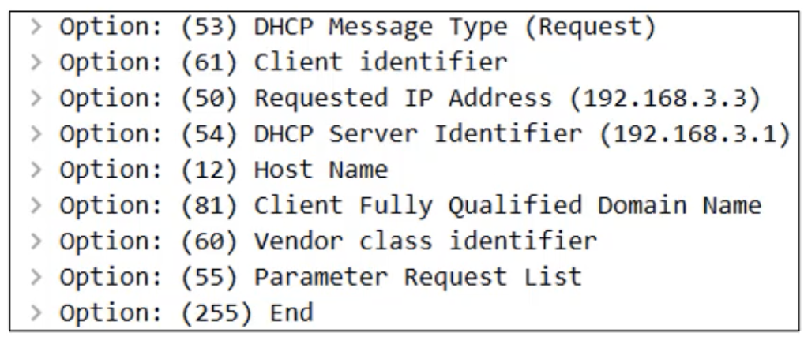
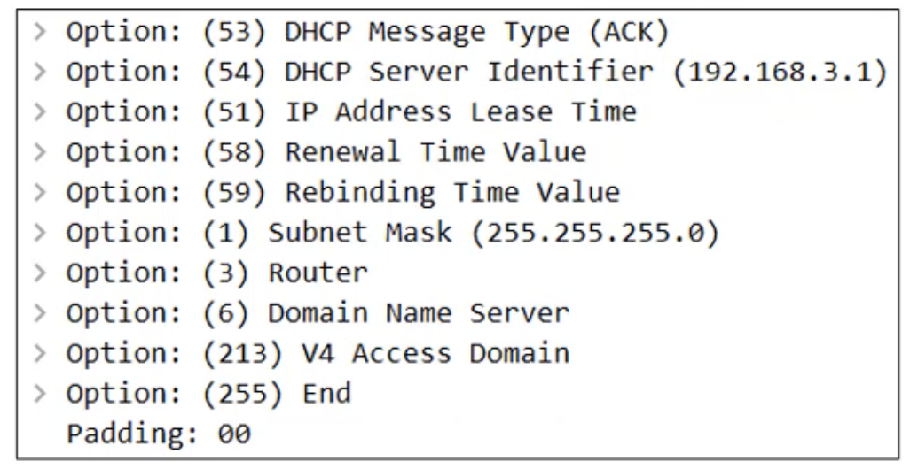

 # 应用层常见的协议

- 超文本传输：HTTP、HTTPS
- 文件传输：FTP
- 电子邮件：SMTP、POP3、IMAP
- 动态主机配置：DHCP
- 域名系统：DNS

# 域名（Domain Name）

- 由于 IP 地址不方便记忆，并且不能表达组织的名称和性质，人们设计出域名（比如 Google.com）
	- 但实际上，为了能访问到具体的主机，最终还是得知道目标主机的 IP 地址
	- 域名可以通过购买获得
- 那为什么不全部用域名，而是使用 IP 地址
	- IP 地址固定 4 个字节，域名随随便便就 10 几个字节，这无疑会增加路由器的负担，而且还会浪费流量
- 根据级别不同，域名可分为
	- 顶级域名（Top-level Domain，简称TLD）
	- 二级域名
	- 三级域名
	- ...

## 顶级域名的分类

- 通用顶级域名（General Top-level Domain，简称 gTLD）
	- .com（公司）、.net（网络机构）、.org（组织机构）、.edu（教育）、.gov（政府部门）、.int（国际组织等）、
- 国家及地区顶级域名（Country Code Top level Domain，简称 ccTLD）
	- .cn（中国）、.jp（日本）、.uk（英国）
- 新通用顶级域名（New Generic Top-level Domain，简称 New gTLD）
	- .vip、.xyz、.top、.club、.shop 等

## 二级域名

- 二级域名是指顶级域名之下的域名
	- 在通用顶级域名下，它一般指域名注册人的名称，例如Google、baidu、Microsoft 等
	- 在国际及地区顶级域名下，它一般指注册类别的，例如 com、edu、gov、net等

#  DNS

- DNS全程是：Domain Name System，译为：域名系统
	- 利用 DNS 协议，可以将域名（比如 baidu.com）解析成对应的 IP 地址（比如：45.113.192.10）
	- DNS 可以基于 UDP 协议，也可以基于 TCP 协议，服务器占用 53 端口

## 常用命令

- nslookup 域名：查看对应的 IP 地址

## 服务器

- 客户端首先会访问最近的一台 DNS 服务器（也就是客户端自己配置的 DNS 服务器）
- 所有的 DNS 服务器都记录了 DNS 根域名服务器的 IP 地址
- 上级 DNS 服务器记录了下一级 DNS 服务器的 IP 地址
- 全球一共 13 台 IPV4 的 DNS 根域名服务器，25 台 IPV6 的 DNS 根域名服务器

# IP地址的分配

- IP 地址按照分配方式，可以分为：静态 IP 地址、动态 IP 地址
	- 静态 IP 地址
		- 手动设置
		- 使用场景：不怎么需要移动的台式机（比如学校机房的台式机）、服务器等
	- 动态 IP 地址
		- 从 DHCP 服务器自动获取 IP 地址
		- 适用场景：移动设备、无线设备等

# DHCP

- DHCP（Dynamic Host Configuration Protocol），译为：动态主机配置协议
	- DHCP 协议基于 UDP 协议，客户端是 68 端口，服务器是 67 端口
- DHCP 服务器会从 IP 地址池中，挑选一个 IP 地址 ‘出租’ 给客户端一段时间，时间到期就回收它们
	- 平时家里上网的路由器就可以充当 DHCP 服务器

## 四个阶段

- DISCOVER：发现服务器
	- 发广播包（源 IP 是0.0.0.0，目标 IP 是255.255.255.255，目标 MAC 是FF:FF:FF:FF:FF:FF）
- OFFER：提供租约
	- 服务器返回可以租用的 IP 地址，已经租用期限、子关掩码、网关、DNS等信息
	- 注意：这里可能会有多个服务器提供租约
- REQUEST：选择 IP 地址
	- 客户端选择一个 OFFER，发送广播包进行回应
- ACKNOWLEDGE：确认
	- 被选中的服务器发送 ACK数据包给客户端
	- 到此为止，IP 地址分配完毕

## 细节

- DHCP 服务器可以跨网段分配 IP 地址吗？（DHCP 服务器，客户端不在同一个网段）
	- 可以通过 DHCP 中介代理（DHCP Relay Agent）实现跨网段分配 IP 地址
- 自动续约
	- 客户端在租期不足的时候，自动向 DHCP 服务器发送 REQUEST 信息申请续约
