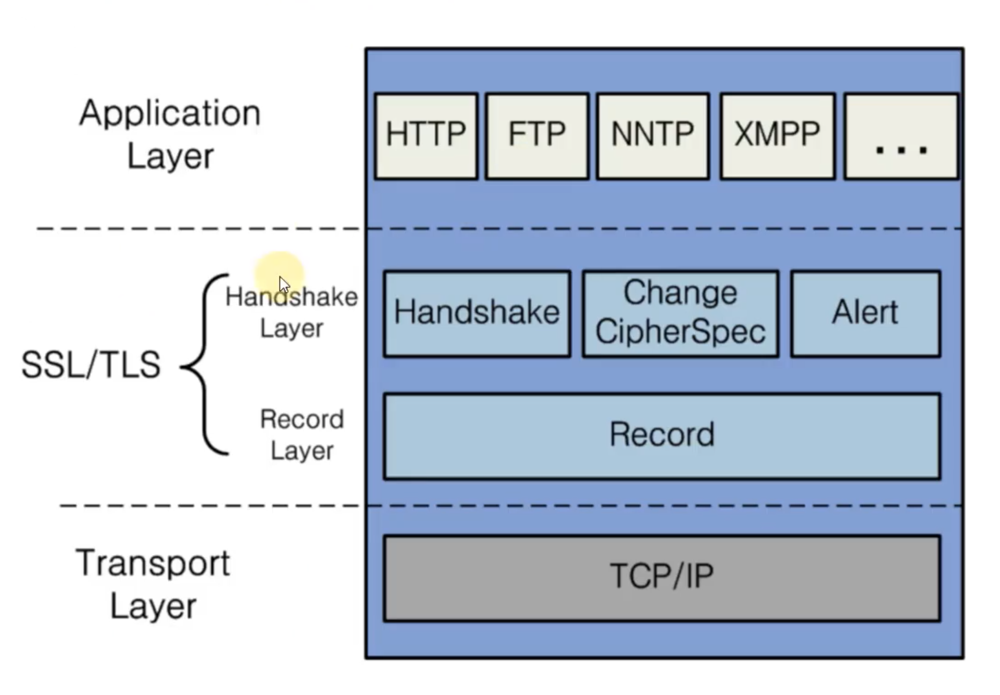
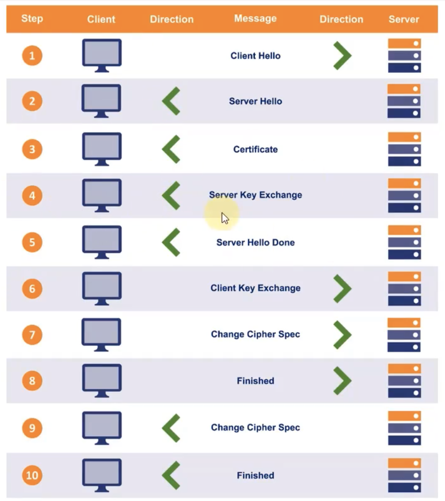
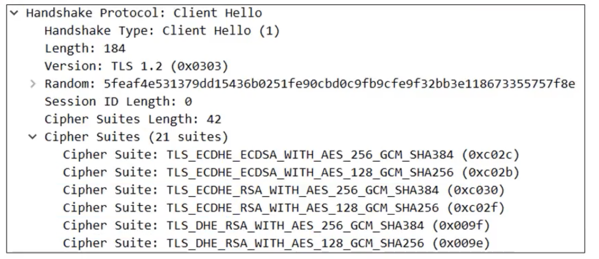
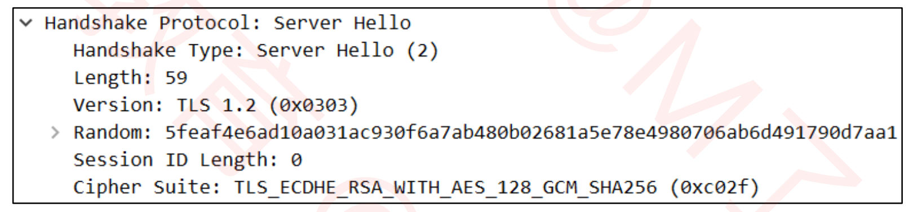
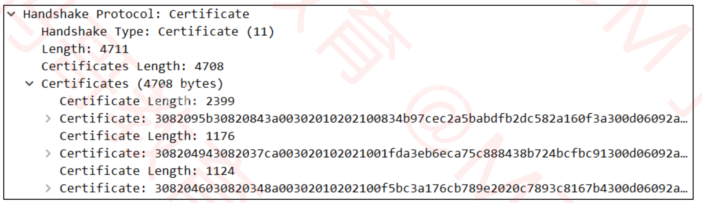
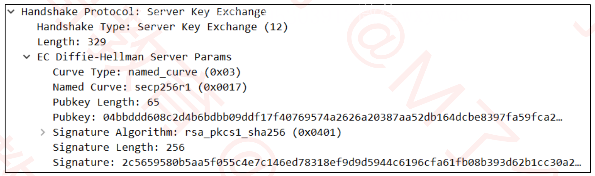
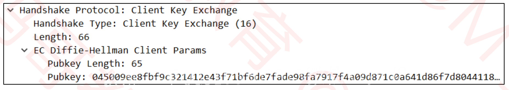
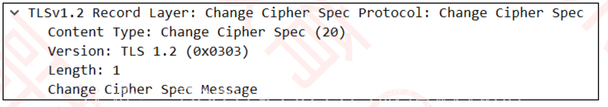
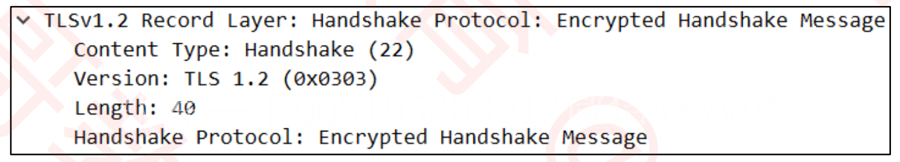

# HTTPS

- HTTPS（**H**yper**T**ext **T**ransfer **P**rotocol **S**ecure），译为：超文本传输安全协议
	- 常称为HTTP over TLS、HTTP over SSL、HTTP Secure
	- 由网景公司于1994年首次提出
- HTTPS的默认端口号是443（HTTP是80）
- 现在在浏览器上输入http://www.baidu.com 
	- 会自动重定向到https://www.baidu.com

# SSL/TLS

- HTTPS是在HTTP的基础上使用SSL/TLS来加密报文，对窃听和中间人攻击提供合理的防护
- SSL/TLS也可以用在其他协议上，比如 
- FTP → FTPS  
- SMTP → SMTPS
- TLS（**T**ransport **L**ayer **S**ecurity），译为：传输层安全性协议
	- 前身是SSL（**S**ecure **S**ockets **L**ayer），译为：安全套接层
- 历史版本信息 
	- SSL 1.0：因存在严重的安全漏洞，从未公开过
	- SSL 2.0：1995年，已于2011年弃用(RFC 6176)
	- SSL 3.0:1996年，已于2015年弃用(RFC 7568)
	- TLS 1.0:1999年(RFC 2246) 
	- TLS 1.1:2006年(RFC 4346)
	- TLS 1.2:2008年(RFC 5246)
	- TLS 1.3:2018年(RFC 8446)
		- 有没有发现:TLS的RFC文档编号都是以46结尾

## 工作在那一层

# OpenSSL

- OpenSSL是SSL/TLS协议的开源实现，始于1998年，支持Windows、Mac、Linux等平台
	- Linux、Mac一般自带OpenSSL
	- Windows下载安装OpenSSL:https://slproweb.com/products/Win32OpenSSL.html
- 常用命令  
	- 生成私钥:openssl genrsa -out mj.key
	- 生成公钥:openssl rsa -in mj.key -pubout -out mj.pem
- 可以使用OpenSSL构建一套属于自己的CA，自己给自己颁发证书，称为“自签名证书” |

# HTTPS 的成本

- 证书的费用
- 加解密计算 
- 降低了访问速度有些企业的做法是:包含敏感数据的请求才使用HTTPS，其他保持使用HTTP 
	- http://www.icbc.com.cn/ 
	- https://mybank.icbc.com.cn/

# HTTPS 的通信过程

- 总的可以分为3大阶段 
- 1 TCP的3次握手 
-  2 TLS的连接 
-  3 HTTP请求和响应 

# TSL 1.2 的连接

- 大概是有 10 步骤
- 图片中省略了中间产生的一些 ACK 确认

## 第一步

1. Client Hello

	- TLS的版本号

	- 支持的加密组件(Cipher Suite)列表
		- 加密组件是指所使用的加密算法及密钥长度等

	- 一个随机数(Client Random) 

## 第二步

2. Server Hello
	- TLS的版本号
	- 选择的加密组件
		- 是从接收到的客户端加密组件列表中挑选出来的
	- 一个随机数(Server Random)

## 第三步

3. Certificate
	- 服务器的公钥证书(被CA签名过的)

## 第四步

4. Server Key Exchange
	- 用以实现ECDHE算法的其中一个参数(Server Params)
		- ECDHE是一种密钥交换算法
		- 为了防止伪造，Server Params经过了服务器私钥签名

## 第五步

5. Server Hello Done

	- 告知客户端:协商部分结束

- 目前为止，客户端和服务器之间通过明文共享了

	- Client Random、Server Random、Server Params
- 而且，客户端也已经拿到了服务器的公钥证书，接下来，客户端会验证证书的真实有效性

## 第六步

6. Client Key Exchange

	- 用以实现ECDHE算法的另一个参数(Client Params)

	

- 目前为止，客户端和服务器都拥有了 ECDHE 算法需要的2个参数：Server Params、Client Params
- 客户端、服务器都可以
	- 使用 ECDHE 算法根据 Server Params、Client Params 计算出一个新的随机密钥串：Pre-master secret
	- 然后结合Client Random、Server Random、Pre-master secret生成一个主密钥
	- 最后利用主密钥衍生出其他密钥:客户端发送用的会话密钥、服务器发送用的会话密钥等

## 第七步

7. Change Cipher Spec
	- 告知服务器:之后的通信会采用计算出来的会话密钥进行加密

## 第八步

8. Finished
	- 包含连接至今全部报文的整体校验值(摘要)，加密之后发送给服务器
	- 这次握手协商是否成功，要以服务器是否能够正确解密该报文作为判定标准

## 第九、十步

9. Change Cipher Spec
10. Finished
	- 到此为止，客户端服务器都验证加密解密没问题，握手正式结束
	- 后面开始传输加密的HTTP请求和响应

