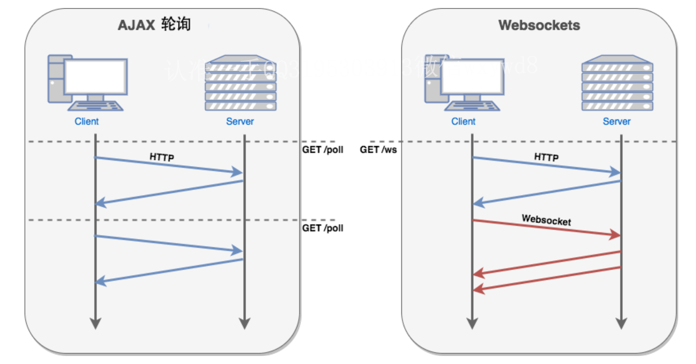
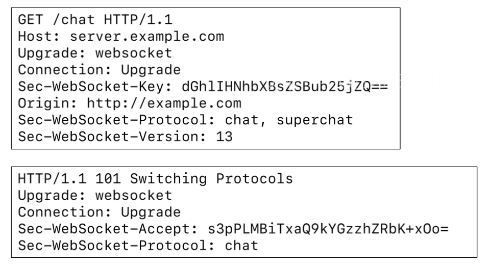
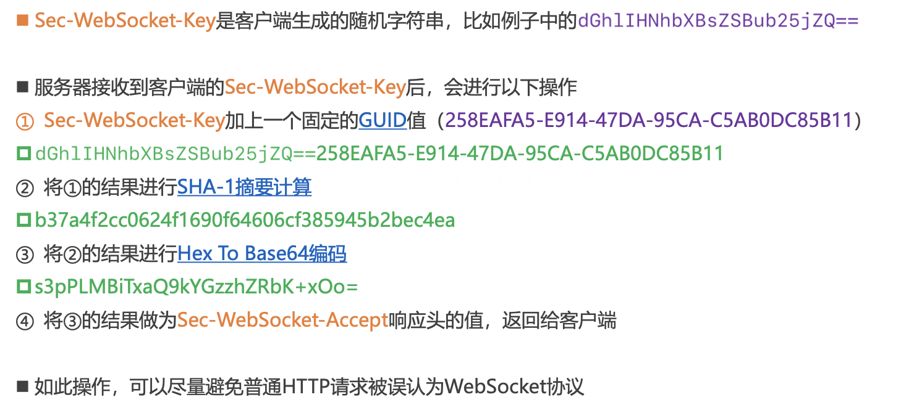

# HTTP VS WebSocket

- HTTP请求的特点：通信只能由客户端发起。所以，早期很多网站为了实现推送技术，所用的技术都是轮询
	- 轮询是指由浏览器每隔一段时间(如每秒)向服务器发出HTTP请求，然后服务器返回最新的数据给客户端 
	- 为了能更好的节省服务器资源和带宽，并且能够更实时地进行通讯，HTML5规范中出现了WebSocket协议
- WebSocket和HTTP属于平级关系，都是应用层的协议
	- 其实TCP本身就是支持全双工通信的(客户端、服务器均可主动发消息给对方)
	- 只是HTTP的“请求-应答模式”限制了TCP的能力
- WebSocket使用80(ws://)、443(wss://)端口，可以绕过大多数防火墙的限制
	- ws://example.com/wsapi
	- wss://secure.example.com/wsapi
- 与HTTP不同的是，WebSocket需要先建立连接
	- 这就使得WebSocket成为一种有状态的协议，之后通信时可以省略部分状态信息
	- 而HTTP请求可能需要在每个请求都额外携带状态信息(如身份认证等)

# WebSocket

- WebSocket，是基于TCP的支持**全双工**通信的应用层协议
	- 在2011年由IETF标准化为RFC 6455，后由RFC 7936补充规范
	- 客户端、服务器，任何一方都可以主动发消息给对方
- WebSocket的应用场景很
	- 社交订阅、股票基金报价、体育实况更新、多媒体聊天、多玩家游戏等

# WebSocket建立连接

- WebSocket需要借助HTTP协议来建立连接(也叫作握手，Handshake)
	- 由客户端(浏览器)主动发出握手请求
- Connection必须设置Upgrad
	- 表示客户端希望连接升级
- Upgrade必须设置websocket
	- 表示希望升级到WebSocket协议
- Sec-WebSocket-Version
	- 表示支持的Websocket版本
	- RFC 6455要求使用的版本是13

# WebService

- WebService，译为:Web服务，是一种跨编程语言和跨操作系统平台的远程调用技术标准
- WebService使用场景举例
	- 天气预报、手机归属地查询、航班信息查询、物流信息查询等
	- 比如天气预报，是气象局把自己的服务以WebService形式暴露出来，让第三方程序可以调用这些服务功能
	- http://www.webxml.com.cn/zh_cn/index.aspx
- 事实上，WebService完全可以用普通的Web API取代(比如HTTP + JSON)
	- 现在很多企业的开放平台都是直接采用Web API

# WebService的核心概念

- SOAP(Simple Object Access Protocol)，译为:简单对象访问协议
- 很多时候，SOAP = HTTP + XML
- WebService使用SOAP协议来封装传递数据
- WSDL(Web Services Description Language)，译为:Web服务描述语言
- 一个XML文档，用以描述WebService接口的细节(比如参数、返回值等)
- 一般在WebService的URL后面跟上?wsdl获取WSDL信息
- 比如:http://ws.webxml.com.cn/WebServices/WeatherWS.asmx?wsdl

# IPV6

- IPV6（Internet Protocol Version 6），译为：网络协议第六版
	- 用它来取代 IPV4 主要是为了解决 IPV4 地址枯竭问题，同时它也在其他方面对于 IPV4 有许多改进
	- 然而长期以来 IPV4 在互联网流量中仍然占据主要地位，IPV6 用户增长缓慢
	- 在 2019年12月，通过IPV6只使用 Google 服务的用户百分率首次超过 30%
		- 因为需要设备，操作系统内核升级支持 IPV6
- IPV6 采用 128 位的地址，而 IPV4 使用的是 32 位
	- 支持$2^{128}$ （约$3.4 * 10^{38}$）个地址
	- 就以地球人口 70 亿人口计算，每人平均可分得约$4.86 * 10^{28}$个 IPV6地址

