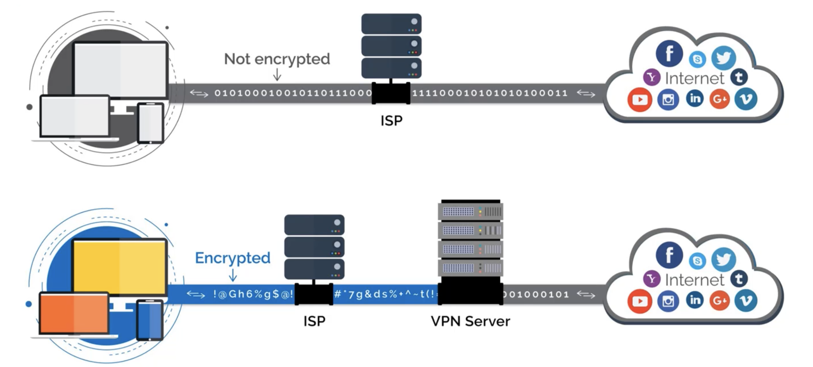
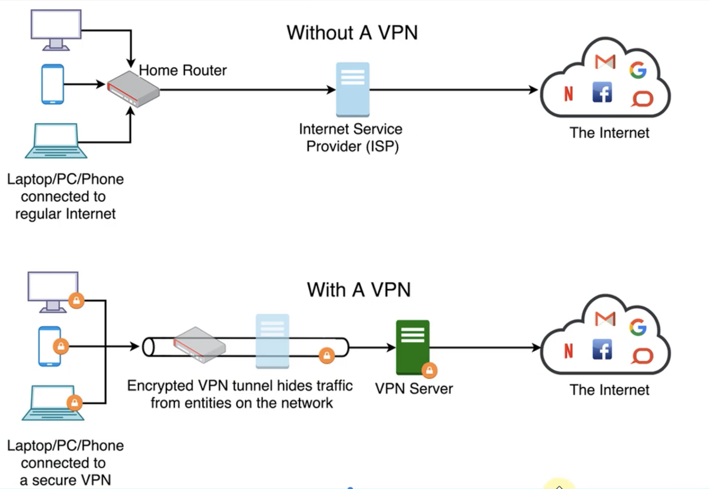
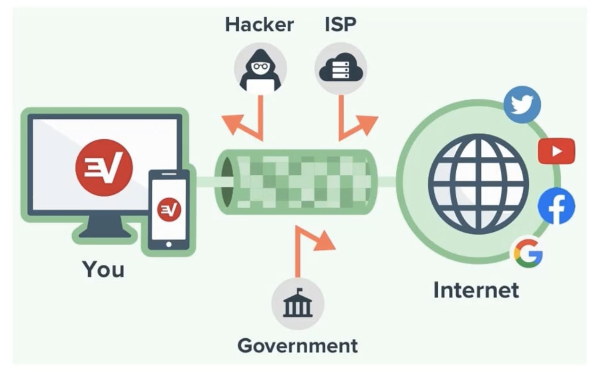
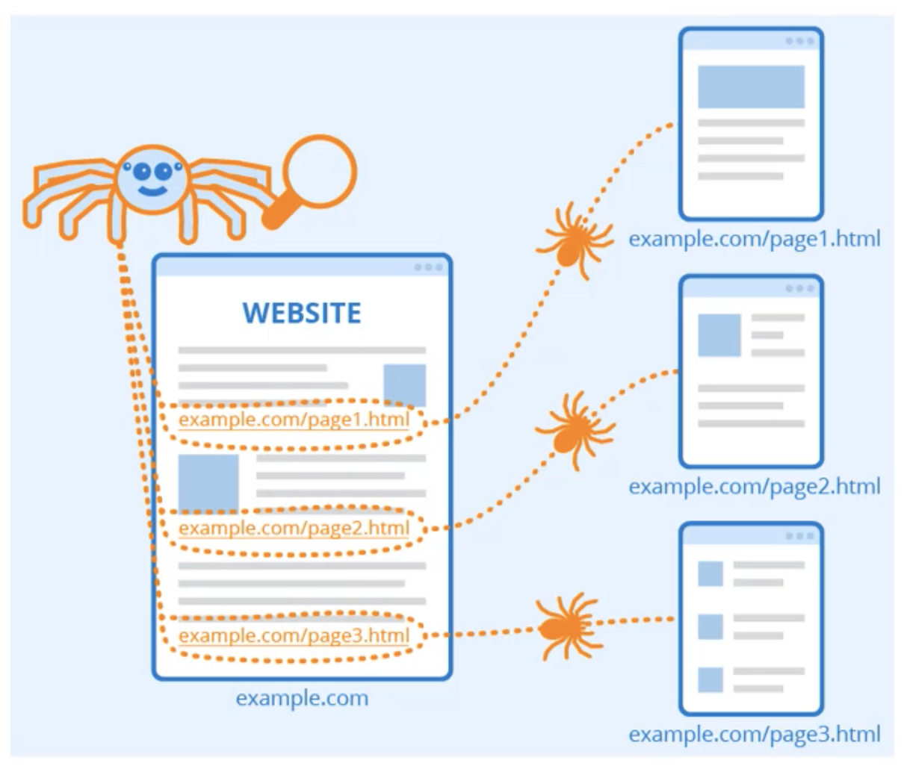
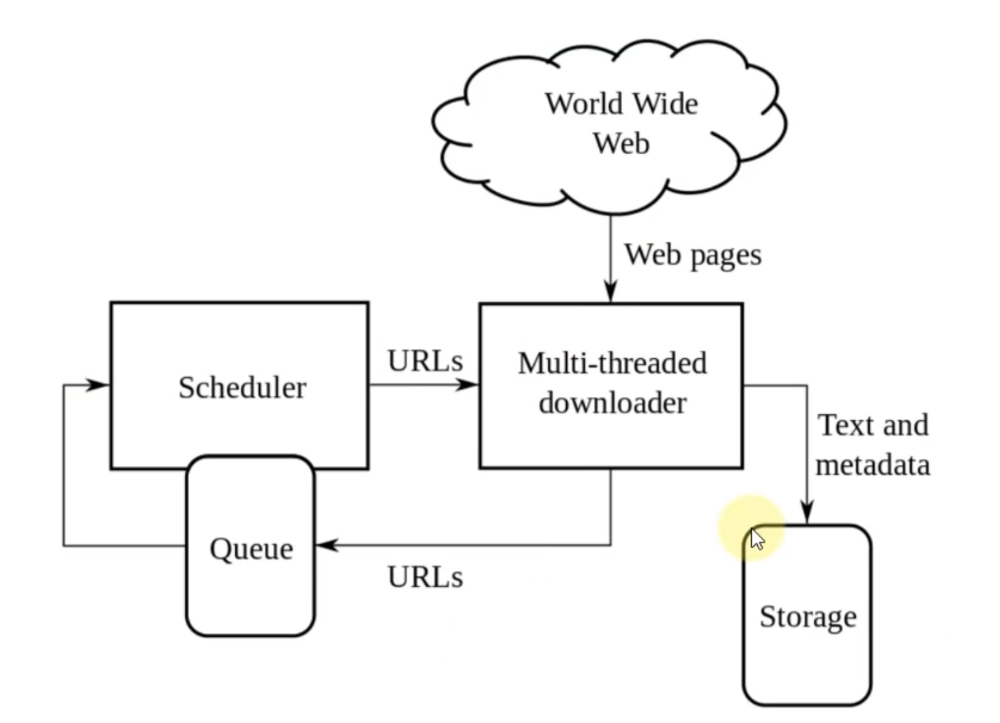
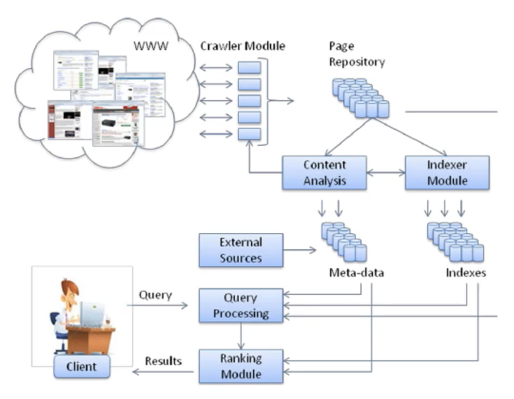
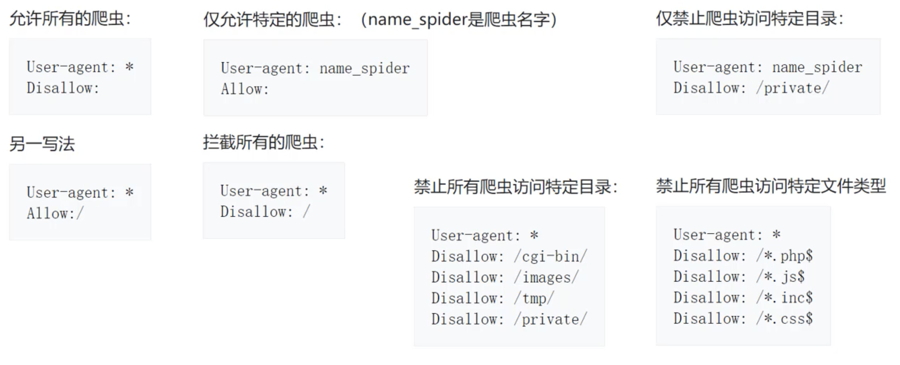
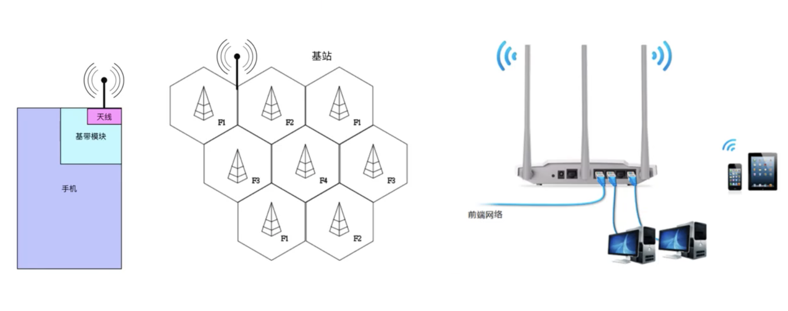
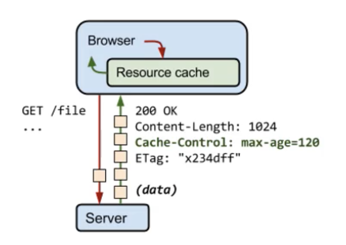
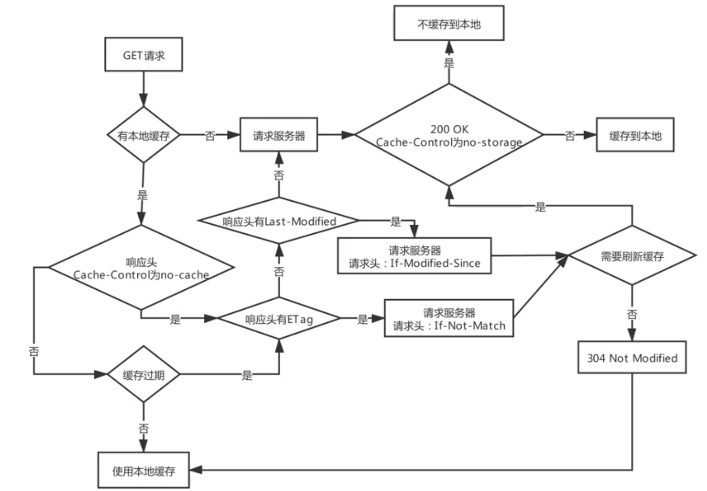

# VPN

- VPN（Virtual Private Network），译为：虚拟私人网络
	- 它可以在公共网络上建立专用网络，进行加密通讯

# VPN的作用

- 提高上网的安全性
- 保护公司内部资料
- 隐藏上网者的身份
- 突破网站的地域限制
	- 有些网站针对不不同地区的用户展示不同的内容
- 突破网络封锁
	- 因为有 GFW 的限制，有些网站值国内无法访问
	- Great Firewall of China
	- 中国长城防火墙

# VPN与代理的区别

- 软件
	- VPN一般需要安装VPN客户端软件
	- 代理不需要安装额外的软件
- 安全性
	- VPN默认会对数据进行加密
	- 代理默认不会对数据进行加密（数据最终是否加密取决于使用的协议本身）
- 费用
	- 一般情况下，VPN比代理贵

# VPN的实现原理

- VPN的实现原理是：使用了隧道协议（Tunneling Protocol）
- VPN一般工作在：传输层、数据链路层

- 常见的VPN隧道协议有
	- PPTP
	- L2TP
	- IPsec
	- SSL VPN（如 OpenVPN）
	- ......

# 网络爬虫

- 网络爬虫（Web Crawler），也叫网络蜘蛛（Web Spider）
	- 模拟人类使用浏览器操作页面的行为，对页面进行相关的操作
	- 常用爬虫工具：Python的 Scrapy 框架

 

# 搜索引擎

 

# 网络爬虫- robots.txt

- robots.txt 是存放于网站根目录的文本文件
	- 用来告诉爬虫：那些内容是不应该爬取的，哪些是可以被爬取的
	- 因为一些系统中的 URL 是大小敏感的，所以 robots.txt 的文件名应统一为小写
- 它并不是一个规范，而只是约定俗成的，所以并不能保证网站的隐私
	- 只能防君子，不能防小人
	- 无法阻止不讲武德的年轻爬虫爬取隐私信息

# 无线网络

# 缓存（Cache）

- 实际上，HTTP的缓存机制远远比图片的流程要复杂
- 通常会缓存的情况是：GET请求 + 静态资源（比如HTML、CSS、JS、图片等）
- 可以通过刷新来强制刷新缓存
- 缓存会存放在不同地方
	- disk cache
	- memory cache

# 缓存的响应头

- Pragma：作用类似于Cache-Control，HTTP/1.0的产物
- Expires：缓存的过期时间（GMT格式时间），HTTP/1.0的产物
- Cache-Control：设置缓存策略
	- no-storage:不缓存数据到本地
	- public：允许用户、代理服务器缓存数据到本地
	- private：只允许用户缓存到本地
	- max-age：缓存的有效时间（多少时间不过期），单位秒
	- no-cache：每次需要发请求给服务器询问缓存是否有变化，再来决定如何使用缓存
- 优先级：Pragma > Cache-Control > Expires
- Last-Modified：资源的最后一次修改时间
- ETag：资源的唯一标识（根据文件计算出来的摘要值）
- 优先级：ETag > Last-Modified

# 缓存的请求头

- if-None-Match
	- 如果上一次的相应头中有 ETag，就会将 ETag 的值作为请求头的值
	- 如果服务器发现资源的最新摘要值跟 if-None-Match 不匹配，就会返回新的资源（200 OK）
	- 否则，就不会返回资源的具体数据（304 Not Modified）
- if-Modified-Since
	- 如果上一次响应头中没有 ETag，有 Last-Modified，就会将Last-Modified的值作为请求头的值
	- 如果服务器发现资源的最后一次修改时间晚于if-Modified-Since，就会返回新的资源（200 OK）
	- 否则，就不会返回资源的具体数据（304 Not Modified）

# Last-Modified VS ETag

- Last-Modified的缺陷
	- 只能精确到秒级，如果资源在 1 秒内修改了，刻画短无法获取最新的资源数据
	- 如果某些资源被修改了（最后一次修改时间发生了变化），但是内容并没有任何变化
		- 会导致相同数据重复传送，没有使用到缓存
- ETag可以办到
	- 只要资源的内容没有变化，就不会重复传输资源数据
	- 只要资源的内容发生了改变，就会返回最新的资源数据给客户端

# 缓存的使用流程

 